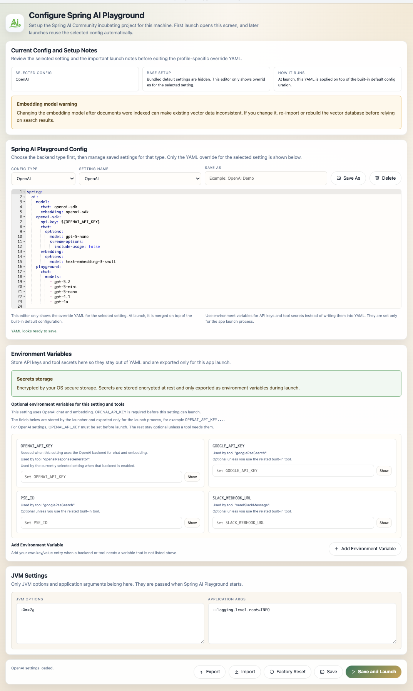
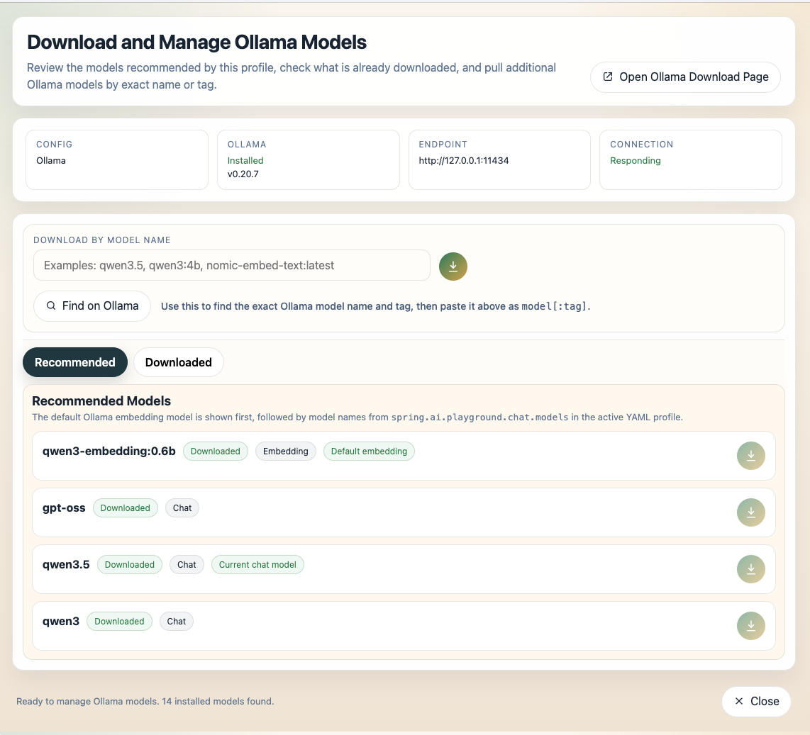
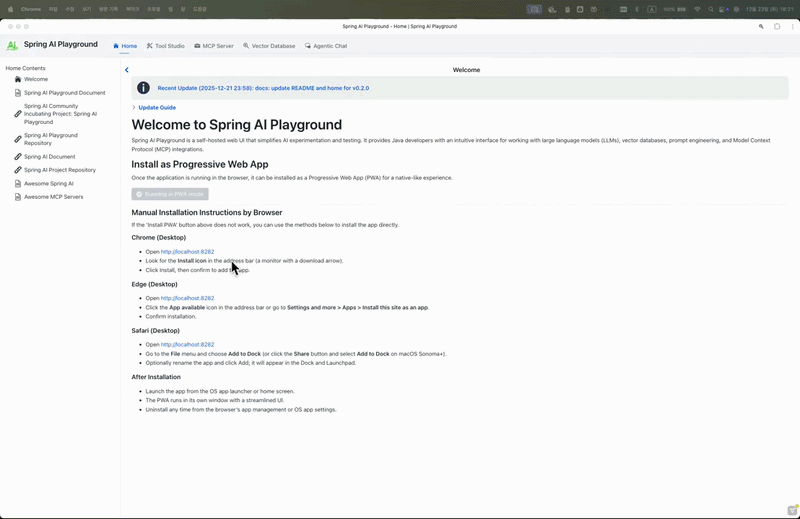

# Spring AI Playground

**Safe Local Execution Layer for AI Agent Tools**

Spring AI Playground is a cross-platform desktop app for building, testing, validating, and executing MCP tools in a controlled local environment. It helps you create reusable MCP tools once and use them across macOS, Windows, and Linux through a self-contained runtime. Unlike platforms that focus primarily on generating agents or authoring tools, Spring AI Playground focuses on making the tools it manages inside the app safer and easier to inspect before reuse.

> **No pass, no run.**

In Tool Studio, new or updated built-in tools are test-run before they are published to the built-in MCP server. You do not need to know Java, Spring, or JVM internals to use it. If you can install a desktop app and write a small JavaScript function, you can build tools here and connect them to hosts and clients such as Claude Desktop, Claude Code, Cursor, IDEs, and other MCP-compatible environments.

## The Problem

AI agents can generate tools quickly, but generated tools are not inherently safe to execute.

- It is often unclear what actually runs at execution time
- Failures are difficult to predict before real usage
- Execution is not easily traceable or inspectable

Most platforms focus on creation.

Very few make verification part of the default workflow for built-in tool publication.

## Who is this for?

- Developers building MCP tools who want validation built into the default workflow
- Teams connecting MCP tools into Python, Node.js, or mixed-stack agent environments
- Users of Claude Desktop, Claude Code, Cursor, and other MCP-compatible environments

## Quick Start

The fastest path is the desktop app distributed through GitHub Releases.

Spring AI Playground is a standalone desktop app, so you can install it and start building MCP tools without setting up a Java project, Docker environment, or source build first.

### 1. Download the Desktop App

Choose the installer for your platform from the latest release:

[](https://github.com/spring-ai-community/spring-ai-playground/releases/latest/download/Spring.AI.Playground.exe)
[](https://github.com/spring-ai-community/spring-ai-playground/releases/latest/download/Spring.AI.Playground-arm64.dmg)
[](https://github.com/spring-ai-community/spring-ai-playground/releases/latest/download/Spring.AI.Playground-x64.dmg)
[](https://github.com/spring-ai-community/spring-ai-playground/releases/latest/download/Spring.AI.Playground.deb)
[](https://github.com/spring-ai-community/spring-ai-playground/releases/latest/download/Spring.AI.Playground.rpm)

Or browse all available assets on the [Releases page](https://github.com/spring-ai-community/spring-ai-playground/releases).

### 2. Install and Launch

Install the app like a normal desktop application, then launch **Spring AI Playground** from your applications menu.

The desktop app bundles the backend runtime together with a launcher that provides provider starter templates, YAML override editing, environment-variable based secret handling, and one-click launch.

If you install the app, you can run Spring AI Playground immediately without setting up Docker or running the source manually.

> **Install notes by platform**  
> Depending on your platform, the first install may include an OS security prompt for unsigned or not-yet-reputation-established builds.
>
> - macOS: copy the app into **Applications**, then use **System Settings > Privacy & Security > Open Anyway** if Gatekeeper blocks launch.
> - Windows: if Microsoft Defender SmartScreen warns that the app is unrecognized, click **More info** and then **Run anyway** only if you trust the release source.
> - Linux: the `.deb` and `.rpm` packages usually install without a separate unsigned-app override flow, but your distribution may still ask for normal package-install confirmation.
>
> For more detailed macOS Gatekeeper guidance, Windows SmartScreen notes, and Linux package-install details, see the [Getting Started guide](https://spring-ai-community.github.io/spring-ai-playground/getting-started/).
>
> If macOS still blocks launch because the app is quarantined, and you trust the app, one practical workaround is:
>
> ```
> xattr -dr com.apple.quarantine "/Applications/Spring AI Playground.app"
> ```

<p align="center">
  <b>First-Launch Configuration Screen</b><br/>
  Desktop launcher overview with the built-in config editor
</p>

<p align="center">
  <a href="docs/assets/images/launcher-openai.png">
    
  </a>
</p>

<p align="center">
  <b>Ollama Model Manager</b><br/>
  Review recommended models, search exact Ollama names, and manage downloaded models
</p>

<p align="center">
  <a href="docs/assets/images/lancher-ollama-config.png">
    
  </a>
</p>

## Documentation

Detailed installation, configuration, features, and tutorials live in the documentation site:

- Documentation site: https://spring-ai-community.github.io/spring-ai-playground/
- Getting Started: https://spring-ai-community.github.io/spring-ai-playground/getting-started/
- Features: https://spring-ai-community.github.io/spring-ai-playground/features/
- Tutorials: https://spring-ai-community.github.io/spring-ai-playground/tutorials/

Alternative runtimes are still supported:

- Docker for server-style deployment
- local source execution for development workflows and MCP STDIO testing

<p align="center">
  <b>Agentic Chat Demo</b><br/>
  Tool-enabled agentic AI built with Spring AI and MCP
</p>

<p align="center">
  <a href="docs/assets/images/agentic-chat-demo.gif">
    
  </a>
</p>

## Why Spring AI Playground?

- **Built-In MCP Server**: Publish tools directly from the app and expose them immediately through the built-in MCP server instead of wiring ad-hoc local scripts by hand.
- **No Pass, No Run Workflow**: In Tool Studio, built-in tools are test-run before they are published, making validation part of the default product flow instead of an optional afterthought.
- **Executable Tool Validation**: Test tools with real inputs, outputs, and runtime constraints before you reuse them from other MCP-compatible hosts and clients.
- **Secure Secret Management**: Keep API keys and sensitive configuration out of YAML and manage them through the desktop app's secret storage and launcher-backed environment settings. When OS-backed secure storage is unavailable, the app clearly warns before falling back to plain-text local storage.
- **Tool-to-Agent Workflow**: Create tools in Tool Studio, inspect them through MCP, and use them in Agentic Chat in one continuous workflow.
- **Provider Agnostic**: Switch between Ollama, OpenAI, and other OpenAI-compatible APIs without changing the overall workflow.
- **OS-Independent Tool Runtime**: Tools are authored once as JavaScript and run through the same bundled runtime, so the same tool definition works consistently across macOS, Windows, and Linux.
- **Single-Agent Execution**: Use validated built-in tools together with grounded context (RAG) in Agentic Chat to handle focused, practical workflows without needing a larger orchestration layer. Agentic Chat can also call tools exposed by MCP servers that you explicitly connect and trust.

The intended workflow is practical and composable:

- create or adapt tools in Tool Studio
- test them before publishing
- expose them through the built-in MCP server
- inspect them through MCP Inspector
- index knowledge in Vector Database
- combine tools and documents in Agentic Chat

## Why Not Just Use Agent Builders?

Agent builders focus on generating tools and composing workflows.

Spring AI Playground focuses on validating tools and controlling execution.

It complements agent builders by providing a reliable execution layer.

## Project Scope & Positioning

Spring AI Playground is a **tool-first environment** for building, testing, validating, and operationalizing MCP tools in a practical workflow.

It is best understood as a **safe local execution layer for AI agent tools**.

> **Note:** This project is intentionally focused in its current stage.  
> The goal is to make MCP tool building, validation, inspection, and runtime exposure simple and reliable, so the tools you create here can be reused from MCP-compatible hosts and clients such as Claude Code, Claude Desktop, IDEs, and other agent environments.

Current focus:

- providing a UI-driven environment for building, testing, and validating MCP tools in a practical workflow
- making test-before-publish the default path for built-in local tool exposure
- testing tool execution flows, environment-backed tool configuration, and RAG integration in one place
- making tools easier to inspect, easier to test, and easier to operationalize before they are reused elsewhere
- supporting practical single-agent workflows through Agentic Chat with tools and grounded context. See [Agentic Chat Architecture Overview](https://spring-ai-community.github.io/spring-ai-playground/features/#agentic-chat-architecture-overview).
- promoting validated built-in tools into reusable MCP-hosted runtimes that can be shared across multiple MCP-compatible hosts and clients

It is not trying to replace the tools where agents actually run. It is designed to give you a clearer path from local tool prototype to inspectable, reusable MCP server.

## Contributing & Scope

Please read this section before opening issues or submitting contributions.

### Current Scope

- bug reports with reproducible steps
- documentation improvements
- usage examples
- focused improvements to existing tool, MCP, RAG, and Agentic Chat workflows

### Out of Scope For Now

- broad feature requests that significantly expand project scope
- experimental model integrations outside the current supported provider list (currently: Ollama, OpenAI, and OpenAI-compatible APIs)
- high-level multi-agent orchestration layers
- platform-level marketplace or governance features

### Reporting Issues

Before opening an issue:

- use the Bug Report template for reproducible failures
- submit a documentation PR for documentation fixes or improvements
- read the project scope above before requesting broader changes

We triage issues regularly, and issues outside the current scope may be closed with guidance.

If you believe you have a contribution that fits the current scope, submit a PR or a targeted issue.

## Upcoming Improvements

These are the near-term areas we plan to improve while keeping the project focused on practical, reusable tool execution.

### Observability

- **Execution Visibility**: improve tracing and inspection for tool execution, MCP calls, failures, and runtime behavior
- **Operational Insight**: make it easier to understand what ran, why it failed, and how a published tool behaves in practice

### Hardening Existing Capabilities

- **Tool Runtime Improvements**: strengthen the current workflow for building, validating, and publishing tools
- **Secret Handling**: continue improving how tool configuration and environment-backed values are stored, managed, and used at runtime
- **Validation and Reuse**: make validated tools easier to inspect, reuse, and operationalize as MCP-hosted runtimes
- **Agentic Chat Usability**: improve practical workflows that combine tools and grounded context in one focused runtime

### Platform Support

- **Authentication**: improve access control where it fits the current product boundary
- **Multimodal Support**: image and audio input/output with supported multimodal-capable models
