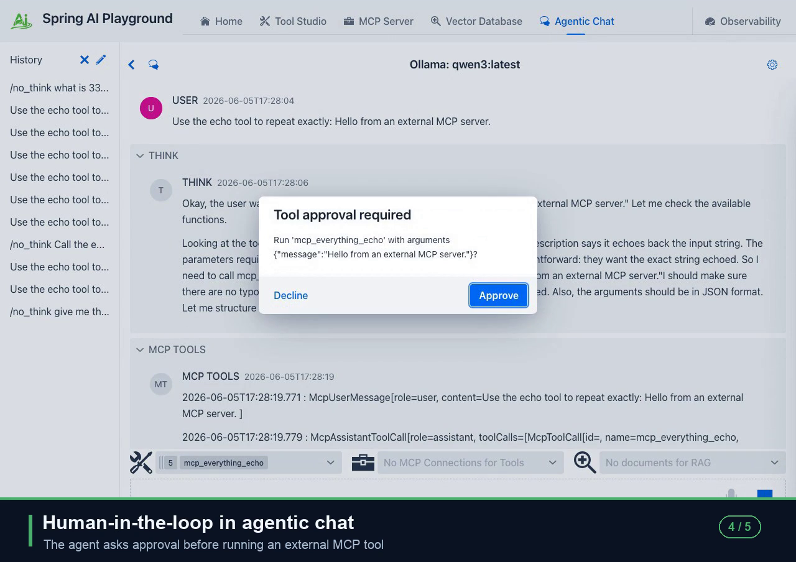

# Spring AI Playground

**Safe Local Execution Layer for AI Agent Tools**

Spring AI Playground is a cross-platform desktop app for building, testing, validating, and executing MCP tools in a controlled local environment. It helps you create reusable MCP tools once and use them across macOS, Windows, and Linux through a self-contained runtime. Unlike platforms that focus primarily on generating agents or authoring tools, Spring AI Playground focuses on making the tools it manages inside the app safer and easier to inspect before reuse.

> **No pass, no run.**

Every tool you build earns a **Local Pass** — a local test-run with your sample arguments. Only passing tools are added live to the built-in MCP server and become callable from Agentic Chat. A tool that has not passed is never exposed to an agent.

> **Security scope.** The in-process sandbox is defense-in-depth for the local build-and-vet loop. It is not adversarial-grade isolation and not a gateway. To run tool code you do not trust, nest it in container or microVM isolation. See [Isolation tiers](https://spring-ai-community.github.io/spring-ai-playground/safety-architecture/#isolation-tiers).

Safe execution does not end at publication. Every chat, tool call, vector lookup, and MCP invocation that runs in the app lands in the built-in **Observability dashboards** — twelve panels (Overview, Tokens & Cost, AI Models, Tool Studio, MCP Servers, MCP Inspector, Vector Database, Agentic Chat, Host, Web Application, Logs, Traces) backed by a ring buffer with dated disk persistence. Drill from a row into the trace timeline and raw spans, jump to the conversation thread, and deep-link back into Agentic Chat — so the tools you let an agent call are also the tools you can see in detail after the fact.

In Tool Studio, new or updated built-in tools are test-run before they are published to the built-in MCP server. You do not need to know Java, Spring, or JVM internals to use it. If you can install a desktop app and write a small JavaScript function, you can build tools here and connect them to hosts and clients such as Claude Desktop, Claude Code, Cursor, IDEs, and other MCP-compatible environments.

Ships with a **bundled catalog of default tools** across five source bundles — web fetch, datetime, math, security, encoding, crypto, filesystem, GitHub, Wikipedia, weather, finance, geo, and a Korean-domain bundle (Upbit, Bithumb, Naver, Kakao, KMA, KOFIC, KRX, data.go.kr keychain) — searchable and filterable in the [Default Tools directory](docs/features/default-tools/index.md#browse-all-tools).

Plus a **preset catalog of external MCP servers** — Gmail, Notion, Slack, GitHub, Linear, Atlassian, Tavily, Firecrawl, Microsoft-Teams, Sentry, and more — grouped by category with `${ENV_VAR}` placeholders so disabled servers can't be activated without setup. Browse the full list in the [Default MCP Catalog](docs/features/default-mcp-catalog/index.md).

<p align="center">
  <b>Spring AI Playground — Demo</b><br/>
  Connect an MCP server · compose a safe proxy · human-in-the-loop approval · full observability
</p>

<p align="center">
  <a href="docs/assets/images/spring-ai-playground-demo.mp4">
    
  </a>
  <br/>
  <sub>▶ Click to watch the demo — or see it autoplay on the <a href="https://spring-ai-community.github.io/spring-ai-playground/">docs site</a></sub>
</p>

## The Problem

AI agents can generate tools quickly, but generated tools are not inherently safe to execute.

- It is often unclear what actually runs at execution time
- Failures are difficult to predict before real usage
- Execution is not easily traceable or inspectable

Most platforms focus on creation.

Very few make verification part of the default workflow for built-in tool publication, and even fewer leave a clear trail of what each tool actually did after it ran. Spring AI Playground treats both as part of safe local execution — Local Pass at the gate, Observability dashboards on the inside.

## Who is this for?

- Developers building MCP tools who want validation built into the default workflow
- Teams running MCP tools in agent host environments (Claude Code, Cursor, IDE plugins, mixed-stack runtimes) who need a stable local execution layer instead of ad-hoc local scripts
- Teams who need a clear, local audit trail of token cost, latency, and per-call traces for chat, tool, vector, and MCP invocations
- Spring developers looking for a working end-to-end reference implementation of Spring AI's ChatClient, MCP client/server, RAG advisor, vector store, and Observation API
- Users of Claude Desktop, Claude Code, Cursor, and other MCP-compatible environments

## Quick Start

The fastest path is the desktop app distributed through GitHub Releases.

Spring AI Playground is a standalone desktop app, so you can install it and start building MCP tools without setting up a Java project, Docker environment, or source build first.

### 1. Download the Desktop App

Choose the installer for your platform from the latest release:

[](https://spring-ai-community.github.io/spring-ai-playground/#win-x64)
[](https://spring-ai-community.github.io/spring-ai-playground/#mac-arm64)
[](https://spring-ai-community.github.io/spring-ai-playground/#mac-x64)
[](https://spring-ai-community.github.io/spring-ai-playground/#linux-deb)
[](https://spring-ai-community.github.io/spring-ai-playground/#linux-rpm)

Each badge resolves to the latest published release automatically and opens a confirm dialog with the filename, size, and OS-specific default save path. The downloaded file keeps the version in its name (e.g. `spring-ai-playground-<version>-mac-arm64.dmg`). Or browse all available assets on the [Releases page](https://github.com/spring-ai-community/spring-ai-playground/releases).

### 2. Install and Launch

Install the app like a normal desktop application, then launch **Spring AI Playground** from your applications menu.

The desktop app bundles the backend runtime together with a launcher that provides provider starter templates, YAML override editing, environment-variable based secret handling, and one-click launch.

If you install the app, you can run Spring AI Playground immediately without setting up Docker or running the source manually.

> **macOS**
>
> Gatekeeper may block the install flow in two places:
>
> - When you open the downloaded DMG, macOS may show a warning such as “cannot be opened because the developer cannot be verified.” If you trust the release source, go to **System Settings > Privacy & Security** and click **Open Anyway**.
> - After copying the app into **Applications**, macOS may block the first app launch again. If that happens, open the app once, then return to **System Settings > Privacy & Security** and click **Open Anyway**.
>
> If the app still doesn’t open because it remains quarantined, and you trust the app, one practical workaround is:
>
> ```
> xattr -dr com.apple.quarantine "/Applications/Spring AI Playground.app"
> ```
>
> **Windows**
>
> The most common warning appears when you run the downloaded installer (`.exe`).
>
> If Microsoft Defender SmartScreen shows a warning such as “Windows protected your PC” or says the app is unrecognized:
>
> - Click **More info**
> - Then click **Run anyway**
>
> **Linux**
>
> Separate Gatekeeper- or SmartScreen-style reputation warnings are uncommon. When installing the `.deb` or `.rpm` package, you usually only need to complete the normal package-install confirmation steps.
>
> For more detailed platform guidance, see the [Getting Started guide](https://spring-ai-community.github.io/spring-ai-playground/getting-started/).

### Verify Your Download

Every release ships with a matching `.sha256` checksum file and a Sigstore SLSA build provenance attestation. See [Verify Your Download](https://spring-ai-community.github.io/spring-ai-playground/getting-started/#verify-your-download) in the docs for the exact `shasum`, `Get-FileHash`, and `gh attestation verify` commands.

The desktop launcher handles first-run setup on one screen — provider config, Default MCP Tools curation, and JVM/environment cards — and includes an Ollama model manager to review, search, and download models. See [Getting Started](https://spring-ai-community.github.io/spring-ai-playground/getting-started/) and [Model Configuration](https://spring-ai-community.github.io/spring-ai-playground/getting-started/#model-configuration).

## Documentation

Detailed installation, configuration, features, and tutorials live in the documentation site:

- Documentation site: https://spring-ai-community.github.io/spring-ai-playground/
- Getting Started: https://spring-ai-community.github.io/spring-ai-playground/getting-started/
- Application Architecture: https://spring-ai-community.github.io/spring-ai-playground/architecture/
- **AI Agent Tool Safety Architecture**: https://spring-ai-community.github.io/spring-ai-playground/safety-architecture/ — defense-in-depth sandbox model, policy resolution, threat model, and per-tool Risk Level reference
- Features: https://spring-ai-community.github.io/spring-ai-playground/features/
- Tutorials: https://spring-ai-community.github.io/spring-ai-playground/tutorials/

Alternative runtimes are still supported. The same Spring Boot fat JAR drives every channel; switching to a stdio MCP transport is opt-in via the `mcp-stdio` Spring profile.

For the **app/web experience** (default — `streamable-http` MCP server on port 8282, Vaadin UI front and center):

- Docker — `docker run -p 8282:8282 -v spring-ai-playground:/root ghcr.io/spring-ai-community/spring-ai-playground`
- Local source run — `./mvnw -Pproduction spring-boot:run`

For the **stdio MCP server** (drop-in for Claude Desktop, Claude Code, IDEs, and any other MCP-compatible client) — set `SPRING_PROFILES_INCLUDE=mcp-stdio` to layer the stdio transport on top of the default profile (so model config like Ollama / OpenAI is preserved):

- Docker — `docker run -i --rm -e SPRING_PROFILES_INCLUDE=mcp-stdio -v spring-ai-playground:/root ghcr.io/spring-ai-community/spring-ai-playground`. Add `-p 8282:8282` if you also want browser access to the Vaadin Inspector alongside the stdio channel.
- Raw fat JAR — download `spring-ai-playground-*.jar` from [Releases](https://github.com/spring-ai-community/spring-ai-playground/releases) (or `./mvnw -Pproduction package`) and run `SPRING_PROFILES_INCLUDE=mcp-stdio java -jar spring-ai-playground-*.jar`. No Docker required, ideal for Java/Spring developers and CI integrations.

Full setup details for both modes live in [Getting Started: Alternative Runtimes](https://spring-ai-community.github.io/spring-ai-playground/getting-started/#alternative-runtimes).

## Why Spring AI Playground?

- **Built-In MCP Server**: Publish tools directly from the app and expose them immediately through the built-in MCP server instead of wiring ad-hoc local scripts by hand.
- **External MCP Catalog**: a preset catalog of external MCP server connections (Gmail, Notion, Slack, GitHub, Linear, Atlassian, Tavily, Microsoft-Teams, Sentry, and more) grouped by category with `${ENV_VAR}` placeholders so disabled servers can't be activated without setup. One-click activation from the sidebar once the required env vars exist. Browse the full list in the [Default MCP Catalog](docs/features/default-mcp-catalog/index.md).
- **MCP Server Proxy**: Select tools from any connected external MCP server and re-expose them on the built-in `/mcp` endpoint — compose multiple servers into one surface callable from Agentic Chat, the Inspector, and external MCP clients, each gated by per-tool human-in-the-loop.
- **No Pass, No Run Workflow**: A new tool starts as a **Draft** — invisible to the MCP server and to chat. It only crosses the exposure gate after a Local Pass (a successful test run with its declared sample inputs), making validation part of the default product flow instead of an optional afterthought.
- **Built-in MCP Server Native Tools**: The launcher's Default MCP Tools card and Tool Studio's Built-in MCP Server Native Tools drawer both edit the same `default-tools-preference.json` — pick a preset (`Starter 5`, `Dev Essentials`, `Korea Toolkit`, `File Toolkit`, `Everything`) plus optional per-tool include / exclude rules to decide exactly which subset of the bundled tools the built-in MCP server exposes.
- **Executable Tool Validation**: Test tools with real inputs, outputs, and runtime constraints before you reuse them from other MCP-compatible hosts and clients.
- **Defense-in-depth Sandbox + Risk Level**: Every tool runs through a deny-first class allowlist, SSRF-guarded `fetch`, rooted `safety.fs`, statement and wall-clock limits, with a visible per-tool **Risk Level (L0–L5)** computed from the declared capabilities — surface every tool's blast radius before you publish it.
- **Human-in-the-Loop Approval**: Sensitive tool calls pause for explicit approval — both Agentic Chat and the built-in MCP server gate per-tool execution behind a human confirmation, so an agent never runs a risky tool without your sign-off.
- **Secure Secret Management**: API keys and sensitive configuration stay out of YAML and live in the desktop app's secret storage or `${ENV_VAR}` placeholders that resolve at tool / MCP load time. **SecretMasking** redacts any resolved value (≥ 4 characters) from error logs and console output. When OS-backed secure storage is unavailable, the app clearly warns before falling back to plain-text local storage.
- **Tool-to-Agent Workflow**: Create tools in Tool Studio, inspect them through MCP, and use them in Agentic Chat in one continuous workflow.
- **Provider Agnostic**: Switch between Ollama, OpenAI, and other OpenAI-compatible APIs without changing the overall workflow.
- **OS-Independent Tool Runtime**: Tools are authored once as JavaScript and run through the same bundled runtime, so the same tool definition works consistently across macOS, Windows, and Linux.
- **Single-Agent Execution**: Use validated built-in tools together with grounded context (RAG) in Agentic Chat to handle focused, practical workflows without needing a larger orchestration layer. Agentic Chat can also call tools exposed by MCP servers that you explicitly connect and trust.
- **Observability Dashboards**: Twelve built-in dashboards (Overview, Tokens & Cost, AI Models, Tool Studio, MCP Servers, MCP Inspector, Vector Database, Agentic Chat, Host, Web Application, Logs, Traces) backed by an in-memory ring buffer with dated disk persistence. Drill from a row into the trace timeline and raw spans, jump to the full conversation thread, and deep-link straight back into Agentic Chat.

The intended workflow is practical and composable:

- create or adapt tools in Tool Studio (drafts stay private until they pass)
- test them before publishing — the Local Pass is what opens the MCP exposure gate
- curate which bundled defaults the MCP server exposes alongside your own tools
- inspect everything live through MCP Inspector
- index knowledge in Vector Database
- combine tools and documents in Agentic Chat

## Why Not Just Use Agent Builders?

Agent builders focus on generating tools and composing workflows.

Spring AI Playground focuses on validating tools and controlling execution.

It complements agent builders by providing a reliable execution layer.

## Built on Spring AI

Spring AI Playground doubles as a working reference implementation of the Spring AI framework — every surface in the app maps to a real Spring AI API, so you can use this repo as an end-to-end example of how those pieces fit together.

- **ChatClient + advisor pipeline** drives Agentic Chat — message memory, the `RetrievalAugmentationAdvisor` for RAG, and the Tool Calling pipeline are composed through `ChatClient.builder()` and a custom `SpringAiPlaygroundRagAdvisor`.
- **MCP client and server starters together** — `spring-ai-starter-mcp-client` connects to the external MCP servers in the preset catalog and to the built-in MCP server in the same JVM, while `spring-ai-starter-mcp-server-webmvc` publishes every Local-Pass tool you author through the `spring-ai-playground-tool-mcp` connection on `/mcp`.
- **Tool Calling Manager + custom `ToolCallback`** — Tool Studio tools and external MCP tools both register through a single `McpToolCallingManager`, with `LoggingMcpToolCallback` adding correlation ids and secret masking around every call.
- **Vector store + ETL pipeline** — `SimpleVectorStore` plus the Spring AI Tika document reader power Vector Database, exposed through the same reader / chunker / pre-retrieval / retrieval / post-retrieval stages the framework ships.
- **Micrometer Observation API** — `ObservationRegistry` is wired into `ToolCallingManager` and `SimpleVectorStore`, so spans emitted by Spring AI's semantic conventions (`gen_ai.client.operation`, `spring.ai.chat.client`) flow straight into the in-app Observability dashboards alongside chat-client spans.

The version tracks the latest Spring AI release; use it as a reference when integrating these same features into your own Spring Boot app.

## Project Scope & Positioning

Spring AI Playground is a **tool-first environment** for building, testing, validating, and operationalizing MCP tools in a practical workflow.

It is best understood as a **safe local execution layer for AI agent tools**.

> **Note:** This project is intentionally focused in its current stage.  
> The goal is to make MCP tool building, validation, inspection, and runtime exposure simple and reliable, so the tools you create here can be reused from MCP-compatible hosts and clients such as Claude Code, Claude Desktop, IDEs, and other agent environments.

Current focus:

- providing a UI-driven environment for building, testing, and validating MCP tools in a practical workflow
- making test-before-publish the default path for built-in local tool exposure
- testing tool execution flows, environment-backed tool configuration, and RAG integration in one place
- making tools easier to inspect, easier to test, and easier to operationalize before they are reused elsewhere
- supporting practical single-agent workflows through Agentic Chat with tools and grounded context. See [Agentic Chat Architecture Overview](https://spring-ai-community.github.io/spring-ai-playground/features/#agentic-chat-architecture-overview).
- promoting validated built-in tools into reusable MCP-hosted runtimes that can be shared across multiple MCP-compatible hosts and clients

It is not trying to replace the tools where agents actually run. It is designed to give you a clearer path from local tool prototype to inspectable, reusable MCP server.

## Contributing & Scope

Please read this section before opening issues or submitting contributions.

### Current Scope

- bug reports with reproducible steps
- targeted documentation fixes
- usage examples

### Out of Scope For Now

- feature requests and code contributions — the project is currently in a maintainer-driven phase with limited bandwidth. We are not accepting code PRs or feature proposals from outside contributors at this time. Bug reports and documentation fixes are very welcome.
- experimental model integrations outside the current supported provider list (currently: Ollama, OpenAI, and OpenAI-compatible APIs)
- high-level multi-agent orchestration layers
- platform-level marketplace or governance features

### Reporting Issues

Pick the right channel:

- **Bug Report** issue template — for reproducible app failures
- **Documentation Issue** template — for docs errors you can't fix via PR
- documentation PR — for targeted fixes in `docs/` (typos, errors, broken links); open a Discussion first for README changes or new sections
- **GitHub Discussions** — Q&A for questions, Show and tell for examples; not Issues
- read the project scope above before requesting broader changes

We triage issues regularly, and issues outside the current scope may be closed with guidance.

If you have a contribution that fits the current scope (bug report, doc fix, usage example), submit a PR or a targeted issue. For anything else, please open a Discussion first — but be aware we may not act on it given current capacity.

## Anonymous Usage Telemetry

The official build sends anonymous usage data (page views, feature interaction events,
device/browser info) to the maintainer's Google Tag Manager / Google Analytics account so
the most-used features can be prioritized. IPs are anonymized by Google. The same opt-out switch applies
to both the web app and every desktop launcher window (splash, server-splash, config
editor, Ollama manager):

- **Server / Docker / `mvn`**: `SPRING_AI_PLAYGROUND_TELEMETRY_ENABLED=false`
- **Desktop launcher**: set `SPRING_AI_PLAYGROUND_TELEMETRY_ENABLED=false` before launching
  the app (the launcher forwards this env var to every window and to the bundled Spring
  process)
- **From source / IDE**: pass `-Dspring.ai.playground.telemetry.enabled=false` as a JVM arg

If you self-host this project for EU users, adding cookie consent on top is the
operator's responsibility under GDPR.

## Upcoming Improvements

These are the next pieces we plan to add while keeping the project focused on practical, reusable tool execution. Track day-to-day progress in the [CHANGELOG `[Unreleased]` section](CHANGELOG.md#unreleased).

### Next Up

- **Local speech-to-text mic in Agentic Chat**: voice input captured and transcribed locally via whisper.cpp through an Electron Node addon (no cloud round-trip). Whisper model selection and download surface in the desktop launcher's config editor and startup splash.
- **Modular RAG pipeline studio in Vector Database**: composable ETL pipeline editor for reader / chunker / pre-retrieval / retrieval / post-retrieval stages, with a reworked chunk-confirmation dialog and Name + Description fields on documents.
- **Built-in MCP Server Authentication**: lock down the locally-exposed MCP server endpoint with token-based access (external MCP connections already covered by OAuth 2.1 and env-backed secrets).
- **Multimodal Support**: image and audio input/output with supported multimodal-capable models.
