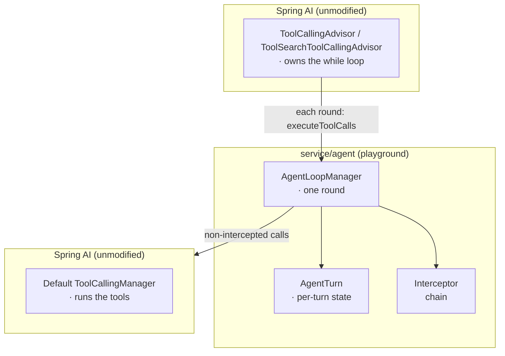
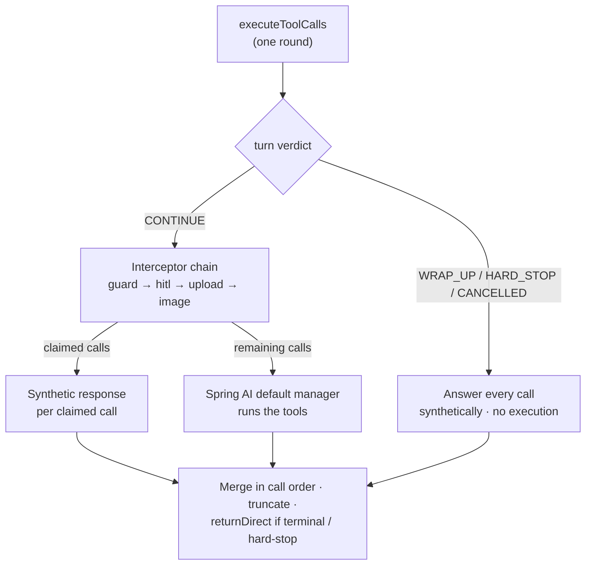

title: Agent Loop
description: How Spring AI Playground governs the agentic tool-calling loop - a decorator on Spring AI's ToolCallingManager that adds per-turn state, round bounds, and an interceptor chain for approval and interactive tools, without touching the Spring AI loop.

# Agent Loop

An **agent** is a model calling tools in a loop until it can answer. In Spring AI Playground that loop is owned by **Spring AI** - the playground does not reimplement it. What the playground adds is the *governance* around each round: how many rounds may run, what to do when the model repeats itself or a call is cancelled, and how a tool call can pause for a human or for a file. This page describes that layer.

Pages this layer connects to:

- [Human-in-the-Loop Approval](hitl-architecture.md) - the per-call approval gate that lives inside this loop
- [Context Engineering](context-engineering-architecture.md) - what enters the model's context each round
- [AI Agent Observability](observability-architecture.md) - the per-turn traces every round emits
- [Application](architecture.md) - where `service/agent` sits in the runtime

## Where it sits { #seam }

Spring AI's `ToolCallingAdvisor` (static tools) and `ToolSearchToolCallingAdvisor` (dynamic discovery) own the `while` loop: call the model, if it asked for tools execute them, append the results, repeat until the model answers. Both delegate the *execute the tools* step to a `ToolCallingManager`. The playground supplies its own implementation, [`AgentLoopManager`](https://github.com/spring-ai-community/spring-ai-playground/blob/main/src/main/java/org/springaicommunity/playground/service/agent/AgentLoopManager.java), wired into both advisors as their manager.

So the relationship is: **the playground wraps the Spring AI loop from the outside, through the extension point the loop already offers.** No Spring AI class is modified or subclassed - `AgentLoopManager` decorates the default manager. Because the static advisor, the dynamic advisor, and the non-streaming `call()` path all funnel through this one manager, it is the single place that governs every tool round.

What this seam can and cannot do shapes everything below. It **can** count rounds, replace a specific tool call with a synthetic response, and end the loop (by returning `returnDirect`). It **cannot** change the loop's own control flow - so a soft limit is enforced by *persuasion* (a synthetic "wrap up" tool response) and only the hard limit *forces* termination.

## Per-turn state { #turn }

One [`AgentTurn`](https://github.com/spring-ai-community/spring-ai-playground/blob/main/src/main/java/org/springaicommunity/playground/service/agent/AgentTurn.java) is created per user message and placed in the tool context, so every round of that turn shares it. It tracks the round count, a per-fingerprint call count (tool name + arguments), the set of tools declined this turn, the interaction budget for the current round, and a cancelled flag. It is built from atomics/concurrent sets - rounds run on reactive scheduler threads and `cancel()` arrives from outside the stream.

If no turn is present in the tool context (a caller that uses the manager directly, e.g. a test or an external embedder), `AgentTurn.from` returns a detached, unbounded turn - the pre-existing behavior, no guards.

At the start of each round the turn returns a **verdict**:

| Verdict | When | Effect |
|---|---|---|
| `CONTINUE` | normal | Run the round through the interceptor chain. |
| `WRAP_UP` | round count past `soft-max-rounds` | Every tool call is answered with "the tool budget is exhausted, answer now" - nothing executes. |
| `HARD_STOP` | round count past `hard-max-rounds` | Same, plus `returnDirect` so the loop ends immediately. |
| `CANCELLED` | the stream was stopped/failed | Every call is answered without executing, and the loop ends. |

The soft/hard split exists because of the seam: the playground cannot delete tools from the next round, only respond to the calls the model already made. `WRAP_UP` persuades; `HARD_STOP` is the backstop for a model that ignores the persuasion. Defaults are 16 and 18 - see the [configuration reference](getting-started/configuration.md#agent-loop). All limits are enforced by [`LoopGuardInterceptor`](https://github.com/spring-ai-community/spring-ai-playground/blob/main/src/main/java/org/springaicommunity/playground/service/agent/LoopGuardInterceptor.java) and counted on the `chat.tool.loop` meter.

## The round pipeline { #pipeline }

`AgentLoopManager.executeToolCalls` runs once per round:

1. **Shape the prompt** - resolve dynamic-pool tools the model named, and guard tool names that are not exposed (an unknown name would otherwise crash the loop; it is answered with a recovery hint instead, even when no tools are bound).
2. **Begin the round** - `turn.beginRound()` returns the verdict above.
3. **Run the interceptor chain** - each interceptor may *claim* tool calls by returning a synthetic response keyed by tool call id. A claimed call is never executed and is not seen by later interceptors. Order is fixed: `LoopGuard` → `HitlApproval` → `FileUpload` → `ImageReference`. Because the guard runs first, a cancelled or budget-exhausted round never opens a dialog.
4. **Execute the rest** - non-claimed calls go to the wrapped Spring AI manager, inside an MDC identity scope for log/trace correlation.
5. **Assemble** - claimed and executed responses are merged back in the model's original call order; any follow-up message (e.g. an attached image) is appended; oversized results are truncated; a terminal action card sets `returnDirect`; a `HARD_STOP`/`CANCELLED` verdict forces `returnDirect`.

## The interceptors { #interceptors }

Each interceptor is a small, stateless unit; per-turn memory lives on `AgentTurn`, UI handlers are pulled from the tool context.

- **`LoopGuardInterceptor`** - applies the round verdict, short-circuits a tool called with identical arguments too many times, and auto-declines any tool already declined this turn (so a re-request never reopens a dialog).
- **`HitlApprovalInterceptor`** - the [human-in-the-loop gate](hitl-architecture.md). Raises one approval question per gated call, keyed by tool call id, and batches the round's questions into a single dialog. Fails closed: if the dialog cannot be shown or errors, the calls are declined.
- **`FileUploadInterceptor`** - handles `requestFileUpload` by opening the upload dialog (within the round's interaction budget). A cancel/timeout marks the tool declined for the turn and tells the model to stop retrying and ask the user to upload in a new message.
- **`ImageReferenceInterceptor`** - handles `describeImage`: resolves an existing image, or opens an upload/pick dialog, then attaches the image as a follow-up message for a vision model. Cancel behaves like the upload case.

The upload and image interceptors are why the loop is *interactive*: a tool call can block on a person mid-loop. The interaction budget (one dialog per round by default) keeps those blocking waits from stacking past the stream's 300-second inter-signal timeout.

## Lifecycle and cancellation { #lifecycle }

Interactive dialogs block a round thread while they wait. Two things keep that safe:

- **Fail-safe timeouts.** Each dialog waits only for its configured timeout (approval 120s, upload/image 180s), both clamped below the 300s stream timeout, then resolves to decline / not-provided.
- **Stream-end cleanup.** When the stream ends early - an error or the UI detaching - `ChatService` marks the turn cancelled and calls `cancelPending()` on each interactive handler, which completes the blocked wait and closes any open dialog. This prevents an orphaned modal from outliving the response.

One consequence worth noting: the upload and approval dialogs are **modal**, so while one is open the chat's Stop button is behind the backdrop and cannot be clicked. Aborting an open dialog is done with its own **Cancel** / **Decline** button (which ends the tool cleanly and lets the model wrap up); `cancelPending` covers the error/detach cases, not the Stop button.

## Messages back to the model { #messages }

Every synthetic response follows one rule: **state what happened, then say what to do next.** A decline, a cancel, a repeat, a budget stop - each tells the model plainly that the call did not run and not to retry it this turn, so a small local model does not spin on the same call. These are centralized in [`AgentTurnMessages`](https://github.com/spring-ai-community/spring-ai-playground/blob/main/src/main/java/org/springaicommunity/playground/service/agent/AgentTurnMessages.java). The MCP server-side gate carries the same "do not retry" hint for external callers.

## Observability { #observability }

- `chat.tool.loop` counter, tagged by `outcome` (`wrap-up`, `hard-stop`, `cancelled`, `repeated`, `declined-repeat`, `interaction-budget`) - how often each guard fired.
- `mcp.hitl.decision` counter, tagged `outcome` (`approved`, `declined`, `ask-failed`) and `side=chat` - approval decisions (the server gate reports `side=server`). See [Human-in-the-Loop Approval](hitl-architecture.md).
- The process panel in Agentic Chat shows each round's user message, tool calls, and tool results, emitted by `AgentLoopHarness`.

## Related

- [Human-in-the-Loop Approval](hitl-architecture.md) - the approval gate inside this loop, and the MCP server-side gate
- [Context Engineering](context-engineering-architecture.md) - static vs dynamic tool exposure feeding the loop
- [Application](architecture.md) - where the loop sits in the advisor chain
- [Configuration reference → Agent loop](getting-started/configuration.md#agent-loop) - the tunables
