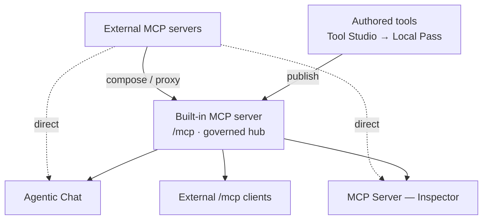
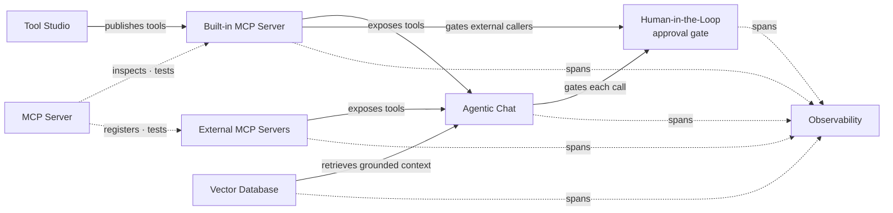
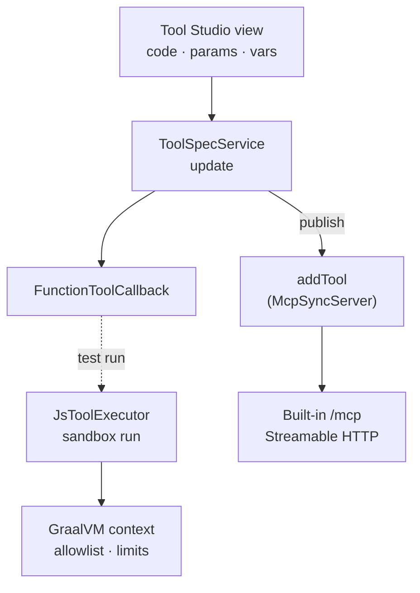
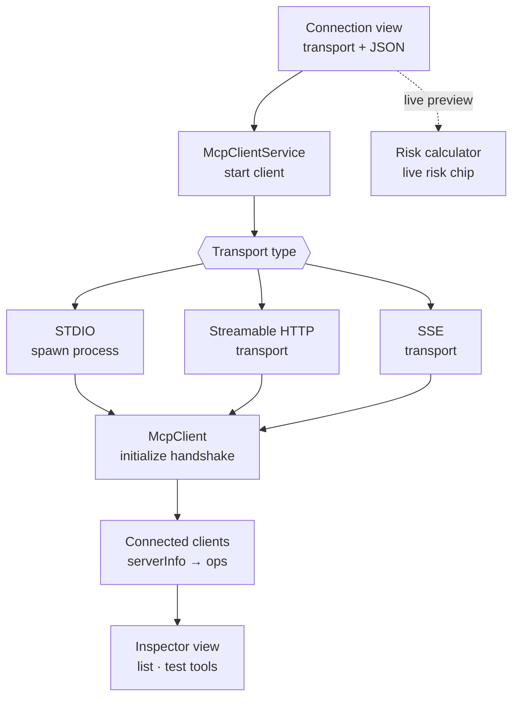
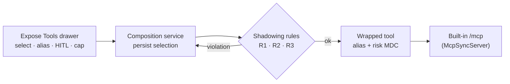
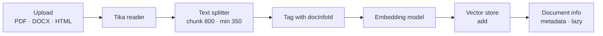
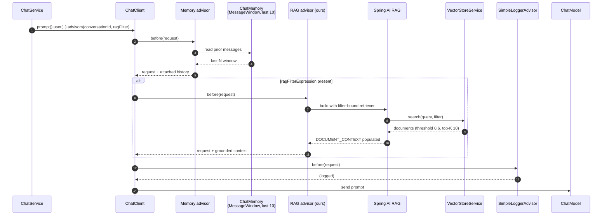
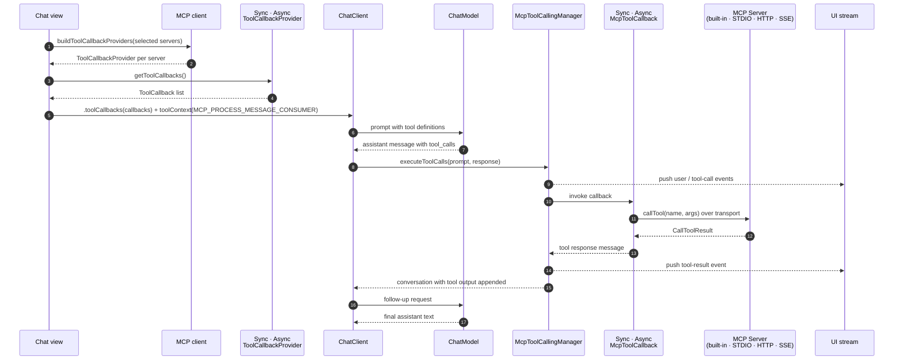
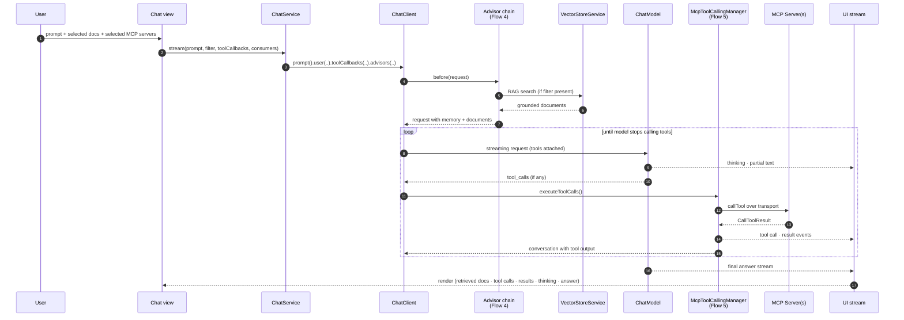

title: Application
description: Spring AI Playground architecture — runtime layers, feature modules, data flows, and extension points across Tool Studio, MCP, RAG, and Agentic Chat.

# Application

Spring AI Playground is a **tool-first Spring Boot application** with several UI surfaces layered on top of a shared runtime. The primary packaged experience is a cross-platform desktop app; Docker and source execution are supported as alternative runtimes.

This page explains how the system is organized, how requests flow through it, and where to extend it. It is intended for contributors, integrators, and anyone evaluating how the product is built under the hood.

This is one of six architecture documents that complement each other:

- **Application** (this page) — runtime layers, feature modules, data flows, extension points
- **[Safe Tool Specification](safe-tool-specification.md)** — normative JSON spec for tool authoring (fields, JSON Schema, resolution algorithm, lifecycle)
- **[AI Agent Tool Safety](safety-architecture.md)** — defense-in-depth sandbox model, policy resolution, threat-to-layer mapping, known limitations
- **[MCP Server Safety](mcp-server-safety.md)** — client-side risk model for external MCP servers and re-exposed tools
- **[Human-in-the-Loop Approval](hitl-architecture.md)** — the runtime per-call approval gate (chat dialog + MCP elicitation)
- **[AI Agent Observability](observability-architecture.md)** — the visibility layer that captures every action the agent took and surfaces it through twelve dashboards

## Overview { #overview }

The whole product is one local desktop app built on the idea of **"no pass, no run"**: a tool is authored, tested in a sandbox against its own values, and only then published to the built-in MCP server where an agent can call it. **External MCP servers are reached two ways** — Agentic Chat and the MCP Inspector connect to them *directly*, and selected upstream tools are also *composed/proxied* onto the built-in server so they reach every consumer (Chat, Inspector, external `/mcp` clients) wrapped and governed. Agentic Chat composes tools with RAG grounding, served by a local model by default.

Solid arrows are the built-in server path (authored tools + proxied external tools); dotted arrows are direct external connections. The rest of this page expands that flow into runtime layers, feature modules, and data flows.

## Design Goals

**Spring AI Playground is a Safe Local Execution Layer for AI Agent Tools.** A tool a model can invoke is just code running on someone's machine — so the whole system is shaped to make that code declare what it touches *before* it touches anything. A tool is a structured spec; the spec runs in a Java-level sandbox on the author's own host; the sandbox earns the tool a Local Pass against the author's own test values; only then does the tool reach the built-in MCP server where any client (including the model) can call it. **No pass, no run** is the product, not a slogan.

That framing drives every other choice on this page:

- **Tools are executable, not descriptive.** Tool definitions run in a sandbox and can be tested before they are published.
- **MCP is a first-class runtime boundary.** Built-in and external tools are consumed through the same Model Context Protocol surface.
- **RAG is inspectable.** Retrieved chunks are visible in Chat before the model uses them.
- **Chat composes capabilities.** Agentic Chat is where tools and grounded context are combined — not where they are invented.
- **Local-first defaults.** No external database or cloud services required to try the product end-to-end.

## Runtime Layers

The application is easiest to think about as five layers. Each layer has a well-defined responsibility and a narrow interface with the one above it.

{ loading=lazy }

### Layer 1 — Desktop Launcher (Electron)

Located in `electron/`. Responsible for packaging, configuration, and process lifecycle — not for any AI behavior.

- `main.js` spawns the bundled Spring Boot JAR, polls for readiness, opens the main `BrowserWindow`, and terminates the JVM on quit.
- `launcher-config.js` holds YAML templates per provider (Ollama, OpenAI, OpenAI-compatible).
- `ollama-manager.js` drives the Ollama model manager window.
- **OS secure storage** — provider API keys and `${ENV}` secrets entered in the launcher are sealed with Electron `safeStorage` (Keychain on macOS, DPAPI on Windows, libsecret/kwallet on Linux) and written to an encrypted `secrets` store, never as plaintext when OS encryption is available.

The launcher is optional. Running the JAR directly or the Docker image skips this layer entirely.

### Layer 2 — UI Surfaces

Hand-written **Vaadin Flow** views under `src/main/java/org/springaicommunity/playground/webui/`. Not Hilla-generated. Each feature area has a root view (`@Route`, `@SpringComponent`, `@UIScope`) and smaller component views composed inside it.

| Package | Root view | Purpose |
|---|---|---|
| `webui/home` | `HomeView` | Landing page with product surfaces |
| `webui/tool` | `ToolStudioView` | JavaScript tool authoring and test runner |
| `webui/mcp` | `McpServerView`, `McpServerConnectionView`, `McpServerConfigView` | Sidebar (Built-in / Active / Inactive catalog), connection form, Inspector for built-in and external MCP servers |
| `webui/vectorstore` | `VectorStoreView` | Document upload, chunk inspection, search |
| `webui/chat` | `ChatView` | Agentic Chat with tools and RAG |
| `webui/observability` | `ObservabilityView` | Twelve dashboards (Overview · Tokens & Cost · AI Models · Tool Studio · MCP Servers · MCP Inspector · Vector Database · Agentic Chat · Host · Web Application · Logs · Traces) + Trace Detail / Conversation Thread / Model Pricing Manager dialogs |
| `webui/common/sidebar` | `SidebarFilterBar`, `CategoryGroupDetails`, `SidebarItemLayout` | Shared widgets used by both the MCP Server sidebar and the Tool Studio tool list — search + Categories MultiSelect + Tags MultiSelect, collapsible per-category groups, status dot · name · pills row |

Streaming responses (chat, tool execution traces) are pushed to the browser over Vaadin's WebSocket push.

### Layer 3 — Backend Services

Per-feature services under `src/main/java/org/springaicommunity/playground/service/`, each owning its persistence and runtime concerns. (The observability backend is a separate top-level `observability/` package — its UI sits in Layer 2 and its pipeline is documented in [AI Agent Observability](observability-architecture.md).)

| Package | Key services | Owns |
|---|---|---|
| `service/chat` | `ChatService`, `ChatHistoryService` | Chat execution, history, tool/RAG composition |
| `service/tool` | `ToolSpecService`, `ToolCategoryCatalog`, `ChipListBinding`, `DefaultToolPresetCatalog`, `DefaultToolsPreference{Resolver,Service}`, `ToolActivationCalculator`, `McpToolDefinition` + `ToolManifest` envelope | Tool definitions, preset/preference resolution, draft/exposure state |
| `service/tool/runtime` | `JsToolExecutor`, `JsRuntimeGlobals`, `SafeHttpFetch`, `SafeFs`, `JsHelperException` | GraalVM sandbox, `fetch` SSRF guard, `safety.fs`, `safety.parser.*` |
| `service/tool/policy` | `EffectivePolicyResolver`, `SandboxPostureCalculator` | Per-tool capability overrides + **sandbox** risk-level (L0–L5) calculation (distinct from the MCP connection/exposure risk in `service/mcp/risk`) |
| `service/mcp` | `McpServerInfoService`, `McpToolCallingManager`, `HitlToolCallAdvisor`, `McpServerHitlToolGate` | Built-in MCP server metadata, tool-call eventing, and the two human-in-the-loop approval gates (chat-side advisor + server-side elicitation) — see [Human-in-the-Loop Approval](hitl-architecture.md) |
| `service/oauth` | `EncryptedFileOAuth2AuthorizedClientRepository`, `OAuthTokenEncryptor`, `McpClientRegistrationRepository`, `McpOAuth2AuthorizationCodeRequestCustomizer` | OAuth 2.1 for external MCP connections — encrypted-at-rest token store, dynamic client registration, authorization-code customizer |
| `service/mcp/catalog` | `McpCatalogService`, `McpCategoryService`, `McpTagSuggestionService` | 57-entry preset catalog (49 remote + 8 stdio per OS) — loaded from `default-mcp-specs.json` and `default-mcp-specs-stdio-{mac,linux,windows}.json`, plus the 14-row `default-mcp-categories.json` taxonomy (13 catalog-facing categories + `CUSTOM` reserved for user-added entries), plus dynamic tag suggestions for the Config form; each entry carries `trustSignals` + `docsAdequate` metadata consumed by the risk model |
| `service/mcp/client` | `McpClientService`, `Mcp*PropertiesService` | External MCP clients across STDIO / HTTP / SSE |
| `service/mcp/risk` | `McpServerRiskCalculator`, `McpToolPublishRiskCalculator`, `McpToolRiskComposer`, `McpToolPoisoningScanner`, `McpToolHashLedger`, `McpCompositionService`, `McpCompositionShadowingRules`, `McpExposedToolService`, `WrappedExternalToolCallback` | L0–L5 risk scoring for external servers/tools (transport · auth · trust · doc axes + floor rules), tool-description poisoning scan, fingerprint ledger for change detection, and tool **composition** that re-exposes upstream tools on the built-in server with alias / description / HITL overrides — see [MCP Server Safety](mcp-server-safety.md) |
| `service/util` | `SecretMasking`, `EnvVarResolver` | Resolve `${ENV_VAR}` placeholders against the OS env; sweep connection-error notifications + per-call logs to replace any resolved secret value with `***` |
| `service/vectorstore` | `VectorStoreService`, `VectorStoreDocumentService` | Tika ingestion, chunking, embedding, search |
| `service/identity` | `DeviceIdProvider`, `UserIdentityService`, `MdcIdentityFilter` (in `config`) | Stable per-device id — salted SHA-256 of the OS machine id, persisted to `identity/installation.json`; injected into MDC as `userId` / `sessionId` for log + trace correlation (see [Observability → Device-based identity](observability-architecture.md#device-identity)) |
| `observability` *(top-level)* | `ObservabilityCollector`, `ObservabilityRingBuffer`, `ObservabilityTimeSeries`, `ModelPricingService` | Micrometer `ObservationHandler` pipeline + ring buffer / time series / JSONL persistence that backs the Observability dashboards — a sibling of `service/`, shown here because it is runtime backend. Full design: [AI Agent Observability](observability-architecture.md) |

Persistence is pluggable via `PersistenceServiceInterface` and coordinated by `SpringAiPlaygroundPersistenceManager` on startup / shutdown. The default writes JSON files under the user home directory.

### Layer 4 — Spring AI Integration

Thin adapter layer configured in `SpringAiPlaygroundApplication` and related Spring `@Configuration` classes.

- `ChatClient` is built once from **all `Advisor` beans injected as an array** (`chatClientBuilder.defaultAdvisors(Advisor[])`), ordered by each advisor's `getOrder()`. The four are **`MessageChatMemoryAdvisor`**, **`SpringAiPlaygroundRagAdvisor`** (`LOWEST_PRECEDENCE − 1`), **`SimpleLoggerAdvisor`**, and **`HitlToolCallAdvisor`** (`HIGHEST_PRECEDENCE + 300`) — the last extends Spring AI's `ToolCallAdvisor`, so it owns the tool-calling loop: it wraps `McpToolCallingManager`, which runs the [human-in-the-loop approval gate](hitl-architecture.md) before any tool executes.
- `ChatMemory` defaults to `MessageWindowChatMemory` (last 10 messages) backed by `InMemoryChatMemoryRepository`.
- `VectorStore` defaults to `SimpleVectorStore` (in-memory). Swap via Spring profile or user configuration.
- `EmbeddingModel` is resolved from the active model profile (Ollama by default, OpenAI optional).
- **Built-in MCP Server** — wired through `spring-ai-starter-mcp-server` and exposes published Tool Studio tools over **Streamable HTTP at `/mcp`**. Runs in-process inside the JVM.
- **MCP Client** — wired through `spring-ai-starter-mcp-client` to connect out to external MCP servers.
- **McpToolCallingManager** — the project's `ToolCallingManager` implementation that drives the chat tool-calling loop. It wraps the Spring AI default manager and is where the per-tool human-in-the-loop approval check runs before a tool executes.

### Layer 5 — External Runtimes

Everything outside the JVM:

- **Model providers** — Ollama (local, default), OpenAI, OpenAI-compatible servers (llama.cpp, LM Studio, TabbyAPI, vLLM).
- **Vector databases** (optional) — pgvector, Weaviate, Qdrant, Milvus, and any other Spring AI `VectorStore`. These are opt-in: add the corresponding starter dependency, rebuild, and configure the bean. The default `SimpleVectorStore` is in-process and lives in Layer 4.
- **External MCP servers** — connect through STDIO (spawned process), Streamable HTTP, or legacy SSE.
- **Document readers** — Apache Tika handles PDF, DOCX, HTML, and others.

## Feature Modules

The main surfaces are **connected parts of one workflow**, not isolated demos:

- **Tool Studio** creates and publishes tools into the **Built-in MCP Server**.
- **MCP Server** is the validation boundary — register, inspect, and test external MCP connections before trusting them; the Built-in MCP Server is included there by default.
- **Vector Database** prepares indexed knowledge for retrieval.
- **Agentic Chat** composes tools (from the Built-in MCP Server or External MCP Servers) and retrieved documents into one conversational runtime.
- **Human-in-the-Loop** is a cross-cutting runtime gate — a tool flagged for approval pauses before it runs, asking the user in Chat (dialog) or the calling client (MCP elicitation). See [Human-in-the-Loop Approval](hitl-architecture.md).
- **Observability** is the read-only visibility layer — every other surface emits `gen_ai.*` / `spring.ai.tool` / `db.vector.client.operation` spans into the `ObservabilityCollector`, which assembles per-turn `TraceRecord`s and exposes them through twelve dashboards. See [AI Agent Observability](observability-architecture.md) for the pipeline.

## Key Data Flows

### Flow 1 — Tool authoring and publication

A tool defined in Tool Studio is a `FunctionToolCallback` whose executor delegates to the GraalVM JavaScript sandbox. Publishing registers the callback with the built-in `McpSyncServer` so external MCP clients (Claude Desktop, Claude Code, etc.) can call it.

Sandbox policy is configurable under `spring.ai.playground.tool-studio.js-sandbox`. The defaults are deny-first: raw network I/O, file I/O, native access, and thread creation are all blocked at the Java level. A `deny-classes` list (System, Runtime, Process, Class, reflect, invoke, Thread, ClassLoader, ServiceLoader, spi) is evaluated before any allow-class match, so deny always wins. The allow-classes are limited to pure-compute packages (`java.lang/math/time/util/text.*`). Tools talk to the outside world through built-in helpers — `fetch` (four-layer SSRF guard, `strict` egress), `safety.fs` (rooted at `tool-studio.fs.base-path`), and `safety.parser.{html,yaml,csv,xml}` — and a tool that genuinely needs more opens specific capabilities through per-tool overrides on its `SandboxOverrides` block (`addAllowClasses`, `hostsAllow`, `networkMode`, `fileRead`/`fileWrite`, `fsBasePath`), which raise its visible risk level (L0–L5) computed by `SandboxPostureCalculator`. See [Tool Studio → Sandbox & Capabilities](features/tool-studio/index.md#sandbox-capabilities) for the full override shape, egress mode behavior, and risk-level rules.

Publishing has two states. A new or unverified tool is a **Draft** — it lives in Tool Studio and is **not** registered with the built-in MCP server. A Local Pass (a successful test run with the declared test values) flips the `McpToolDefinition` exposure flag and `ToolActivationCalculator` registers the callback with `McpSyncServer`. Which built-in tools are Local-Passed (active) on boot is decided by `DefaultToolPresetCatalog` + `DefaultToolsPreferenceResolver`, configured at setup (the launcher's Default MCP Tools card or a CLI override). Tool Studio's Built-in MCP Server Native Tools drawer then selects which Local-Passed tools the server exposes.

### Flow 2 — External MCP server connection

`McpClientService` is transport-agnostic. A dedicated `Mcp*PropertiesService` knows how to build a transport from the connection JSON for each `McpTransportType`.

Once registered, the same connection becomes available as a tool source in Agentic Chat. While the form is open, `McpServerRiskCalculator` scores the in-progress connection and renders a live **risk chip** beside the transport selector (see [MCP Server Safety](mcp-server-safety.md)).

### Flow 2b — Exposing external tools (composition)

Beyond inspecting a connection, the operator can **re-expose** selected upstream tools on the built-in MCP server through the Expose Tools drawer. `McpCompositionService` persists the selection (exposed alias, description override, per-tool HITL, max-risk cap); on enable, `McpCompositionShadowingRules` validates the set (alias collisions, cross-server references), `McpToolRiskComposer` combines server + tool risk (lowered one band when HITL is set), and `McpExposedToolService` wraps each chosen tool in a `WrappedExternalToolCallback` registered with `McpSyncServer` — so it joins the Tool Studio tools published at `/mcp`.

### Flow 3 — Document ingestion and RAG

Searches go through `VectorStoreService.search(query, filterExpression)` which builds a `SearchRequest` with similarity threshold `0.6` and top-K `10` by default. The `docInfoId` metadata makes it possible to scope retrieval to specific documents in Chat.

### Flow 4 — Chat advisor chain (memory + RAG)

Every chat request passes through the `ChatClient` advisor chain before it reaches the model. The chain is assembled from all `Advisor` beans injected as an array (`defaultAdvisors(Advisor[])`) and ordered by each advisor's `getOrder()` — **MessageChatMemoryAdvisor**, **SpringAiPlaygroundRagAdvisor**, **SimpleLoggerAdvisor**, and **HitlToolCallAdvisor** (which owns the tool-calling loop and runs the [human-in-the-loop gate](hitl-architecture.md); see Flow 5).

RAG only runs when the user selected at least one document — otherwise `SpringAiPlaygroundRagAdvisor` short-circuits and the chain moves on. Retrieved documents are carried in the request's `DOCUMENT_CONTEXT` so the UI can render them alongside the final answer.

### Flow 5 — Chat with MCP tools

Tool callbacks come from MCP clients, not from code you compile in. When a user picks one or more MCP servers in Chat, `McpClientService` hands back a `ToolCallbackProvider` for each live connection (built-in or external). The model sees their tools as ordinary function tools; `McpToolCallingManager` intercepts every call so the UI can show it.

The same path handles the Built-in MCP Server (loopback Streamable HTTP at `/mcp`) and external servers (STDIO, Streamable HTTP, SSE) — only the transport differs.

### Flow 6 — Agentic Chat

Agentic Chat is the compose step: it drives Flow 4 and Flow 5 in one streaming request, letting the model decide how many tool-call rounds to run before it produces the final answer.

Retrieved documents, every tool call, every tool result, and any reasoning trace are all surfaced in the UI — the agent's path from question to answer is explicit rather than hidden.

## Safe Tool Spec

The **Safe Tool Specification** is the on-disk contract that makes the "Safe Local Execution Layer" claim concrete. Every tool — bundled in the playground's catalog (`src/main/resources/tool/default-tool-specs-*.json`) or authored in Tool Studio (saved under `~/spring-ai-playground/tool/save/`) — serializes into one JSON document with three coupled concerns: identity the model sees, code the runtime executes, and safety posture the sandbox will enforce. The name distinguishes it from generic tool specs (MCP's `tools/list` schema, OpenAI function calling) that describe an interface but say nothing about *what is safe to let an agent run.*

The spec maps directly onto the four parts of the product positioning:

- **Safe** — the spec carries a `sandboxOverrides` block (author intent) that `SandboxPostureCalculator` resolves into an enforced `toolSafety` block. No tool reaches the MCP server until those two are reconciled and the spec earns its Local Pass.
- **Local** — specs persist to the author's own host (`~/spring-ai-playground/tool/save/`); the bundled catalog ships the same JSON shape pre-filled. Nothing about a spec leaves the machine unless an MCP client over the loopback asks for it.
- **Execution Layer** — the spec carries the JS action body and the input shape the runtime invokes. `draft: true` means the spec has not yet earned a Local Pass and is not exposed; flipping that flag is what publishes the tool.
- **for AI Agent Tools** — `name`, `description`, and `params` are *model-visible* (they drive tool selection and argument typing through MCP); `staticVariables` is server-side config the model never sees, sourced from `${ENV_VAR}` placeholders.

### Author intent → enforced posture

A safe tool spec carries two safety-related blocks that look similar but serve opposite directions:

- **`sandboxOverrides`** — what the *author* declared they need (broader network mode, FS access, additional class-allowlist entries). This is the editable surface in Tool Studio's Sandbox & Capabilities pane. Missing or null fields mean "baseline" — no override.
- **`toolSafety`** — what the *runtime* will actually enforce. `SandboxPostureCalculator` reads `sandboxOverrides` plus the baseline policy and produces a resolved snapshot. The Risk Level badge (L0–L5) the UI shows is computed from this block, and the audit log records this block on every invocation.

The split exists so that (1) the editable intent and the enforced posture cannot drift, (2) verifying a foreign spec's safety properties only needs reading `toolSafety`, and (3) the audit log captures what was *actually enforced*, not what the author *asked for*.

For the full document grammar — every field, JSON Schema, resolution algorithm, network mode behavioral table, Risk Level computation, versioning policy, validation error model, and canonical examples — see [**Safe Tool Specification 1.0**](safe-tool-specification.md). For the resolver internals and threat-to-layer mapping, see [AI Agent Tool Safety](safety-architecture.md). For the Tool Studio UI form that writes this JSON, see [Tool Studio → Sandbox & Capabilities](features/tool-studio/index.md#sandbox-capabilities).

## Sandbox Safety

Tool Studio is the only part of the system that runs user-authored code. The implementation models safety as three independent layers — an always-on Java-level sandbox, a per-tool override surface with a visible risk badge, and a transport-level security layer in front of the MCP endpoint.

For the system-level reference (three-layer diagram, policy resolution, per-execution enforcement, threat-to-layer mapping, known limitations, and the next-pass HITL design), see → [**AI Agent Tool Safety Architecture**](safety-architecture.md).

For the user-facing surface (override fields, Risk Level rules, SSRF four-layer steps), see → [Tool Studio → Safety](features/tool-studio/index.md#safety) and [Tool Studio → Sandbox & Capabilities](features/tool-studio/index.md#sandbox-capabilities).

## Configuration and Profiles

| Location | Purpose |
|---|---|
| `src/main/resources/application.yaml` | Base defaults, profile declarations |
| `src/main/resources/tool/default-tool-specs*.json` | Built-in tools shipped with the app (split by bundle: `default-tool-specs.json`, `-builtin.json`, `-builtin-helpers.json`, `-builtin-fs.json`, `-network.json`, `-kr.json`) |
| `electron/resources/default-application.yaml` | Desktop launcher's default config template |
| `electron/launcher-config.js` | Provider starter templates (Ollama, OpenAI, OpenAI-compatible) |

Runtime selection happens through Spring profiles (`ollama`, `openai`) combined with user configuration written by the launcher. The same JAR can target any supported provider — no rebuild required.

## Persistence

`SpringAiPlaygroundPersistenceManager` hooks into Spring's lifecycle and delegates to per-feature persistence services:

- `ChatHistoryPersistenceService` — conversation metadata and messages
- `ToolSpecPersistenceService` — authored tools
- `VectorStoreDocumentPersistenceService` — uploaded documents and metadata
- `McpServerInfoPersistenceService` — saved external MCP connections

State is serialized as JSON under the user home directory. `SimpleVectorStore` itself is volatile — vectors are recomputed on restart when the default store is in use. Swapping in a durable vector store (pgvector, Weaviate) removes that constraint.

## Extensibility Points

| Extension | Where |
|---|---|
| New model provider | Spring profile + `application.yaml` + launcher template |
| New vector store | Standard Spring AI `VectorStore` bean override |
| New MCP transport | Add an `McpClientPropertiesService<T>` implementation and register it against `McpTransportType` |
| New tool | Tool Studio (runtime, no rebuild) or a Spring bean exposing a `ToolCallback` |
| Custom advisor | Register an additional `Advisor` bean; picked up by `ChatClient` builder |
| Custom persistence | Implement `PersistenceServiceInterface` |

## Why This Shape

The five-layer model is deliberate. Each capability has a dedicated runtime area, but the user-facing flows **compose** those capabilities rather than hiding them behind a single opaque screen. That is what makes the app useful as a validation environment: every boundary — sandbox, MCP transport, retrieval, tool execution — is visible and testable in isolation before it is combined in Chat.

## Further Reading

- [Overview](index.md) — product positioning, quick start path, and documentation map
- [Getting Started](getting-started/index.md) — install, configure, and run the app
- [Features](features/index.md) — what each product area does and how to use it
- [Tutorials](tutorials/index.md) — end-to-end walkthroughs that exercise these flows
