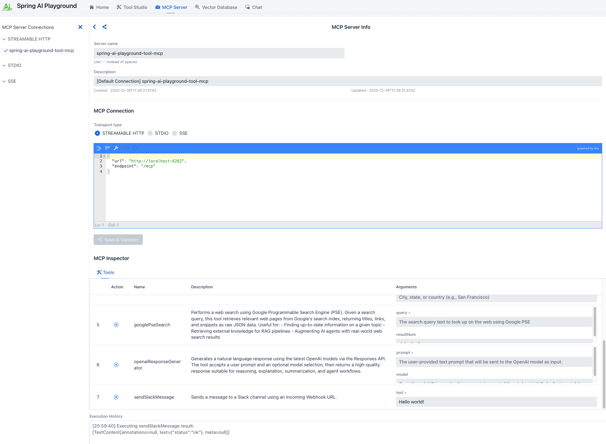
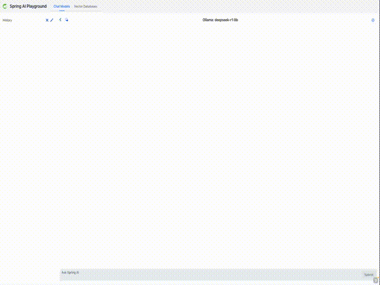
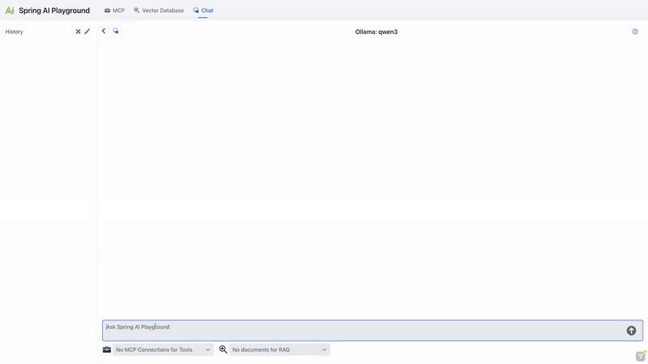

Description: Explore Spring AI Playground features: Tool Studio, MCP Server, Vector Database, Agentic Chat, and the safe local architecture behind its AI tool workflow.

# Features

This page explains the main product areas in the same order the application is designed to be understood: Architecture, Tool Studio, MCP Server, Vector Database, and Agentic Chat.

## Architecture

Spring AI Playground is a tool-first Spring Boot application with multiple UI surfaces layered on top of a shared set of runtime services.

The primary packaged experience is the cross-platform desktop app, while Docker and local source execution remain available as alternative runtimes for server-style deployment or development workflows.

At a high level, the product is organized around a few major surfaces that work together instead of behaving like isolated demos.

### Architectural Shape

The application is easiest to think about as five layers:

1. navigation and UI surfaces
2. workflow-specific UI components
3. service-layer orchestration for chat, tools, MCP, and vector search
4. Spring AI integrations for models, embeddings, vector stores, and MCP
5. external runtimes such as model providers, vector databases, and MCP servers

### Main UI Surfaces

The main product areas are:

- Home
- Tool Studio
- MCP Server
- Vector Database
- Agentic Chat

Those screens are not isolated demos. They are connected parts of one workflow-oriented runtime:

- Tool Studio creates and publishes tools
- MCP Server inspects and executes tools from built-in and external MCP connections
- Vector Database prepares indexed knowledge for RAG
- Agentic Chat composes documents and tools into one conversational runtime

### Service Layer

Behind those screens, the runtime follows the same separation of concerns:

- Tool Studio handles tool definitions, persistence, and JavaScript execution
- MCP Server handles connection management, transport handling, inspection, and tool invocation
- Vector Database handles document ingestion, chunking, embedding, persistence, and search
- Agentic Chat handles chat execution, history, shared context, and workflow composition

This is one of the reasons the app works well as a validation environment. Each major capability has a dedicated runtime area, but the user-facing flows compose those capabilities rather than hiding them behind a single opaque screen.

### Why the Architecture Matters

Many playground-style apps stop at prompt entry and output display. Spring AI Playground deliberately goes further:

- tool definitions are executable, not just descriptive
- MCP is treated as a first-class runtime boundary
- RAG can be inspected before it is trusted
- chat is where capabilities are composed, not where they are invented

That makes the project a practical reference environment for Spring AI rather than only a prompt playground.

## Tool Studio

Tool Studio is the low-code authoring environment for JavaScript-based tools.


It is the part of the product that turns the Playground from a read-only testing interface into an executable tool runtime.

### What Tool Studio Does

Tool Studio lets you:

- create tools directly in the browser
- define structured input parameters
- define static variables
- test tool execution immediately
- publish tools to the built-in MCP server without restart or redeploy

### Built-in MCP Server

Tool Studio is tightly integrated with the built-in MCP server.

- endpoint: `http://localhost:8282/mcp`
- protocol: Streamable HTTP
- default server name: `spring-ai-playground-tool-mcp`

When you publish a tool from Tool Studio, it becomes available through that MCP endpoint immediately.

### Security

The built-in MCP server leverages Spring AI's MCP security model through Spring Security, but the default local experience is intentionally simple.

- authentication is disabled by default
- for production-style security, you can apply Spring AI's official MCP security configuration without changing your tool logic
- for setup details, refer to the [Spring AI MCP Security Documentation](https://docs.spring.io/spring-ai/reference/api/mcp/mcp-security.html)

The practical point is that the local Playground is optimized for fast iteration first. When you move toward a stricter deployment model, the MCP exposure boundary does not need to change, but the surrounding security model can.

### Connect to the Built-in MCP Server

Once Spring AI Playground is running, the built-in MCP server can be consumed directly by MCP-compatible clients.

#### Claude Code

Recent Claude Code versions support Streamable HTTP directly.

```bash
claude mcp add spring-ai-playground http://localhost:8282/mcp
```

Restart Claude Code if needed so the new server is picked up.

#### Cursor

Configure a Streamable HTTP server in Cursor with:

- Name: `Spring AI Playground`
- URL: `http://localhost:8282/mcp`

In practice, that means:

1. open Cursor Settings
2. navigate to **Features > MCP**
3. add a new MCP server
4. choose **Streamable HTTP**
5. enter the name and URL above

#### Claude Desktop

If your Claude Desktop plan supports native remote connectors, you can add `http://localhost:8282/mcp` directly from the Settings UI.

For broader compatibility, one practical approach is to use `mcp-remote`:

```json
{
  "mcpServers": {
    "spring-ai-playground": {
      "command": "npx",
      "args": ["-y", "mcp-remote", "http://localhost:8282/mcp"]
    }
  }
}
```

Restart Claude Desktop after saving the config.

This proxy-style setup is especially useful when direct remote configuration is unavailable or inconvenient, because it wraps the remote Streamable HTTP MCP server behind a local process contract that desktop clients already understand well.

### Dynamic Tool Exposure

Tool Studio and the built-in MCP server are intentionally designed for a no-restart workflow:

- create or update a tool
- test it
- publish it
- inspect it through MCP immediately

When a tool is created or updated in Tool Studio, it is dynamically discovered and exposed by the default built-in MCP server. You can then inspect its schema and validate execution behavior from the MCP Server screen without restarting or redeploying the application.

### JavaScript Runtime

Tool actions run as JavaScript through GraalVM Polyglot inside the JVM.

The runtime characteristics are:

- ECMAScript 2023 execution
- controlled Java interop
- sandbox-oriented restrictions
- whitelist-based access to approved Java classes

The default sandbox configuration is intentionally restrictive:

- network I/O allowed
- file I/O blocked
- native access blocked
- thread creation blocked
- allowed classes explicitly listed

Typical sandbox settings look like this:

```yaml
js-sandbox:
  allow-network-io: true
  allow-file-io: false
  allow-native-access: false
  allow-create-thread: false
  max-statements: 500000
  allow-classes:
    - java.lang.*
    - java.math.*
    - java.time.*
    - java.util.*
    - java.text.*
    - java.net.*
    - java.io.*
    - java.net.http.HttpClient
    - java.net.http.HttpRequest
    - java.net.http.HttpResponse
    - java.net.http.HttpHeaders
    - org.jsoup.*
```

That makes Tool Studio suitable for low-code integrations without turning it into an unrestricted scripting surface. If you need a stricter deployment posture, GraalVM sandbox policies can be layered on top in a custom source build. For more background, see the [GraalVM Security Guide](https://www.graalvm.org/latest/security-guide/sandboxing/).

The reason this matters is that Tool Studio is intended for small, deterministic tool actions rather than arbitrary unrestricted scripting. In other words, the runtime is flexible enough for practical HTTP-based tool integrations while still keeping the safety boundary explicit.

Because tool code can call network APIs and depend on environment values, cross-platform reuse is best understood as a portable workflow rather than a guarantee that every tool behaves identically on every OS and runtime environment.

### Key Tool Studio Capabilities

- Tool MCP Server Setting: control which tools are exposed through the built-in MCP server
- Enable Auto-Add Tools: decide whether newly created or updated tools are exposed automatically
- Registered Tools: keep a larger local tool library while exposing only a curated subset
- Tool Specification View: inspect the generated JSON schema, metadata, and parameter contract
- Copy to New Tool: clone an existing tool as a template instead of starting from scratch
- Tool List and Selection: browse existing tools and reload them into the editor
- Tool Metadata: define stable names and agent-friendly descriptions
- Structured Parameters: define required inputs, descriptions, and test values for model-side tool calling
- Static Variables: inject configuration values and environment-backed secrets
- Test Run and Debug Console: validate console output, status, elapsed time, and result before publishing

In the UI, these capabilities show up as the practical authoring workflow:

- expose only the tools you want MCP clients to see
- inspect the generated tool specification before publishing
- copy a working tool into a new template instead of starting from a blank definition
- test with representative values and review the debug output before updating the runtime

That combination is one of the strongest product-specific ideas in the Playground. You can keep many tools in your workspace, expose only a controlled set, validate the exact contract the model will see, and update the runtime without a restart cycle.

### Low-code Tool Development Workflow

1. Open Tool Studio.
2. Define the tool name and description.
3. Add structured parameters with test values.
4. Add static variables if needed.
5. Write the JavaScript action.
6. Run **Test Run** and inspect the debug output.
7. Publish with **Test & Update Tool**.

### Pre-built Example Tools

Tool Studio includes pre-built tools you can use as references and templates:

- `googlePseSearch`: search the web using Google Programmable Search Engine
- `extractPageContent`: fetch and clean the main text from a web page
- `buildGoogleCalendarCreateLink`: generate a Google Calendar event creation URL
- `sendSlackMessage`: send a message through a Slack webhook
- `openaiResponseGenerator`: call OpenAI and return a generated response
- `getWeather`: fetch a compact weather summary
- `getCurrentTime`: return the current time in ISO format

Some of these depend on environment-backed secrets:

- `googlePseSearch` typically depends on `GOOGLE_API_KEY` and `PSE_ID`
- `sendSlackMessage` depends on `SLACK_WEBHOOK_URL`
- `openaiResponseGenerator` depends on `OPENAI_API_KEY`

That is one of the reasons the desktop launcher’s environment-variable workflow is important.

### Using Tools in Agentic Chat

Tool Studio tools can be used in Agentic Chat through MCP integration. With a tool-capable model and the built-in MCP connection enabled, the model can call those built-in tools during agentic workflows.

Agentic Chat can also call tools exposed by external MCP servers that you explicitly connect and trust.

## MCP Server

The MCP Server area is where you manage and inspect tool connections.



It serves two roles:

- it helps you validate tools published by Spring AI Playground itself
- it acts as a client-side inspection surface for external MCP servers

That distinction matters for safety expectations: built-in tools follow the Tool Studio authoring and test-run workflow, while external MCP servers are connections that you choose to add and trust.

### Connection Management

The MCP runtime supports multiple transport styles, including:

- Streamable HTTP
- STDIO
- legacy HTTP plus SSE-style setups where needed

This makes the Playground useful both for local tool exposure and for external MCP integration testing.

Streamable HTTP is the modern single-endpoint transport used by the built-in MCP server, while STDIO and legacy HTTP plus SSE remain useful for compatibility and external integrations.

The modern Streamable HTTP transport formalized in the MCP v2025-03-26 specification uses a single MCP endpoint. Clients POST JSON-RPC requests to `/mcp`, responses can stream when supported, and session-oriented behavior can be layered on top by MCP clients and servers.

That modern transport replaces the older split HTTP-plus-SSE mental model with a simpler single endpoint, while still preserving compatibility value for STDIO and older integrations.

### MCP Inspector

The Inspector is the practical center of the MCP screen.

It lets you:

- browse the available tools on a connection
- inspect tool names and descriptions
- review argument schemas
- execute tools directly
- inspect results and execution history

That means MCP Server is not just a configuration page. It is an interactive validation surface.

This matters because tool integration work is much easier when schemas and execution behavior are validated before those tools are introduced into a longer-running agentic conversation.

### Getting Started With MCP

1. configure an MCP connection
2. inspect the available tools
3. review the argument schemas
4. execute tools directly
5. use the validated connection later in Agentic Chat

### Relationship to Tool Studio

Tool Studio and MCP Server are designed to work together:

- Tool Studio creates or updates a tool
- the built-in MCP server exposes it
- MCP Inspector verifies the contract and runtime behavior
- Agentic Chat consumes the validated connection

This is one of the cleanest parts of the overall product flow.

## Vector Database

Vector Database is the RAG preparation and retrieval-validation area.



It gives you an end-to-end environment for document ingestion, chunking, embedding, storage, and similarity search.

### What It Supports

This area acts as a vector database playground built on Spring AI vector store integrations.

That includes:

- switching between vector providers without changing application code
- using a unified Spring AI retrieval model
- validating retrieval quality before relying on it in chat

### Support for Major Vector Database Providers

Spring AI Playground follows the Spring AI vector store ecosystem and can be used with providers such as Apache Cassandra, Azure Cosmos DB, Azure Vector Search, Chroma, Elasticsearch, GemFire, MariaDB, Milvus, MongoDB Atlas, Neo4j, OpenSearch, Oracle, PostgreSQL/PGVector, Pinecone, Qdrant, Redis, SAP Hana, Typesense, Weaviate, and others supported by Spring AI.

### Major Capabilities

- Custom Chunk Input: enter raw text and test chunking directly
- Document Uploads: ingest PDF, Word, and PowerPoint-style content
- End-to-End Processing: extraction, chunking, embedding, and indexing
- Search and Scoring: run vector similarity search and inspect scores
- Spring AI Filter Expressions: narrow searches using metadata conditions

### Why It Matters

RAG often fails quietly when chunking, embeddings, or indexing are misaligned. This screen exists so those problems become observable:

- you can see whether ingestion completed
- you can inspect chunk quality
- you can verify retrieval relevance
- you can catch embedding-model changes that invalidate old vector data

That is why the desktop launcher warns users about changing embedding models after indexing content.

In practice, this is what turns the Vector Database page into a real RAG validation surface rather than a generic upload page. You can inspect ingestion quality, retrieval quality, and filter behavior before trusting the same data inside chat.

## Agentic Chat

Agentic Chat is the unified runtime where Spring AI Playground combines documents, tools, models, and conversation state.



This unified interface lets you:

- run RAG workflows grounded in indexed documents
- execute tool-enabled agent flows through MCP
- test complete agent strategies by combining documents and tools in a single chat session

### Key Features

- document selection for RAG grounding
- MCP connection selection for tool-enabled execution
- real-time visibility into retrieved context and tool usage
- one conversational surface for both chain-style and agentic patterns

This area is closely aligned with Spring AI's workflow and agentic guidance. If you want the conceptual background behind these two modes, see [Building Effective Agents](https://docs.spring.io/spring-ai/reference/api/effective-agents.html).

### Two Integrated Paradigms

#### 1. RAG: Knowledge via Chain Workflow

When documents are selected, Agentic Chat follows a deterministic retrieval pattern:

- retrieval from the vector store
- prompt augmentation with grounded context
- response generation based on that context

#### 2. MCP: Actions via Agentic Reasoning

When MCP connections are enabled, Agentic Chat can behave like an agent:

- reasoning about which tools are needed
- invoking tools through MCP
- observing the result
- continuing or answering directly

### Workflow Integration

The intended end-to-end flow is:

1. prepare tools in Tool Studio or connect them in MCP Server
2. prepare knowledge in Vector Database
3. enable the relevant documents and MCP connections in Agentic Chat
4. send a request and observe how retrieval and tool use combine

This is the place where the rest of the product becomes visible as one coherent system rather than separate screens. The outputs of Tool Studio, MCP Server, and Vector Database all converge here.

### Requirements for Agentic Reasoning

Basic chat can work with any supported provider. Tool-enabled agentic behavior works best with models that support function calling and stronger reasoning.

For Ollama-based flows:

- use tool-capable models from [Ollama's Tool Category](https://ollama.com/search?c=tools)
- use reasoning-capable models from [Ollama's Thinking Category](https://ollama.com/search?c=thinking)
- validate tools in MCP Inspector before relying on them in Agentic Chat

The README specifically recommends models such as Qwen 3 and GPT-OSS for stronger tool-oriented reasoning.

### Agentic Chat Architecture Overview

The diagram below is included as a conceptual reference to the related agentic systems material in the Spring AI docs.

It is included here to explain how the Playground's Agentic Chat maps onto the broader Spring AI mental model. In this project, the diagram is not describing a separate product feature hidden behind the UI. It is a conceptual reference for understanding how the Playground combines model reasoning, retrieval, tool execution, and memory in one chat runtime.


If you want the fuller conceptual background, start with [Building Effective Agents](https://docs.spring.io/spring-ai/reference/api/effective-agents.html). That reference explains the workflow-versus-agent distinction that this Playground makes concrete through Tool Studio, MCP Server, Vector Database, and Agentic Chat.

This Chat experience facilitates exploration of Spring AI's workflow and agentic paradigms, empowering developers to build AI systems that combine chain-based RAG workflows with agentic, tool-augmented reasoning. In practice, it follows Spring AI's Agentic Systems architecture, where grounded retrieval and dynamic tool execution coexist in one context-aware chat runtime.

| Component | Type | Description | Configuration Location | Key Benefits | Model Requirements |
| --- | --- | --- | --- | --- | --- |
| **LLM** | Core Model | Executes chain-based workflows and performs agentic reasoning for tool usage within a unified chat runtime. | Agentic Chat | Central reasoning and response generation; supports both deterministic workflows and agentic patterns. | Chat models; tool-aware and reasoning-capable models recommended. |
| **Retrieval (RAG)** | Chain Workflow | Deterministic retrieval and prompt augmentation using vector search over selected documents. | Vector Database | Predictable, controllable knowledge grounding; tunable retrieval parameters such as Top-K and thresholds. | Standard chat plus embedding models. |
| **Tools (MCP)** | Agentic Execution | Dynamic tool selection and invocation via MCP, driven by LLM reasoning and tool schemas. | Tool Studio, MCP Server | Enables external actions, multi-step reasoning, and adaptive behavior. | Tool-enabled models with function calling and reasoning support. |
| **Memory** | Shared Agentic State | Sliding window conversation memory shared across workflows and agents through `ChatMemoryAdvisor` and the underlying Spring AI chat memory support. | Spring AI chat runtime (`InMemoryChatMemory`) | Coherent multi-turn dialogue with a sliding window improves coherence, planning, and tool usage quality. | Models benefit from longer context and structured reasoning. |

By leveraging these elements, Agentic Chat goes beyond basic Q&A and becomes a practical environment for building effective, modular AI applications that combine workflow predictability with agentic autonomy.

## Further Reading

- [Overview](index.md): return to the main product overview and documentation map
- [Getting Started](getting-started.md): install the app, configure providers, and choose a runtime
- [Tutorials](tutorials.md): follow end-to-end workflows for tools, MCP, vector search, and agentic chat
