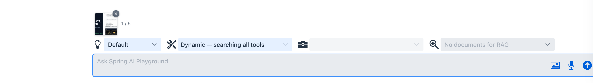

# Multimodal Vision Input

Agentic Chat accepts images as first-class, native multimodal input: attach a photo, ask a question, and a vision-capable model sees the actual pixels - not a text description of them. The pipeline handles resizing, EXIF metadata, storage, and model-capability checks so the conversation stays fast and private.

{ width="1200" }

## Three ways to attach

| Entry point | How |
|---|---|
| **Attach button** | Click the picture icon in the prompt field and pick one or more images |
| **Drag and drop** | Drop image files anywhere on the prompt field |
| **Clipboard paste** | Copy an image (or a screenshot) and paste it into the prompt field |

All three feed the same pipeline. Accepted formats: PNG, JPEG, WebP, GIF (10MB per image before optimization). Each attached image appears as a **chip** above the prompt - click the **x** on a chip to remove it before sending. Up to **5 images** ride along with one message: the chip bar shows a `N / 5` counter and the attach button disables at the cap (5 is a safe ceiling across local vision models - Ollama backends accept between 1 and 8 images per request depending on the model).

## What happens in the browser

Before anything reaches the server, the browser optimizes the image the same way LibreChat, Open WebUI, and the OpenAI clients do:

1. **EXIF first** - camera metadata (capture time, GPS, camera model, exposure, ISO, orientation) is extracted from the *original* file, because the resize step strips it.
2. **Orientation fix** - the image is decoded with EXIF rotation applied.
3. **Resize** - anything longer than **2048px** on its longest edge is scaled down (never up), preserving aspect ratio.
4. **Re-encode** - images with transparency stay PNG; everything else becomes JPEG at quality 0.92. Animated GIFs are passed through untouched.

The optimized bytes plus the extracted EXIF go to the server as the attachment. Nothing is uploaded to any third party - with a local Ollama model the image never leaves your machine.

## Content-addressed storage

Every attached image is stored in the conversation's own workspace under the playground home at `workspace/<conversation>/images/`, keyed by the SHA-256 of its bytes:

```
workspace/Chat-a1b2c3/images/
├── 4e73726bd2c9...d62c25.jpg     # the optimized image
└── 4e73726bd2c9...d62c25.json    # metadata: original file name, MIME type, size, EXIF
```

Attaching the same image twice in a conversation stores it once, and images never leak across conversations - the same per-conversation isolation as the [filesystem tools' workspace](../default-tools/filesystem.md). The hash doubles as a stable reference the model can use later (see [describeImage](#describeimage-re-reference-an-earlier-image)).

## Sending and rendering

Attached images ride along with your next message as Spring AI `Media` on the user message - the provider-native multimodal path (Ollama `images`, OpenAI `image_url`). The sent images render as thumbnails inside your message bubble, and the image references persist with the conversation: reopening a chat restores the thumbnails from the image store. Only the references are saved in the conversation file - the bytes stay deduplicated in the conversation's `images/` directory.

{ width="1200" }

## Vision capability check

Not every model can see. The playground checks *before* you send:

- **OpenAI** - GPT-5 family chat models are multimodal; no warning.
- **Ollama** - the model's manifest is inspected for actual **vision tensors**, not just the advertised `vision` capability flag. This matters because some conversions (notably **mlx models on Apple Silicon**) advertise `vision` while shipping no vision tensors - they silently hallucinate instead of reading the image. The playground detects this case and warns specifically.

| State | What you see |
|---|---|
| Vision tensors present | No warning - attach and go |
| No vision capability | "This model can't process images. Select a vision-capable model." |
| Capability flag without tensors (mlx) | "Reports vision support but ships no vision tensors... pick a non-mlx GGUF vision model." |

The warning fires at attach time but never blocks the send - you stay in control.

!!! warning "Apple Silicon: use a non-mlx model for vision"
    The auto-selected `-mlx` variants are great for text but do not carry vision tensors. For image analysis pick the standard GGUF build - for example `qwen3.5:4b` rather than `qwen3.5:4b-mlx`. If the model list in the settings drawer only offers `-mlx` builds, type the model name directly - custom names are accepted.

## Errors and timeouts

If a non-vision model is sent an image anyway, provider errors are translated into actionable messages ("This model can't process images. Pick a vision-capable model...") instead of raw HTTP bodies. A stream that goes silent is cut off after 5 minutes with a retry hint - local vision models can take a minute or two before the first token on a cold start, so the window is generous.

## describeImage: re-reference an earlier image

Attached images do not need to be re-sent to be discussed again. The **`describeImage`** default tool lets the model re-summon any stored image mid-conversation:

- *"What was in the background of that photo I sent earlier?"* - the model calls `describeImage`, the chat loads the stored image by its hash, and attaches it to the next model call. This works even when the original turn has fallen out of the [context window](../../context-engineering-architecture.md#conversation-memory).
- If several images match, the chat opens a **chooser dialog**; if none exist, it opens an **upload dialog** - the same human-in-the-loop seam as [tool approval](../../tutorials/11-human-approval.md) and [`requestFileUpload`](../default-tools/examples.md#requestFileUpload).

The tool reference is in [Default Tool Examples](../default-tools/examples.md#describeImage). The **[Image analyst](prompt-presets.md#image-analyst)** preset packages the whole loop - analyze an attached image, tabulate findings with `renderTable`, read the EXIF sidecars to map geotagged photos with `plotPointsOnMap`, and export tables as CSV ([Tutorial 14](../../tutorials/14-analyze-an-image.md) walks the map scenario end to end).

## Privacy notes

- Images are optimized and stored **locally** under the playground home; with a local provider they are never transmitted anywhere else.
- EXIF metadata - **including GPS location** if the photo has it - is preserved in the local metadata store so the model can answer "where was this taken?". Nothing strips it, so treat conversations with remote providers accordingly.
- Conversation files store only image *references* (hash, file name, MIME type). Deleting a conversation offers an "Also delete workspace file(s)" checkbox - checked by default, it removes the stored images with the chat; uncheck it to keep them on disk.
