description: Agentic Chat - one local runtime combining documents, tools, models, and memory, with system-prompt presets, per-turn reasoning, and rich Markdown rendering.

# Agentic Chat

**Where:** top navigation → **Agentic Chat**.

Agentic Chat is the unified runtime where Spring AI Playground combines documents, tools, models, and conversation state. It is also where everything you assemble elsewhere - system prompts, built-in and authored tools, proxied MCP servers, and indexed documents - comes together as the live context for a single conversation.

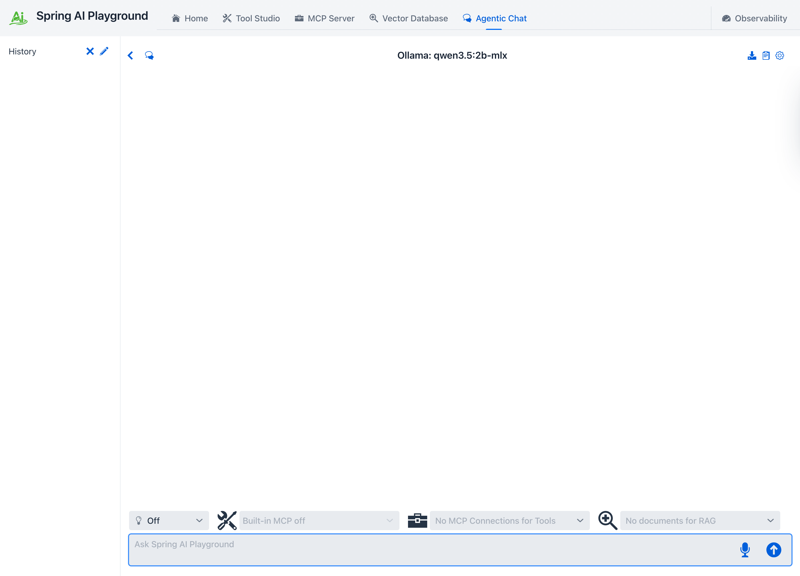{ width="1500" }

This unified interface lets you:

- run RAG workflows grounded in indexed documents
- execute tool-enabled agent flows through MCP
- steer the model with reusable system-prompt **[presets](prompt-presets.md)** and **[templates](prompt-templates.md)** from the Prompt Library
- dial **reasoning effort** up or down per turn
- read responses with syntax-highlighted code, rendered math, and diagrams
- test complete agent strategies by combining documents and tools in a single chat session

## Key Features

- document selection for RAG grounding
- MCP connection selection for tool-enabled execution
- manual tool selection or **dynamic tool discovery** - the model searches a large catalog on demand
- per-turn reasoning effort and provider-aware generation options
- system-prompt presets and variable-driven templates
- real-time visibility into retrieved context, reasoning, and tool usage
- one conversational surface for both chain-style and agentic patterns

This area is closely aligned with Spring AI's workflow and agentic guidance. If you want the conceptual background behind these two modes, see [Building Effective Agents](https://docs.spring.io/spring-ai/reference/api/effective-agents.html). For how the Playground assembles the full model context - system prompt, retrieved documents, tools, memory, and options - see [Context Engineering](../../context-engineering-architecture.md).

## The chat workspace

The screen has three regions:

- **Header actions** (top right): **New Chat**, **Export conversation** (download icon), **Prompt Library** (clipboard icon), and the **Settings** cog - the cog stays the right-most action, an app-wide convention.
- **Conversation area**: the running exchange. User turns render as plain text; assistant turns render as Markdown and carry collapsible process panels (THINK, MCP TOOLS, RAG) when those stages run.
- **Selector row + prompt input** (bottom): the reasoning control and the tool and document selectors sit directly above the text box, so what the model can reach is always one glance from where you type.

## Composing a request

### Reasoning effort

The lightbulb dropdown on the selector row sets how hard the model thinks on the **next** turn - `Off`, `Low`, `Medium`, or `High`. It is dynamic: change it between turns without starting a new chat.

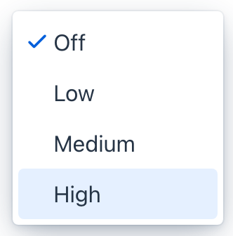{ width="166" }

The control is provider-aware and only appears for models that support it. The level maps to each provider's own knobs - on OpenAI it becomes `reasoning_effort`; on Ollama it toggles thinking and its depth. `Off` sends no reasoning option at all, which is the safe default for non-reasoning models. See [Context Engineering → Reasoning effort](../../context-engineering-architecture.md#reasoning-effort) for the mapping.

### Choosing tools and documents

The **tools** icon on the selector row opens the tool popover. It is the per-chat switch for what the agent may call, and it offers two mutually exclusive ways to decide:

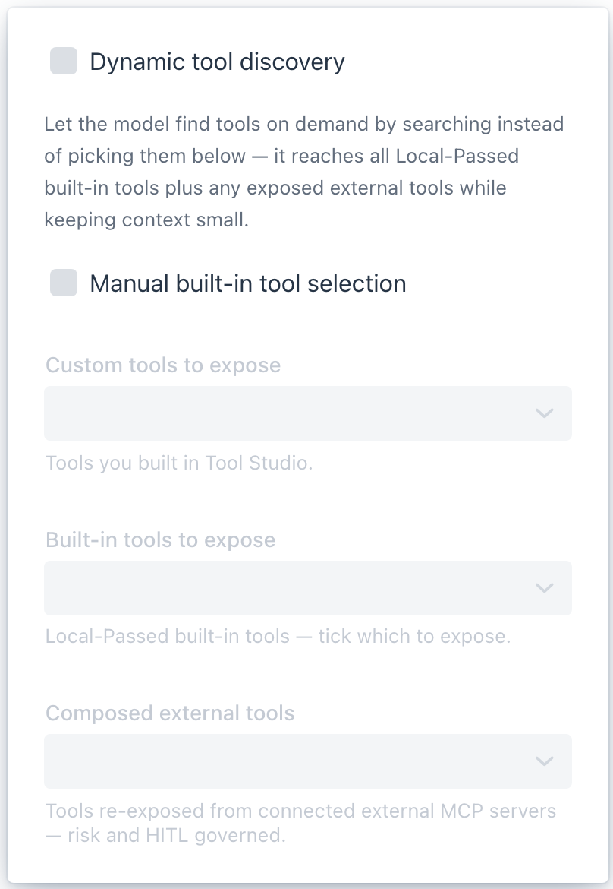{ width="404" }

- **Dynamic tool discovery** - let the model find tools on demand instead of choosing them by hand (see [below](#dynamic-tool-discovery)).
- **Manual built-in tool selection** - the master toggle for picking exactly which in-process tools this chat exposes. When it is on, the three selectors below become active:
    - **Custom tools** - tools you built in [Tool Studio](../tool-studio/index.md).
    - **Built-in tools** - the Local-Passed built-in tools; tick which ones this chat may call.
    - **Composed external tools** - tools re-exposed from connected external MCP servers, each risk-scored and human-in-the-loop governed.

Ticking one mode unticks the other. Beside the popover, the **MCP servers** selector picks which connected external servers feed the chat, and the **document** selector enables [Vector Database](../vector-database.md) collections for RAG grounding. All of these selections are remembered per conversation.

### Dynamic tool discovery { #dynamic-tool-discovery }

By default a chat sends the model the full schema of every tool you expose - fine for a handful, but a broad agent setup can push **tens of thousands of tokens of definitions into every turn**. **Dynamic tool discovery** removes that cost: the chat hands the model a single `toolSearchTool`, and the model searches the catalog on demand instead of receiving every definition up front. Tick it at the top of the tool popover (the exposed-tools box then reads **Dynamic — searching all tools**); it stays disabled until the searchable pool clears the `tool-search.min-tools` floor (default 10), so add more in [Tool Studio](../tool-studio/index.md) if it is greyed out.

It is also how the built-in **[Self-equipping agent](prompt-presets.md)** preset works. For the full picture - why it matters for agents, the 34-64% token-savings experiment behind it, how it lets a small local model drive a large toolbox, and the configuration - see **[Dynamic tool discovery](dynamic-tool-discovery.md)**.

### Voice input

The microphone icon by the prompt box dictates your message - click to start, click again to stop. Transcribed text streams into the input as you speak and keeps anything you already typed. The backend is picked automatically by where the app runs:

- **Desktop app** - on-device **Whisper**: the native desktop app transcribes your voice locally on the machine, with no cloud round-trip. It is opt-in - turn it on and download a model once in the launcher's settings ([Local Speech-to-Text card](../../getting-started/desktop.md#local-speech-to-text-whisper)). Supported on Apple Silicon Macs; Intel Macs show a short notice instead.
- **Chrome browser** - the browser's built-in Web Speech API: nothing to download, but recognition is handled by the browser. Safari and Firefox prompt you to switch to Chrome or the desktop app.

While recording, the mic doubles as a stop button with a countdown wedge that fills as silence builds up - it auto-stops after a few seconds of quiet, or click to stop immediately. It is the input-side complement to [Read aloud](#message-actions).

### System prompts and presets

The system prompt frames every turn. You can type one in the [settings drawer](#the-chat-settings-drawer), or pull a ready-made **[preset](prompt-presets.md)** or a variable-driven **[template](prompt-templates.md)** from the Prompt Library (clipboard icon in the header). The two are related but distinct - a preset is a complete prompt you apply as-is; a template has `{{variables}}` you fill in first - and each has its own page below.

## The chat settings drawer

The **Settings** cog opens the chat model drawer - the static configuration for the conversation. Editing it and pressing **Apply & New Chat** starts a fresh conversation with the new settings.

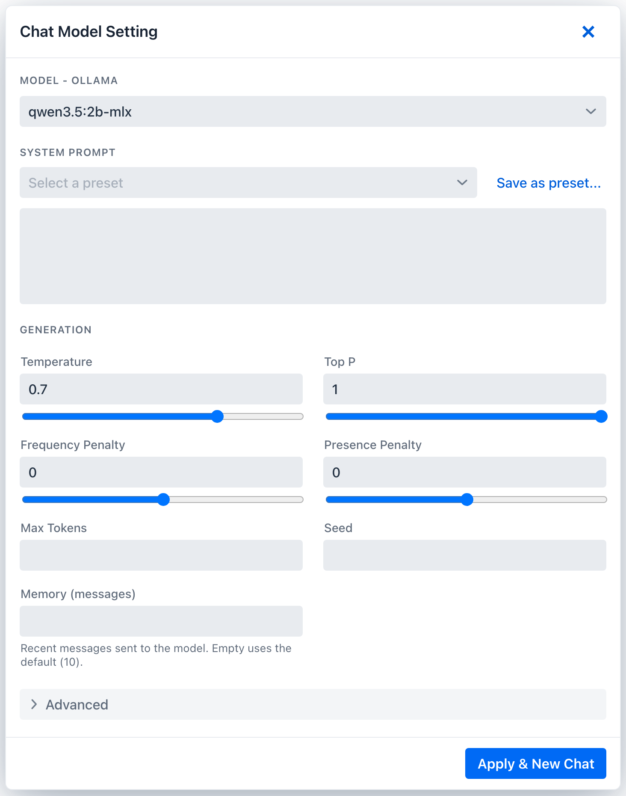{ width="732" }

- **Model** - the section header names the active provider (`Model - Ollama` or `Model - OpenAI`) and lets you switch the chat model.
- **Context** - the per-chat **Recent messages** window (how many recent messages reach the model each turn; older turns stay in saved history - see [Context Engineering → Conversation memory](../../context-engineering-architecture.md#conversation-memory)) and the **system prompt** (free-text, or pre-filled from a Prompt Library preset).
- **Generation** - temperature, top-p, frequency and presence penalty, max tokens, seed, and **stop sequences** (comma-separated; on OpenAI capped at 4).
- **Advanced details** - a raw **provider-options JSON** editor for any option the form does not surface. It opens pre-expanded when it already holds a value.

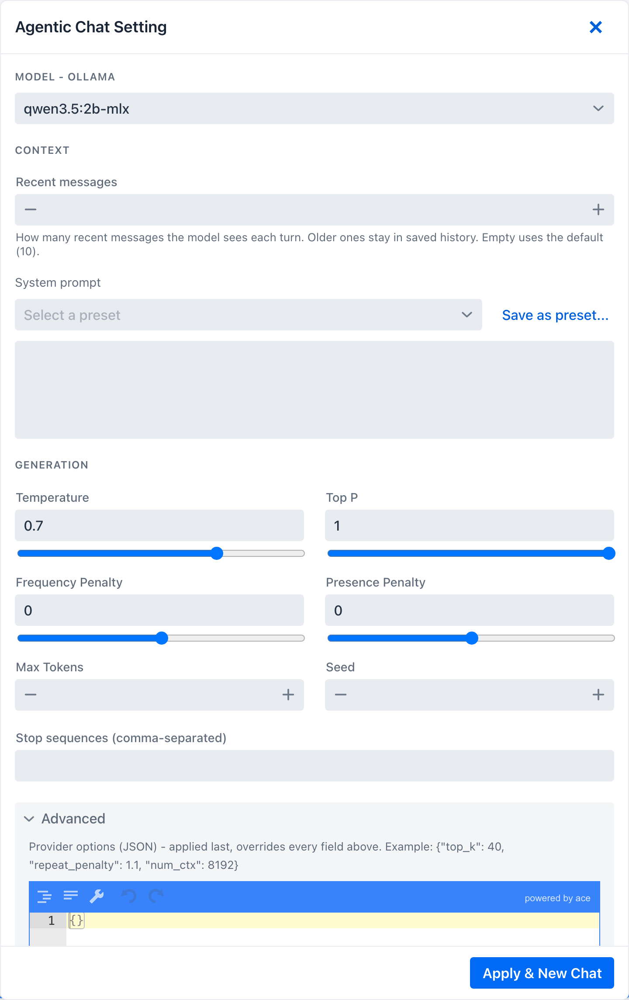{ width="732" }

The drawer is provider-aware: the option labels, the stop-sequence cap, and the JSON placeholder change with the active provider. The full property mapping lives in [Context Engineering → Generation options](../../context-engineering-architecture.md#generation-options). Out-of-range entries (a Recent-messages or Max-Tokens below 1, or more stop sequences than the provider allows) are flagged inline; **Apply & New Chat** is blocked until you fix them, and the drawer stays open with the offending field highlighted.

### Switching models and the download gate

The download gate applies only when the active provider is **Ollama** (local models you pull). With Ollama active, the model dropdown marks any model that is not yet pulled with a **download indicator**.

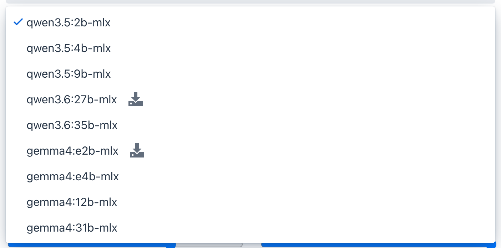{ width="702" }

If you apply an Ollama model that is not installed, the chat does not start on a missing model. A gate dialog appears first; choosing **Download** pulls it with a live progress bar and a cancel option, and when the download finishes the chat starts on the new model.

For a remote provider such as **OpenAI** there is nothing to download, so the download indicator, helper text, and gate dialog do not appear.

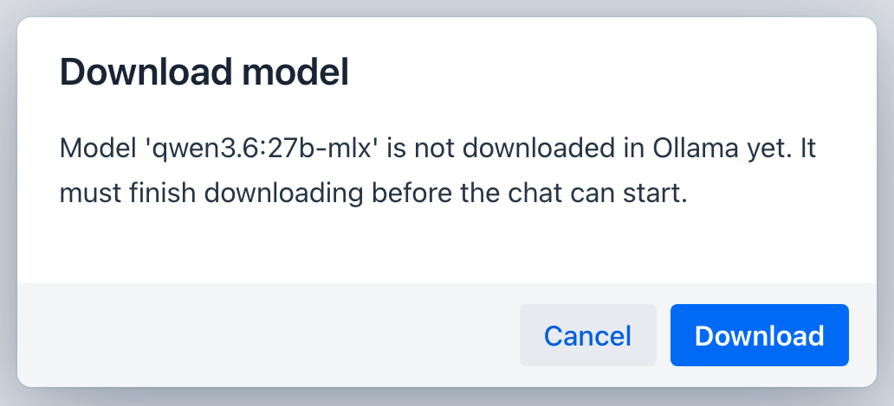{ width="516" }

### Provider lock

Each conversation is stamped with the provider that created it. If you open a saved conversation while the app is running a **different** provider, the conversation is shown read-only with a banner, so its history stays intact but you cannot append turns that the current provider could not have produced.

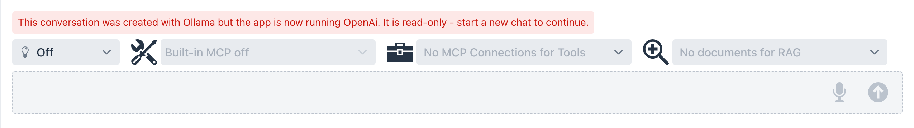{ width="1275" }

## Reading a response

### Markdown, code, math, and diagrams

Assistant turns render as full Markdown. Code blocks are syntax-highlighted (highlight.js) with a language label and a one-click copy button; math renders with KaTeX both inline (`$...$`) and as display blocks (`$$...$$`); and fenced ` ```mermaid ` blocks render as diagrams. Links open in a new tab. Rendering runs once the turn finishes streaming.

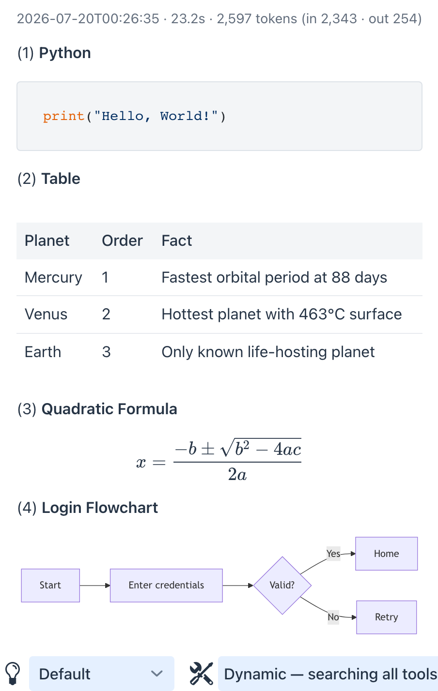{ width="583" }

### Action cards

Some built-in tools render an interactive **action card** instead of plain text. When the model calls `sendEmail` it produces an **Email draft** card; `addToCalendar` produces a **Calendar event** card; and `showLocation` embeds an interactive **Location** map. The first two show the fields the model filled in plus a button to act on the draft - the email card a single **Send email** button, the calendar card an **Add to calendar** dropdown:

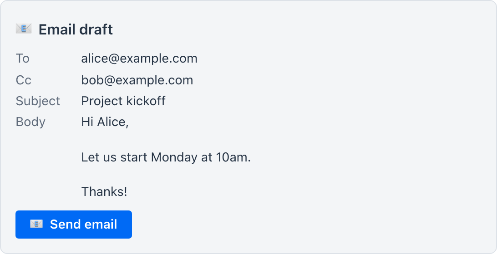{ width="546" }

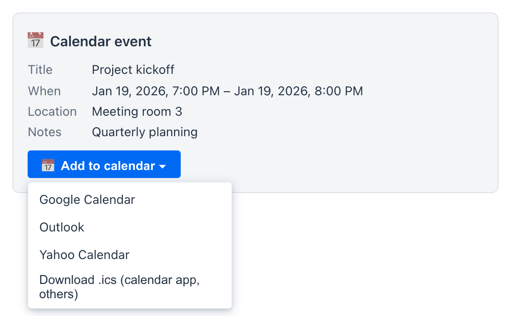{ width="546" }

These follow a **review-then-send** rule: the model only *drafts*, it never sends. **Send email** opens a prefilled `mailto:` link in your own mail app; **Add to calendar** opens a menu to add the event to Google Calendar, Outlook, or Yahoo Calendar, or to get a standard `.ics` file - in the desktop app the `.ics` opens directly in your OS calendar app, in a browser it downloads for you to import. You stay in the loop for the outward action - a sibling of the [human-in-the-loop approval](../human-in-the-loop.md) gate. (Mechanically, any tool - including one you author in [Tool Studio](../tool-studio/index.md) - whose output carries a fenced `saip-action` block is rendered as a card; if it emits the `saip-action-return-direct` variant it is also treated as the final step of the request, so the turn ends without a follow-up model reply.) The `showLocation` card is display-only - it embeds a keyless map plus an **Open in Google Maps** link and sends nothing:

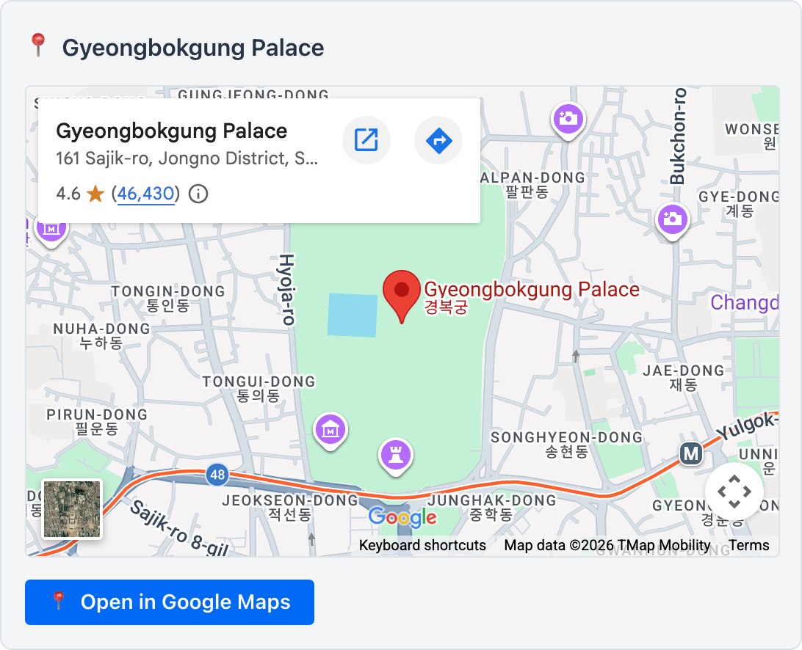{ width="546" }

### Clickable file paths

On the **desktop app**, a backtick-wrapped absolute path in a reply becomes clickable - click it to reveal that file or folder in your OS file browser:

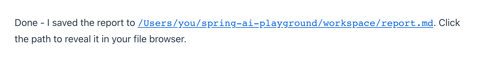{ width="808" }

It is a convenience for the [filesystem tools](../default-tools/filesystem.md), not a capability the model can trigger - only your click does anything. It is scoped server-side to the same **readable roots** (your home directory by default), and it only ever *reveals* a path, never opens or runs a file. In a plain browser, headless, or Docker run the path is just text.

### Message actions

Hovering a turn reveals its action bar - six controls left to right:

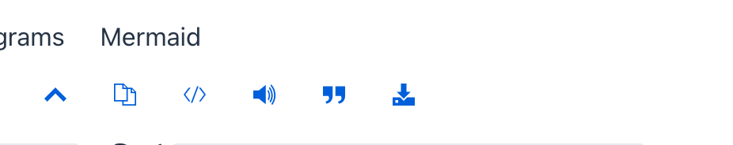{ width="463" }

- **Collapse** - fold a long turn (toggles to **Expand**).
- **Copy** - copy the raw Markdown.
- **Show raw** - toggle the assistant turn between rendered Markdown and its raw source (flips to **Show rendered**).
- **Read aloud** - text-to-speech via the OS voices (where available).
- **Quote in prompt** - drop the turn into the input as a `>` quote for a follow-up.
- **Export** - save just this message (see below).

### Timing and token metrics

Every assistant turn carries its own metrics in the header line - the time, how long the turn took, and the token counts, for example `4.2s · 331 tokens (in 90 · out 241)`. When a turn reasons or calls tools, the tokens spent in those stages are attributed to their respective panels.

### Reasoning and tool panels

When a turn thinks, calls tools, or retrieves documents, those stages appear as collapsible panels above the answer, each summarizing its duration and token cost:

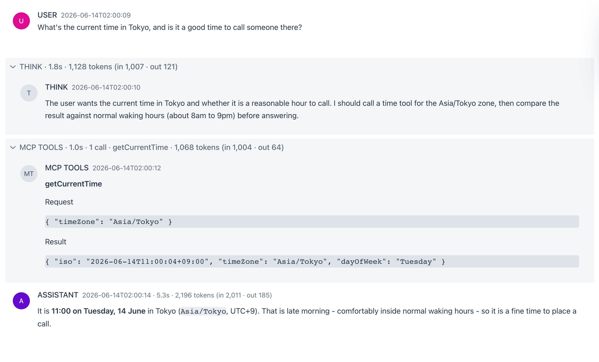{ width="1263" }

- **THINK** - the model's reasoning trace (when reasoning effort is on).
- **MCP TOOLS** - each tool call with its arguments and result, the call count, and the tool names.
- **RAG** - the retrieval step, with the document count and titles.

The panels collapse once a stage completes so the answer stays front and center; click any panel to reopen it. This is the same visibility the [Observability](../observability/index.md) dashboards capture after the fact.

## Exporting a conversation

The **Export conversation** action in the header (and the per-message **Export**) writes the chat out as **Markdown (.md)**, **Plain text (.txt)**, **JSON (.json)**, or a **PDF** (print).

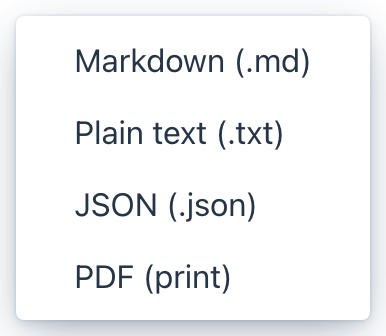{ width="193" }

## Two Integrated Paradigms

### 1. RAG: Knowledge via Chain Workflow

When documents are selected, Agentic Chat follows a deterministic retrieval pattern:

- retrieval from the vector store
- prompt augmentation with grounded context
- response generation based on that context

### 2. MCP: Actions via Agentic Reasoning

When MCP connections are enabled, Agentic Chat can behave like an agent:

- reasoning about which tools are needed
- invoking tools through MCP
- observing the result
- continuing or answering directly

When a tool requires approval, Agentic Chat **pauses and asks you to approve or decline** the call before it runs - the on-device half of [Human-in-the-Loop Approval](../human-in-the-loop.md). Declining tells the model the call was not run, so it won't silently retry.

## Workflow Integration

The intended end-to-end flow is:

1. prepare tools in Tool Studio or connect them in MCP Server
2. prepare knowledge in Vector Database
3. enable the relevant documents and MCP connections in Agentic Chat
4. send a request and observe how retrieval and tool use combine

This is the place where the rest of the product becomes visible as one coherent system rather than separate screens. The outputs of Tool Studio, MCP Server, and Vector Database all converge here.

## Requirements for Agentic Reasoning

Basic chat can work with any supported provider. Tool-enabled agentic behavior works best with models that support function calling and stronger reasoning.

For Ollama-based flows:

- use tool-capable models from [Ollama's Tool Category](https://ollama.com/search?c=tools)
- use reasoning-capable models from [Ollama's Thinking Category](https://ollama.com/search?c=thinking)
- validate tools in MCP Inspector before relying on them in Agentic Chat

The default `playground.chat.models` list features `qwen3.5:2b` (default) plus `qwen3.5:9b` / `qwen3.6:35b` for stronger tool-oriented reasoning, with `gemma4:e4b`, `gpt-oss:20b`, and `deepseek-r1:8b` as alternatives. See [Picking a Model](../../tutorials/index.md#picking-a-model) in the Tutorials for the tradeoffs.

## Agentic Chat Architecture Overview

The diagram below is included as a conceptual reference to the related agentic systems material in the Spring AI docs.

It is included here to explain how the Playground's Agentic Chat maps onto the broader Spring AI mental model. In this project, the diagram is not describing a separate product feature hidden behind the UI. It is a conceptual reference for understanding how the Playground combines model reasoning, retrieval, tool execution, and memory in one chat runtime. For the concrete build-up of that context in this project - system prompt, presets and templates, RAG, tools, memory, and per-request options - see [Context Engineering](../../context-engineering-architecture.md).


If you want the fuller conceptual background, start with [Building Effective Agents](https://docs.spring.io/spring-ai/reference/api/effective-agents.html). That reference explains the workflow-versus-agent distinction that this Playground makes concrete through Tool Studio, MCP Server, Vector Database, and Agentic Chat.

This Chat experience facilitates exploration of Spring AI's workflow and agentic paradigms, empowering developers to build AI systems that combine chain-based RAG workflows with agentic, tool-augmented reasoning. In practice, it follows Spring AI's Agentic Systems architecture, where grounded retrieval and dynamic tool execution coexist in one context-aware chat runtime.

| Component | Type | Description | Configuration Location | Key Benefits | Model Requirements |
| --- | --- | --- | --- | --- | --- |
| **LLM** | Core Model | Executes chain-based workflows and performs agentic reasoning for tool usage within a unified chat runtime. | Agentic Chat | Central reasoning and response generation; supports both deterministic workflows and agentic patterns. | Chat models; tool-aware and reasoning-capable models recommended. |
| **Retrieval (RAG)** | Chain Workflow | Deterministic retrieval and prompt augmentation using vector search over selected documents. | Vector Database | Predictable, controllable knowledge grounding; tunable retrieval parameters such as Top-K and thresholds. | Standard chat plus embedding models. |
| **Tools (MCP)** | Agentic Execution | Dynamic tool selection and invocation via MCP, driven by LLM reasoning and tool schemas. | Tool Studio, MCP Server | Enables external actions, multi-step reasoning, and adaptive behavior. | Tool-enabled models with function calling and reasoning support. |
| **Memory** | Shared Agentic State | The full conversation is kept locally; each turn the model sees a configurable trailing window, supplied through `MessageChatMemoryAdvisor` over an [`LlmWindowChatMemory`](../../context-engineering-architecture.md#conversation-memory) decorator. | Agentic Chat drawer (per-chat **Recent messages**) + `spring.ai.playground.chat.memory-max-messages` (default 10); `history-max-messages` (2000) caps the local store | Coherent multi-turn dialogue without inflating every request; the recent-context window is tunable per conversation. | Models benefit from a longer window when the task needs more history. |

By leveraging these elements, Agentic Chat goes beyond basic Q&A and becomes a practical environment for building effective, modular AI applications that combine workflow predictability with agentic autonomy.

## What the Chat can reach

Agentic Chat is a **consumer** of three inventories curated elsewhere in the Playground. Use these references to know what's available before composing a chat session:

- **[Default Tools](../default-tools/index.md)** - 88 pre-loaded built-in tools (Examples · Utilities · Filesystem · Global · Korea) callable directly from chat without any external setup. Each carries a Risk Level (L0-L5) and `${ENV_VAR}` requirements per page.
- **[Default MCP Servers](../default-mcp-catalog/index.md)** - 57 preset external MCP server connections (Gmail, Notion, GitHub, Linear, BigQuery, Stripe, ...). One-click activation from the MCP Server sidebar adds them as tool sources for chat.
- **[Vector Database](../vector-database.md)** - indexed document collections that the **RAG advisor chain** retrieves from at chat time (`SpringAiPlaygroundRagAdvisor` short-circuits when no documents are selected, so retrieval is opt-in per conversation).

→ Try it: [Tutorials](../../tutorials/index.md) - end-to-end flows that combine Tool Studio, MCP Inspector, Vector Database, and Agentic Chat.
