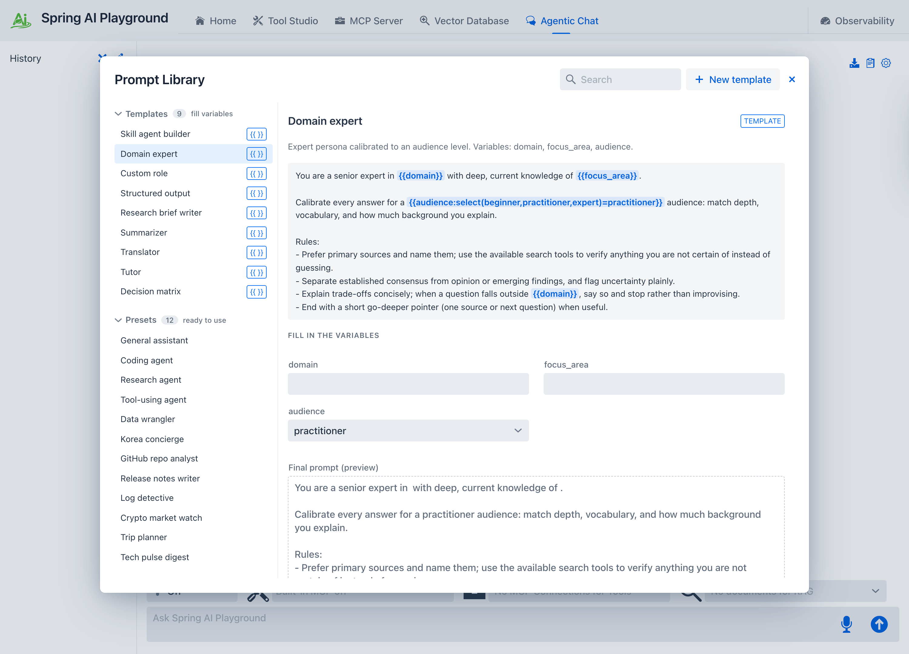
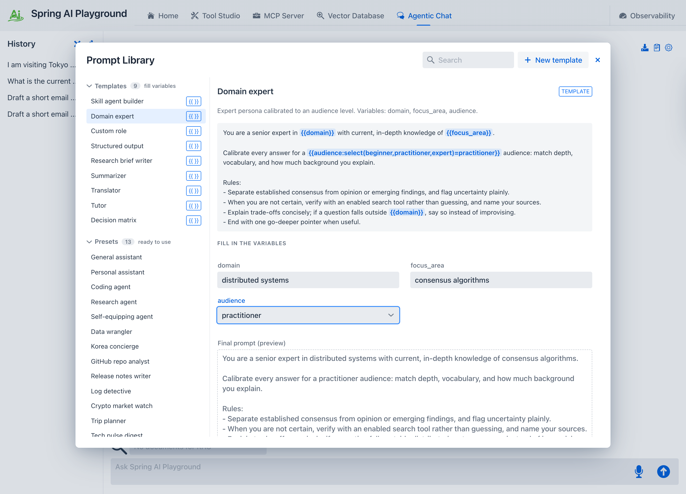
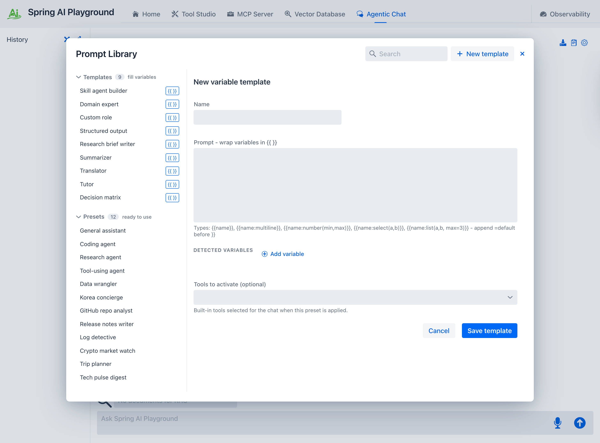
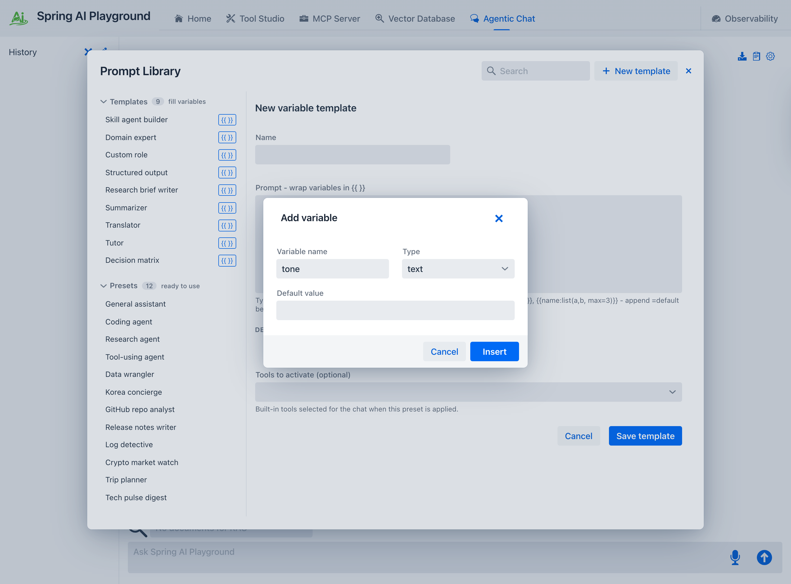
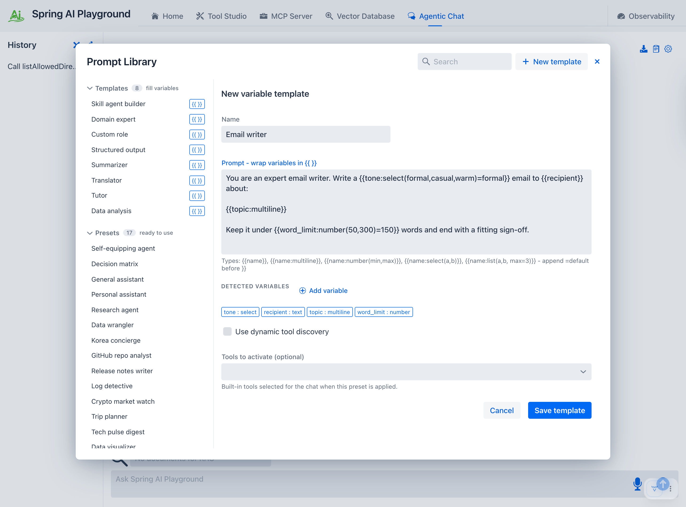
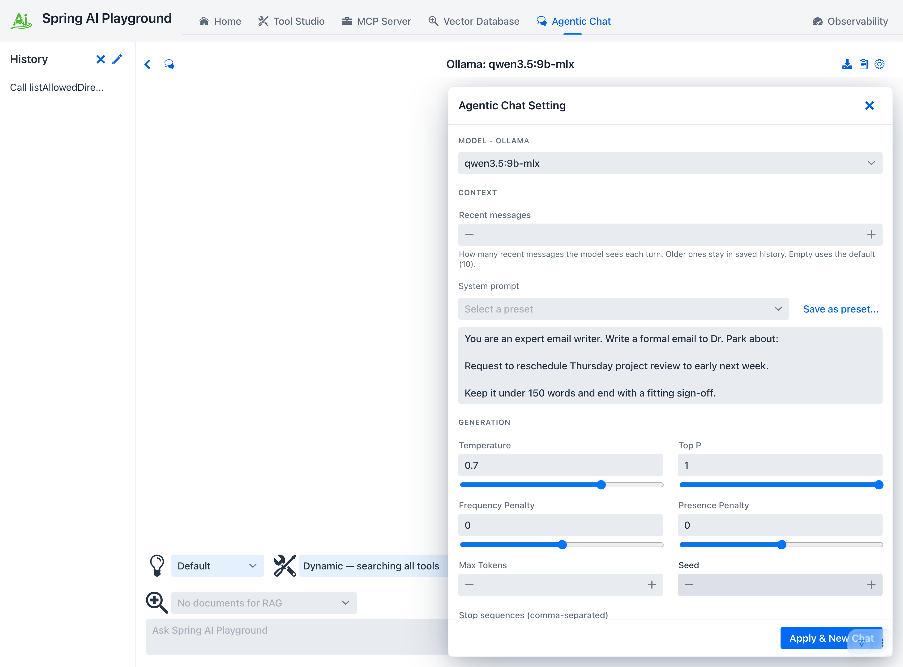
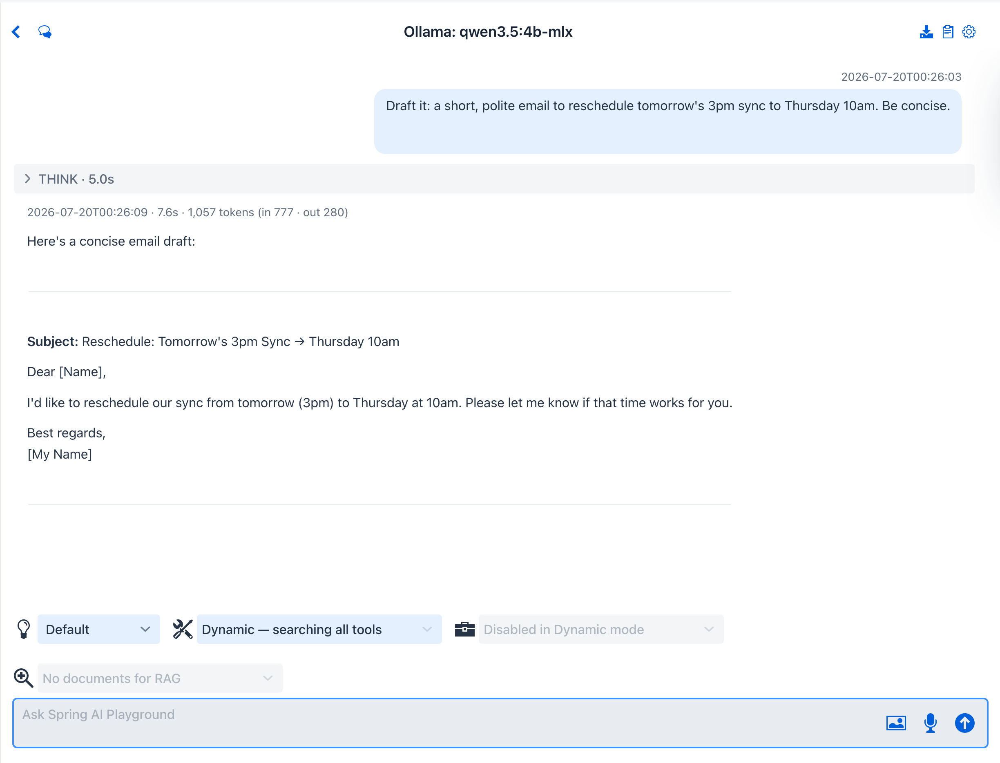

description: Prompt Templates - variable-driven system prompts for Agentic Chat. Fill double-brace variables and a renderer builds the final prompt. 9 built-in templates.

# Prompt Templates

**Where:** Agentic Chat header → **Prompt Library** (clipboard icon) → the **Templates** group.

A **template** is a reusable system prompt with `{{variable}}` placeholders. Instead of writing the same instructions with different specifics every time, you pick a template, fill a small form, and a custom renderer assembles the final system prompt from your answers.

> **Templates vs Presets.** Both live in the Prompt Library and both end up as a conversation's system prompt - but they are reached differently. A **[preset](prompt-presets.md)** is a *complete* prompt you apply as-is. A **template** (this page) is *parameterized*: it has `{{variables}}` you fill in first, and the renderer produces the finished prompt from your input. Reach for a preset to start fast; reach for a template when you want the same structure with different specifics each time.

{ width="1500" }

## Filling the variables

Selecting a template shows a form on the right, one field per `{{variable}}`. As you type, the **Final prompt (preview)** updates live, so you always see exactly what the model will receive. Any field you leave blank falls back to that variable's default, so a template is runnable even before you touch the form.

{ width="1500" }

When the form is ready:

- **Save as preset & apply** assembles the prompt, stores it under *My presets*, and applies it to the chat in one step.
- **Save as preset** keeps the assembled prompt under *My presets* without applying it.

The assembled prompt becomes a [preset](prompt-presets.md) - this is the bridge between the two: a template is how you *generate* a preset.

## Variable syntax

Templates use a compact **double-brace** syntax. A custom Spring AI `TemplateRenderer` handles it, and single-brace `{var}` is left untouched on purpose, so a prompt can show JSON or code examples without escaping.

```
{{name}}                                  text input
{{name:multiline}}                        multi-line text area
{{name:select(a,b,c)=a}}                  dropdown with options and a default
{{name:number(min,max)=value}}            bounded number
{{name:list(a,b,c,max=N)}}                multi-pick, up to N
{{name=default}}                          text input with a default
```

| Type | Renders as | Example from the built-ins |
| --- | --- | --- |
| *(none)* | single-line text field | `{{topic}}`, `{{role}}` |
| `multiline` | text area | `{{task:multiline}}`, `{{criteria:multiline}}` |
| `select(...)` | dropdown | `{{audience:select(beginner,practitioner,expert)=practitioner}}` |
| `number(min,max)` | bounded number field | `{{word_limit:number(100,2000)=600}}` |
| `list(...,max=N)` | capped multi-pick | *(available for your own templates)* |

A `=value` suffix on any type sets the default. The rendering rules, and why the double-brace convention is used, are detailed in [Context Engineering → System prompts, presets, and templates](../../context-engineering-architecture.md#system-prompts-presets-and-templates).

## Required tools

A template can declare the built-in tools it uses - for example **Research brief writer** names four search tools. The detail pane lists them under **Required tools**, and they reference only key-less (**Local Pass**) tools. Filling a template produces a preset, so applying it behaves like any [preset](prompt-presets.md#required-tools): it **resets the built-in MCP server to expose exactly those tools**, turns built-in MCP on for the new chat, and selects them - with a confirmation dialog first. Tools are never enabled silently; you stay in control of what the agent can call.

## Create your own template

You are not limited to the built-ins. The **New template** button in the Prompt Library header opens a blank editor where you build one from scratch.

**1. Open the editor.** Click **New template**. You get a **Name** field, a **Prompt** area (wrap variables in `{{ }}`), a live list of detected variables, and a tools picker.

{ width="1460" }

**2. Add variables.** Type `{{name:type=default}}` tokens directly, or click **Add variable** to build one from a small form - pick a type (text, multiline, number, select, list), set its options or a default, and **Insert** drops the finished token into the prompt. You never have to memorize the syntax.

{ width="1460" }

**3. Watch the variables register.** As you type, the **Detected variables** row shows each `{{variable}}` with its parsed type, so you can confirm the template is well-formed before saving.

{ width="1460" }

**4. Save it.** Name the template and click **Save template**. It joins the **Templates** group in the left rail - persisted under `<home>/spring-ai-playground/chat/save/`, so it survives restarts - and immediately shows its fill-in form, ready to use exactly like a built-in.

The storage layout and load order are covered in [Context Engineering → System prompts, presets, and templates](../../context-engineering-architecture.md#system-prompts-presets-and-templates).

## Worked example: a template, filled and run

Take the email-writer template built above. Filling its form - tone `formal`, recipient `Dr. Park`, a one-line topic - and clicking **Save as preset & apply** opens the settings drawer with the **assembled** system prompt already in place. This rendered text is the template's output, now a reusable [preset](prompt-presets.md):

{ width="1460" }

Press **Apply & New Chat**, send a short instruction, and the model answers in the role the template defined - here a complete formal email, generated locally on `qwen3.5:2b-mlx`:

{ width="1460" }

That is the point of a template: author the structure once, then produce a tailored preset - and a tailored result - from it whenever you need one.

## Built-in templates

Spring AI Playground ships **9 templates**. Each assembles into a ready-to-use [preset](prompt-presets.md) once you fill its variables.

| Template | Variables | What it produces |
| --- | --- | --- |
| **Skill agent builder** | skill_name, goal, tools, procedure, output_format | Defines a single-purpose agent and saves the filled result as a reusable preset. |
| **Domain expert** | domain, focus_area, audience | An expert persona calibrated to an audience level. |
| **Custom role** | role, task, tone | Any role, task, and tone. |
| **Structured output** | format, fields, strictness | Locks every reply into one format (table / JSON / bullets / steps). |
| **Research brief writer** | topic, angle, word_limit, source_mix | A bounded research brief with a word limit and source mix. Activates 6 search tools. |
| **Summarizer** | content_type, output_length, focus | Faithful summaries by content type and length. Activates `extractPageContent`. |
| **Translator** | source_language, target_language, register | Format-preserving translation. |
| **Tutor** | subject, learner_level, teaching_style | A personal tutor by subject, level, and teaching style. |
| **Decision matrix** | decision, options, criteria | Weighted option-vs-criteria scoring with the arithmetic shown. Activates `evalExpression`, `stats`. |

The tools a template names are built-in [Default Tools](../default-tools/index.md); enable them from the chat tool selector (or let the template select them on apply). Tools that need a key stay dormant until you supply the matching environment variable.

---

→ Back to [Agentic Chat](index.md) · the other half: [Prompt Presets](prompt-presets.md) · how it all fits together: [Context Engineering](../../context-engineering-architecture.md)
