title: Visualization & cards
description: Default Tools - Visualization reference. 18 free L0 tools that return a saip-action block the chat renders as a rich interactive card - charts, maps, diagrams, tables, diffs, and more.

# Default Tools - Visualization & cards

The eighteen tools on this page are **productivity / visualization** tools that turn data into a **rich interactive card** in the chat instead of plain text. Each one returns a fenced ` ```saip-action ` block; the chat front end detects it and renders a real chart, map, diagram, table, diff, or stat row inline in the assistant's message.

They are all **free** and run at the sandbox **L0** baseline (Safest) - pure compute, no network and no filesystem widening. The model only produces a description of *what to draw*; the rendering happens client-side. They ship in the **everything** preset.

Chart and map cards (the ECharts- and Leaflet-backed ones) carry **PNG export** and **Copy** buttons so a rendered card can be saved as an image or copied straight into another document or message.

!!! tip "How the model uses these"
    The model calls one of these tools with already-gathered data - e.g. it fetches crypto candles with a Korea/global tool, then calls `renderCandlestick` to draw them. The pattern is **gather with a data tool → render it with a visualization tool**. After calling, the model tells you the card is shown below; it must not paste a code block itself - the card appears automatically.

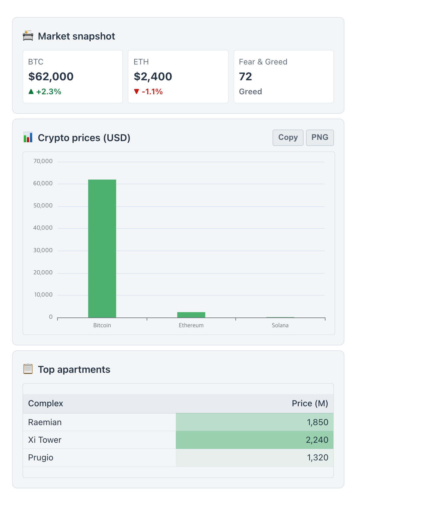{ width="680" }

## Charts { #charts }

ECharts-backed cards. All eight render from JSON data you provide and expose **PNG** + **Copy** export buttons.

<div class="tcg-grid" markdown>

<div class="tcg-card tcg-card--clickable" id="renderChart" data-tool-id="renderChart" data-tool-title="renderChart" markdown>
<div class="tcg-name"><span class="tcg-name__text">renderChart</span> <span class="cost">🆓</span></div>
<div class="tcg-art" markdown>:material-chart-bar:</div>
<div class="tcg-type">productivity · visualization <span class="risk risk-l0">L0</span></div>
<div class="tcg-body" markdown>
Renders a chart directly in the chat from data you provide: bar, line, area, pie, radar, scatter, or gauge. Use this to visualize numbers you have gathered.
</div>
<div class="tcg-stats" markdown>
<div class="tcg-stats__line" markdown>**Params** &nbsp; `chartType` · `labels` · `series` · `title` · `max` · `seriesName` · `sort`</div>
<div class="tcg-stats__line" markdown>**Env** &nbsp; &nbsp; &nbsp; -</div>
</div>
<div class="tcg-cta">Click for full reference · params · card behavior</div>
<div class="tcg-detail-template" hidden markdown>

**More detail**

Renders a chart directly in the chat from data you provide: bar, line, area, pie, radar, scatter, or gauge. `labels` is a JSON array of category names (x-axis categories, pie slice names, or radar axes). `series` is EITHER a JSON array of numbers (single series) OR a JSON array of `{"name":..., "data":[...]}` objects (multiple series). Per type: bar/line/area use labels + numeric series; pie uses labels + one numeric series; radar uses labels as axes + one or more `{name,data}` series; scatter uses series of `[x,y]` number pairs (labels optional); gauge shows ONE number (pass series as `[value]`, optional `max`). `sort` reorders a single-series bar or pie chart by value - use `asc` for categories with no inherent order (countries, products) and omit it for time or ordinal categories (years, months, stages). The card has PNG + Copy export buttons.

**Parameters**

| Param | Type | Req | Description |
|---|---|---|---|
| `chartType` | `STRING` | ✓ | One of bar, line, area, pie, radar, scatter, gauge. |
| `labels` | `STRING` |  | JSON array of category names (x-axis, pie slices, or radar axes). |
| `series` | `STRING` | ✓ | JSON array of numbers, or of `{name, data}` objects. |
| `title` | `STRING` |  | Optional chart title. |
| `max` | `STRING` |  | Gauge maximum (gauge type only). |
| `seriesName` | `STRING` |  | Optional name for a single series (legend/tooltip label). |
| `sort` | `STRING` |  | Category order for a single-series bar or pie chart: `asc` or `desc`. Omit for time or ordinal categories. |

**Sandbox** - Runs at the sandbox **L0** baseline (Safest) - pure compute: no network, no filesystem.

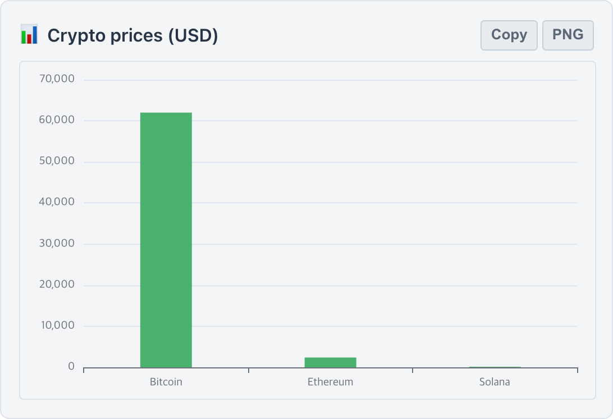{ width="620" }

</div>
</div>

<div class="tcg-card tcg-card--clickable" id="renderCandlestick" data-tool-id="renderCandlestick" data-tool-title="renderCandlestick" markdown>
<div class="tcg-name"><span class="tcg-name__text">renderCandlestick</span> <span class="cost">🆓</span></div>
<div class="tcg-art" markdown>:material-finance:</div>
<div class="tcg-type">productivity · visualization <span class="risk risk-l0">L0</span></div>
<div class="tcg-body" markdown>
Renders an OHLC candlestick chart in the chat from open/high/low/close data, optionally overlaying trading volume. Pairs with crypto or stock candle tools.
</div>
<div class="tcg-stats" markdown>
<div class="tcg-stats__line" markdown>**Params** &nbsp; `data` · `title` · `volume`</div>
<div class="tcg-stats__line" markdown>**Env** &nbsp; &nbsp; &nbsp; -</div>
</div>
<div class="tcg-cta">Click for full reference · params · card behavior</div>
<div class="tcg-detail-template" hidden markdown>

**More detail**

Renders an OHLC candlestick chart in the chat. `data` is a JSON array of `{t (label or date), o, h, l, c, v?}` objects (open/high/low/close, optional volume). Set `volume` to `true` to overlay trading volume. Pairs with crypto or stock candle tools. The card has PNG + Copy export buttons.

**Parameters**

| Param | Type | Req | Description |
|---|---|---|---|
| `data` | `STRING` | ✓ | JSON array of `{t, o, h, l, c, v?}` candles (`t` may also be `date` or `time`). |
| `title` | `STRING` |  | Optional chart title. |
| `volume` | `STRING` |  | `'true'` to overlay trading volume. |

**Sandbox** - Runs at the sandbox **L0** baseline (Safest) - pure compute: no network, no filesystem.

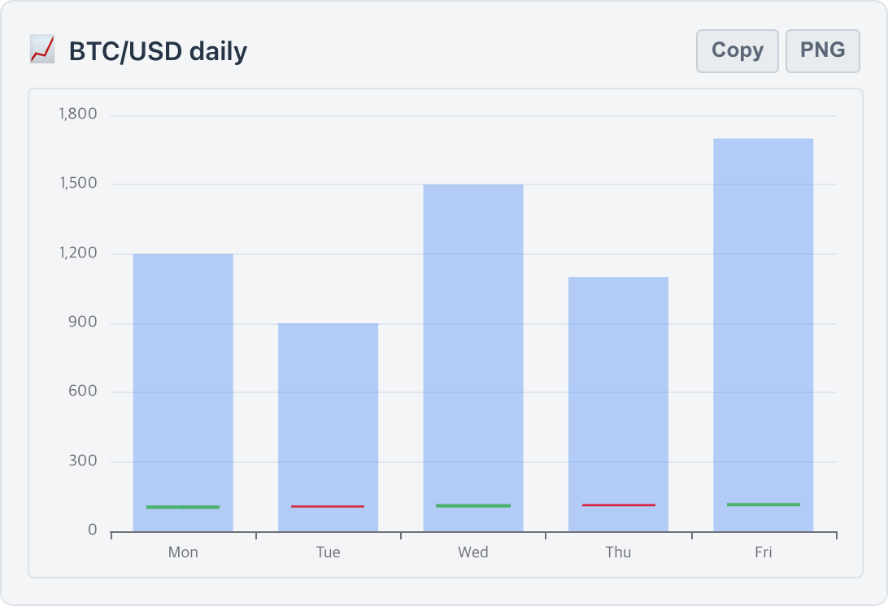{ width="620" }

</div>
</div>

<div class="tcg-card tcg-card--clickable" id="renderHeatmap" data-tool-id="renderHeatmap" data-tool-title="renderHeatmap" markdown>
<div class="tcg-name"><span class="tcg-name__text">renderHeatmap</span> <span class="cost">🆓</span></div>
<div class="tcg-art" markdown>:material-grid:</div>
<div class="tcg-type">productivity · visualization <span class="risk risk-l0">L0</span></div>
<div class="tcg-body" markdown>
Renders a 2D heatmap in the chat from x/y category labels and `[xIndex, yIndex, value]` triples. Good for activity-by-day-and-hour, correlation, or any matrix of numbers.
</div>
<div class="tcg-stats" markdown>
<div class="tcg-stats__line" markdown>**Params** &nbsp; `xLabels` · `yLabels` · `data` · `title`</div>
<div class="tcg-stats__line" markdown>**Env** &nbsp; &nbsp; &nbsp; -</div>
</div>
<div class="tcg-cta">Click for full reference · params · card behavior</div>
<div class="tcg-detail-template" hidden markdown>

**More detail**

Renders a 2D heatmap in the chat. `xLabels` and `yLabels` are JSON arrays of category names. `data` is a JSON array of `[xIndex, yIndex, value]` triples. Good for activity-by-day-and-hour, correlation, or any matrix of numbers. The card has PNG + Copy export buttons.

**Parameters**

| Param | Type | Req | Description |
|---|---|---|---|
| `xLabels` | `STRING` | ✓ | JSON array of x-axis category names. |
| `yLabels` | `STRING` | ✓ | JSON array of y-axis category names. |
| `data` | `STRING` | ✓ | JSON array of `[xIndex, yIndex, value]` triples (objects `{x, y, value}` also accepted). |
| `title` | `STRING` |  | Optional chart title. |

**Sandbox** - Runs at the sandbox **L0** baseline (Safest) - pure compute: no network, no filesystem.

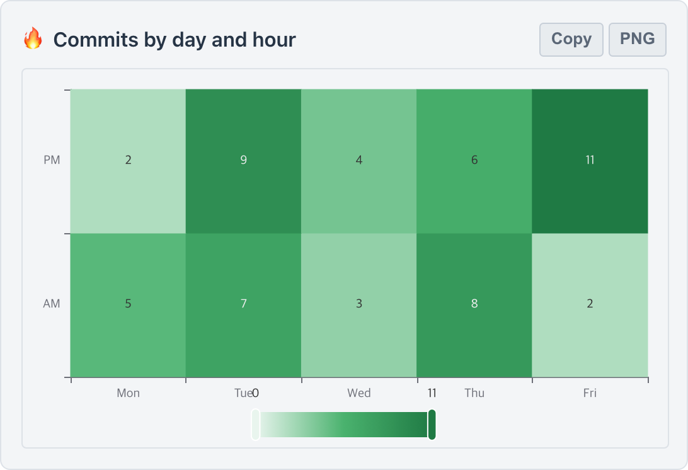{ width="620" }

</div>
</div>

<div class="tcg-card tcg-card--clickable" id="renderSankey" data-tool-id="renderSankey" data-tool-title="renderSankey" markdown>
<div class="tcg-name"><span class="tcg-name__text">renderSankey</span> <span class="cost">🆓</span></div>
<div class="tcg-art" markdown>:material-transit-connection-variant:</div>
<div class="tcg-type">productivity · visualization <span class="risk risk-l0">L0</span></div>
<div class="tcg-body" markdown>
Renders a Sankey flow diagram in the chat from a list of nodes and weighted `{source, target, value}` links between them.
</div>
<div class="tcg-stats" markdown>
<div class="tcg-stats__line" markdown>**Params** &nbsp; `nodes` · `links` · `title`</div>
<div class="tcg-stats__line" markdown>**Env** &nbsp; &nbsp; &nbsp; -</div>
</div>
<div class="tcg-cta">Click for full reference · params · card behavior</div>
<div class="tcg-detail-template" hidden markdown>

**More detail**

Renders a Sankey flow diagram in the chat. `nodes` is a JSON array of node names (or `{name}` objects). `links` is a JSON array of `{source, target, value}` where source/target are node names. The card has PNG + Copy export buttons.

**Parameters**

| Param | Type | Req | Description |
|---|---|---|---|
| `nodes` | `STRING` | ✓ | JSON array of node names or `{name}` objects. |
| `links` | `STRING` | ✓ | JSON array of `{source, target, value}`. |
| `title` | `STRING` |  | Optional chart title. |

**Sandbox** - Runs at the sandbox **L0** baseline (Safest) - pure compute: no network, no filesystem.

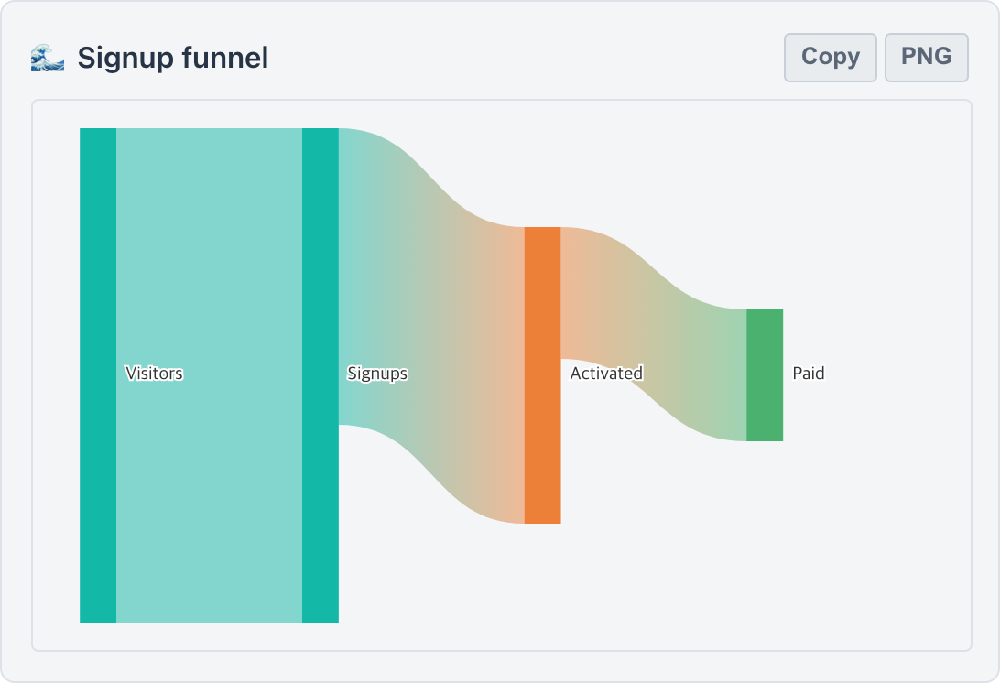{ width="620" }

</div>
</div>

<div class="tcg-card tcg-card--clickable" id="renderFunnel" data-tool-id="renderFunnel" data-tool-title="renderFunnel" markdown>
<div class="tcg-name"><span class="tcg-name__text">renderFunnel</span> <span class="cost">🆓</span></div>
<div class="tcg-art" markdown>:material-filter:</div>
<div class="tcg-type">productivity · visualization <span class="risk risk-l0">L0</span></div>
<div class="tcg-body" markdown>
Renders a funnel chart for staged, descending values in the chat from a list of `{name, value}` stages, usually ordered largest to smallest.
</div>
<div class="tcg-stats" markdown>
<div class="tcg-stats__line" markdown>**Params** &nbsp; `data` · `title`</div>
<div class="tcg-stats__line" markdown>**Env** &nbsp; &nbsp; &nbsp; -</div>
</div>
<div class="tcg-cta">Click for full reference · params · card behavior</div>
<div class="tcg-detail-template" hidden markdown>

**More detail**

Renders a funnel chart for staged, descending values in the chat. `data` is a JSON array of `{name, value}` objects, usually ordered from largest to smallest stage. The card has PNG + Copy export buttons.

**Parameters**

| Param | Type | Req | Description |
|---|---|---|---|
| `data` | `STRING` | ✓ | JSON array of `{name, value}` stages. |
| `title` | `STRING` |  | Optional chart title. |

**Sandbox** - Runs at the sandbox **L0** baseline (Safest) - pure compute: no network, no filesystem.

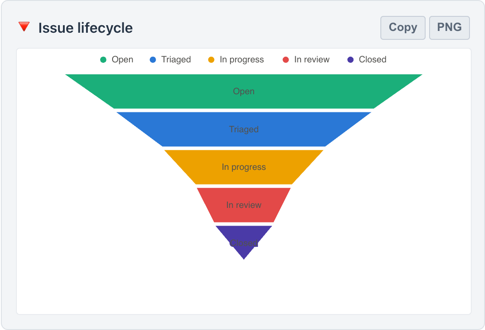{ width="620" }

</div>
</div>

<div class="tcg-card tcg-card--clickable" id="renderTreemap" data-tool-id="renderTreemap" data-tool-title="renderTreemap" markdown>
<div class="tcg-name"><span class="tcg-name__text">renderTreemap</span> <span class="cost">🆓</span></div>
<div class="tcg-art" markdown>:material-view-grid:</div>
<div class="tcg-type">productivity · visualization <span class="risk risk-l0">L0</span></div>
<div class="tcg-body" markdown>
Renders a treemap of hierarchical part-of-whole data in the chat from `{name, value, children?}` nodes; nested children are allowed for hierarchy.
</div>
<div class="tcg-stats" markdown>
<div class="tcg-stats__line" markdown>**Params** &nbsp; `data` · `title`</div>
<div class="tcg-stats__line" markdown>**Env** &nbsp; &nbsp; &nbsp; -</div>
</div>
<div class="tcg-cta">Click for full reference · params · card behavior</div>
<div class="tcg-detail-template" hidden markdown>

**More detail**

Renders a treemap of hierarchical part-of-whole data in the chat. `data` is a JSON array of `{name, value, children?:[...]}` nodes; nested children are allowed for hierarchy. The card has PNG + Copy export buttons.

**Parameters**

| Param | Type | Req | Description |
|---|---|---|---|
| `data` | `STRING` | ✓ | JSON array of `{name, value, children?}` nodes. |
| `title` | `STRING` |  | Optional chart title. |

**Sandbox** - Runs at the sandbox **L0** baseline (Safest) - pure compute: no network, no filesystem.

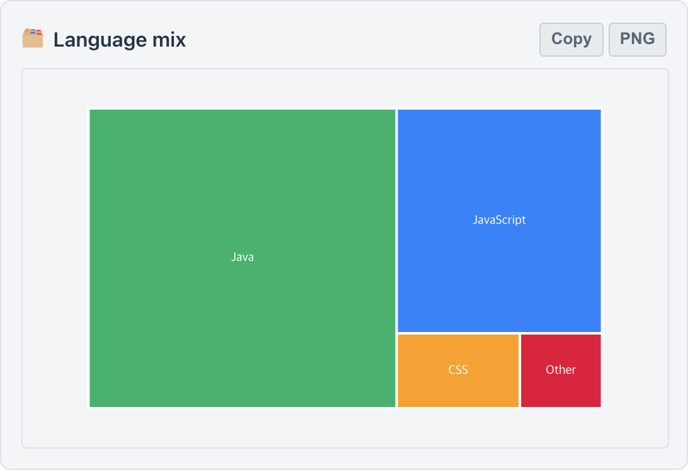{ width="620" }

</div>
</div>

<div class="tcg-card tcg-card--clickable" id="renderGraph" data-tool-id="renderGraph" data-tool-title="renderGraph" markdown>
<div class="tcg-name"><span class="tcg-name__text">renderGraph</span> <span class="cost">🆓</span></div>
<div class="tcg-art" markdown>:material-graph-outline:</div>
<div class="tcg-type">productivity · visualization <span class="risk risk-l0">L0</span></div>
<div class="tcg-body" markdown>
Renders a force-directed relationship graph in the chat from nodes and links. Good for dependencies, knowledge maps, or social graphs.
</div>
<div class="tcg-stats" markdown>
<div class="tcg-stats__line" markdown>**Params** &nbsp; `nodes` · `links` · `directed` · `title`</div>
<div class="tcg-stats__line" markdown>**Env** &nbsp; &nbsp; &nbsp; -</div>
</div>
<div class="tcg-cta">Click for full reference · params · card behavior</div>
<div class="tcg-detail-template" hidden markdown>

**More detail**

Renders a network/relationship graph using a force-directed layout. `nodes` is a JSON array of node names (or `{name, value?, category?}` objects; `value` scales node size, `category` groups and colors nodes with a legend). `links` is a JSON array of `{source, target, value?}` where source/target are node names and `value` scales the edge width. Set `directed` to `true` for arrowed edges. The card has PNG + Copy export buttons.

**Parameters**

| Param | Type | Req | Description |
|---|---|---|---|
| `nodes` | `STRING` | ✓ | JSON array of node names or `{name, value?, category?, symbolSize?}` objects (symbolSize sets an explicit node diameter). |
| `links` | `STRING` | ✓ | JSON array of `{source, target, value?}` edges. |
| `directed` | `STRING` |  | `'true'` for directed (arrowed) edges. |
| `title` | `STRING` |  | Optional chart title. |

**Sandbox** - Runs at the sandbox **L0** baseline (Safest) - pure compute: no network, no filesystem.

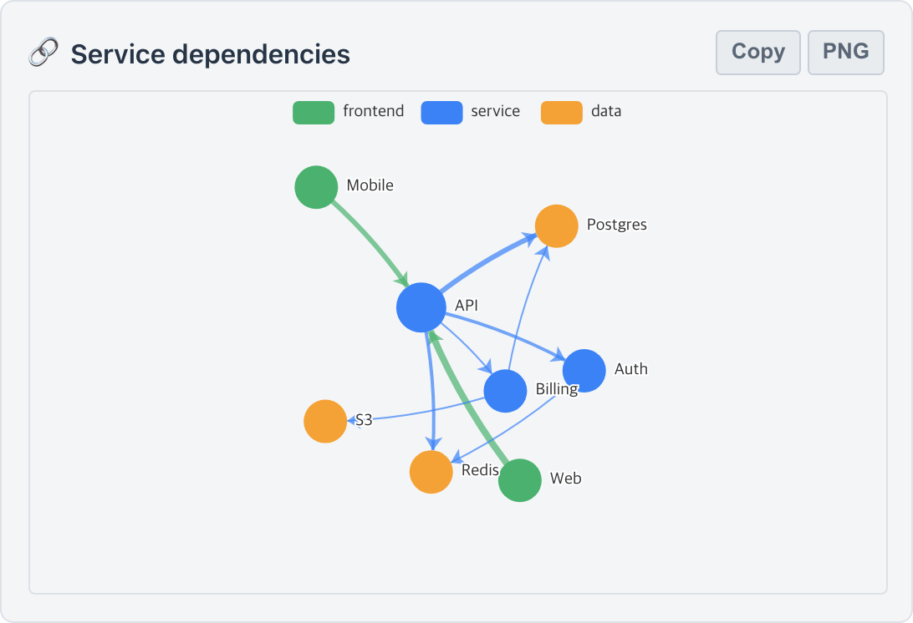{ width="620" }

</div>
</div>

<div class="tcg-card tcg-card--clickable" id="renderWindRose" data-tool-id="renderWindRose" data-tool-title="renderWindRose" markdown>
<div class="tcg-name"><span class="tcg-name__text">renderWindRose</span> <span class="cost">🆓</span></div>
<div class="tcg-art" markdown>:material-compass-rose:</div>
<div class="tcg-type">productivity · visualization <span class="risk risk-l0">L0</span></div>
<div class="tcg-body" markdown>
Renders a rose (polar bar) chart in the chat, showing magnitude by category around a circle. Good for wind direction, time-of-day distributions, or ranked category comparisons.
</div>
<div class="tcg-stats" markdown>
<div class="tcg-stats__line" markdown>**Params** &nbsp; `directions` · `series` · `title` · `seriesName` · `sort`</div>
<div class="tcg-stats__line" markdown>**Env** &nbsp; &nbsp; &nbsp; -</div>
</div>
<div class="tcg-cta">Click for full reference · params · card behavior</div>
<div class="tcg-detail-template" hidden markdown>

**More detail**

Renders a rose (polar bar) chart, plotting magnitude by category around a circle. `directions` is a JSON array of the labels arranged around the circle - compass points (N, NE, E, ...), hours, months, or any plain category names. `series` is EITHER a JSON array of numbers (single series) OR a JSON array of `{name, data}` objects (stacked bands). A single series is drawn nightingale style: each slice gets its own palette color, and slices are sorted ascending by value so they grow around the circle. When every label carries an order of its own - compass points, anything containing a digit, month or weekday names - the order you passed is kept instead. `sort` overrides that choice (`asc`, `desc`, or `none`). Several `{name, data}` series stack into bands, one color per band, with a legend. Good for wind direction, time-of-day distributions, or ranked category comparisons. The card has PNG + Copy export buttons.

**Parameters**

| Param | Type | Req | Description |
|---|---|---|---|
| `directions` | `STRING` | ✓ | JSON array of direction or category labels. |
| `series` | `STRING` | ✓ | JSON array of numbers, or of `{name, data}` objects for stacked bands. |
| `seriesName` | `STRING` |  | Optional name for a single series (legend/tooltip label). |
| `title` | `STRING` |  | Optional chart title. |
| `sort` | `STRING` |  | Slice order: `asc` (the default for a single series with plain category labels), `desc`, or `none` to keep the given order. |

**Sandbox** - Runs at the sandbox **L0** baseline (Safest) - pure compute: no network, no filesystem.

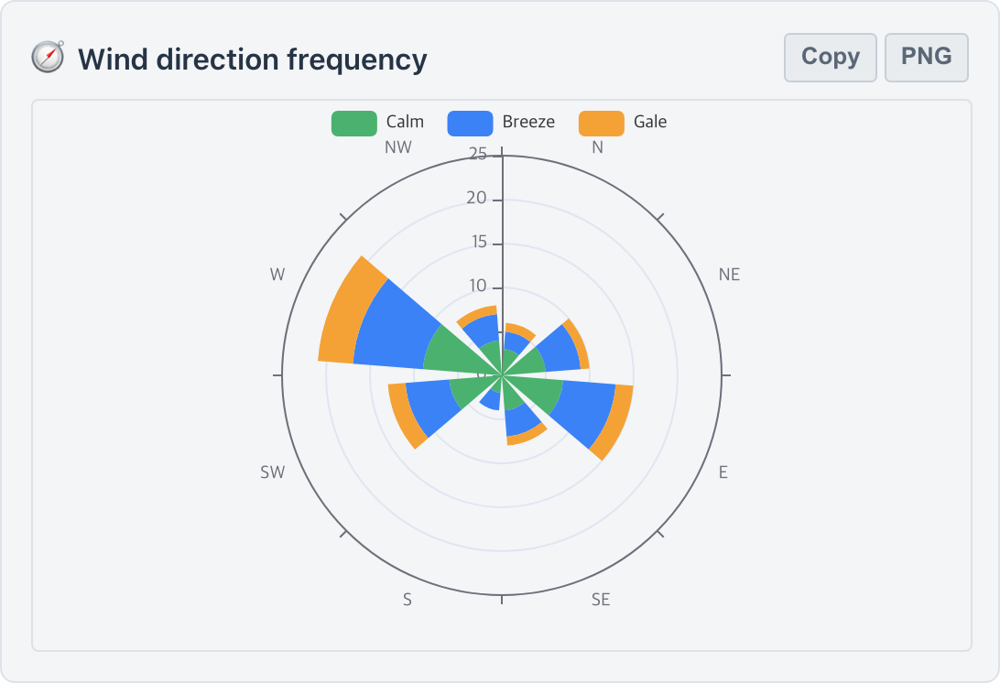{ width="620" }

</div>
</div>

</div>

## Maps { #maps }

Leaflet- and ECharts-backed map cards. Display-only, no account or key; the marker and density maps carry a light/dark basemap toggle, and all three expose PNG + Copy export buttons.

<div class="tcg-grid" markdown>

<div class="tcg-card tcg-card--clickable" id="plotPointsOnMap" data-tool-id="plotPointsOnMap" data-tool-title="plotPointsOnMap" markdown>
<div class="tcg-name"><span class="tcg-name__text">plotPointsOnMap</span> <span class="cost">🆓</span></div>
<div class="tcg-art" markdown>:material-map-marker-multiple:</div>
<div class="tcg-type">productivity · visualization <span class="risk risk-l0">L0</span></div>
<div class="tcg-body" markdown>
Renders an interactive world map with MULTIPLE markers directly in the chat. Use this to plot several geographic points at once (e.g. earthquakes, cities, store locations).
</div>
<div class="tcg-stats" markdown>
<div class="tcg-stats__line" markdown>**Params** &nbsp; `points` · `title` · `style`</div>
<div class="tcg-stats__line" markdown>**Env** &nbsp; &nbsp; &nbsp; -</div>
</div>
<div class="tcg-cta">Click for full reference · params · card behavior</div>
<div class="tcg-detail-template" hidden markdown>

**More detail**

Renders an interactive world map with MULTIPLE markers directly in the chat. Pass `points` as a JSON array; each item needs numeric `lat` and `lng`, plus an optional `label` and an optional numeric `weight` (or `mag`) that sizes and colors the marker. Display-only, no account or key. Optional `style` picks the basemap (light or dark); the default is light and the user can also toggle it on the map. For a single place, use `showLocation` from [Examples](examples.md) instead.

**Parameters**

| Param | Type | Req | Description |
|---|---|---|---|
| `points` | `STRING` | ✓ | JSON array of `{lat, lng, label?, weight?}` points. |
| `title` | `STRING` |  | Optional caption shown above the map. |
| `style` | `STRING` |  | Basemap: `light` (default) or `dark`. |

**Sandbox** - Runs at the sandbox **L0** baseline (Safest) - pure compute: no network, no filesystem.

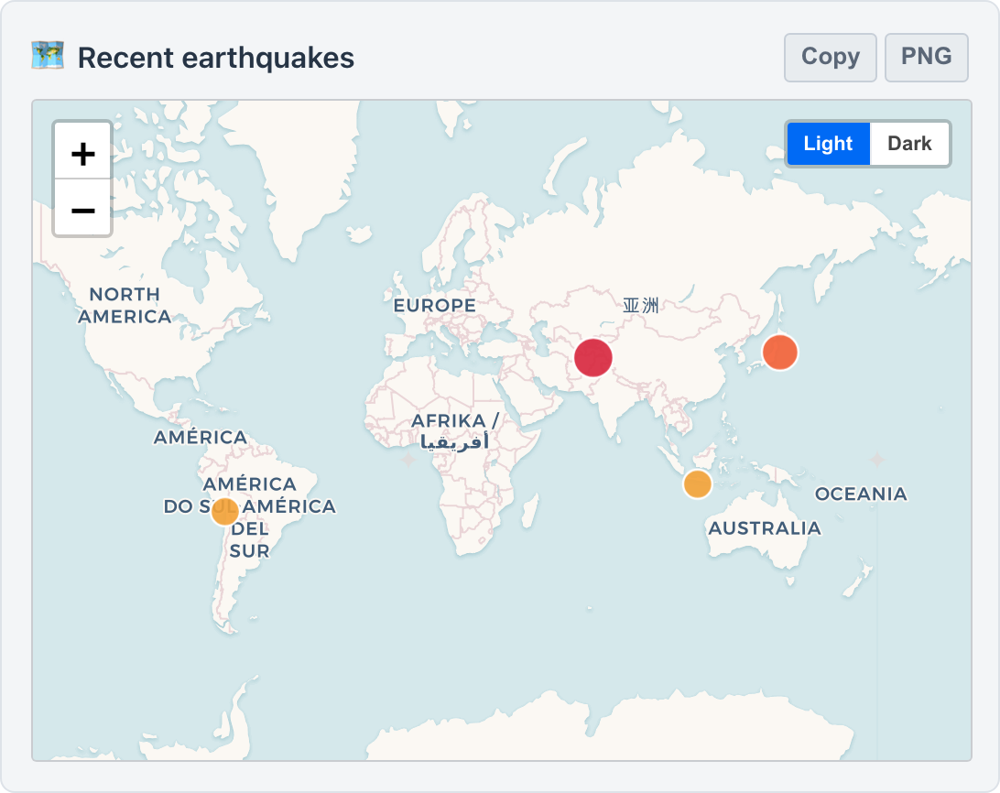{ width="620" }

</div>
</div>

<div class="tcg-card tcg-card--clickable" id="renderChoropleth" data-tool-id="renderChoropleth" data-tool-title="renderChoropleth" markdown>
<div class="tcg-name"><span class="tcg-name__text">renderChoropleth</span> <span class="cost">🆓</span></div>
<div class="tcg-art" markdown>:material-map-legend:</div>
<div class="tcg-type">productivity · visualization <span class="risk risk-l0">L0</span></div>
<div class="tcg-body" markdown>
Renders a region-shaded choropleth map from a GeoJSON you supply and per-region values. Good for any statistic broken out by region.
</div>
<div class="tcg-stats" markdown>
<div class="tcg-stats__line" markdown>**Params** &nbsp; `geoJson` · `values` · `nameProperty` · `title`</div>
<div class="tcg-stats__line" markdown>**Env** &nbsp; &nbsp; &nbsp; -</div>
</div>
<div class="tcg-cta">Click for full reference · params · card behavior</div>
<div class="tcg-detail-template" hidden markdown>

**More detail**

Renders a choropleth (region-shaded) map from a caller-supplied GeoJSON. `geoJson` is a GeoJSON FeatureCollection whose features each carry a name property. `values` is a JSON array of `{name, value}` keyed by that feature name; regions are shaded from light to dark by value, with a legend. Use `nameProperty` if the feature name lives under a key other than `name`. The card has PNG + Copy export buttons.

**Parameters**

| Param | Type | Req | Description |
|---|---|---|---|
| `geoJson` | `STRING` | ✓ | GeoJSON FeatureCollection with named features. |
| `values` | `STRING` | ✓ | JSON array of `{name, value}` keyed by feature name. |
| `nameProperty` | `STRING` |  | Feature property holding the region name (default `name`). |
| `title` | `STRING` |  | Optional card title. |

**Sandbox** - Runs at the sandbox **L0** baseline (Safest) - pure compute: no network, no filesystem.

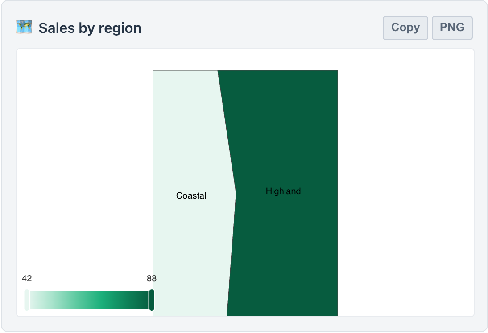{ width="620" }

</div>
</div>

<div class="tcg-card tcg-card--clickable" id="renderGeoHeat" data-tool-id="renderGeoHeat" data-tool-title="renderGeoHeat" markdown>
<div class="tcg-name"><span class="tcg-name__text">renderGeoHeat</span> <span class="cost">🆓</span></div>
<div class="tcg-art" markdown>:material-heat-wave:</div>
<div class="tcg-type">productivity · visualization <span class="risk risk-l0">L0</span></div>
<div class="tcg-body" markdown>
Renders a geographic density heatmap over a real basemap (Light/Dark toggle). Good for incident density, sightings, or any lat/lng hotspot map.
</div>
<div class="tcg-stats" markdown>
<div class="tcg-stats__line" markdown>**Params** &nbsp; `points` · `radius` · `title` · `style`</div>
<div class="tcg-stats__line" markdown>**Env** &nbsp; &nbsp; &nbsp; -</div>
</div>
<div class="tcg-cta">Click for full reference · params · card behavior</div>
<div class="tcg-detail-template" hidden markdown>

**More detail**

Renders a geographic density heatmap over a real basemap, where denser or higher-intensity areas glow warmer. `points` is a JSON array of `{lat, lng, intensity?}` objects. Optional `radius` (pixels) controls the blur spread. The map has a Light/Dark basemap toggle. For discrete markers instead of a density field, use `plotPointsOnMap`. The card has PNG + Copy export buttons.

**Parameters**

| Param | Type | Req | Description |
|---|---|---|---|
| `points` | `STRING` | ✓ | JSON array of `{lat, lng, intensity?}` objects. |
| `radius` | `STRING` |  | Blur radius in pixels (default 28). |
| `style` | `STRING` |  | Basemap: `light` (default) or `dark`. |
| `title` | `STRING` |  | Optional card title. |

**Sandbox** - Runs at the sandbox **L0** baseline (Safest) - pure compute: no network, no filesystem.

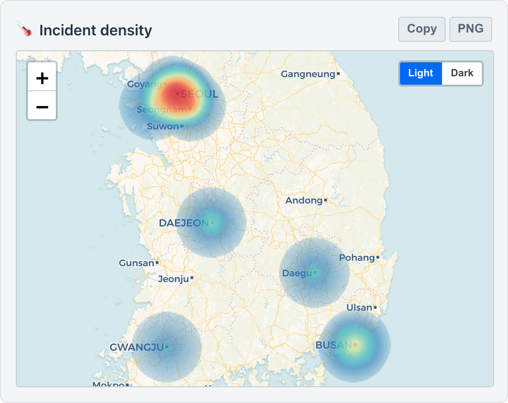{ width="620" }

</div>
</div>

</div>

## Documents & data { #documents-data }

Text- and table-oriented cards: tables, KPI tiles, comparisons, timelines, and side-by-side diffs.

<div class="tcg-grid" markdown>

<div class="tcg-card tcg-card--clickable" id="renderTable" data-tool-id="renderTable" data-tool-title="renderTable" markdown>
<div class="tcg-name"><span class="tcg-name__text">renderTable</span> <span class="cost">🆓</span></div>
<div class="tcg-art" markdown>:material-table:</div>
<div class="tcg-type">productivity · visualization <span class="risk risk-l0">L0</span></div>
<div class="tcg-body" markdown>
Renders a sortable, searchable data table in the chat. Good for any list of records (prices, issues, search results).
</div>
<div class="tcg-stats" markdown>
<div class="tcg-stats__line" markdown>**Params** &nbsp; `columns` · `rows` · `title` · `sortable` · `searchable`</div>
<div class="tcg-stats__line" markdown>**Env** &nbsp; &nbsp; &nbsp; -</div>
</div>
<div class="tcg-cta">Click for full reference · params · card behavior</div>
<div class="tcg-detail-template" hidden markdown>

**More detail**

Renders a sortable, searchable data table in the chat. Pass `columns` as a JSON array of `{key, label, align?('right'), format?('number'), heat?(true to shade the cell by value)}` and `rows` as a JSON array of objects keyed by each column key. Optional `sortable` and `searchable` (`'true'`/`'false'`). Good for any list of records (prices, issues, search results).

**Parameters**

| Param | Type | Req | Description |
|---|---|---|---|
| `columns` | `STRING` | ✓ | JSON array of `{key, label, align?, format?, heat?}`. |
| `rows` | `STRING` | ✓ | JSON array of objects keyed by each column key. |
| `title` | `STRING` |  | Optional table title. |
| `sortable` | `STRING` |  | `'true'`/`'false'`. |
| `searchable` | `STRING` |  | `'true'`/`'false'`. |

**Sandbox** - Runs at the sandbox **L0** baseline (Safest) - pure compute: no network, no filesystem.

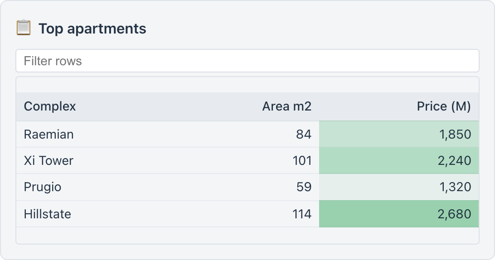{ width="620" }

</div>
</div>

<div class="tcg-card tcg-card--clickable" id="renderStatCards" data-tool-id="renderStatCards" data-tool-title="renderStatCards" markdown>
<div class="tcg-name"><span class="tcg-name__text">renderStatCards</span> <span class="cost">🆓</span></div>
<div class="tcg-art" markdown>:material-card-text:</div>
<div class="tcg-type">productivity · visualization <span class="risk risk-l0">L0</span></div>
<div class="tcg-body" markdown>
Renders a row of KPI / metric tiles in the chat. Use for headline numbers like prices, counts, or weather readings.
</div>
<div class="tcg-stats" markdown>
<div class="tcg-stats__line" markdown>**Params** &nbsp; `cards` · `title`</div>
<div class="tcg-stats__line" markdown>**Env** &nbsp; &nbsp; &nbsp; -</div>
</div>
<div class="tcg-cta">Click for full reference · params · card behavior</div>
<div class="tcg-detail-template" hidden markdown>

**More detail**

Renders a row of KPI / metric tiles in the chat. Pass `cards` as a JSON array of `{label, value, delta?, trend?('up'|'down'|'flat')}`. Use for headline numbers like prices, counts, or weather readings.

**Parameters**

| Param | Type | Req | Description |
|---|---|---|---|
| `cards` | `STRING` | ✓ | JSON array of `{label, value, delta?, trend?}`. |
| `title` | `STRING` |  | Optional row title. |

**Sandbox** - Runs at the sandbox **L0** baseline (Safest) - pure compute: no network, no filesystem.

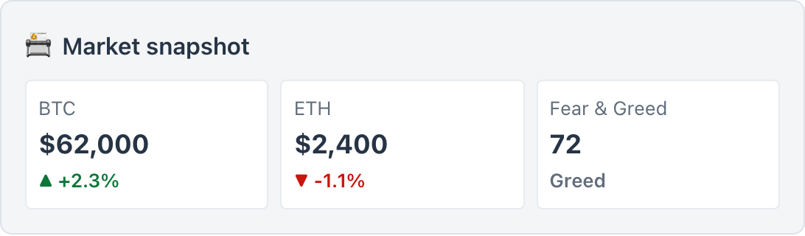{ width="620" }

</div>
</div>

<div class="tcg-card tcg-card--clickable" id="renderComparison" data-tool-id="renderComparison" data-tool-title="renderComparison" markdown>
<div class="tcg-name"><span class="tcg-name__text">renderComparison</span> <span class="cost">🆓</span></div>
<div class="tcg-art" markdown>:material-compare:</div>
<div class="tcg-type">productivity · visualization <span class="risk risk-l0">L0</span></div>
<div class="tcg-body" markdown>
Renders a side-by-side comparison table for two or more entities, optionally highlighting the winning value per row.
</div>
<div class="tcg-stats" markdown>
<div class="tcg-stats__line" markdown>**Params** &nbsp; `entities` · `rows` · `title`</div>
<div class="tcg-stats__line" markdown>**Env** &nbsp; &nbsp; &nbsp; -</div>
</div>
<div class="tcg-cta">Click for full reference · params · card behavior</div>
<div class="tcg-detail-template" hidden markdown>

**More detail**

Renders a side-by-side comparison table for two or more entities. `entities` is a JSON array of names (the columns). `rows` is a JSON array of `{label, values:[...], best?(0-based index of the winning value, optional)}`.

**Parameters**

| Param | Type | Req | Description |
|---|---|---|---|
| `entities` | `STRING` | ✓ | JSON array of entity names (the columns). |
| `rows` | `STRING` | ✓ | JSON array of `{label, values, best?}`. |
| `title` | `STRING` |  | Optional table title. |

**Sandbox** - Runs at the sandbox **L0** baseline (Safest) - pure compute: no network, no filesystem.

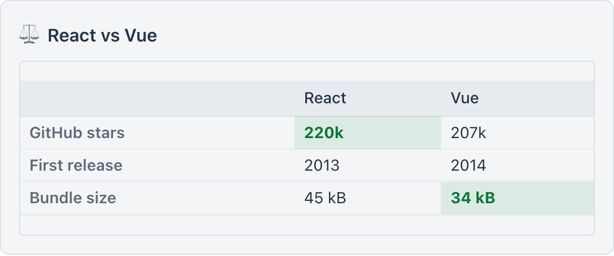{ width="620" }

</div>
</div>

<div class="tcg-card tcg-card--clickable" id="renderTimeline" data-tool-id="renderTimeline" data-tool-title="renderTimeline" markdown>
<div class="tcg-name"><span class="tcg-name__text">renderTimeline</span> <span class="cost">🆓</span></div>
<div class="tcg-art" markdown>:material-timeline:</div>
<div class="tcg-type">productivity · visualization <span class="risk risk-l0">L0</span></div>
<div class="tcg-body" markdown>
Renders a vertical event timeline in the chat. Use for histories, schedules, or sequences of dated events.
</div>
<div class="tcg-stats" markdown>
<div class="tcg-stats__line" markdown>**Params** &nbsp; `events` · `title`</div>
<div class="tcg-stats__line" markdown>**Env** &nbsp; &nbsp; &nbsp; -</div>
</div>
<div class="tcg-cta">Click for full reference · params · card behavior</div>
<div class="tcg-detail-template" hidden markdown>

**More detail**

Renders a vertical event timeline in the chat. `events` is a JSON array of `{date, title, detail?}`. Use for histories, schedules, or sequences of dated events.

**Parameters**

| Param | Type | Req | Description |
|---|---|---|---|
| `events` | `STRING` | ✓ | JSON array of `{date, title, detail?}`. |
| `title` | `STRING` |  | Optional timeline title. |

**Sandbox** - Runs at the sandbox **L0** baseline (Safest) - pure compute: no network, no filesystem.

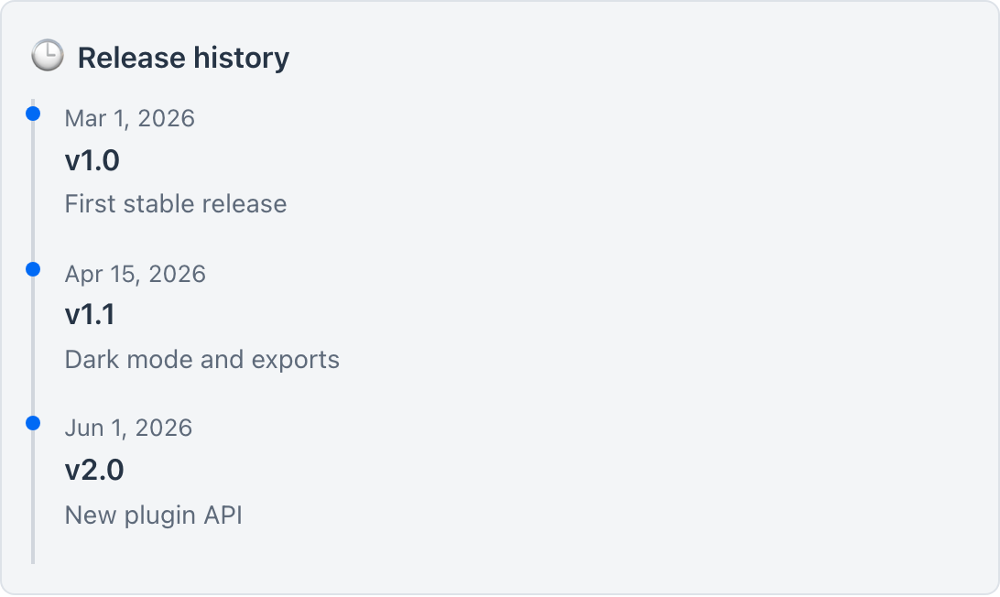{ width="620" }

</div>
</div>

<div class="tcg-card tcg-card--clickable" id="renderDiff" data-tool-id="renderDiff" data-tool-title="renderDiff" markdown>
<div class="tcg-name"><span class="tcg-name__text">renderDiff</span> <span class="cost">🆓</span></div>
<div class="tcg-art" markdown>:material-file-compare:</div>
<div class="tcg-type">productivity · visualization <span class="risk risk-l0">L0</span></div>
<div class="tcg-body" markdown>
Compares two texts (or two files you have read) line by line and shows a side-by-side diff card: lines only on the left are red, lines only on the right are green.
</div>
<div class="tcg-stats" markdown>
<div class="tcg-stats__line" markdown>**Params** &nbsp; `left` · `right` · `leftLabel` · `rightLabel` · `title`</div>
<div class="tcg-stats__line" markdown>**Env** &nbsp; &nbsp; &nbsp; -</div>
</div>
<div class="tcg-cta">Click for full reference · params · card behavior</div>
<div class="tcg-detail-template" hidden markdown>

**More detail**

Compares two texts (or two files you have read) line by line and shows a side-by-side diff card: lines only on the left are red, lines only on the right are green. If the two are almost entirely different it shows a 'completely different' banner. Pass the two texts as `left` and `right` with optional `leftLabel`/`rightLabel` (e.g. file names). To compare files, read them first with `readTextFile` and pass the contents.

**Parameters**

| Param | Type | Req | Description |
|---|---|---|---|
| `left` | `STRING` | ✓ | Left-hand text. |
| `right` | `STRING` | ✓ | Right-hand text. |
| `leftLabel` | `STRING` |  | Optional label for the left side (e.g. a file name). |
| `rightLabel` | `STRING` |  | Optional label for the right side. |
| `title` | `STRING` |  | Optional card title. |

**Sandbox** - Runs at the sandbox **L0** baseline (Safest) - pure compute: no network, no filesystem.

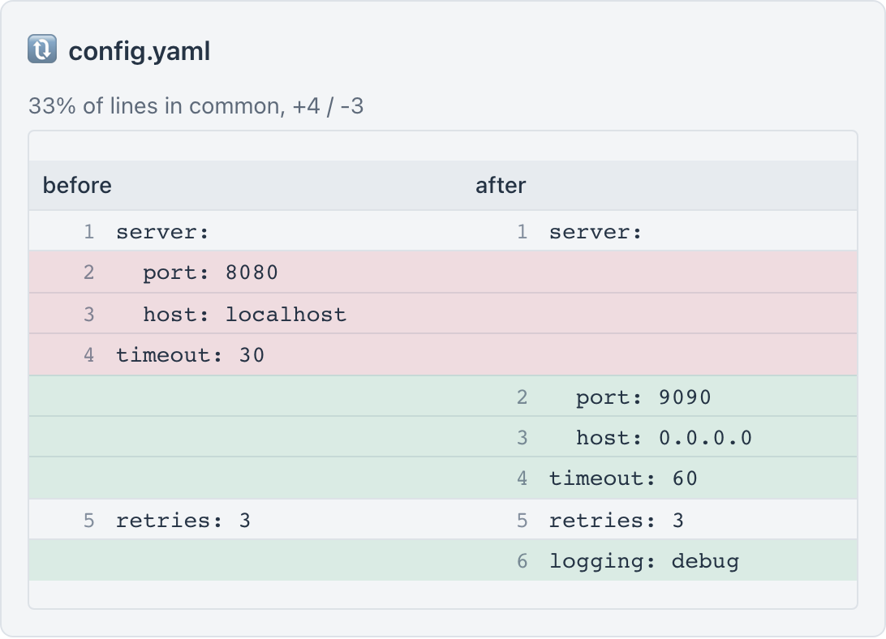{ width="620" }

</div>
</div>

</div>

## Media & diagrams { #media-diagrams }

Mermaid diagrams and embedded images.

<div class="tcg-grid" markdown>

<div class="tcg-card tcg-card--clickable" id="renderDiagram" data-tool-id="renderDiagram" data-tool-title="renderDiagram" markdown>
<div class="tcg-name"><span class="tcg-name__text">renderDiagram</span> <span class="cost">🆓</span></div>
<div class="tcg-art" markdown>:material-sitemap:</div>
<div class="tcg-type">productivity · visualization <span class="risk risk-l0">L0</span></div>
<div class="tcg-body" markdown>
Renders a Mermaid diagram directly in the chat (flowchart, sequence, gantt, mindmap, pie, ER, state, timeline, and more).
</div>
<div class="tcg-stats" markdown>
<div class="tcg-stats__line" markdown>**Params** &nbsp; `code` · `title`</div>
<div class="tcg-stats__line" markdown>**Env** &nbsp; &nbsp; &nbsp; -</div>
</div>
<div class="tcg-cta">Click for full reference · params · card behavior</div>
<div class="tcg-detail-template" hidden markdown>

**More detail**

Renders a Mermaid diagram directly in the chat (flowchart, sequence, gantt, mindmap, pie, ER, state, timeline, and more). Use this to show a process, architecture, timeline, relationship, or org chart as a real diagram instead of plain text. Pass the Mermaid source as `code`, starting with the diagram type, e.g. `flowchart LR`, `sequenceDiagram`, `gantt`, `mindmap`, `erDiagram`, `stateDiagram-v2`, or `timeline`.

**Parameters**

| Param | Type | Req | Description |
|---|---|---|---|
| `code` | `STRING` | ✓ | Mermaid source, starting with the diagram type. |
| `title` | `STRING` |  | Optional diagram title. |

**Sandbox** - Runs at the sandbox **L0** baseline (Safest) - pure compute: no network, no filesystem.

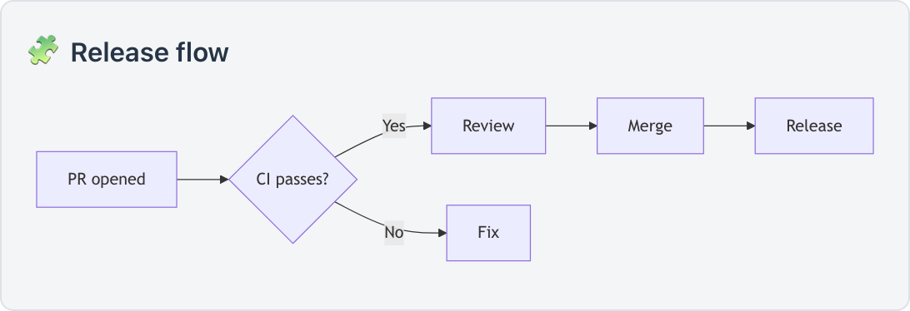{ width="620" }

</div>
</div>

<div class="tcg-card tcg-card--clickable" id="showImage" data-tool-id="showImage" data-tool-title="showImage" markdown>
<div class="tcg-name"><span class="tcg-name__text">showImage</span> <span class="cost">🆓</span></div>
<div class="tcg-art" markdown>:material-image:</div>
<div class="tcg-type">productivity · visualization <span class="risk risk-l0">L0</span></div>
<div class="tcg-body" markdown>
Displays an image from a public URL directly in the chat (a photo, a chart image, a diagram, or a QR code you have a link to).
</div>
<div class="tcg-stats" markdown>
<div class="tcg-stats__line" markdown>**Params** &nbsp; `url` · `caption` · `alt`</div>
<div class="tcg-stats__line" markdown>**Env** &nbsp; &nbsp; &nbsp; -</div>
</div>
<div class="tcg-cta">Click for full reference · params · card behavior</div>
<div class="tcg-detail-template" hidden markdown>

**More detail**

Displays an image from a public URL directly in the chat (a photo, a chart image, a diagram, or a QR code you have a link to). Provide a direct https image `url` and an optional `caption`. Use only direct image URLs (typically ending in `.png`/`.jpg`/`.jpeg`/`.gif`/`.webp`/`.svg`).

**Parameters**

| Param | Type | Req | Description |
|---|---|---|---|
| `url` | `STRING` | ✓ | Direct https image URL. |
| `caption` | `STRING` |  | Optional caption shown below the image. |
| `alt` | `STRING` |  | Optional alt text. |

**Sandbox** - Runs at the sandbox **L0** baseline (Safest) - pure compute: no network, no filesystem.

{ width="520" }

</div>
</div>

</div>

## How the card renders

Each tool returns a fenced ` ```saip-action ` block describing the card. The chat front end parses it and mounts the matching renderer - ECharts for the chart family and the choropleth map, Leaflet for the marker and density maps, Mermaid for diagrams, and lightweight DOM for tables, stat cards, comparisons, timelines, and diffs. Because the rendering is client-side and the tools declare no network or filesystem capability, every card runs at the sandbox **L0** baseline.

The chart and map cards expose **PNG** (download the rendered card as an image) and **Copy** (copy the image to the clipboard) buttons, so a generated visual can be dropped straight into another document, slide, or message - including an email drafted with `sendEmail` from [Examples](examples.md).
