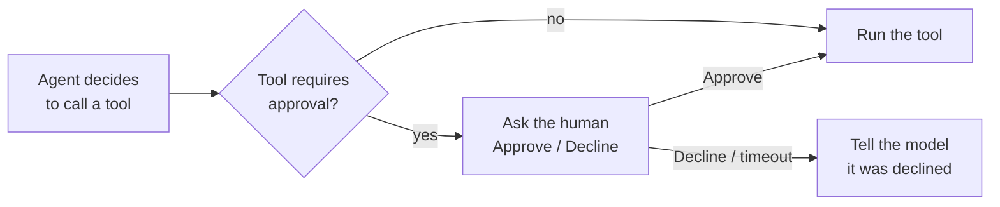

description: Human-in-the-Loop approval in Spring AI Playground - require explicit approval before a tool runs, set it per tool, and approve or decline calls inside Agentic Chat.

# Human-in-the-Loop Approval

**Where:** set it per tool in **Tool Studio → Sandbox & Capabilities → Human-in-the-loop**, or per re-exposed tool in the **Composed Tools** drawer's **HITL** column. It then takes effect in **Agentic Chat** and for any external MCP client.

**Human-in-the-loop (HITL)** pauses a tool call and waits for you to **approve or decline** before the tool runs. The risk level warns you how dangerous a tool is; the sandbox limits what it can touch; HITL is the gate that asks *"run this exact call?"* at the moment it would fire.

It is the final safety layer, on top of the [tool sandbox](../safety-architecture.md) and the [MCP risk model](../mcp-server-safety.md). The design and internals are on the [Human-in-the-Loop Approval architecture page](../hitl-architecture.md); this page is the how-to.

## The two modes { #modes }

Every tool has an approval mode:

| Mode | What it does |
| --- | --- |
| **Required - ask every run** | The call is gated **every time**, for both Agentic Chat and external MCP clients. |
| **Disabled - no prompt** | The tool runs without asking. |

The mode **defaults to Required above `L0`** and to Disabled at `L0` - the more capable a tool, the more it asks out of the box.

## Set approval on a tool you author { #author }

1. Open **Tool Studio** and select or create a tool.
2. Expand **Sandbox & Capabilities**.
3. Under **Human-in-the-loop**, pick **Required** or **Disabled**.
4. *(Optional)* In **Approval prompt (optional)**, write the question shown at approval time. `{toolName}` and `{args}` are substituted at call time - e.g. `Run tool '{toolName}' with arguments {args}?`
5. **Test & Publish** (or **Test & Update**).

!!! warning "Reducing oversight asks for confirmation"
    Moving a tool from Required to Disabled opens a **Reduce human oversight?** confirmation, so you never lower the gate by accident. Disabled lets any client run the tool immediately, with no approval step beyond the sandbox.

## Require approval on a re-exposed external tool { #expose }

When you [proxy an external tool](mcp-server/proxy.md) through the built-in server, each row in the **Composed Tools** drawer has a **HITL** toggle:

- Ticking **HITL** means *"require explicit human approval before this tool runs when called from an external MCP client. Chat on this device gates these tools too."*
- It also **lowers the tool's displayed risk by one band** (a `HITL -1` annotation), because a human now gates every call - see [Composed risk and HITL mitigation](../mcp-server-safety.md#composed-risk). Built-in tools that ship with approval required (the filesystem write and destructive tools) carry the same credit, rendered as a dual chip such as `L5 → L4`.

You can toggle approval per tool, or for all selected tools at once. The same setting is available in YAML via the `hitl: true` key on a composed tool - see the [Configuration reference](../getting-started/configuration.md#mcp).

## Approve a call in Agentic Chat { #chat }

When the agent calls a gated tool, a dialog appears titled **Tool approval required** with the rendered prompt and two buttons:

- **Approve** → the tool runs, and the conversation continues with its result.
- **Decline** → the tool does **not** run. The model is told you declined so it won't silently retry; it either finds another way or tells you the action couldn't be completed.

If you don't answer within two minutes, or close the dialog, the call is **declined** automatically - approval fails safe. If the agent requested several tools at once, each gated one is confirmed on its own; ungated calls run without interruption.

Walk through it end to end in [Tutorial 11 - Approve a Tool in Chat](../tutorials/11-human-approval.md).

## What an external client sees { #external }

For an external MCP client (e.g. Claude Desktop) calling a `Required` tool on the built-in `/mcp` server, the built-in server issues an MCP **elicitation** request - a confirmation card the client renders before the call proceeds. If the client does not support elicitation, the call is **denied** (it cannot be approved). The playground's own [MCP Inspector → Elicitation](mcp-server/inspector.md#elicitation) shows elicitation requests the playground receives while acting as an MCP client; external clients render the built-in server's approval prompt in their own UI.

## Good defaults { #defaults }

- **Keep Required for anything that writes, deletes, sends, or spends** - irreversible or outward-facing actions are exactly what a person should confirm.
- **Leave read-only, local tools Disabled** so routine calls don't nag you.
- **Review-then-send action cards are a separate pattern.** The built-in `sendEmail` and `addToCalendar` tools ship at L0 and need no approval because they only *draft* - they never send mail or write a calendar. The outward action happens only when you click the button on the [action card](agentic-chat/index.md#action-cards) they render in chat, so that click is itself the human gate. A `send`-named tool shipping without an approval prompt is therefore not an exception to the rule above.

## Related

- [Human-in-the-Loop Approval (architecture)](../hitl-architecture.md) - the two gates, loopback de-duplication, and fail-safe internals
- [MCP Server Proxy](mcp-server/proxy.md) - re-expose external tools with per-tool approval
- [Tool Studio](tool-studio/index.md) - author tools and their sandbox + approval policy
- [Agentic Chat](agentic-chat/index.md) - where approvals are answered
- [Tutorial 11 - Approve a Tool in Chat](../tutorials/11-human-approval.md)
