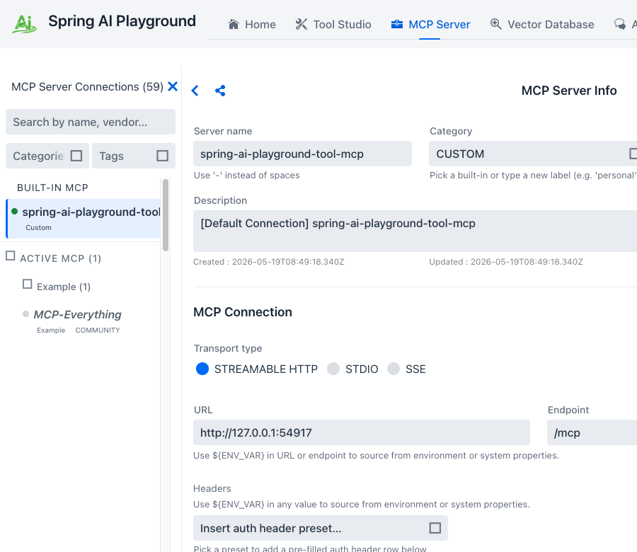
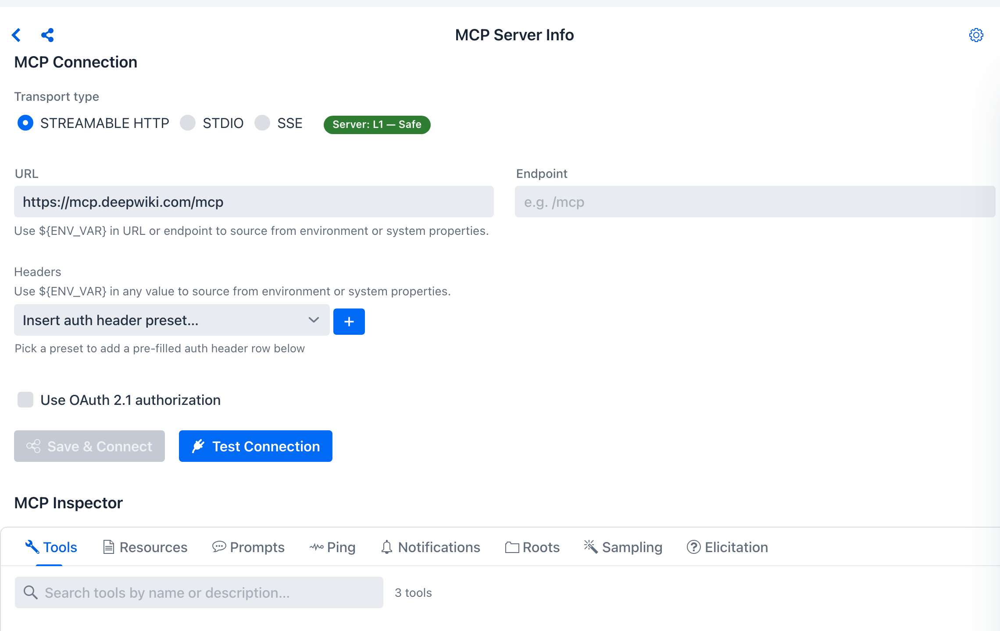
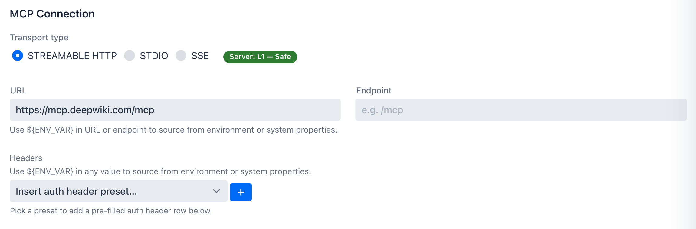
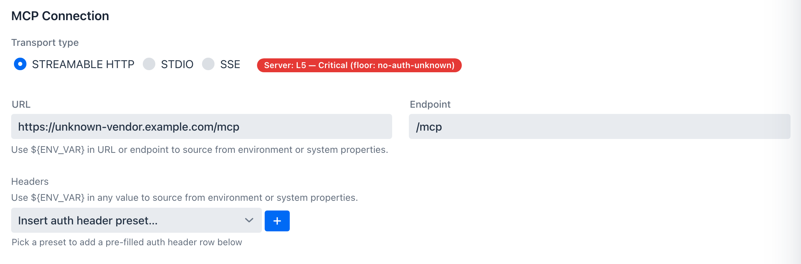

description: MCP Server — sidebar catalog + manual connections, multi-transport runtime, OAuth 2.1, live connection risk scoring, tool exposure (composition), and Inspector for tools, resources, prompts, client primitives.

# MCP Server

**Where:** top navigation → **MCP Server**.

The MCP Server screen is where you pick, configure, and inspect a single MCP connection. The **left rail** is a 3-layer sidebar (Built-in / Active / Inactive) under a sticky `MCP Server Connections (N)` header and a shared filter bar. The **right pane** is `MCP Server Info` — a connection form whose content swaps in to match whichever row is selected on the left, without ever leaving the page. The screen serves two audiences at once:

- It validates tools that **Spring AI Playground itself** publishes through the built-in MCP server (always pinned to the top of the sidebar).
- It is the client-side inspection surface for **external MCP servers** — anything you activate from the catalog, or any custom STDIO / HTTP / SSE / OAuth 2.1 server you wire up by hand.

## Catalog & Sidebar Filtering { #catalog-sidebar-filtering }

The sidebar splits into three layers from top to bottom under a sticky filter bar:

- **Built-in MCP** — the always-on local server that publishes the tools authored in Tool Studio. Pinned flat at the top, no category group. A coloured status dot beside the name reflects the last health check: **green** for OK, **red** for a transport-init or ping error, **gray** for not yet connected.
- **Active MCP (N)** — user-activated remote and stdio servers, grouped per category. Each row shows the matching **category pill**, any **tag pills** (e.g. `COMMUNITY`), and a stability pill (`preview` / `beta`) where applicable. Empty by default with the inline hint *"No active MCP yet — activate one from the Inactive MCP list below."*
- **Inactive MCP (N)** — the **57-entry preset catalog** (49 vendor-official remote + 8 community stdio per OS), grouped per category. Rows render as **ghost-style** to stay visually distinct from active connections: italic name, neutral dot, dashed top border, 5 % shade background. Categories that carry a coloured tile — `PREVIEW`, `FREE-TIER`, `KOREA`, `LEGAL` — surface stability and cohort signals on the group header itself. Hint text under the section: *"Catalog entries — click an item to activate."*

The sidebar header counter swaps between `(N)` and `(N filtered of M)` depending on whether a filter is active. When no entry matches and the search box has text, an empty-state panel offers a **Clear filters** button.

### Filter bar

Just below the sidebar title sits a three-control filter bar (shared `webui/common/sidebar/SidebarFilterBar` widget) — a **search** input, a **Categories** multi-select (13 catalog categories plus `Custom`), and a **Tags** multi-select (11 cohort labels). The three controls compose AND across groups, OR within a group.

{ width="640" loading=lazy }

For the per-control behaviour, full categories/tags vocabulary, AND/OR composition examples, and how the right-pane connection form prefills when you click a row, see [Default MCP Servers → Sidebar filtering and form prefill](../default-mcp-catalog/index.md#sidebar-filtering-and-form-prefill).

### Live status in the sidebar

Each connection in the **Built-in MCP** and **Active MCP** layers carries a colored dot that reflects its last health check: green for OK, gray for offline (not connected), red for a transport-init or ping error. The dot updates as the playground reconnects or re-pings, so a connection that drops mid-session is visible without opening the Inspector. Catalog entries in the **Inactive** layer render in italics with a neutral dot — they're ghost rows that haven't been connected yet.

### Activate from the catalog

Clicking any **Inactive MCP** entry copies the catalog template into the configuration form on the right pane:

- **transport** — `STREAMABLE_HTTP` for remote entries, `STDIO` for the per-OS entries
- **URL or command + args** — with `${ENV_VAR}` placeholders for anything secret. STDIO arguments render as one row per argv element so individual values stay editable.
- **OAuth issuer URI + scopes** — pre-filled for OAuth-protected entries
- **category + tag chips** — matching the catalog row
- **inline description** — carrying any prerequisites and a `Docs:` link

For example, clicking **MCP-Everything** under `Example` lands an STDIO row pre-filled with Command `/usr/local/bin/npx`, Arguments `-y` + `@modelcontextprotocol/server-everything`, Category `EXAMPLE`, Tags `community` + `global`, and a description carrying the macOS prereq (Node.js 18+) and the Docker fallback.

The row stays in the Inactive layer until you click **Save & Connect**; on save the row moves into the Active layer under the same category group and the playground spawns the child process. For OAuth entries this records the registration without yet connecting — see [OAuth 2.1 Authorization Code](#oauth-21-authorization-code) below for the **Authorize** click.

For the full per-category browse of the 57 catalog entries, see the [Default MCP Servers directory](../default-mcp-catalog/index.md).

### Add Custom Server

When a server isn't in the catalog, the **Add Custom Server** header CTA opens an empty configuration form. Defaults: `Streamable HTTP` transport, `Custom` category, placeholder URL `http://127.0.0.1:<server-port>`, `/mcp` endpoint, default description `"Please edit the description of the MCP Server."`, and an empty headers preset dropdown.

Three field constraints worth knowing before saving:

- **Server name** — pre-filled to `New MCP Server`. The constraint is `[A-Za-z0-9._-]+` (no spaces) so the persisted JSON file name stays inside the save directory; typing a space surfaces an inline red validation note.
- **Category** — defaults to `CUSTOM`. The combo accepts a typed value to create a new label, or picks from the 13 built-in catalog categories.
- **Tags** — free-form; the chip picker suggests cohort tags already in use across the active list and catalog.

The **Headers** section's **Insert auth header preset…** dropdown drops a templated row (Bearer / Basic / API Key) with `${VAR}` substitution wired in; the **+** button next to it adds a blank row. OAuth 2.1 has its own checkbox-toggled sub-form further down.

### Browse the Default MCP Servers

The 57 catalog entries are documented in their own directory under Features. Use the [Default MCP Servers index](../default-mcp-catalog/index.md) for a full searchable card grid (Category / Tag / Transport chips), or jump directly to a category-cohort sub-page:

| Sub-page | Categories merged | Entries | What lives there |
|---|---|---|---|
| [Productivity & Communication](../default-mcp-catalog/productivity.md) | Productivity + Communication | 8 | Mail, calendar, notes, chat, team messaging — Gmail, Outlook Mail / Calendar, Notion, Slack, Microsoft Teams, Kakao PlayMCP |
| [Dev & Project Management](../default-mcp-catalog/dev.md) | Dev + Project Management | 12 | GitHub, Linear, Atlassian Rovo, Sentry, Asana, Azure DevOps, Microsoft Learn, Context7, Korean Law + stdio: Git, Puppeteer, Playwright |
| [Data & Cloud](../default-mcp-catalog/data-cloud.md) | Storage + Database + Cloud | 17 | BigQuery, Neon, Supabase, PlanetScale, Google Cloud (SQL / Spanner / Firestore / Run / Storage), Drive, OneDrive, Cloudflare, Vercel, Netlify, Render, Heroku + stdio SQLite |
| [Business](../default-mcp-catalog/business.md) | Finance + CRM + Design + Utility | 12 | Stripe, PayPal, Square, HubSpot, Intercom, Mixpanel, Figma, Canva, Webflow, Google Maps Grounding + stdio: Memory (Knowledge Graph), Sequential Thinking |
| [Search](../default-mcp-catalog/search.md) | Search | 6 | Tavily, Exa, Firecrawl, Jina AI, SerpAPI + stdio Brave Search |
| [Examples](../default-mcp-catalog/examples.md) | Reference test servers | 2 | MCP Everything (protocol-coverage reference), DeepWiki (free library docs) |

Each sub-page carries the per-entry card grid plus **Workflow combinations**, **Auth & secrets**, and a **Picking guide** decision matrix tuned to that category cohort.

## Connection Management

A connection is created in one of two ways:

1. **From the catalog** — click any **Inactive MCP** entry; the form pre-fills with the catalog template and **Save & Connect** finishes the activation. This is the path for the 57 catalogued vendor surfaces.
2. **From scratch** — click **Add Custom Server**; the form opens with the defaults above. Use this for anything not in the catalog.

The MCP runtime supports multiple transport styles:

- **Streamable HTTP** — the modern single-endpoint transport formalised in the MCP v2025-03-26 specification. Clients POST JSON-RPC requests to `/mcp`, responses stream when supported, session-oriented behavior layers on top. This is the form used by the built-in MCP server and by **49 of the 57** catalog entries.
- **STDIO** — JSON-RPC over the spawned process's stdin/stdout. The form exposes **Command** + **Args** + **Env** fields; the catalog ships **8 stdio entries** in OS-specific variants (macOS / Linux use `npx` or `uvx`; Windows uses `npx.cmd`) and the sidebar picks the variant matching the host OS so the pre-filled command saves without editing.
- **Legacy HTTP plus SSE** — kept for compatibility with older external MCP integrations; the form exposes a separate **SSE Endpoint** field.

### Test Connection without disturbing live clients

The config form has a **Test Connection** button next to **Save & Connect**. It spins up a transient sync MCP client, runs `initialize` and a one-shot `listTools`, then disposes the client — without touching the running connection map. Use it to validate a config change against a remote server before saving, which would otherwise replace the live client and might briefly drop tool availability in chat.

### Custom HTTP headers and `${ENV_VAR}` substitution { #custom-http-headers-and-env_var-substitution }

HTTP and SSE connections both expose a single **Headers** section in the config form, edited as key/value rows. The same row layout drives the auth-preset dropdown — picking **Authorization (Bearer Token)**, **Authorization (Basic Auth)**, or **API Key Header** inserts a templated row whose value you fill in. Picking a preset fills the first empty row if one exists, otherwise appends a new row. OAuth 2.1 servers use a dedicated checkbox-toggled sub-form covered in the next section.

{ loading=lazy }

STDIO connections' **Env** section uses the same add/delete row UI — the **+** button next to the section header adds a blank row, and each row's trash button removes it.

Header values, STDIO `env` values, and any name listed in `requiredEnv` accept `${VAR}` placeholders that resolve from the OS environment at connect time (with a JVM system-property fallback). The persisted JSON stores the placeholder string literally; the actual value only enters memory when the connection is brought up. A missing reference throws at connect time instead of silently sending an empty header.

Connection-error notifications and per-call invocation logs are swept by the `SecretMasking` filter — any string that matches a resolved `${VAR}` value is replaced with `***` before the UI renders it. See [Safety Architecture → Secret masking](../../safety-architecture.md#secret-masking) for the full pipeline.

## OAuth 2.1 Authorization Code

For servers that expect an OAuth dance instead of a static token (Notion, Linear, Atlassian Rovo, the Workspace catalog entries, …) the form exposes a dedicated **OAuth 2.1 Authorization Code** sub-form. Open it by ticking the **Use OAuth 2.1 authorization** checkbox on the form. Unticking it drops the OAuth block from the persisted config entirely.

{ loading=lazy }

The sub-form has five fields plus an Advanced group:

- **Client ID** *(required)* — accepts a `${ENV_VAR}` placeholder so client IDs don't end up in the persisted JSON.
- **Issuer URI** — alone enough for OIDC discovery via `.well-known` to auto-resolve the authorization and token endpoints. Most providers need nothing more than this.
- **Scopes** — comma-separated (e.g. `read, write`). Leave blank to inherit the issuer's defaults.
- **Advanced** *(collapsible)* — discloses manual `authorization_uri` / `token_uri` / `client_secret` / client auth method overrides for non-OIDC providers.
- **Redirect URI** — the callback the playground will listen on, displayed read-only so you can register the exact value on the issuer side.
- **Authorize** — stays disabled until you click **Save & Connect** to record the registration; clicking it then opens your system browser to the consent screen.

The flow has three observable states:

- **Configured** — Save & Connect persists the OAuth registration but does not connect yet (no token).
- **AWAITING_AUTHORIZATION** — clicking **Authorize** opens the system browser to the issuer's consent screen and the connection sits in this state until the redirect lands. The Home dashboard surfaces a counter so half-finished authorizations don't get lost.
- **Connected** — once the redirect completes, the playground exchanges the code for tokens and the connection comes up like any other.

Tokens are kept in an encrypted file store under `${user.home}/spring-ai-playground/mcp/oauth-tokens/`. The encryption key is derived from a per-install salt plus the host's `user.home`, so copying the directory to another machine doesn't disclose tokens to that host. Refresh is transparent — once you authorize, the playground keeps the connection live across restarts as long as the issuer accepts the refresh.

!!! tip "Use `${ENV_VAR}` for client secrets"
    The OAuth sub-form's **Client secret** field accepts placeholders the same way header values do. Storing `${SOME_OAUTH_CLIENT_SECRET}` in the form keeps the secret out of the persisted JSON; the actual value is read from the OS environment at connect time.

## Connection risk preview { #connection-risk-preview }

Every server config form carries a live **risk chip** beside the transport selector. It recomputes as you edit — pick a catalog entry or type a URL, and the chip updates before you ever click **Save & Connect**. The chip reflects the [MCP server risk rubric](../../mcp-server-safety.md): four axes (transport, auth, trust, documentation) bucketed into `L0`–`L5`, with three floor rules that jump straight to **L5 — Critical**.

{ loading=lazy }

The chip sits beside the transport selector. A vendor-official catalog entry over HTTPS computes low:

{ loading=lazy }

Typing an unknown public URL with no auth trips the `no-auth-unknown` floor and the chip turns red — a prompt to add auth or re-check the host before connecting:

{ loading=lazy }

The built-in `spring-ai-playground` server is the one exception — it shows **L0 — Verified**, since the risk model is bypassed for the self-loopback server. For the axis-by-axis scoring, floor conditions, the description poisoning scan, and the fingerprint ledger, see [MCP Server Safety](../../mcp-server-safety.md).

## MCP Inspector

Once a connection is up, the **MCP Inspector** is where you exercise every primitive the server (or your client) exposes, isolated from chat. The eight tabs split into **server primitives** (Tools, Resources, Prompts, Ping, Notifications) and **client primitives** (Roots, Sampling, Elicitation — inverted: the *server* asks the playground to act as the client).

See the [MCP Inspector sub-page](inspector.md) for the full per-tab walkthrough, including the `InlineResultPanel` request/response/raw-toggle behaviour, JSON-Schema-typed input controls, and how to verify push notifications and OAuth-protected reads end-to-end.

## Expose external tools — the MCP Server Proxy { #expose-external-tools }

The **gear icon** on the MCP Server Info header opens the **Expose Tools** drawer, which **re-publishes selected tools from your external connections through the built-in server** (`spring-ai-playground-built-in-mcp`) — so they're callable from Agentic Chat *and* external `/mcp` clients, each wrapped with a risk level, optional HITL approval, logging, and secret masking.

This is the **MCP Server Proxy**. Its dedicated page covers the full walkthrough — the per-composition risk cap, per-tool HITL and alias/description overrides, the safe-wrapping contract, the poisoning/shadowing guards, and how external clients reach the proxied tools:

[:material-arrow-right: MCP Server Proxy](proxy.md){ .md-button }

## Getting Started With MCP

1. **Pick a server** — open the sidebar's **Inactive MCP** section and click a catalog entry, or click **Add Custom Server** for anything not in the catalog. See the [Default MCP Servers directory](../default-mcp-catalog/index.md) for the full per-category browse.
2. **Fill the connection form** — for catalog rows the form is pre-filled; supply only the local bits (API key via `${VAR}` placeholders, tenant ID, OAuth Authorize click). For custom rows, type the URL or command + auth. Watch the **[risk chip](#connection-risk-preview)** beside the transport selector — it scores the connection live before you save.
3. **Validate before saving** — click **Test Connection** to spin up a transient client and confirm `initialize` + one-shot `listTools` work without touching the running connection map.
4. **Save & Connect** — the row moves into the **Active MCP** sidebar layer; the status dot turns green when the playground gets a successful ping.
5. **For OAuth-protected servers** — complete the **Authorize** browser handoff once; the AWAITING_AUTHORIZATION counter on Home tracks half-finished flows.
6. **Inspect the live connection** — exercise tools, resources, prompts, ping, notifications, roots, sampling, elicitation in the [MCP Inspector](inspector.md).
7. **(Optional) Expose its tools on the built-in server** — open the **[Expose Tools](#expose-external-tools)** gear drawer to merge selected upstream tools into `spring-ai-playground-built-in-mcp`, with a per-composition risk cap and per-tool HITL.
8. **Use it from chat** — the validated connection is now available to Agentic Chat as a tool / resource source.

## Relationship to Tool Studio

Tool Studio and MCP Server are designed to work together:

- Tool Studio creates or updates a tool
- The built-in MCP server exposes it (visible as the **Built-in MCP** row at the top of the sidebar)
- MCP Inspector verifies the contract and runtime behavior
- Agentic Chat consumes the validated connection

This is one of the cleanest parts of the overall product flow.

The two surfaces also **share a sidebar widget**. The MCP Server view and Tool Studio's tool list both render through `webui/common/sidebar/SidebarFilterBar` (search + Categories MultiSelect + Tags MultiSelect) + `CategoryGroupDetails` (collapsible per-category groups) + `SidebarItemLayout` (status dot · name · category pill · tag pills). Filters compose identically on both screens — see [Tool Studio](../tool-studio/index.md) for the same widget in its tool-authoring context.
