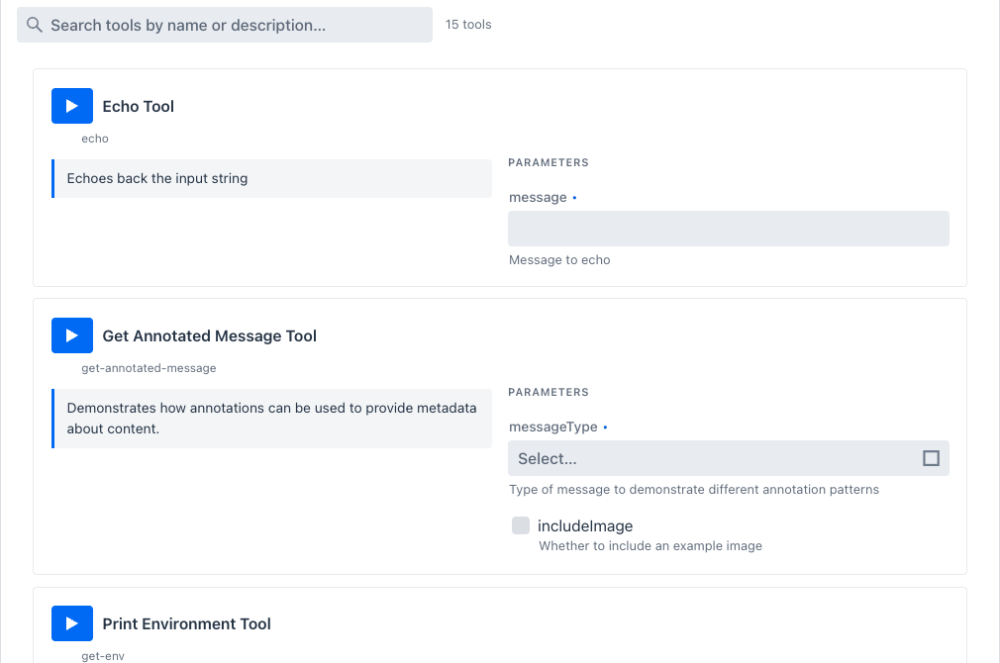
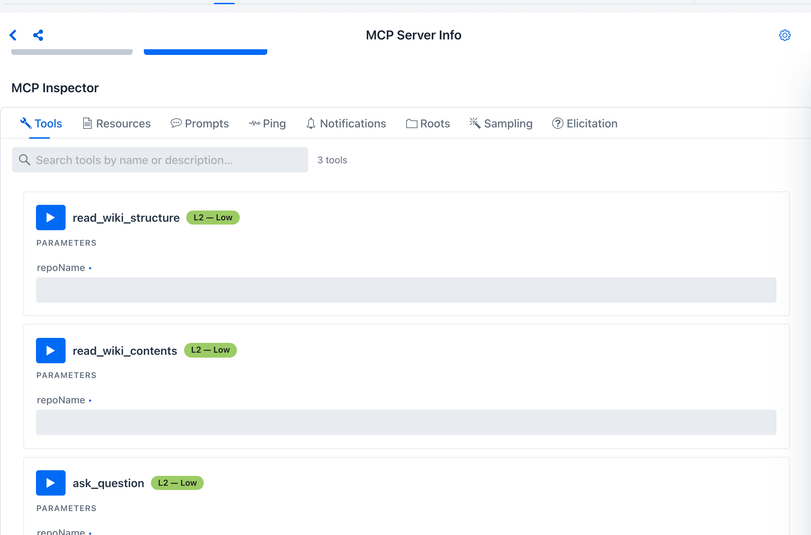
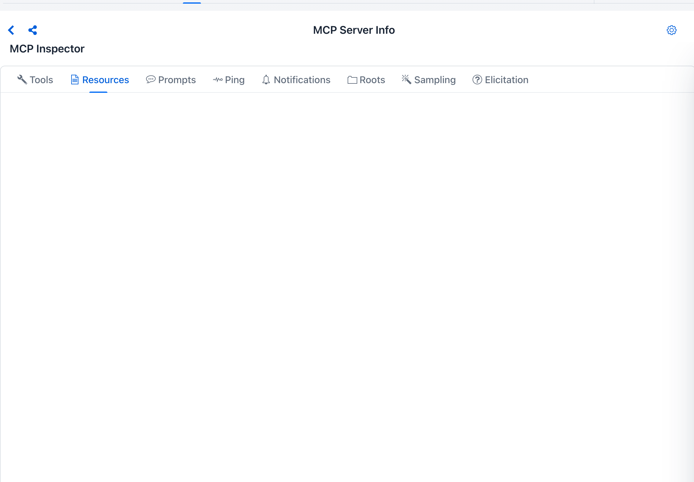
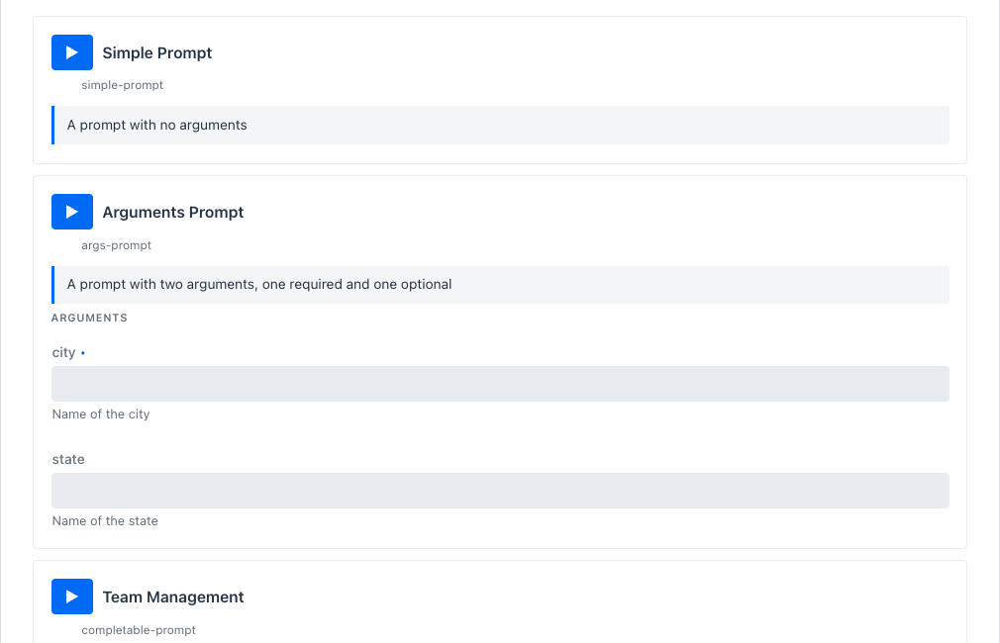
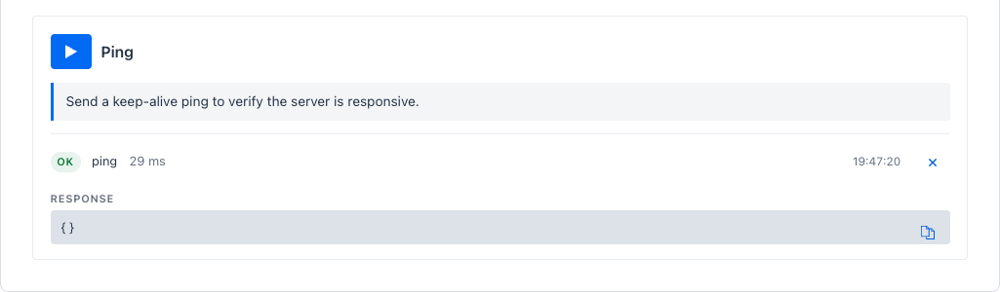
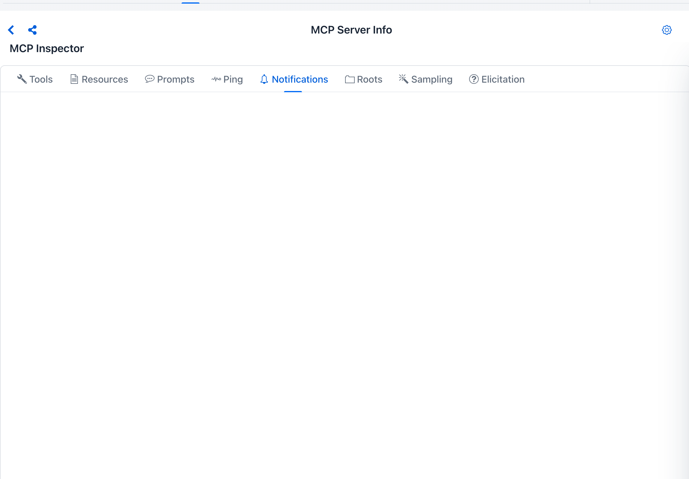
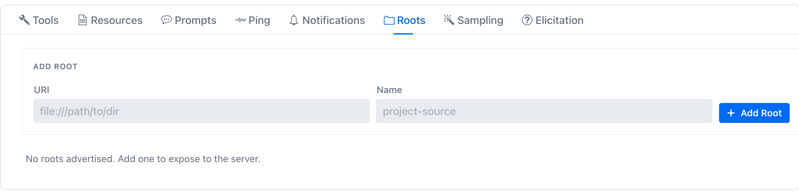
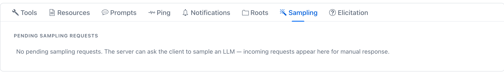
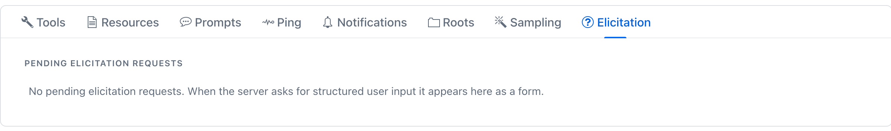

description: MCP Inspector - what each MCP primitive is (Model Context Protocol spec + Spring AI MCP SDK) and how this playground's Inspector surfaces them.

# MCP Inspector

**Where:** top navigation → **MCP Server** → select an active connection → the **MCP Inspector** pane.

The MCP **Inspector** is the right-hand pane of the MCP Server screen for an *active* connection. It exposes every primitive the connected server speaks - and every client primitive the server can call back into - as a per-card surface you can drive in isolation from chat.

There are **eight primitives** in the [Model Context Protocol specification](https://spec.modelcontextprotocol.io/) that this Inspector covers, split by *direction*:

| Direction | Primitives |
| --- | --- |
| **Server → client** (Inspector calls the server) | [Tools](#tools) · [Resources](#resources) · [Prompts](#prompts) · [Ping](#ping) · [Notifications](#notifications) |
| **Server → client (inverted)** - the server asks the playground's MCP *client* to do something | [Roots](#roots) · [Sampling](#sampling) · [Elicitation](#elicitation) |

Spring AI's MCP support exposes both sides through `spring-ai-starter-mcp-client` (which the playground uses to talk to every active connection) and `spring-ai-starter-mcp-server` (which the playground itself implements as the built-in MCP server). The Inspector is a thin Vaadin Flow surface around the **client** half - it consumes server primitives, and it answers the inverted ones.

!!! tip "Want to see every primitive light up at once?"
    Activate the **MCP Everything** catalog row - it's the official MCP working group's reference test server, and it intentionally implements every primitive listed below. See [Default MCP Servers → Examples → MCP-Everything](../default-mcp-catalog/examples.md#MCP-Everything) for the activation spec, per-OS command, Docker alternative, and a one-tool-per-tab walkthrough.

## Server primitives

### Tools { #tools }

**What it is** - In the MCP spec, a tool is a callable function the server publishes. Each tool has a stable `name`, an optional human-readable `displayTitle`, a model-facing `description`, an input schema (JSON Schema), an optional output schema, and a set of declarative `annotations` (`readOnlyHint`, `destructiveHint`, `idempotentHint`, `openWorldHint`). The client discovers the set with `tools/list` and invokes one with `tools/call`. Spring AI's `McpSyncClient` (or `McpAsyncClient`) is the Java entry point; the playground holds one per active connection inside `McpClientService`.

**How the playground surfaces it** - `webui/mcp/inspector/primitives/server/ToolPrimitive.java` renders each tool the server returns from `tools/list` as a full-width card. The card lays out the **Run** action button, the display title (with the raw `tool.name` as a sub-label when `displayTitle` differs), a **risk chip** scoring the tool on the [MCP risk rubric](../../mcp-server-safety.md) (`L0`-`L5`, e.g. `L2 - Low`), badges for every annotation the server declared, the model-facing description, and an **inputs panel** built per the tool's JSON-Schema property map - `InspectorHelpers` picks the right Vaadin control per JSON-Schema `type` (boolean → checkbox, number → number field, array/object → JSON editor, enum → dropdown, string → text field with format-aware placeholder). Clicking **Run** calls `McpClientService.callTool(serverInfo, name, args)` through the live transport - not a sandbox - and the result lands inline via `InlineResultPanel` (OK / ERROR badge · elapsed ms · ISO timestamp · REQUEST / RESPONSE blocks · Raw toggle to the JSON-RPC envelope · Copy · dismiss).

*Tools tab - Echo card on top (`message` input) and Get Annotated Message just below (Select for `messageType`, checkbox for `includeImage`). Each card is `ToolPrimitive` rendering one entry from `tools/list`. The full per-tool walkthrough lives on the [MCP Everything page](../default-mcp-catalog/examples.md#MCP-Everything).*

Every card also carries its own **risk chip** next to the tool name. On the DeepWiki connection, both read tools score `L2 - Low`:

{ loading=lazy }

*The per-tool chip is the [MCP tool risk](../../mcp-server-safety.md#tool-risk) level, scored independently of the server. The same upstream tool re-exposed on the built-in server shows `L0 - Verified` instead, since the built-in self-loopback server bypasses the risk model.*

### Resources { #resources }

**What it is** - A resource is content the server lets the client *read* by URI. The spec has two flavors: **static resources** are concrete URIs the server has (`server.example/file.txt`), discovered via `resources/list`; **resource templates** are URI patterns with parameters (`server.example/file/{id}`), discovered via `resources/templates/list`. Both are read with `resources/read` (`uri` + optional parameter substitution). Resources can carry a `mimeType` and a server-supplied description. Spring AI exposes resources on both sides - `McpServerFeatures.SyncResourceSpecification` for publishing, `McpSyncClient.listResources` / `readResource` for consuming.

**How the playground surfaces it** - `ResourcePrimitive.java` renders one card per static resource; `ResourceTemplatePrimitive.java` renders one card per template and includes the JSON-Schema-typed input panel for template variables. A **Read** play-button on each card calls `resources/read` for the resolved URI and lands the body inline. Text content types render verbatim; binary content surfaces as a base64 preview with byte-length displayed. The section header carries the count (`RESOURCES N`, `RESOURCE TEMPLATES N`).

*Resources tab - each row is one `ResourcePrimitive` card: name + URI + content-type chip + server-supplied description + a play-button to read. Resource templates (when the server publishes any) appear in a second section below the static list with a `VARIABLES` block per card driven by the same JSON-Schema input controls the Tools tab uses.*

### Prompts { #prompts }

**What it is** - A prompt is a named, parameterised message template the server can render for the client. The spec defines `prompts/list` (discovery, returns `name` + optional `description` + optional argument schema) and `prompts/get` (render with supplied arguments → returns a list of `messages` ready to feed a model). Argument schemas can flag completion support, which causes the client to call `completion/complete` for auto-suggest as the user types. Spring AI's `McpSyncClient.listPrompts` / `getPrompt` covers the consumer side.

**How the playground surfaces it** - `PromptPrimitive.java` renders one card per prompt. Argument-less prompts collapse to name + description + **Preview**. Prompts with arguments expose typed inputs per the prompt's argument schema; arguments declared as completable trigger MCP `completion/complete` calls as you type. Clicking **Preview** calls `prompts/get` and lands the rendered messages inline so you can see exactly what the server would hand a downstream model.

*Prompts tab - `Simple Prompt` is an args-less prompt; `Arguments Prompt` requires `city` and accepts an optional `state`. A third card (`completable-prompt` / Team Management) lives further down and uses MCP completion for its `department` argument.*

### Ping { #ping }

**What it is** - `ping` is a one-shot liveness check defined by the spec. The client sends an empty `ping` request; the server is expected to respond with an empty result. The round-trip is what proves the transport is alive end-to-end, independent of any tool or resource call. Spring AI's `McpSyncClient.ping()` issues it.

**How the playground surfaces it** - `PingTab.java` renders a single `PingCard` - one button, one inline result panel. Clicking the button sends `ping` and the result panel below shows the OK badge + elapsed milliseconds, or an ERROR badge if the transport returns or times out.

*Use this for two things: a **liveness check** independent of any tool (a tool-call timeout doesn't say whether the server itself is reachable; ping does), and as a **reconnect signal** when the sidebar status dot flips gray.*

### Notifications { #notifications }

**What it is** - Notifications are *unsolicited messages from the server* to the client. The spec covers `notifications/tools/list_changed`, `notifications/resources/list_changed`, `notifications/resources/updated`, `notifications/prompts/list_changed`, and structured log records (`notifications/message`). Clients subscribe by being connected - the transport keeps the channel alive for inbound traffic. Spring AI dispatches them via `McpSyncClient.setLoggingConsumer` / `setToolsChangeConsumer` / `setResourcesChangeConsumer` / `setPromptsChangeConsumer`.

**How the playground surfaces it** - `NotificationsTab.java` is a live feed. Each incoming notification appears as a row with a timestamp, the notification method, and the (pretty-printed) payload. The feed accumulates while the tab is open and resets when the sidebar selection changes. This is the **only place chat doesn't surface** server push notifications, so it's the canonical way to verify that an external server actually emits the change events it claims to.

*On MCP Everything specifically, invoking the `Toggle Subscriber Updates` tool on the Tools tab kicks the server into periodically pushing `notifications/resources/updated` - which is when entries start landing in this feed.*

## Client primitives

These three are **inverted**: the server initiates the call and the playground (acting as the MCP client) is expected to respond. Spring AI handles the wiring through `McpClientFeatures` - `SyncRootsProvider`, `SyncSamplingProvider`, `SyncElicitationProvider`. The playground binds a Vaadin tab to each provider so the human in the loop can answer.

### Roots { #roots }

**What it is** - A *root* is a file or URI the client advertises to the server as something the server may operate on. The server requests the list via `roots/list`; the client responds with its current roots. The client can also push `notifications/roots/list_changed` when the set mutates. The spec is intentionally non-prescriptive about how roots are scoped - it's a *contract surface* the server can rely on for filesystem-style operations without the client having to grant blanket access.

**How the playground surfaces it** - `RootsTab.java` lists the roots the playground will return to any `roots/list` request from the connected server. Each row is a `RootPrimitive` (URI + optional human-readable name + a remove button). An inline form at the bottom (URI + Name + **+ Add Root**) appends a row and synchronises a `notifications/roots/list_changed` to the server.

*The default root list is empty - add roots only when a server has explicitly asked which directories or URIs you've opted to expose. Roots advertised here are visible to any subsequent `roots/list` from the connected server until you remove them.*

### Sampling { #sampling }

**What it is** - *Sampling* is the server asking the client to run a model turn on its behalf. The spec endpoint is `sampling/createMessage` - the server sends a conversation (`messages`), optional `modelPreferences` (cost / speed / intelligence hints), a system prompt, max tokens, temperature, and stop sequences; the client returns the assistant message. This is how a server-side agent loop can recurse into the user's model **without bringing its own credentials**. Spring AI's `SyncSamplingProvider` is the contract.

**How the playground surfaces it** - `SamplingTab.java` is a feed of pending sampling requests. Each request lands as a `SamplingRequestPrimitive` card carrying the conversation messages, the model preferences, and **Approve** / **Reject** buttons. Approved requests run through the playground's configured chat model (the same `ChatClient` Agentic Chat uses) and the resulting assistant message is returned to the server. Rejected requests return an MCP-spec error so the server can react.

*Sampling is the human-in-the-loop gate you stand up **before** letting a server-side agent loop call back into the user's model. On MCP Everything, invoking the `Trigger Sampling Request Tool` on the Tools tab makes the server fire sampling/createMessage back here - that's when a card appears in this feed.*

### Elicitation { #elicitation }

**What it is** - *Elicitation* is the server asking the *user* a question mid-conversation. The spec endpoint is `elicitation/create` - the server sends a `prompt` text plus a `requestedSchema` (a JSON Schema describing what answer it expects); the client renders the form, the human fills it in, the client returns the answer. This is how a server can pull "which calendar should I write this event to?" out of the user without the host model having to know to ask. Spring AI's `SyncElicitationProvider` is the contract.

**How the playground surfaces it** - `ElicitationTab.java` is a feed of pending elicitation requests. Each request lands as an `ElicitationRequestPrimitive` card carrying the prompt text, a form rendered per the server's `requestedSchema` (same JSON-Schema-typed inputs the Tools tab uses), and **Submit** / **Cancel** buttons. Submitting ships the answer back; cancelling returns an error. The card stays in the feed afterwards as a record so you can audit what was asked.

*On MCP Everything, invoking the `Trigger Elicitation Request Tool` on the Tools tab makes the server fire elicitation/create back here.*

## Why every Inspector card uses the same layout

Every per-primitive card - `ToolPrimitive`, `ResourcePrimitive`, `PromptPrimitive`, `PingCard`, `SamplingRequestPrimitive`, `ElicitationRequestPrimitive`, `RootPrimitive` - applies `PrimitiveCardLayout.applyCardStyle` and uses `PrimitiveCardLayout.titleRow` for the icon + title + action-button header. Result panels are all `InlineResultPanel`. That consistency is intentional - once you understand how one card behaves, every other tab works the same way: title row → optional badges → description → typed inputs → action → inline result. The eight tabs differ only in which primitive they exercise.

Hands-on walkthrough against a server that implements all eight primitives: [Default MCP Servers → Examples → MCP-Everything](../default-mcp-catalog/examples.md#MCP-Everything).
