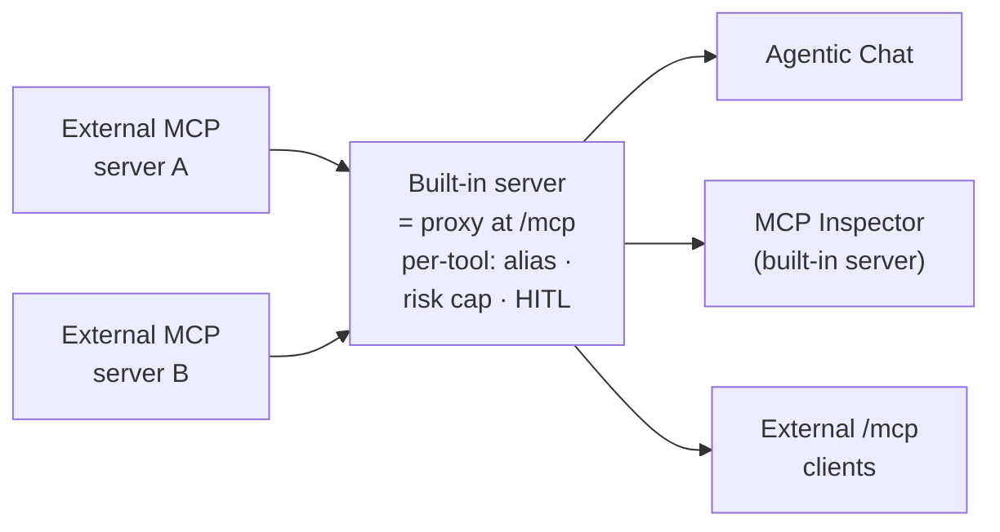

description: MCP Server Proxy - re-publish selected tools from your external MCP connections through the playground's own built-in MCP server, governed per tool with a risk level, HITL approval, logging, and secret masking.

# MCP Server Proxy

**Where:** top navigation → **MCP Server** → select a connected server → the **gear icon** at the top-right of the *MCP Server Info* pane → **Expose Tools**.

The **MCP Server Proxy** re-publishes tools from the external MCP servers you've connected **through the playground's own built-in MCP server** (`spring-ai-playground-built-in-mcp`, Streamable HTTP at `/mcp`). The built-in server fronts those upstream servers as a **governed proxy** - Agentic Chat, the MCP Inspector, and any external MCP client reach the proxied tools on one endpoint, alongside the tools you authored in Tool Studio. You control it **per tool**: which tools, under what alias, with what risk cap and human-approval setting.



You pick the tools through the **Expose Tools** drawer; internally the selection is a *composition* (`McpComposition`) that wraps each chosen tool in a `WrappedExternalToolCallback`. "Proxy" is the user-facing idea - *re-publish someone else's tool through mine, per tool* - and "composition" is the mechanism.

!!! info "Combine across connections"
    You re-publish the tools you select - individually or with **Select all**, across one or several active connections - combined onto the one built-in `/mcp` endpoint. See [Default MCP Servers → trust and risk](../default-mcp-catalog/index.md#trust-and-risk).

## Why proxy a tool instead of calling it directly

An external MCP server can be written in any language and run anywhere - you didn't author it and can't see inside it. Proxying it through the built-in server buys three things that a direct connection doesn't:

- **One endpoint, governed.** Chat and external `/mcp` clients reach the upstream tool alongside your own tools, without each client negotiating that vendor's transport or auth.
- **A safety envelope.** Every proxied tool is wrapped with a computed risk level, optional human approval (HITL), full logging and tracing, and secret masking - see the [safe-wrapping contract](../../mcp-server-safety.md#wrapping-contract).
- **A review gate.** Before a tool is published it passes a [description poisoning scan](../../mcp-server-safety.md#poisoning-scan), a [fingerprint ledger](../../mcp-server-safety.md#fingerprint-ledger) (so a silently-redefined upstream tool is flagged for re-review), and [composition shadowing rules](../../mcp-server-safety.md#shadowing-rules).

## The Expose Tools drawer

The **gear icon** on the MCP Server Info header opens the **Expose Tools** drawer.

{ loading=lazy }

- **Max risk to expose** caps which tools can be selected - any tool whose effective risk exceeds the cap (default `L3`) is disabled in the list.
- **Require approval (HITL)** can be set per tool, or for all selected tools at once via the header checkbox. Marking a tool HITL lowers its effective risk by one band and **gates the call at runtime** - external clients are asked via MCP elicitation, and chat on this device shows an approval dialog (see [Human-in-the-Loop](../human-in-the-loop.md)).
- Each server row expands to its tools; every tool shows its own **risk chip** plus an alias / description editor. The exposed alias defaults to `<server>_<tool>` and the input schema passes through unchanged.

{ loading=lazy }

## What the proxy adds to each tool

Re-exposing a tool **wraps** it - it doesn't copy it. The upstream call is unchanged, but the wrapped tool now carries a composed risk level, emits `start` / `done` / `crash` spans tagged with its upstream origin and risk, masks upstream connection secrets in errors, and honors its HITL flag.

That wrapper - plus the risk scoring, poisoning scan, fingerprint ledger, and shadowing rules behind it - is the **safety model**, documented field-by-field on its own page so this one stays about *using* the feature: see **[MCP Server Safety → The safe-wrapping contract](../../mcp-server-safety.md#wrapping-contract)**.

## Who can reach the proxied tools

Once you click **Apply**, the selected tools join the built-in server and are reachable by:

- **Agentic Chat** - alongside your Tool Studio tools and any directly-selected MCP connections.
- **The MCP Inspector** - select the built-in server (`spring-ai-playground-built-in-mcp`) in the MCP Server screen and the proxied tools show up in its [Tools tab](inspector.md#tools), where you can run them directly. (They display as `L0 - Verified` there, since the built-in server bypasses the risk model - the upstream's real level still shows on its own connection's Inspector.)
- **External MCP clients** - anything that connects to the playground's `/mcp` endpoint sees the proxied tools in `tools/list` (under their exposed aliases).

This is how external tools reach external clients in practice; the [trust-and-risk overview](../default-mcp-catalog/index.md#trust-and-risk) frames the same exposure at the catalog level.

## Steps

1. **Connect the upstream server** - activate a [catalog entry](../default-mcp-catalog/index.md) or add a custom server, and confirm its tools work in the [Inspector](inspector.md#tools).
2. **Open the Expose Tools drawer** - the gear icon on the MCP Server Info header.
3. **Set the ceiling** - pick a **Max risk to expose** cap; optionally tick **Require approval (HITL) for all selected tools**.
4. **Select tools** - expand a server, tick the tools you want. Each shows its effective risk chip; over-cap tools are disabled.
5. **(Optional) Rename / gate** - edit the exposed alias or description, and toggle HITL per tool.
6. **Apply** - the tools join the built-in server, visible at the top of the sidebar and callable from chat and `/mcp`.

## Configure exposure via YAML { #yaml-exposure }

The drawer's selection is a composition you can also declare in `application.yaml` - handy for reproducible or scripted setups. Under `spring.ai.playground`:

```yaml
spring:
  ai:
    playground:
      built-in-mcp-server:
        name: spring-ai-playground-built-in-mcp   # identity external /mcp clients see
        description: Curated tools for my team     # shown in clients' server list
        exposure-mode: both          # builtin-only | composed-only | both
      mcp-server:
        composed-tools-max-risk: L3  # cap; tools whose risk exceeds this are skipped
        composed-tools:
          - server: DeepWiki         # connected server name
            tool: ask_question       # upstream tool name
            alias: deepwiki_ask      # exposed name (optional; defaults to <server>_<tool>)
            description: "..."        # optional description override
            hitl: true               # require human approval (optional, default false)
```

The built-in server's **name** and **description** are sourced from this config (not the connection form) so the published identity stays stable and keeps matching the `L0 - Verified` self-bypass.

Each list entry wraps one upstream tool, exactly like a drawer row - same risk cap, alias, and HITL semantics. The upstream server must be **connected** for its tools to wrap. These keys are also in the [Configuration reference → MCP built-in server & exposure](../../getting-started/configuration.md#mcp).

## Related

- [MCP Server Safety](../../mcp-server-safety.md) - how composed risk, the poisoning scan, the fingerprint ledger, and shadowing rules are computed
- [MCP Server](index.md) - connections, transports, OAuth, the sidebar catalog
- [MCP Inspector](inspector.md) - exercise a connection's tools (with per-tool risk chips) before proxying them
- [Default MCP Servers](../default-mcp-catalog/index.md) - the 57 preset connections you can proxy from
