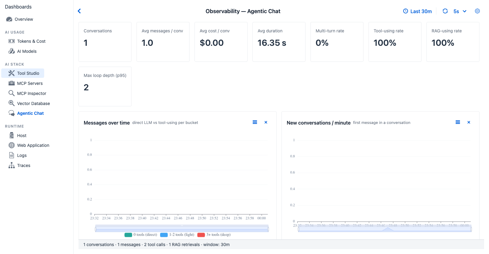

title: Agentic Chat Observability
description: Conversation-level observability - TraceRecords grouped by conversationId via ConversationAggregator. Multi-turn rate, loop depth, total cost per session, outcomes.

# Agentic Chat

*Agentic Chat - `ConversationAggregator` groups `TraceRecord`s by `conversationId` to surface behavioural metrics that only make sense across multiple turns. Multi-turn rate identifies whether the window's traffic is a sustained session or a series of one-shot questions.*

**Purpose** - conversation-level observability. The trace stream produces one `TraceRecord` per turn; this tab groups those by `conversationId` (via `ConversationAggregator`) and surfaces *behavioural* metrics that only make sense across multiple turns - multi-turn rate, loop depth, total cost per session.

## When to look here

- *"Are users running long, multi-turn sessions or one-shot questions?"* - Multi-turn rate KPI + Conversation duration chart.
- *"Is the agent looping?"* - Max loop depth (p95) KPI + Agentic loop depth chart. A loop depth above 5 in steady-state is usually a misconfigured agent.
- *"Which conversations cost the most?"* - Cost per conversation chart + the conversations grid (sortable).
- *"Are agents actually invoking tools end-to-end?"* - Tool-using rate KPI.
- *"Are conversations completing or timing out?"* - Conversation outcomes chart.
- *"Which models dominate inside conversations (vs per-turn)?"* - Models used in conversations.

## Source

`ConversationAggregator` walks `ObservabilityRingBuffer.snapshot()` and groups by `conversationId`. Computes per-conversation totals (token sums, cost via `ModelPricingService`, tool call counts, RAG flags, distinct models / providers, error counts, loop depth, duration).

## Controls

All dashboards share the [Observability global settings](../index.md#global-settings) - time window, refresh interval, custom range. Agentic Chat has no tab-specific controls beyond those.

## KPI cards (eight)

| Card | Shows | Source |
|---|---|---|
| Conversations | Number of distinct conversation IDs in the window | `ConversationAggregator` group count |
| Avg messages / conv | Mean message count per conversation | Aggregated |
| Avg cost / conv | Mean cost per conversation in active currency | Aggregated (uses `ModelPricingService` + `CurrencyService`) |
| Avg duration | Mean wall-clock duration from first to last turn | First-turn timestamp to last-turn timestamp |
| Multi-turn rate | Percentage of conversations with more than one user message | Boolean per conversation |
| Tool-using rate | Percentage of conversations that called at least one tool | Boolean per conversation |
| RAG-using rate | Percentage of conversations that triggered a vector query | Boolean per conversation |
| Max loop depth (p95) | 95th percentile of `tools / messages` ratio across conversations | Heuristic for agentic looping |

## Charts (eight)

| Chart | Type | Reading |
|---|---|---|
| Messages over time | Line, total messages per bucket | High slope → busy chat workload |
| New conversations / minute | Line | Spike = wave of new sessions; flat = warm steady state |
| Agentic loop depth | Histogram of per-conversation loop depth | Tail with depth >5 → agent loops |
| Conversation duration | Histogram (seconds) | Short vs long-session split |
| Tools used in conversations | Horizontal bar of distinct tools across conversations | Conversation-level tool palette |
| Models used in conversations | Horizontal bar | Should match the configured model unless the agent is provider-switching |
| Cost per conversation | Histogram, active currency | Long-tail upper bin = expensive conversations |
| Conversation outcomes | Stacked bar (Completed / Errored / Cancelled) | If Errored climbs, something is wrong end-to-end |

## Tables

**Conversations grid** - `First · Conv id (short) · Messages · Duration · ...` - click a row to open the [Conversation Thread dialog](../runtime/traces.md#drilldown-conversation-thread-dialog) (documented alongside Trace Detail on the Traces page).

## Cross-references

- [Agentic Chat (feature)](../../agentic-chat.md) - the chat UI that produces these traces
- [Traces](../runtime/traces.md) - raw per-turn view; Agentic Chat is the aggregated view
- [Observability Architecture → Conversation-level views](../../../observability-architecture.md#trace-assembly) - `ConversationAggregator` and `ConversationMessageExtractor` design
