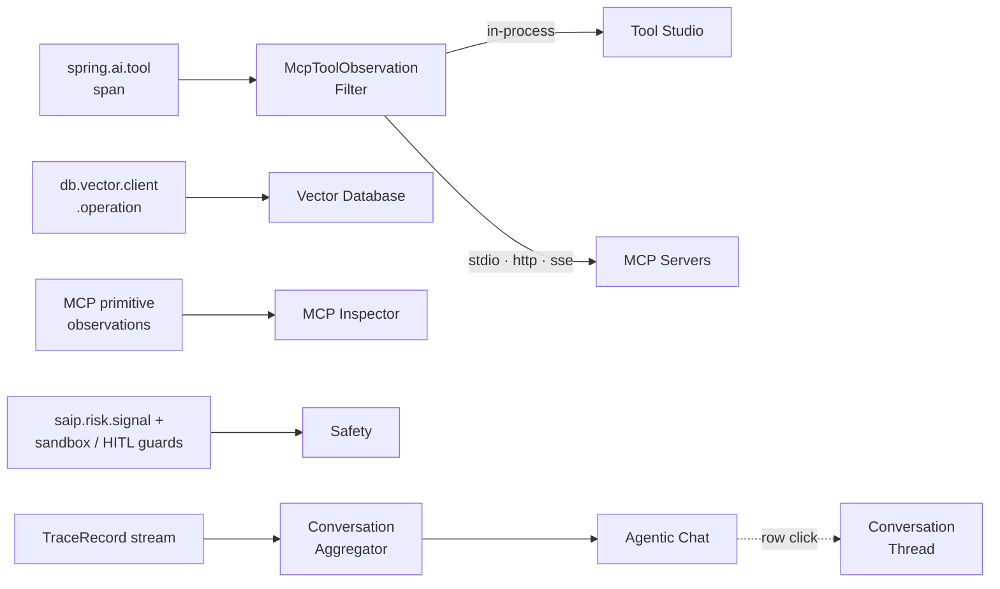

title: AI Stack
description: Six dashboards that split agent tool execution, RAG, and safety by integration kind - Tool Studio · MCP Servers · MCP Inspector · Vector Database · Agentic Chat · Safety.

# AI Stack

The **AI Stack** group surfaces *what the agent actually integrated with* on each turn - split by integration kind so that *"did my sandbox tool work?"* and *"is my MCP server alive?"* never share the same view. Six dashboards.

The discriminator that powers the Tool Studio / MCP Servers split is `McpToolObservationFilter`, an `ObservationFilter` this project registers. It injects `network.transport`, `saip.mcp.server`, and `mcp.method.name` attributes onto every `spring.ai.tool` span by looking up the tool's name in `McpClientService`. See [Observability Architecture → Tool and MCP observability](../../../observability-architecture.md#tool-and-mcp-observability-the-agentic-focus) for the design rationale.

## Pages in this group

-   :material-tools:{ .lg .middle } **[Tool Studio](tool-studio.md)**

    ---

    `spring.ai.tool` spans without `mcp.method.name` (in-process) + `sandbox.guard.blocked` counter. In-process tool latency, error rate, sandbox prevention count.

-   :material-server:{ .lg .middle } **[MCP Servers](mcp-servers.md)**

    ---

    `spring.ai.tool` spans with `mcp.method.name` (external) + OAuth + lifecycle. External MCP latency, transport health, OAuth state.

-   :material-magnify:{ .lg .middle } **[MCP Inspector](mcp-inspector.md)**

    ---

    MCP primitive observations - Tools list, Resources read, Prompts get, Sampling, Elicitation, Roots. MCP server introspection traffic and server-initiated handlers.

-   :material-database-search:{ .lg .middle } **[Vector Database](vector-database.md)**

    ---

    `db.vector.client.operation` spans. RAG query rate, top_k distribution, similarity thresholds, multi-DB mix.

-   :material-chat-processing:{ .lg .middle } **[Agentic Chat](agentic-chat.md)**

    ---

    `TraceRecord` grouped by `conversationId` via `ConversationAggregator`. Per-conversation summaries - message count, cost, multi-turn rate, loop depth.

-   :material-shield-check:{ .lg .middle } **[Safety](safety.md)**

    ---

    `saip.risk.signal` / `saip.tool.risk` counters + sandbox, HITL, and tamper signals. MCP risk model (L0-L5) distribution, poisoning hits, integrity tamper rejects, human-approval rate.

## Cross-references

- [Index](../index.md) - observability landing + the four group pages
- [AI Usage](../ai-usage/index.md) - Tokens & Cost · AI Models
- [Runtime](../runtime/index.md) - Host · Ollama · Web Application · Logs · Traces
- [Tokens & Cost → Model Pricing Manager](../ai-usage/tokens-cost.md#configuring-cost-model-pricing-manager-dialog) - configure per-model rates and display currency
- [Observability Architecture](../../../observability-architecture.md) - pipeline + storage tiers + configuration
- [Safety Architecture](../../../safety-architecture.md) - sandbox layers that Tool Studio's `Sandbox guard blocks` counter ties to
