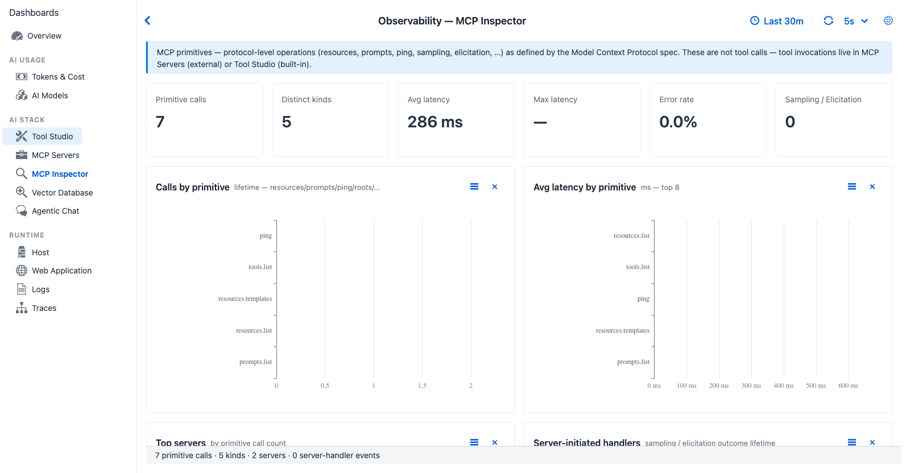

title: MCP Inspector Observability
description: MCP primitive observability - list/read tools, list/read resources, get prompts, sampling, elicitation, roots. Counts and times the protocol operations that sit beneath tool calls.

# MCP Inspector

*MCP Inspector - populates as soon as a `list_tools`, `read_resource`, `get_prompt`, or `sampling` / `elicitation` exchange happens against any registered server.*

**Purpose** - MCP **primitive** observability. MCP defines a small protocol surface beyond tool calls: list/read tools, list/read resources, get prompts, sampling, elicitation, roots. This tab counts and times those operations, **separately** from the tool-call traffic in the [MCP Servers](mcp-servers.md) tab.

## When to look here

- *"Is the agent re-listing tools too often?"* - Calls by primitive (high `list_tools` → wasteful).
- *"Is a server's resource read slow?"* - Avg latency by primitive.
- *"Which server is handling server-initiated sampling / elicitation requests?"* - Server-initiated handlers chart.
- *"Is the inspector itself errored?"* - Error rate KPI.

## Controls

All dashboards share the [Observability global settings](../index.md#global-settings) - time window, refresh interval, custom range. MCP Inspector has no tab-specific controls beyond those.

## KPI cards (six)

| Card | Shows | Source |
|---|---|---|
| Primitive calls | Total non-tool MCP primitive operations | MCP primitive observations |
| Distinct kinds | Number of unique primitive kinds invoked (list_tools, read_resource, ...) | `set(mcp.primitive)` size |
| Avg latency | Mean primitive operation duration | Duration distribution |
| Max latency | Slowest single primitive call | Max of durations |
| Error rate | Percentage of primitive calls with `status=ERROR` | Status field |
| Sampling / Elicitation | Count of server-initiated requests in the window | Two specific MCP primitives |

## Charts (four)

| Chart | Type | Reading |
|---|---|---|
| Calls by primitive | Horizontal bar by primitive kind | Identifies primitives the agent uses most |
| Avg latency by primitive | Horizontal bar (ms) | Slow primitives - e.g. `read_resource` against a large resource |
| Top servers | Horizontal bar by call count | Which MCP server fields the most primitive traffic |
| Server-initiated handlers | Bar (sampling vs elicitation) | If a server requests sampling and the client never responds, it shows here |

## Cross-references

- [MCP Server → MCP Inspector (feature)](../../mcp-server/inspector.md) - the user-facing UI for browsing primitives (this dashboard observes that UI's traffic)
- [Tutorial 9 - MCP Everything walkthrough](../../../tutorials/9-mcp-everything.md) - hands-on tour of all eight MCP primitives
- [MCP Servers](mcp-servers.md) - sibling tab for tool-call traffic
