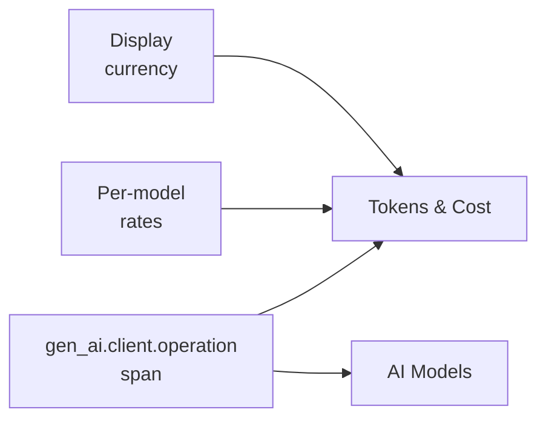

title: AI Usage
description: Two dashboards that answer what the agent spent in token and economic terms - Tokens & Cost rolls up by money, AI Models rolls up by model identity, provider, and streaming latency.

# AI Usage

The **AI Usage** group covers two dashboards that answer the question *what did the agent spend* in token and economic terms - one tab per perspective. Both pages read from the same trace stream documented in [Observability Architecture](../../../observability-architecture.md), and both feed off `gen_ai.*` span attributes that Spring AI emits per OpenTelemetry GenAI semantic conventions.

`Per-model rates` and `Display currency` are both configured exclusively through the **[Model Pricing Manager dialog](tokens-cost.md#configuring-cost-model-pricing-manager-dialog)** opened from the Tokens & Cost dashboard - the dialog is the only supported edit surface.

The two tabs share the same span data - they slice it differently. **Tokens & Cost** rolls up by money and tokens; **AI Models** rolls up by model identity, provider, and latency characteristic (including streaming TTFT). Cost lives only on Tokens & Cost because pricing is a per-model lookup applied at read time, not a property of the trace itself.

## Pages in this group

-   :material-cash-multiple:{ .lg .middle } **[Tokens & Cost](tokens-cost.md)**

    ---

    `gen_ai.usage.*` spans × the configured per-model rates × display currency. $ per model, paid call share, cost projection, per-model token volume.

-   :material-robot-outline:{ .lg .middle } **[AI Models](ai-models.md)**

    ---

    `gen_ai.response.*` + Spring AI streaming observation timers. Provider mix, model mix, TTFT, per-chunk latency, finish reasons, embedding and image duration.

For the underlying pipeline that captures these spans, see [Observability Architecture → The pipeline](../../../observability-architecture.md#the-pipeline). For the Model Pricing Manager dialog and how cost is computed, see the [Tokens & Cost](tokens-cost.md#configuring-cost-model-pricing-manager-dialog) page.

## Cross-references

- [Index](../index.md) - observability landing + the four group pages
- [AI Stack](../ai-stack/index.md) - Tool Studio · MCP Servers · MCP Inspector · Vector Database · Agentic Chat
- [Runtime](../runtime/index.md) - Host · Web Application · Logs · Traces
- [Observability Architecture](../../../observability-architecture.md)
