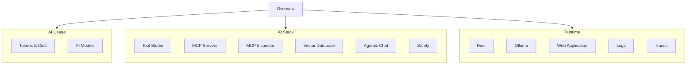
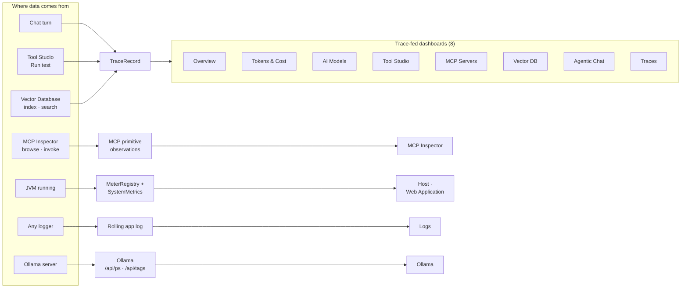

title: Observability
description: Fourteen in-app dashboards surfacing what a Spring AI Playground agent did - token economics, tool and MCP behaviour, RAG quality, host runtime, Ollama monitoring, and a live trace tail.

# Observability

**Where:** top navigation → **Observability**.

The observability layer is the **visibility arm** of Spring AI Playground's safety model - the user-facing surface that answers *what the agent did, in what order, against which integration, at what cost*. Where the [sandbox](../../safety-architecture.md) prevents unsafe actions at the call boundary, this layer captures every action that did happen and presents it through **fourteen dashboards** in the desktop app.

The pages under this section document the user surface. For the trace pipeline, storage tiers, configuration, and external export paths, see [AI Agent Observability Architecture](../../observability-architecture.md).

The **Home** screen carries a compact **System & Observability** panel - built-in MCP server status and bind posture, provider readiness chips, last-30-minute call / token / latency KPIs, and the tool-call risk distribution - with a link that opens all fourteen dashboards. It reads the same collector as the dashboards, so the numbers always agree.

## Who uses these dashboards

The dashboards are designed around three roles, all of which can be the same person on a desktop deployment:

- **Builder** - authoring tools, iterating on a prompt, debugging why an agent picked the wrong tool. Lives in **Traces**, **Agentic Chat**, **Tool Studio**.
- **Operator** - monitoring a deployment over time: cost trends, error rates, MCP server health, system load. Lives in **Overview**, **Tokens & Cost**, **MCP Servers**, **Host**.
- **Investigator** - drilling into a specific incident from a log line back to the originating model decision. Lives in **Logs**, **Traces**, **Trace Detail dialog**.

Every dashboard is read-only and passive - opening it never alters trace data or model behaviour.

## Sidebar map - fourteen dashboards in four groups

The fourteen dashboards are grouped into four sections in the left sidebar. Each group answers a different category of question:

The Overview tab is the landing surface - every group has its own dedicated tabs for depth, but Overview shows one panel from each so an operator can spot anomalies at a glance and drill in from there.

## Global settings

Every dashboard shares one `ObservabilityGlobalSettings` singleton - so picking *Last 1H* on the Tokens & Cost tab and clicking over to AI Models shows the same hour, and changing the refresh interval applies everywhere at once. Three surfaces touch this state:

- **Header time-window picker** - top-right of every dashboard, six chips: `Last 5m · 10m · 20m · 30m · 1h · 3h` (default **30m**). Clicking a chip switches the sliding window and retickes charts.
- **Header refresh chip** - beside the time-window picker. Quick-pick `Off · 1s · 2s · 5s · 10s · 30s · 60s` (default **5s**). When **Off**, charts only update on manual refresh.
- **Cog drawer (Observability settings)** - opened by the gear icon. Three sections:

| Section | What it does |
|---|---|
| **Refresh interval** | Wider preset chips (`3s · 5s · 10s · 30s`) plus a numeric `Custom` field. Identical state to the header chip; opening either edits the same value. |
| **Time range** | Toggle between **Sliding window** (the same 6 presets as the header) and **Fixed range** (`From` + `To` `DateTimePicker`s). Fixed range caps at 180 minutes; values outside that window are clipped server-side. When a fixed range is active, the header chips become read-only and auto-refresh pauses (the data window is static). |
| **Per-tab settings** | Optional - the current dashboard injects its own panel here. Example: Logs adds a "Reset to live tail" button. |

An **Apply** button at the bottom commits staged changes; closing the drawer without Apply discards them.

Code:

- `ObservabilityGlobalSettings` - `src/main/java/.../webui/observability/components/ObservabilityGlobalSettings.java` (window enum + refresh choices + listener fan-out)
- `ObservabilitySettingsPanel` - `.../webui/observability/components/ObservabilitySettingsPanel.java` (the drawer body)
- `TimeWindowPicker` / `RefreshIntervalPicker` - header chips
- `ObservabilityView.installSettingsDrawer(...)` - drawer mount

**Host** and **Web Application** ignore the time window: Host shows always-live metrics with rolling history retained by the dedicated `SystemMetricsRingBuffer`, and Web Application reads `MeterRegistry` gauges live and counters lifetime. Both still honor the refresh interval.

## What feeds each dashboard

Dashboards are scoped by *the kind of action that produced the data*, not by *whether a chat happened*. Each surface in the app - Agentic Chat, Tool Studio, MCP Server (Inspector), Vector Database, and the running JVM itself - emits its own observation stream, and the dashboards crop those streams differently:

The five streams are independent and the dashboards mix them differently:

- **`TraceRecord` stream** - every chat turn becomes one `TraceRecord`, but so does every Tool Studio test run and every Vector Database operation that fires through Spring AI. That single record carries `gen_ai.*` / `spring.ai.tool` / `db.vector.client.operation` child spans and surfaces across **Overview, Tokens & Cost, AI Models, Tool Studio, MCP Servers, Vector Database, Agentic Chat, and Traces**. A Tool Studio test that never touches chat still populates the Tool Studio dashboard plus Overview / Traces.
- **MCP primitive observations** - when you browse or invoke through the MCP Inspector (list tools, read resources, get prompts, sampling, elicitation), separate observations fire and feed only the **MCP Inspector** dashboard. Independent of trace.
- **`MeterRegistry` + system metrics** - JVM heap, GC, threads, CPU, HTTP, Tomcat sessions, logback level counts are always live (no user action needed) and feed **Host** and **Web Application**.
- **Ollama HTTP API** - when Ollama is the active chat provider, the **Ollama** dashboard polls the local server's `/api/ps` and `/api/tags` directly (running models, VRAM, installed inventory) - independent of traces and `MeterRegistry`.
- **Application log stream** - anything any code logs is tailed live and feeds **Logs**.

So clicking through MCP Inspector primitives, running a Tool Studio test, or uploading a document in Vector Database all generate data on their own dashboards even without sending a single chat message. Conversely, only the chat surface generates the conversation-level aggregates on Agentic Chat.

## Reference pages

-   :material-view-dashboard-outline:{ .lg .middle } **[Overview](overview.md)**

    ---

    Single-page summary of every other dashboard's headline number - eight KPI cards, fifteen charts across six sections, recent activity grid.

-   :material-cash-multiple:{ .lg .middle } **[AI Usage](ai-usage/index.md)**

    ---

    Tokens & Cost · AI Models - what the agent spent in tokens and money, and which models and providers it routed through.

-   :material-layers-outline:{ .lg .middle } **[AI Stack](ai-stack/index.md)**

    ---

    Tool Studio · MCP Servers · MCP Inspector · Vector Database · Agentic Chat · Safety - what the agent integrated with, split by integration kind.

-   :material-cog-outline:{ .lg .middle } **[Runtime](runtime/index.md)**

    ---

    Host · Ollama · Web Application · Logs · Traces - is the JVM process itself healthy, Ollama's runtime status, and the raw trace stream behind every aggregate.

## Cross-references

- [AI Agent Observability Architecture](../../observability-architecture.md) - pipeline, storage tiers, configuration, external export
- [AI Agent Tool Safety Architecture](../../safety-architecture.md) - the sandbox the observability layer makes auditable
- [Agentic Chat (feature)](../agentic-chat/index.md) - the feature that produces the traces these dashboards consume
- [Tool Studio (feature)](../tool-studio/index.md) - where in-process tools (visible in the Tool Studio dashboard) are authored
- [MCP Server (feature)](../mcp-server/index.md) - built-in and external MCP servers (visible in MCP Servers and MCP Inspector dashboards)
