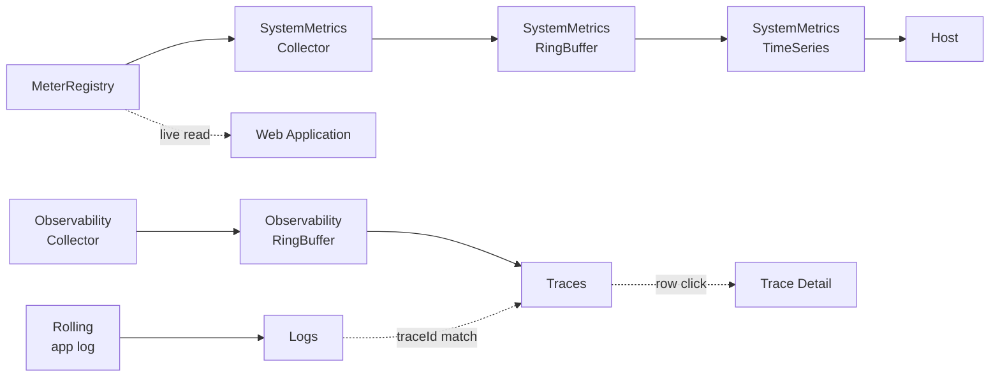

title: Runtime
description: Four dashboards covering JVM/OS health, HTTP and Tomcat instrumentation, live log tail with MDC-extracted trace correlation, and the raw trace stream.

# Runtime

The **Runtime** group is the operational view — JVM and OS health, HTTP and session instrumentation, log search, and the raw trace stream. Where AI Usage and AI Stack answer *"what did the agent do,"* Runtime answers *"is the process itself healthy"* and *"give me the unfiltered evidence."*

The four tabs are independent — Logs and Traces share an MDC `traceId` so an operator can drill from a log line to the trace it came from (and vice versa), but otherwise each tab pulls from its own source. The Host and Web Application tabs both read `MeterRegistry`, but Host historizes it through the dedicated `SystemMetricsCollector` parallel pipeline while Web Application reads live values directly.

## Pages in this group

-   :material-server-network:{ .lg .middle } **[Host](host.md)**

    ---

    `SystemMetricsSnapshot` + `SystemMetricsTimeSeries` (parallel pipeline). JVM heap / GC / threads / classes, OS CPU / load / uptime, disk, file descriptors.

-   :material-web:{ .lg .middle } **[Web Application](web-application.md)**

    ---

    `MeterRegistry` HTTP + Tomcat + Logback + Spring AI active gauges. HTTP traffic, Tomcat session state, logback level counts, in-flight LLM operations.

-   :material-text-box-search-outline:{ .lg .middle } **[Logs](logs.md)**

    ---

    Live tail of the application log with structured MDC extraction. Regex / level / follow-tail filters; click row → jump to trace.

-   :material-source-branch:{ .lg .middle } **[Traces](traces.md)**

    ---

    `ObservabilityRingBuffer.liveStream()` + `snapshot()`. Raw trace rows; click row → Trace Detail dialog with span timeline.

## Cross-references

- [Index](../index.md) — observability landing + the four group pages
- [AI Usage](../ai-usage/index.md) — Tokens & Cost · AI Models
- [AI Stack](../ai-stack/index.md) — Tool Studio · MCP Servers · MCP Inspector · Vector Database · Agentic Chat
- [Tokens & Cost → Model Pricing Manager](../ai-usage/tokens-cost.md#configuring-cost-model-pricing-manager-dialog) — configure per-model rates and display currency
- [Observability Architecture](../../../observability-architecture.md) — pipeline, storage tiers, external export, configuration
