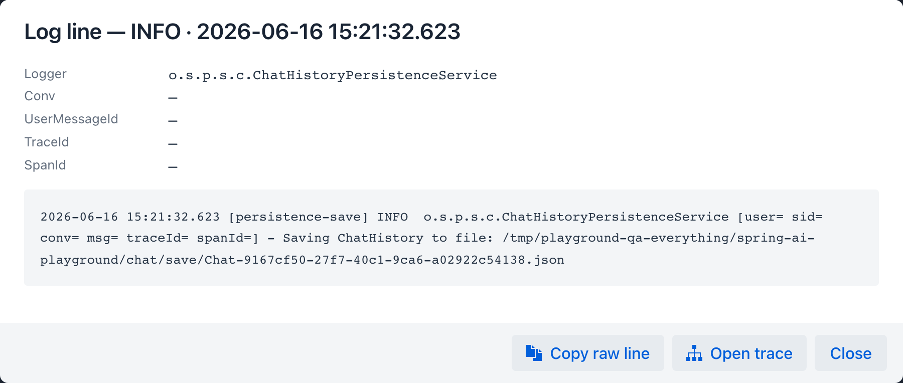

title: Logs
description: Live log search with structured MDC extraction - conv, msg, traceId, and spanId are injected into every line, anchoring each log to the trace it came from.

# Logs


*Logs tab - each line carries the four MDC keys injected by the Logback pattern (`conv`, `msg`, `traceId`, `spanId`), forming the bridge between log search and trace drill-down.*

**Purpose** - live log search with structured MDC extraction. The Logback pattern injects `conv`, `msg`, `traceId`, `spanId` MDC keys into every line emitted during a chat turn, so a log line is always anchored to the trace it came from.

## When to look here

- *"Something errored - give me the actual stack trace"* - Level filter `ERROR` + text search.
- *"Which lines belong to trace `0e9b1a980c1d`?"* - Text search the trace ID.
- *"Show only Spring AI subsystem output"* - Text search `spring.ai.` or filter by logger pattern.
- *"I want to see the full pattern of one conversation"* - Search the conversation ID.

## Data source

Live tail of the application's rolling log (the same stream the file appender writes). Up to 4 MB of recent lines is loaded; older lines are off-screen.

## Controls

- **Level** dropdown - `ALL`, `ERROR`, `WARN`, `INFO`, `DEBUG`, `TRACE`
- **Contains / Regex** text field - substring or regex match
- **Aa-insensitive** checkbox - case insensitivity toggle
- **Regex** checkbox - interpret the filter as regex
- **Follow tail** checkbox - auto-scroll to newest line on each refresh (disabled when custom time range set)
- **Export visible** button - download the filtered visible lines as `.log`
- Time-window preset (see [Observability global settings](../index.md#global-settings)) plus a custom From / To range in the settings drawer (custom range disables auto-refresh + follow-tail)

## Log line structure

The Logback pattern emits each line with this shape:

```
2026-05-22 00:21:01.618 [reactor-http-...] INFO  o.s.p.s.chat.ChatService [conv=Chat-6af5b06e msg=4f37... traceId=0e9b1a980c1d spanId=d23f...] - generated user message id 4f37...
```

The Logs tab parses each line into: `time · thread · level · logger · conv · msg · traceId · spanId · message`. Row colour:

- **ERROR rows** - red tint
- **WARN rows** - orange tint
- All others - dark-theme console row (background `#1e1f24`)

## Drilldown - Log line dialog

Click any row to open the **Log line** dialog. The header shows the line's level and timestamp; the body lists the MDC fields parsed from the line - **Logger**, **Conv**, **UserMessageId**, **TraceId**, **SpanId** (each rendered as `-` when the line did not carry that key) - followed by the full raw line in a scrollable block.

{ width="900" }

The footer carries three actions:

- **Copy raw line** - copies the unparsed line to the clipboard.
- **Open trace** - navigates to the [Traces tab](traces.md) filtered by this line's `traceId`, the bridge from a single log line to the full span tree of the request that produced it. If the line has no `traceId`, it reports that instead.
- **Close** - dismisses the dialog.

## Cross-references

- [Traces](traces.md) - drill from log row → trace by `traceId`
- [Observability Architecture → Log correlation](../../../observability-architecture.md#log-correlation) - Logback pattern reference
