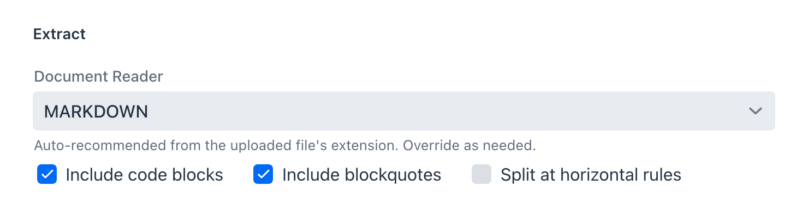
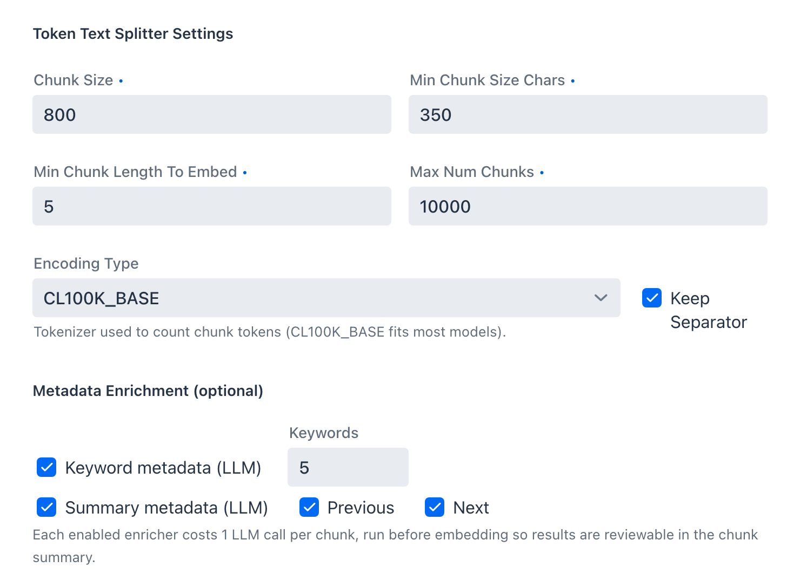
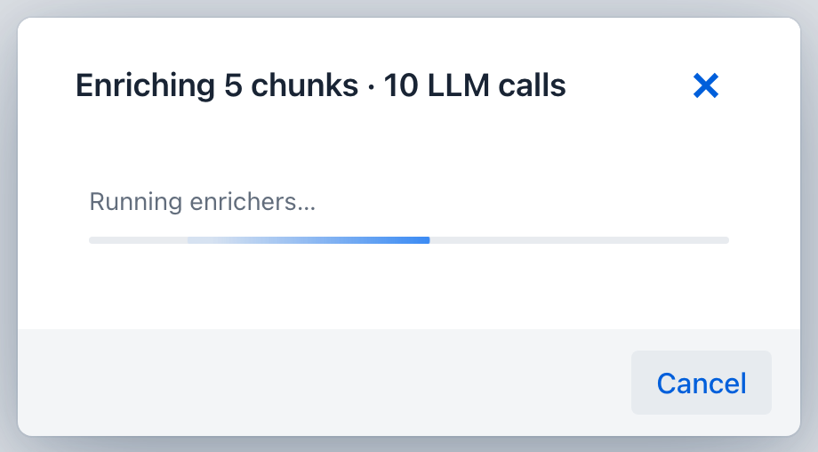
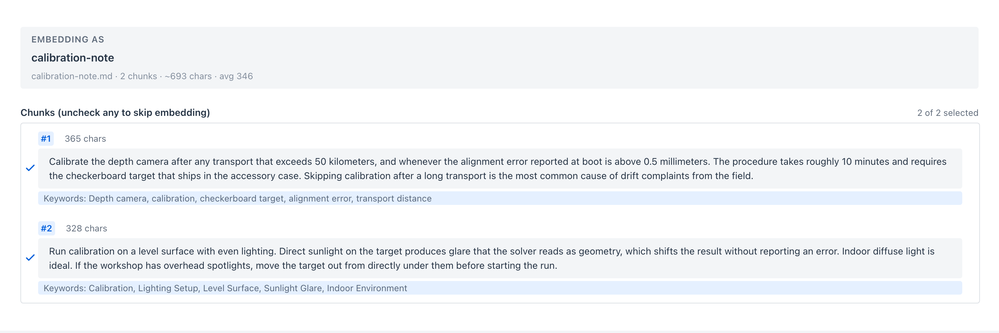

description: The offline half of RAG - Spring AI's ETL pipeline in the Playground, with every document reader, splitter setting, and metadata enricher mapped to its framework class.

# Offline: Indexing

**Where:** Vector Database → the **New Document & ETL Pipeline** button in the header.

Nothing can be retrieved that was not indexed well. This is the offline half of RAG: source file in, embedded chunks out. Spring AI models it as a three-stage [ETL pipeline](https://docs.spring.io/spring-ai/reference/api/etl-pipeline.html), and the dialog is laid out in those same three stages.

| Stage | Spring AI interface | What it produces | In the dialog |
| --- | --- | --- | --- |
| Extract | `DocumentReader` | raw `Document` objects | **Extract** section |
| Transform | `DocumentTransformer` | split and enriched chunks | **Token Text Splitter Settings** + **Metadata Enrichment** |
| Load | `DocumentWriter` | vectors in the store | **Embed and insert** |

## Extract

Upload a single PDF, DOC/DOCX, PPT/PPTX, MD, HTML, JSON, or TXT file up to 20 MB. The reader is chosen for you from the file extension and can be overridden, because the best reader is not always the obvious one: a `.pdf` of scanned slides may extract better through Tika than through either PDF reader.

Each option is a Spring AI reader:

| Reader | Spring AI class | Auto-picked for | Options exposed |
| --- | --- | --- | --- |
| `TIKA` | `TikaDocumentReader` | anything unmatched (DOC, DOCX, PPT, PPTX, ...) | none |
| `TEXT` | `TextReader` | `.txt`, `.text` | character set |
| `JSON` | `JsonReader` | `.json` | keys to extract, blank for whole objects |
| `MARKDOWN` | `MarkdownDocumentReader` | `.md`, `.markdown` | include code blocks, include blockquotes, split at horizontal rules |
| `HTML` | `JsoupDocumentReader` | `.html`, `.htm` | CSS selector, default `body` |
| `PDF_PAGE` | `PagePdfDocumentReader` | `.pdf` | pages per document |
| `PDF_PARAGRAPH` | `ParagraphPdfDocumentReader` | (manual) | none |

The two PDF readers differ in where they cut. `PDF_PAGE` produces one document per page or per N pages, which suits reports with page-aligned content. `PDF_PARAGRAPH` follows the PDF's own paragraph structure, which suits prose that runs across page breaks. Structure-aware readers such as `MARKDOWN` split on the document's own headings, so chunks arrive already aligned to sections before the splitter ever runs.

**Name** and **Description** identify the document later. The description is worth filling in: it is the hint shown when picking documents for a RAG pipeline.

## Transform

Transform runs the `TokenTextSplitter` and, optionally, the metadata enrichers.

### Splitter

`TokenTextSplitter` counts tokens rather than characters, so chunk sizes mean the same thing to the splitter and to the model.

| Control | Default | Effect |
| --- | --- | --- |
| Chunk Size | 800 | target tokens per chunk |
| Min Chunk Size Chars | 350 | a chunk shorter than this is merged forward rather than emitted |
| Min Chunk Length To Embed | 5 | chunks below this are dropped instead of embedded |
| Max Num Chunks | 10000 | ceiling for one document |
| Encoding Type | `CL100K_BASE` | tokenizer used for counting |
| Keep Separator | on | keeps the separator text inside the chunk |

Chunk Size and Min Chunk Size Chars are the two that move retrieval quality most. Chunks that are too small lose the context that makes them answerable; chunks that are too large dilute the embedding so nothing scores well.

### Metadata enrichment

Two optional enrichers attach LLM-generated metadata before embedding:

- **Keyword metadata** uses `KeywordMetadataEnricher`, writing `excerpt_keywords`.
- **Summary metadata** uses `SummaryMetadataEnricher`, writing `section_summary`, optionally folding in the neighbouring chunks with the **Previous** and **Next** options.

Each enricher costs one model call per chunk, so both of them on a 5-chunk document is 10 calls. This is the only part of indexing that spends model time, which is why the dialog states the cost before it starts and the progress dialog repeats it.

Enrichment is cancellable. Cancelling keeps the chunks already enriched and continues with the rest unenriched, so a slow local model never traps you in the dialog.

### Where enriched metadata actually goes

Enriched metadata is stored on the chunk, but it reaches neither the vector nor the prompt. It is easy to assume more happens than actually does.

Spring AI picks the embedding input through `EmbeddingModel.getEmbeddingContent`, which defaults to `Document.getText()`. `OpenAiEmbeddingModel` is the only implementation in Spring AI 2.0 that overrides it, returning `getFormattedContent(MetadataMode.EMBED)` and folding every metadata key on the chunk into the embedded text. The Playground therefore pins `spring.ai.openai.embedding.metadata-mode` to `none`, so both providers vectorize the same thing: the chunk text. Without that pin the same document would produce different vectors on Ollama and on OpenAI, and internal keys such as `docInfoId` would land inside every OpenAI vector.

On the retrieval side, what reaches the prompt is decided by the augmenter's **Context format** option in the [Generation stage](pipeline-studio.md#generation), which offers document text with or without the source label. Neither setting renders enriched metadata.

So the enrichers do not move retrieval scores. What they give you is metadata you can read during chunk review and filter on later.

## Review, then load

Chunking is a separate step from embedding. **Chunk Document** runs extract and transform and shows you the result; nothing is written to the vector store until you confirm. That gap is the point: adjust the splitter and re-run without re-uploading.

Review is also a filter: each chunk has a checkbox, and unchecking one drops it from the load stage. Boilerplate, a table of contents, or a legal footer can be left out instead of polluting the store with chunks that will only ever be false matches.

**Embed and insert** performs the load stage, writing every selected chunk through the configured `VectorStore`. The document then appears under **Sources → Documents**, and if this is the first document in an empty store the app also creates a default retrieval pipeline for it, so chat has something to select immediately.

## Not exposed, and why

Spring AI's ETL API has two members the Playground deliberately leaves out.

`ContentFormatTransformer` attaches a `ContentFormatter` to each document, which controls two exclusion lists: metadata keys kept out of the embedded text, and metadata keys kept out of the prompt text. Neither half has a subject here. Embedding input is pinned to document text on every provider, so no metadata reaches the vector and there is nothing to exclude from it. The prompt half belongs to the [Generation stage](pipeline-studio.md#generation), which already controls it per pipeline at runtime.

`FileDocumentWriter` writes documents back to disk rather than to a vector store, which is an export concern rather than an indexing one.

## Next

- [Pipeline Studio](pipeline-studio.md) - build the retrieval pipeline that will read these chunks
- [Tutorial 3 - Index a Document](../../tutorials/3-index-document.md) - the same flow, step by step
