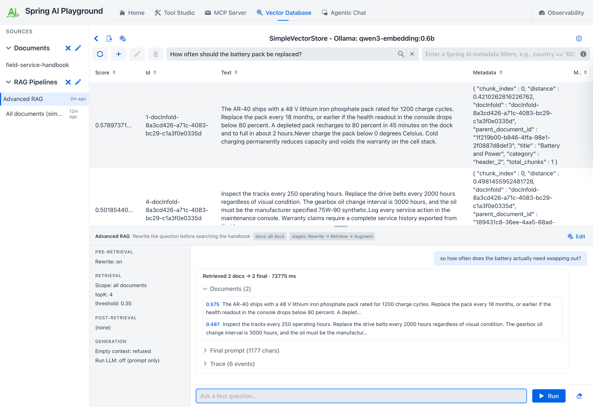
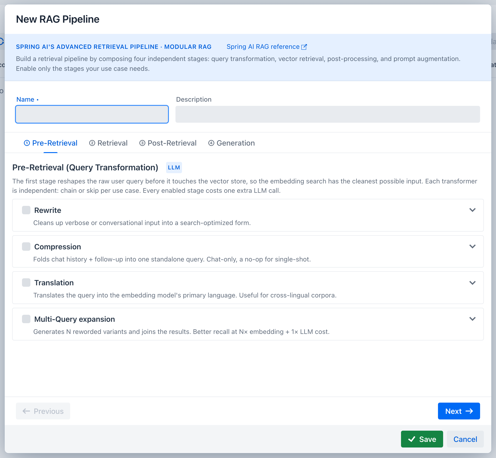
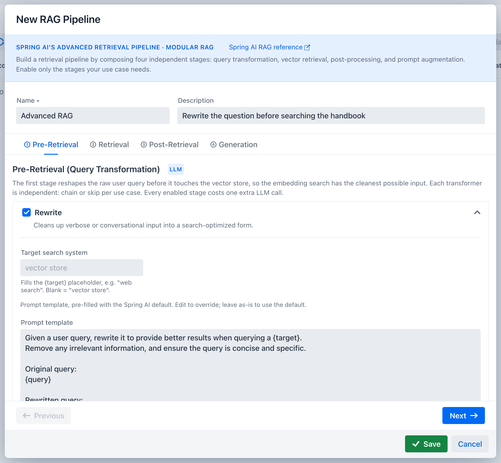
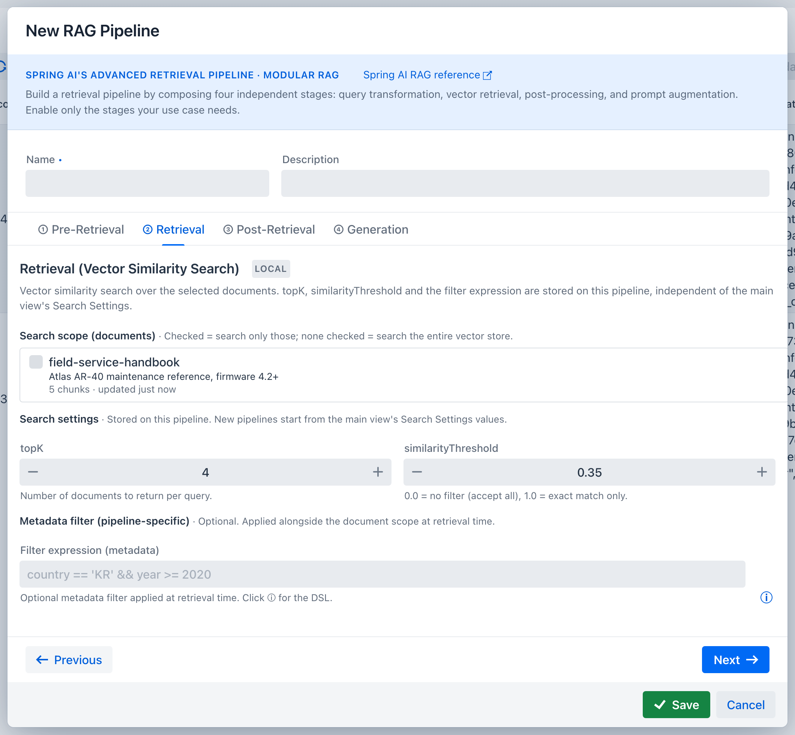
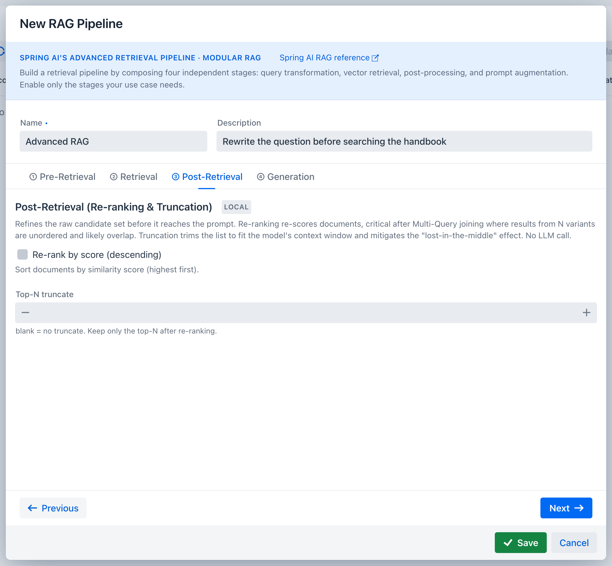
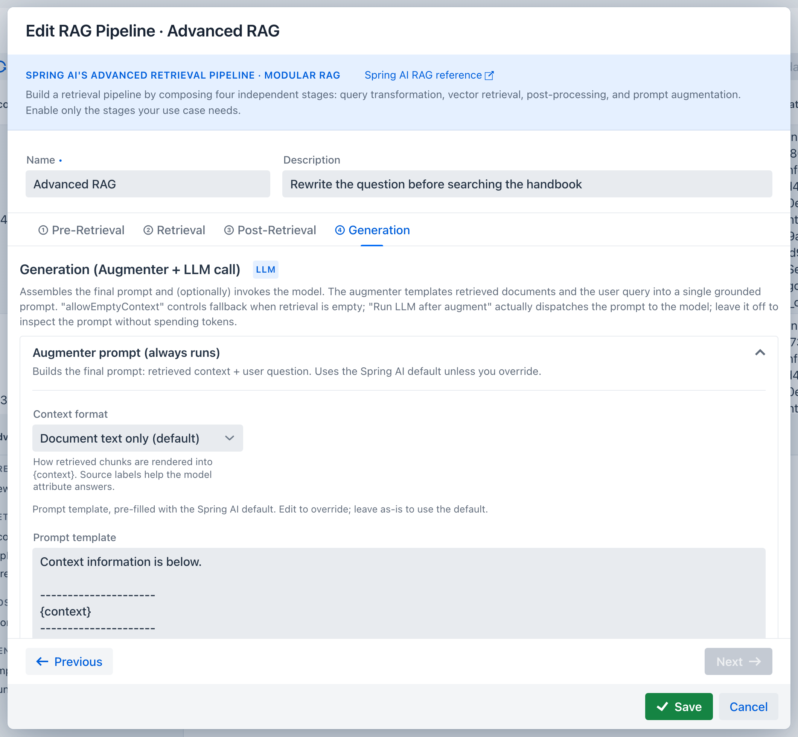
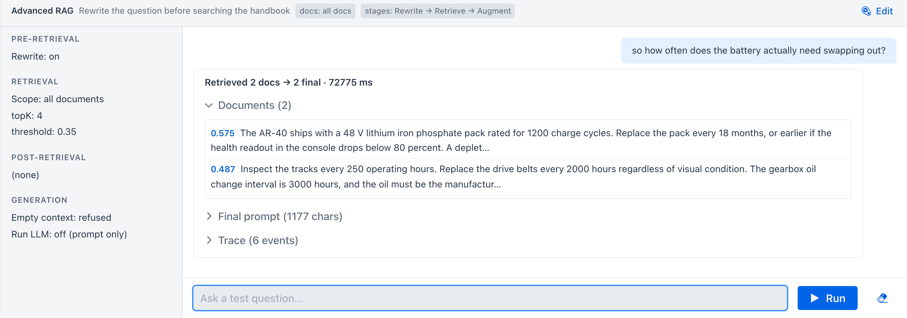

description: Author and test a Spring AI Modular RAG pipeline in the Playground - the four-stage wizard, the full mapping from each control to its Spring AI class, and the shared executor that makes the test match chat.

# Pipeline Studio

**Where:** Vector Database → **Sources → RAG Pipelines** in the sidebar, and the **New RAG Pipeline** button in the header.

A *pipeline* is a saved [Modular RAG](https://docs.spring.io/spring-ai/reference/api/retrieval-augmented-generation.html) configuration: which query transformations run, how retrieval is scoped and tuned, what happens to the candidate documents, and how the final prompt is assembled. Selecting one in Agentic Chat is what turns retrieval on for a conversation.

Pipeline Studio is where you build one and try it before chat depends on it. Selecting a pipeline in the sidebar splits the Vector Database screen: similarity search stays on top, the pipeline surface opens underneath.

## Everything maps to a Spring AI class

The wizard has four tabs because Spring AI's RAG architecture has four stages. Every control turns on a specific framework component. The Playground implements exactly one of these itself, and only because Spring AI ships the interface without a built-in implementation.

| Wizard control | Spring AI SPI | Implementation |
| --- | --- | --- |
| **Rewrite** (+ target search system) | `QueryTransformer` | `RewriteQueryTransformer` |
| **Compression** | `QueryTransformer` | `CompressionQueryTransformer` |
| **Translation** (+ target language) | `QueryTransformer` | `TranslationQueryTransformer` |
| **Multi-Query expansion** (+ count, include original) | `QueryExpander` | `MultiQueryExpander` |
| **Search scope, Top-K, similarity threshold, filter expression** | `DocumentRetriever` | `VectorStoreDocumentRetriever` |
| joining results from expanded queries (automatic) | `DocumentJoiner` | `ConcatenationDocumentJoiner` |
| **Re-rank by score, Top-N truncate** | `DocumentPostProcessor` | `ScoreOrderingDocumentPostProcessor` (this app) |
| **Augmenter prompt, empty-context handling, context format** | `QueryAugmenter` | `ContextualQueryAugmenter` |

That is all six Spring AI RAG SPIs. A test in the suite enumerates the builder options of each component by reflection and fails if the framework gains an option this app does not surface, so the mapping cannot silently drift as Spring AI evolves.

Retrieval and augmentation always run; the rest are opt-in. A pipeline with no query transformation is **Naive RAG**: search, then answer. Turn one on and it becomes **Advanced RAG**, in the same sense the Spring AI reference uses those terms.

## Cost is on the label

Each stage header carries a badge. **LLM** means the stage calls the configured chat model; **LOCAL** means it runs in process with no model call.

Pre-retrieval and generation carry the LLM badge; retrieval and post-retrieval are local. Generation only spends a call when *Run LLM after augment* is on, which chat never uses because the chat model answers instead. So a pipeline's extra cost is simply the number of enabled pre-retrieval stages, which is what the pipeline picker in chat reports as `+N LLM calls`. Multi-Query is the one that also multiplies the retrieval side: N variants mean N embedding calls and N searches before the joiner merges them.

This matters far more with local models than with hosted ones. On `qwen3.5:4b-mlx`, a single rewrite stage took 66 seconds out of a 67-second retrieval turn: the vector search itself was half a second, and the model call was everything else. Four pre-retrieval stages can therefore add minutes before the first token appears, which is why the app derives its stream watchdog from the per-call timeout multiplied by the number of LLM pre-retrieval stages plus one (for the answer itself), with a five-minute floor and a one-hour cap, rather than using a fixed budget.

## Pre-Retrieval

Each transformer is independent and can be chained or skipped:

- **Rewrite** turns verbose or conversational phrasing into a search-shaped query. The optional *target search system* fills the `{target}` placeholder, so you can tell the rewriter it is aiming at something other than a vector store. Blank means `vector store`.
- **Compression** folds the conversation history and a follow-up into one standalone query. It is a chat-only stage and does nothing for a single-shot question, because it needs prior turns to compress.
- **Translation** translates the query into the language your corpus is embedded in, for cross-lingual collections.
- **Multi-Query expansion** generates N reworded variants and searches with all of them, trading cost for recall.

Enabling a card expands it. Every one carries the Spring AI default prompt template, pre-filled and editable: leave it as is to use the framework default, or edit it to override just this pipeline.

## Retrieval

**Search scope** picks which indexed documents this pipeline may read. Leave it empty to search every knowledge-base document - [chat attachments](chat-attachments.md) share the store but stay conversation-scoped, so an empty scope never reads them.

**Top-K** and **similarity threshold** are stored on the pipeline, not shared with the Vector Database search bar above. A new pipeline pre-fills them from the global search settings and then owns its copy, so tuning a pipeline never changes what the manual search returns.

The threshold deserves attention before anything else, because scores are only meaningful relative to the embedding model in use. Measured on a small English corpus, the same question set produces very different absolute values:

| Embedding model | Correct chunk | Question the corpus cannot answer |
| --- | --- | --- |
| `qwen3-embedding:0.6b` (default) | 0.48 - 0.65 | 0.16 - 0.25 |
| `bge-m3` | 0.64 - 0.70 | 0.26 - 0.39 |
| `mxbai-embed-large` | 0.42 - 0.74 | 0.28 - 0.46 |

The default threshold is `0.35`, which sits below every correct-chunk score and above the noise for the shipped model. Two things are worth taking from the table rather than the number:

- **A cutoff tuned for one model can silently empty another.** A value of 0.6 looks reasonable and rejects every correct chunk on the default model.
- **Cross-lingual queries score lower.** Asking in Korean against an English corpus cost the default model about 0.1, and pushed `mxbai-embed-large` below its own noise floor, where no threshold can separate signal from noise.

The ranking is what actually finds the answer; in every measurement the correct chunk came back first. The threshold exists so that an unanswerable question yields an empty context instead of confident nonsense. Verify with a plain search in the bar above, then set the pipeline's threshold below the scores you actually see.

The starting values come from `spring.ai.playground.vectorstore.similarity-threshold` and `.top-k`, so a deployment aimed at a different embedding model can ship its own defaults; see [Configuration](../../getting-started/configuration.md#rag).

The **filter expression** is an additional Spring AI metadata filter, written in the same DSL as the search bar. It is combined with the document scope rather than replacing it. An expression that fails to parse is reported as a warning in the trace and ignored rather than failing the turn.

## Post-Retrieval

**Re-rank by score** sorts the candidates by similarity, highest first. This matters most after Multi-Query: results arriving from N separate searches are in no meaningful order and usually overlap.

**Top-N truncate** trims the list before it reaches the prompt, both to fit the context window and to limit the lost-in-the-middle effect, where content buried in a long context gets ignored.

Neither calls a model.

## Generation

The augmenter assembles retrieved documents and the question into the final prompt. It always runs; there is no switch to turn it off, only its template to override. Expanding the **Augmenter prompt** card reveals that template and the context format.

- **Context format** chooses between document text only and text prefixed with its source label, so the model can attribute a passage to the document it came from.
- **Allow empty context** decides what happens when retrieval returns nothing: off refuses with a static message, on falls back to the empty-context prompt.
- **Run LLM after augment** dispatches the assembled prompt to the model. Leave it off to inspect the prompt without spending tokens. Chat always skips this step, because the chat model streams the answer itself.

## Testing against the real executor

The right half of the pipeline surface is a chat-style test conversation, and it calls the same `RagPipelineExecutor` that Agentic Chat calls. There is no separate test path that could pass while chat fails.

Each run exposes three collapsible sections:

- **Documents** - what retrieval actually returned, after post-processing
- **Final prompt** - the exact text the augmenter produced
- **Trace** - stage-by-stage events, including the transformed query each stage handed to the next

The conversation keeps its history, so Compression has something to compress. Re-selecting the same pipeline preserves the conversation; **Clear** resets it.

## The default pipeline

Embedding a document while no RAG pipeline exists yet also creates a pipeline named **All documents (simple)**, so chat has a usable RAG source without a trip through the wizard. It runs no query transformation, has no document scope so it searches the whole store, and enables score re-ranking. That makes it `stages: 3` (retrieve, re-rank, augment) with no extra model calls. It snapshots the global Top-K and similarity threshold at the moment it is created and then owns those values like any other pipeline, so later changes to the search bar's settings leave it alone.

## Next

- [Runtime: RAG in Chat](runtime.md) - selecting a pipeline in a conversation and reading its trace
- [Offline: Indexing](offline-etl.md) - preparing the chunks this pipeline retrieves
