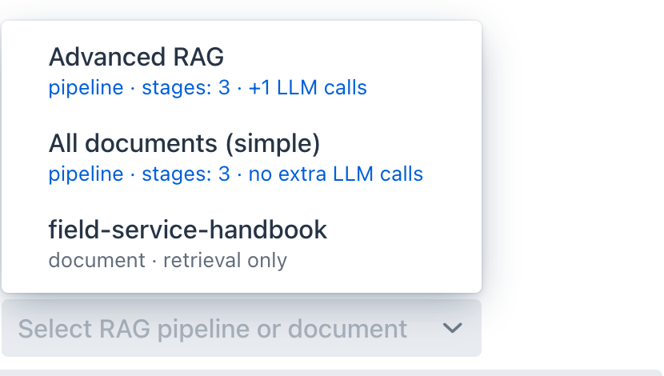

description: The runtime half of RAG - picking a pipeline or a document as the RAG source in Agentic Chat, reading the per-turn retrieval trace, and how the advisor drives the shared executor.

# Runtime: RAG in Chat

**Where:** Agentic Chat → the RAG source selector on the row above the prompt box.

Indexing prepares chunks and a pipeline decides how to retrieve them. This page is the third step: consuming that from a conversation.

## One selector, two kinds of source

Chat takes a single RAG source per conversation. The selector lists both saved pipelines and indexed documents, and the hint on each row tells you which kind you are choosing and what it will cost.

- A **pipeline** row shows `pipeline · stages: N · +M LLM calls`, so the cost of the configuration is visible before you send anything. `stages` counts everything the pipeline will run, including the retrieval and augmentation steps that are always present, while the second half counts only the query-transformation stages that each add a model call. A pipeline with none of those reads `no extra LLM calls`.
- A **document** row shows `document · retrieval only`, meaning no query transformation runs and the question reaches the vector store exactly as you typed it.

Choosing a document is not a separate code path. The advisor synthesizes a pipeline scoped to that document and runs the same executor, so the two kinds of source differ in configuration rather than in machinery. That synthesized pipeline still performs the local stages, so its trace reads `Retrieve → Re-rank → Augment`, and it inherits the global Top-K and similarity threshold rather than carrying its own.

Leaving the selector empty skips retrieval entirely. The selection is remembered per conversation, so reopening a chat restores its RAG source along with its tools and model.

## Reading the trace

When a turn retrieves, a **RAG** panel appears above the answer with the stages that ran.

The panel is where a staged pipeline stops being abstract: you see the rewritten query, the expanded variants, and the documents that survived post-processing, in the order they happened. When an answer is not grounded, this tells you whether retrieval failed or generation ignored what it was given.

If the panel reports zero documents and the model replies that the question is outside its knowledge base, the pipeline's similarity threshold is the first thing to check. Scores depend on the embedding model, so a threshold carried over from a different model can sit above everything your corpus actually scores; see [Pipeline Studio → Retrieval](pipeline-studio.md#retrieval) for the measured ranges.

## How it runs

`SpringAiPlaygroundRagAdvisor` sits in the [chat advisor chain](../../architecture.md#flow-4-chat-advisor-chain-memory-rag) and short-circuits when no RAG source is selected. When one is selected it resolves the source, then calls the same `RagPipelineExecutor` used by [Pipeline Studio](pipeline-studio.md).

Two details are worth knowing:

- **Generation stays with the chat model.** The executor runs every stage up to and including the augmenter, then hands the assembled prompt back rather than calling a model itself, so the answer streams from the chat model you selected. A pipeline's *Run LLM after augment* option is therefore ignored in chat; it exists for testing in the Studio.
- **Compression gets real history.** Prior user and assistant turns are passed into the query so `CompressionQueryTransformer` can fold a follow-up into a standalone question. This is what makes a staged pipeline behave differently in a conversation than in a one-shot test.

Retrieved documents are carried on the request so the panel and the answer render from the same set.

## Timeouts with local models

Each stage is a separate model call, so a four-stage pipeline on a local model can take minutes before the first token appears. Two limits apply:

- `spring.http.clients.read-timeout` (default `10m`) bounds each individual HTTP call to the model, including embedding calls and every pre-retrieval stage. See [Configuration](../../getting-started/configuration.md).
- The first-signal watchdog is derived from that value multiplied by the pipeline's stage count, so enabling more stages widens the budget automatically instead of tripping a fixed limit.

If a turn dies waiting, the stage count in the pipeline hint is the first thing to check against your model's speed.

## Next

- [Tutorial 5 - Chat with RAG](../../tutorials/5-chat-rag.md) - a document first, then the same question through a staged pipeline
- [Agentic Chat](../agentic-chat/index.md) - the rest of the chat surface
