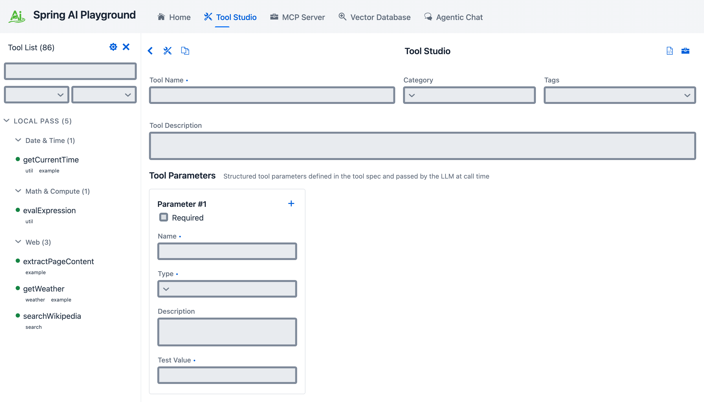
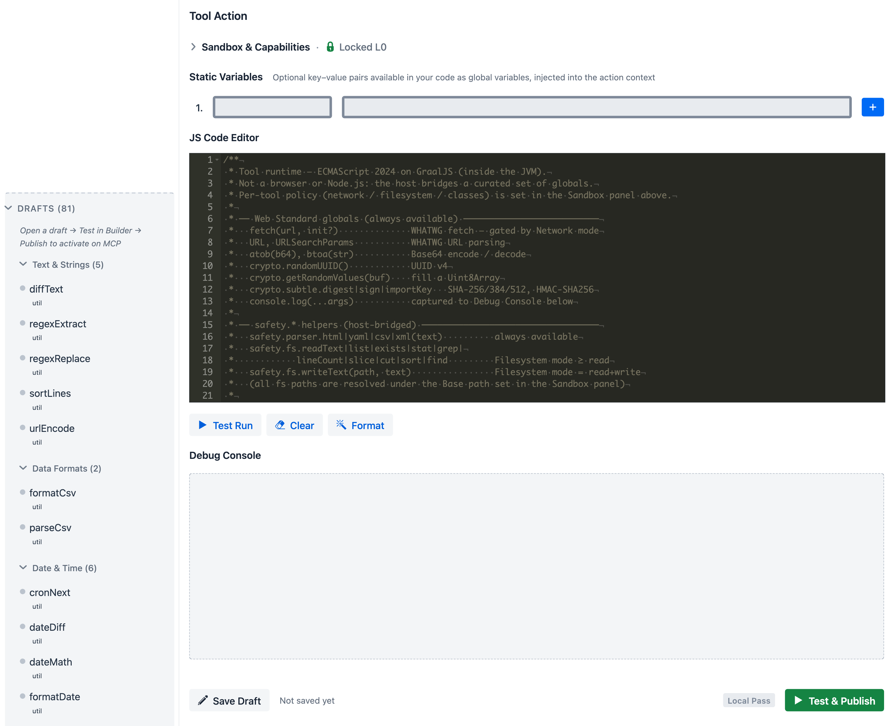
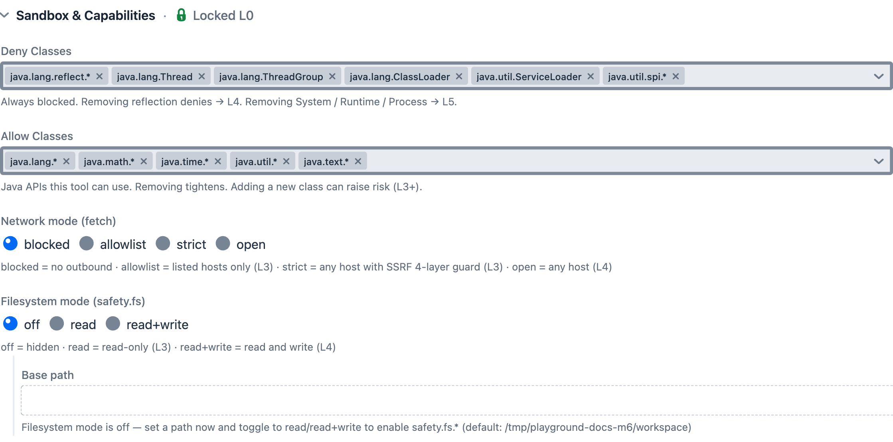
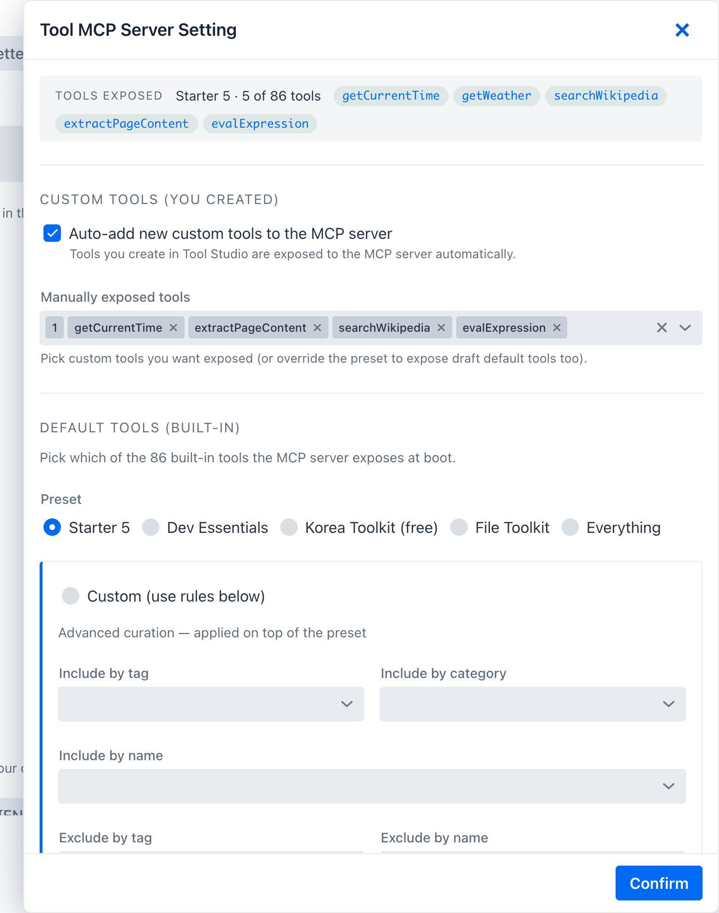

description: Tool Studio — low-code JavaScript tool authoring with deny-first sandbox, Draft state, built-in MCP exposure control, per-tool capability overrides.

# Tool Studio

**Where:** top navigation → **Tool Studio**.

Tool Studio is the low-code authoring environment for JavaScript-based tools. It is the part of the product that turns the Playground from a read-only testing interface into an executable tool runtime.

A tool you author in Tool Studio is a small JavaScript action plus a structured spec — name, description, parameters, optional static variables, and a sandbox capability profile. Tool Studio compiles that into an MCP-callable tool, runs it once locally against your declared test values to earn a **Local Pass**, and only then publishes it to the built-in MCP server.

The authoring screen has two working halves that fold into a single page:

1. **Tool spec form** at the top — name, description, parameters.
2. **Tool Action** below it — JavaScript code editor, test run controls, and the collapsible **Sandbox & Capabilities** pane that controls how the tool's runtime differs from the default.


*Top of Tool Studio: tool name / category / tags, free-form tool description, and structured parameters (Parameter #1 with required flag, name, type, description, and a test value the local sandbox actually executes against).*

## What Tool Studio Does

Tool Studio lets you:

- create tools directly in the browser
- define structured input parameters
- define static variables
- test tool execution immediately
- publish tools to the built-in MCP server without restart or redeploy

## Local Pass — Test Before Publish

Spring AI Playground treats the local test-run as a gate, not a polish step. This is the rule surfaced on the Home screen as **No pass, no run.**

- every tool has at least one sample input (the static variables you define) used for its test-run
- the tool must **pass its test locally** before Tool Studio publishes it
- when the test passes, the tool earns a **Local Pass** and is **added live to the built-in MCP server** the same moment — no restart, no redeploy
- a tool that has not passed is **not added to the built-in MCP server** and is **not callable from Agentic Chat**

In practice this means the act of publishing is the act of testing. You never produce a tool whose first execution happens in front of an agent.

Every one of the 86 bundled [Default Tools](../default-tools/index.md) crossed this same gate before being shipped — they live as ready-to-fork reference for the workflow above.

## Built-in MCP Server

Tool Studio is tightly integrated with the built-in MCP server.

- endpoint: `http://localhost:8282/mcp`
- protocol: Streamable HTTP
- default server name: `spring-ai-playground-built-in-mcp`

When you publish a tool from Tool Studio, it becomes available through that MCP endpoint immediately.

## Tool Action — JavaScript code editor

The lower half of the authoring page is the Tool Action area: the JavaScript code that actually runs when the tool is invoked, plus the controls and panels that surround it.


*Tool Action area top-to-bottom: **Sandbox & Capabilities** stays collapsed by default with a **Locked L0** badge so authoring focuses on the JS action itself; **Static Variables** sit just above the code, available to the action as globals and masked from logs if env-backed; the **JS Code Editor** ships with a sample that lists the cross-bridged globals (`fetch`, `URL`, `URLSearchParams`, `atob`/`btoa`, `crypto`, the `safety.*` helpers) so the author has a working reference without leaving the page; **Test Run / Clear / Format** drive execution; **Debug Console** captures `console.log` output with env-var masking; the bottom action bar — **Save Draft** / Local Pass badge / **Test & Publish** — closes the loop. The only way to expose a tool through MCP is to make its sandboxed test run pass.*

### JavaScript Runtime

Tool actions run as JavaScript through GraalVM Polyglot inside the JVM, on a **virtual-thread-per-task executor** so a runaway tool can be hard-killed on timeout without leaking platform threads.

Runtime characteristics:

- **ECMAScript 2024** with extras enabled — `temporal`, `iterator-helpers`, `new-set-methods`, `regexp-unicode-sets`, `intl-402`, `text-encoding` (configured via GraalVM `js.*` options on a shared `Engine`)
- controlled Java interop through a **deny-first class allowlist** (configured under [Sandbox & Capabilities](#sandbox-capabilities) below)
- safe built-in helpers for HTTP, filesystem, and parsing — so tools rarely need raw `Java.type(...)`
- statement-budget and wall-clock timeout enforced **outside** the JS context: `max-statements: 500000` (GraalVM `ResourceLimits`) and `timeout-seconds: 30` (`Future.get` + `Future.cancel(true)`). Neither is bypassable from JS.

Source of truth: `JsToolExecutor`, `JsRuntimeGlobals`.

### Cross-platform by design

The JS-on-JVM design is what lets every tool in this app — both the bundled defaults and anything you author here — work the same on macOS, Windows, and Linux without per-OS packaging or native toolchains. This is the main split from typical MCP server tools, which ship one native binary per platform and need a build environment on the user's machine.

Concretely:

- One artifact runs on all three OSes — the same JAR is repackaged into the Docker image and the Electron-packaged desktop launcher, all from one `pom.xml`. See [Getting Started](../../getting-started/index.md) for the platform-specific launchers.
- All 86 default tools are pure JavaScript executed through GraalVM Polyglot. No native dependencies, no per-OS build step, no install-time compile.
- Every cross-bridged helper resolves to a Java standard library or well-known JVM library, so platform quirks are handled at the JVM layer:
    - `safety.fs` rides on `java.nio.file.Path` / `Files` — `/` vs `\` and case folding are normalised before any I/O.
    - `fetch` uses the JDK `HttpClient` — same TLS stack, same redirect handling, same connection pool everywhere.
    - `safety.parser.html` / `xml` / `yaml` / `csv` go through jsoup / `javax.xml.parsers` (XXE-hardened) / SnakeYAML / Apache Commons CSV.
    - `crypto.subtle` goes through JCE — algorithms and key formats are JVM-controlled, not OS-controlled.
- Authoring a new tool needs nothing installed locally beyond the running app. No `cargo build`, no `npm install`, no platform-specific shell scripts. Tool Studio's editor + Local Pass is the entire build pipeline.

A pure-runtime caveat: a tool whose JS hard-codes platform-specific paths or external services (`/etc/...`, `C:\Program Files\...`, OS-only binaries) is still platform-coupled at the user-data level. The runtime is OS-agnostic; whether a specific tool you author is portable depends on what it does.

### Built-in JavaScript Helpers

Tools call a small set of capability-scoped helpers instead of raw Java. These are the same helpers the bundled default tools use, so authoring a new tool typically does not require any `Java.type(...)` interop at all.

| Helper | What it does |
|---|---|
| `fetch(url, init?)` | HTTPS/HTTP request with the [SSRF four-layer guard](#ssrf-four-layer-guard). 5 redirect cap, 10 MB body cap, 30 s request timeout, 5 s connect timeout. Restricted hop-by-hop headers (`Host`, `Connection`, `Content-Length`, `Expect`, `Upgrade`) are stripped before sending. 303 redirects downgrade `POST` → `GET`. `init` accepts `method`, `headers`, `body` plus **`maxLength` / `startIndex`** for response pagination. Returns `{status, ok, statusText, url, contentType, truncated, nextStartIndex, headers: {get(name)}, text(), json(), arrayBuffer()}`. Only installed when the effective egress level is not `blocked`. |
| `URL`, `URLSearchParams` | WHATWG URL parsing / building. |
| `atob`, `btoa` | Base64 encode / decode of strings. |
| `crypto.subtle` | `digest` (SHA-256 / SHA-384 / SHA-512 only), `importKey` + `sign` / `verify` for HMAC, and `getRandomValues` — backed by JCE. |
| `crypto.randomUUID()` | UUID v4. |
| `safety.fs` | `readText`, `writeText` (auto-creates parent directories), `list`, `stat`, `exists`, `grep`, `lineCount`, `slice`, `cut`, `sort`, `find` (depth-limited walk, **follows symlinks**). Every path is resolved against the base path and rejected if `normalize()` escapes the root. Per-tool override `fsBasePath` swaps the root for that tool. |
| `safety.parser.html` | jsoup-backed cleaner. Returns a `org.jsoup.nodes.Document` host object — methods are callable from JS, but the class itself is not in the allow-list, so user code cannot construct new jsoup instances via `Java.type(...)`. |
| `safety.parser.xml` | XXE-hardened DOM parser: `disallow-doctype-decl=true`, external general + parameter entities disabled, `XIncludeAware=false`, `expandEntityReferences=false`. Returns a plain `{tag, attrs, text, children}` proxy tree — no host nodes leak. |
| `safety.parser.yaml` | SnakeYAML `Yaml().load()`. **Caveat:** this is the regular constructor (not `SafeConstructor`), so YAML tags such as `!!class.name` will trigger class instantiation during `load`. Treat YAML input as trusted-source-only; do not parse user-supplied YAML with this helper. |
| `safety.parser.csv` | Apache Commons CSV — optional `header` and `delimiter` opts. |
| `console.log` | Captured into the Tool Studio debug pane and into the chat's tool-call trace. Environment-backed static variables are masked by substring replacement when their full resolved value appears in output. Only anchored full-string `$ENV_VAR` references are auto-collected as secrets — substring-inlined env vars are not. Log entries are capped at 1000 per execution. `console.error` is **not** installed in the current build. |

Every helper above is exercised by one or more of the 86 [Default Tools](../default-tools/index.md) — open one in Tool Studio to see the helper in working code, then use **Copy And New Tool** to fork it.

## Sandbox & Capabilities

**Sandbox & Capabilities** is the collapsible pane inside Tool Action that controls how a tool's effective runtime policy differs from the global default. Every tool starts at the baseline — no network, no filesystem, deny-first class allowlist — and earns an L0 badge. Opening this pane lets you widen specific dimensions per tool, and the **Risk Level** badge updates live as you do so.


*Sandbox & Capabilities expanded: **Deny Classes** chips list packages user JS can never touch (removing chips lowers safety — removing reflection denies → L4, removing `System` / `Runtime` / `Process` → L5); **Allow Classes** chips list packages user JS can use (adding new chips can raise risk to L3+); **Network mode** radio chooses `blocked` / `allowlist` / `strict` (default, with SSRF four-layer guard) / `open`; **Filesystem mode** chooses `off` (hidden) / `read` (L3) / `read+write` (L4) / `readwrite`; **Base path** sets the per-tool `safety.fs` root, default `${TOOL_STUDIO_FS_BASE:${user.home}/spring-ai-playground/fs-tool-workspace}`.*

The Sandbox & Capabilities pane reads and writes a `SandboxOverrides` block on the tool's spec. None of the bundled defaults touch the class lists — they only set network mode and host list — but the full surface is available. The five subsections below document the baseline, the override shape, and the per-control semantics in detail. For the normative JSON contract of the spec this pane writes — every field, JSON Schema, resolution algorithm, and Risk Level rules — see **[Safe Tool Specification 1.0](../../safe-tool-specification.md)**.

### Default sandbox baseline (application.yaml)

The Sandbox & Capabilities pane modifies a global baseline defined in `application.yaml`. The defaults are deliberately restrictive: no I/O of any kind, only pure-compute Java packages reachable through `Java.type(...)`, and an explicit deny-list that beats any allow match.

```yaml
spring:
  ai:
    playground:
      tool-studio:
        timeout-seconds: 30
        fs:
          base-path: ${TOOL_STUDIO_FS_BASE:${user.home}/spring-ai-playground/fs-tool-workspace}
        js-sandbox:
          allow-network-io: false
          allow-file-io: false           # single boolean — flips read and write together
          allow-native-access: false
          allow-create-thread: false
          max-statements: 500000
          deny-classes:                  # evaluated before allow-classes — deny ALWAYS wins
            - java.lang.System
            - java.lang.Runtime
            - java.lang.ProcessBuilder
            - java.lang.Process
            - java.lang.Class
            - java.lang.invoke.*
            - java.lang.reflect.*
            - java.lang.Thread
            - java.lang.ThreadGroup
            - java.lang.ClassLoader
            - java.util.ServiceLoader
            - java.util.spi.*
          allow-classes:                 # pure-compute only
            - java.lang.*
            - java.math.*
            - java.time.*
            - java.util.*
            - java.text.*
```

**Pattern semantics for `deny-classes` / `allow-classes`**: an entry is either the exact class name (`java.lang.Class`) or a package prefix ending in `.*` (`java.lang.reflect.*` matches `java.lang.reflect.Method` but not bare `java.lang.reflect`). Deny is evaluated first; if a class matches both lists, the deny wins.

A tool that legitimately needs raw Java network/filesystem access or relaxed network egress **opts in per tool** via Sandbox Capabilities — the per-tool override surface documented in the next subsection. If you need an even stricter deployment than this baseline, GraalVM sandbox policies can be layered on top in a custom source build; see the [GraalVM Security Guide](https://www.graalvm.org/latest/security-guide/sandboxing/).

### `SandboxOverrides` JSON shape

`SandboxOverrides` is the per-tool block that the Sandbox & Capabilities pane edits and the resolver applies. None of the bundled defaults touch the class lists — they only set network mode and host list — but the full shape is:

```json
{
  "addAllowClasses": ["java.net.URL"],
  "removeAllowClasses": [],
  "addDenyClasses": [],
  "removeDenyClasses": [],
  "networkMode": "strict | allowlist | open | blocked",
  "hostsAllow": ["api.example.com", "*.example.com"],
  "fileRead": true,
  "fileWrite": null,
  "fsBasePath": null
}
```

- Putting the same class in both `addAllowClasses` and `addDenyClasses` throws — the resolver enforces a single source of truth.
- `networkMode` replaces the baseline egress level; `hostsAllow` only applies when `networkMode` is `allowlist`.
- `fileRead` / `fileWrite` are nullable — leave them as `null` to inherit the baseline (which is the single `allow-file-io` flag); set them per-tool to split read and write.
- `fsBasePath` swaps the `safety.fs` root for that one tool. Use sparingly — it bypasses the per-app base path.

### Egress modes (network)

The Tool Studio override form exposes four user-facing modes. A fifth (`permissive`, alias for `open`) and a sixth (`custom`, deny-list-based) exist inside `SafeHttpFetch.enforce`; `custom` is currently only filled in from yaml profiles, not from the per-tool form.

| Mode | What it does | SSRF guard |
|---|---|---|
| `blocked` | `fetch` is **not installed** at all — calling it from JS throws `ReferenceError`. | n/a |
| `strict` (default) | Public hosts only. Both the literal host and every DNS-resolved address must not be private/reserved. | ✅ runs |
| `allowlist` | Host must match an entry in `hostsAllow` (exact match or `*.suffix`). | not run |
| `open` (= `permissive`) | No host check. Use only when the tool genuinely needs open egress. | not run |
| `custom` (internal) | Allowed unless the host matches `hostsDeny`. Reachable from yaml profiles only. | not run |

All modes enforce the rest of the contract: scheme is `http` or `https`, body cap 10 MB, redirect cap 5, request timeout 30 s, connect timeout 5 s, restricted hop-by-hop headers stripped, 303 POST→GET downgrade.

### Filesystem mode

The Filesystem radio chooses how `safety.fs` behaves for the tool. The baseline is `off` (no read, no write); per-tool overrides widen the surface.

| Mode | `fileRead` | `fileWrite` | Risk impact |
|---|---|---|---|
| `off` (default) | false | false | Hidden — `safety.fs` calls reject with policy error. |
| `read` | true | false | L3 — tool can `readText` / `list` / `stat` / `find` within the base path. |
| `read+write` | true | true | L4 — tool can also `writeText`, which auto-creates parent directories. |
| `readwrite` | true | true | L4 (same posture as `read+write`; alternate label). |

All file access is rooted at the configured **Base path** (default `${TOOL_STUDIO_FS_BASE:${user.home}/spring-ai-playground/fs-tool-workspace}`, set per-app under `tool-studio.fs.base-path`). `SafeFs.resolveAndValidate` calls `normalize()` and rejects any path whose result does not `startsWith(base)`, so `../../etc/passwd` and absolute paths outside the root both fail. `safety.fs.find` walks with `FileVisitOption.FOLLOW_LINKS` — symbolic links are traversed, so consider that when sharing the base path with untrusted directory trees.

### SSRF four-layer guard

Active only when egress is `strict`. From `SafeHttpFetch.enforce` and `enforceSsrfFourLayer`, in order:

1. **Scheme check** — only `http` and `https` accepted. Anything else rejected as `unsupported-scheme`.
2. **Egress switch** — based on the resolved mode. Only `strict` continues to the next layers.
3. **Literal IP vs DNS branch** — if the host parses as a literal IPv4/IPv6 address, check that address directly. Otherwise resolve via DNS (`InetAddress.getAllByName`) and check **every** returned address. DNS failure or empty resolution both block — fail-closed.
4. **Private/reserved address check** — rejects:
   - loopback (`127.0.0.0/8`, `::1`)
   - link-local (`169.254.0.0/16`, `fe80::/10`)
   - site-local (RFC 1918: `10.0.0.0/8`, `172.16.0.0/12`, `192.168.0.0/16`)
   - any-local (`0.0.0.0`, `::`)
   - multicast (`224.0.0.0/4`, `ff00::/8`)
   - IPv6 ULA (`fc00::/7`)
   - **CGNAT** (`100.64.0.0/10`) — explicitly handled because Java's `isSiteLocalAddress()` does not cover this range

### Risk Level Reference

Computed by `SandboxPostureCalculator.compute` from the tool's effective policy. The badge is the **max** of all signals below. Only L0/L3/L4/L5 are produced by the current calculator (L1 and L2 exist as labels in the UI but no rule yields them today).

| Signal | Threshold | Level |
|---|---|---|
| Default posture (no overrides) | — | **L0** |
| `networkMode` = `allowlist` with concrete hosts | non-`*` allow-list | L3 |
| `networkMode` = `allowlist` containing `*` | wildcard everything | L4 |
| `networkMode` = `open` | any host | L4 |
| `fileRead = true` (write false) | file read only | L3 |
| `fileWrite = true` | write capability | L4 |
| Removed deny entry — non-critical | 1–2 entries dropped | L3 |
| Removed deny entry — non-critical | 3+ entries dropped | L4 |
| Removed deny entry — critical | any of `System` / `Runtime` / `Process` / `ProcessBuilder` | **L5** |
| Added allow entry — file-read | `java.io.File*`, `java.nio.file.Files/Path/Paths` | L4 |
| Added allow entry — reflection | `java.lang.reflect.*`, `java.lang.invoke.*`, `java.lang.Class` | L4 |
| Added allow entry — network | `java.net.http`, `Socket`, `URL`, `URLConnection`, `HttpURLConnection`, `javax.net.ssl`, `org.jsoup` | L4 |
| Added allow entry — file-write | `java.io.FileWriter`, `FileOutputStream`, `RandomAccessFile`, `FileChannel` | **L5** |
| Added allow entry — critical | `System` / `Runtime` / `Process` / `ProcessBuilder` | **L5** |
| Any other class added | non-critical allow | L3 |

Practical interpretation:

- **L0** = baseline defaults. Every starter tool runs here.
- **L3** = narrowed network access or file-read; reviewable.
- **L4** = broad network, file-write, or substantial deny-list relaxation — review carefully before exposing through MCP.
- **L5** = critical class re-enabled — process spawn, reflection escape, or raw file write. Treat as effectively unsandboxed and reserve for trusted authors only.

### Human-in-the-loop approval

The pane also sets the tool's **Human-in-the-loop** approval mode — **Required** (ask on every call) or **Disabled — no prompt**. It defaults to **Required** above `L0`. An optional **Approval prompt** customizes the question, with `{toolName}` and `{args}` substituted at call time, and lowering the mode opens a *Reduce human oversight?* confirmation. This is the runtime gate that pauses a call until you approve it — see **[Human-in-the-Loop Approval](../human-in-the-loop.md)**.

## Safety — defense in depth {#safety}

The terminology matters: this is *safety* in the GraalVM sandbox sense — keeping a small JavaScript action from doing things its author did not intend — not *security* in the sense of authenticating outside callers. The two are layered but separate, and the code makes the same distinction (`safety.fs`, `safety.parser.*` for the sandbox surface; Spring Security on top for the endpoint).

The three layers:

1. **Java-level sandbox (always on)** — what every tool runs inside, no matter who authored it. Deny-first class allowlist, network/file I/O blocked at the JVM (helpers are the only paths), statement-budget + wall-clock timeout, secret masking on `console.log` output. Not bypassable from JS. Configured by [Default sandbox baseline](#default-sandbox-baseline-applicationyaml) above.
2. **Per-tool overrides (visible risk)** — the [Sandbox & Capabilities](#sandbox-capabilities) pane *widens* the sandbox in declared, badge-visible ways. Each widening surfaces as a Risk Level (L0–L5) before publish, so the gate is review rather than runtime. Layer 1 still holds: the deny-list and SSRF guard cannot be turned off here, only the allow-side and network mode can be widened.
3. **MCP endpoint security (Spring Security)** — adversarial-threat layer in front of the MCP transport. Disabled by default for the local single-user case; enabled via [Spring AI MCP Security](https://docs.spring.io/spring-ai/reference/api/mcp/mcp-security.html) for deployed scenarios.

The first two are about safety of execution. The third is about who can talk to the MCP server. Both matter; they fail to different threats.

For the system-level reference — three-layer diagram, policy resolution flow, per-execution enforcement points, threat-to-layer mapping, and known limitations — see [AI Agent Tool Safety Architecture](../../safety-architecture.md).

## Connect to the Built-in MCP Server

Once Spring AI Playground is running, the built-in MCP server can be consumed directly by MCP-compatible clients.

### Claude Code

Recent Claude Code versions support Streamable HTTP directly.

```bash
claude mcp add spring-ai-playground http://localhost:8282/mcp
```

Restart Claude Code if needed so the new server is picked up.

### Cursor

Configure a Streamable HTTP server in Cursor with:

- Name: `Spring AI Playground`
- URL: `http://localhost:8282/mcp`

In practice, that means:

1. open Cursor Settings
2. navigate to **Features > MCP**
3. add a new MCP server
4. choose **Streamable HTTP**
5. enter the name and URL above

### Claude Desktop

If your Claude Desktop plan supports native remote connectors, you can add `http://localhost:8282/mcp` directly from the Settings UI.

For broader compatibility, one practical approach is to use `mcp-remote`:

```json
{
  "mcpServers": {
    "spring-ai-playground": {
      "command": "npx",
      "args": ["-y", "mcp-remote", "http://localhost:8282/mcp"]
    }
  }
}
```

Restart Claude Desktop after saving the config.

This proxy-style setup is especially useful when direct remote configuration is unavailable or inconvenient, because it wraps the remote Streamable HTTP MCP server behind a local process contract that desktop clients already understand well.

## Dynamic Tool Exposure

Tool Studio and the built-in MCP server are intentionally designed for a no-restart workflow:

- create or update a tool
- test it
- publish it
- inspect it through MCP immediately

When a tool is created or updated in Tool Studio, it is dynamically discovered and exposed by the default built-in MCP server. You can then inspect its schema and validate execution behavior from the MCP Server screen without restarting or redeploying the application.

## Key Tool Studio Capabilities

- **Built-in MCP Server Native Tools drawer** (gear icon in the Tool Studio header): the single surface controlling **which Local-Passed tools the built-in MCP server exposes**. Three sections — **Tools exposed** chip summary for the confirmed setting; **Custom tools** selector for tools you authored; **Built-in tools** selector listing the **Local-Passed** built-in tools so you can tick which to expose. The **Auto-expose newly published tools** toggle controls whether newly published (Local-Passed) tools join the server automatically. Which built-in tools are Local-Passed in the first place is decided at **setup** (desktop launcher / CLI) and per-tool via **Publish** in the tool list — not here.
- **Draft state + MCP exposure gate**: a tool that has not earned a Local Pass stays in the **Drafts** section, is **not** exposed through the built-in MCP server, and is **not** callable from Agentic Chat. Only published (Local-Passed) tools cross the gate.
- <a id="tool-list-sidebar"></a>**Tool list sidebar**: tools group under a fixed taxonomy (Text, Data, Date/Time, Math, Encoding, Crypto, Security, Files, Web, Productivity, Messaging, AI APIs, Custom) with chip-based filters. The sidebar uses the **same `SidebarFilterBar` + `CategoryGroupDetails` + `SidebarItemLayout` widgets the MCP Server view uses** (search + Categories MultiSelect + Tags MultiSelect + collapsible per-category groups + status dot · name · pills row). Filters compose identically on both screens — see [MCP Server → Filter bar](../mcp-server/index.md#filter-bar) for the same widget in the catalog context.
- **Sandbox Capabilities view**: per-tool overrides for `addAllowClasses` / `removeAllowClasses` / `addDenyClasses` / `removeDenyClasses`, `hostsAllow`, `fileRead` / `fileWrite`, `fsBasePath`, and `networkMode` — with a live risk-level badge (L0–L5). See [Sandbox & Capabilities](#sandbox-capabilities).
- **Tool Specification View**: inspect the generated JSON schema, metadata, parameter contract, and the resulting `McpToolDefinition` envelope (manifest hash, code hash, audit timestamps).
- **Copy And New Tool**: clone an existing tool as a template instead of starting from scratch.
- **Structured Parameters**: define required inputs, descriptions, and test values for model-side tool calling.
- **Static Variables**: inject configuration values and environment-backed secrets — masked in logs.
- **Test Run and Debug Console**: validate console output, status, elapsed time, and result before publishing.

In the UI these capabilities show up as the practical authoring workflow:

- select which Local-Passed tools are exposed through MCP
- inspect the generated tool specification before publishing
- override sandbox capabilities only where a specific tool needs them, with the risk level visible
- copy a working tool into a new template instead of starting from a blank definition
- test with representative values and review the debug output before updating the runtime

You can keep many tools in your workspace, expose only a controlled subset, validate the exact contract the model will see, and update the runtime without a restart cycle.

## Low-code Tool Development Workflow

1. Open Tool Studio.
2. Define the tool name and description.
3. Add structured parameters with test values.
4. Add static variables if needed.
5. Write the JavaScript action.
6. Run **Test Run** and inspect the debug output.
7. Publish with **Test & Publish** (or **Test & Update** if the tool was already published before).

## Pre-built Example Tools

!!! abstract "Full inventory lives in [Default Tools](../default-tools/index.md)"
    Per-tool reference — name, one-line description, params, env-var deps — is on the five pages under [Default Tools](../default-tools/index.md). This section describes the **preset and curation** shape — how the bundle is sliced into the Local-Passed (active) set at setup.

<div class="grid cards" markdown>

-   :material-rocket-launch:{ .lg .middle } **[Examples](../default-tools/examples.md)**

    ---

    **7** · starter tools — fetch a web page, look up weather, search Google, call OpenAI, post to Slack.

-   :material-toolbox:{ .lg .middle } **[Utilities](../default-tools/utilities.md)**

    ---

    **26** · pure-compute — text, datetime, math, security, encoding, crypto, CSV. No I/O.

-   :material-folder-cog:{ .lg .middle } **[Filesystem](../default-tools/filesystem.md)**

    ---

    **10** · `safety.fs` pipeline — read, list, grep, slice, sort, find, write — under the FS base path.

-   :material-web:{ .lg .middle } **[Global](../default-tools/global.md)**

    ---

    **22** · public APIs — GitHub, Wikipedia, weather, finance, geo, search.

-   :flag_kr:{ .lg .middle } **[Korea](../default-tools/korea.md)**

    ---

    **21** · Korean-domain services — Upbit, Bithumb, Naver, Kakao, KMA, KOFIC, KRX, MOLIT, MFDS.

</div>

The app ships with a bundled catalog of **86 default tools** across five JSON source bundles. They are ready to call from chat the moment a model provider is connected, and they also serve as editable references when you start writing your own.

**Not all of them are Local-Passed (active) by default.** A **preset** decides the starting Local-Passed subset, and **include / exclude rules** layer per-tool tweaks on top. Each preset stands on its own — `Dev Essentials`, `Korea Toolkit`, and `File Toolkit` do **not** automatically inherit Starter 5 (only `getCurrentTime` and `evalExpression` carry through deliberately).

| Preset | Tools exposed | Notes |
|---|---|---|
| `Starter 5` (default) | `getCurrentTime`, `getWeather`, `searchWikipedia`, `extractPageContent`, `evalExpression` | No setup, no API keys — works on a fresh install |
| `Dev Essentials` | `getCurrentTime`, `evalExpression`, `uuid`, `hash`, `base64`, `jwtDecode`, `regexExtract` | Everyday local utilities |
| `Korea Toolkit (free)` | `getCurrentTime`, `evalExpression`, `getUpbitTicker`, `getBithumbTicker`, `searchKpopOnItunes`, `searchKBeautyProducts` | Free Korean services |
| `File Toolkit` | `getCurrentTime`, `evalExpression`, `readTextFile`, `listDir`, `grepFile`, `findFiles`, `sliceFile`, `sortFile`, `cutFileFields` | Filesystem pipeline — set `TOOL_STUDIO_FS_BASE` (or rely on the `${user.home}/spring-ai-playground/fs-tool-workspace` default) |
| `Everything` | All 86 default tools | Heavy MCP catalog |
| `Custom` | None initially | Active when you only want the include/exclude rules to decide what gets exposed |

Per-tool **include / exclude rules** layer on top: name-add → tag-add → category-add → name-remove → tag-remove → category-remove. These rules are configured at setup — the desktop launcher's **Default MCP Tools** card (include-by-tag / -category / -name, exclude-by-tag / -name) or CLI / yaml; `exclude.categories` is data-supported but currently only reachable via CLI / yaml override.

Some default tools depend on environment-backed secrets — `OPENAI_API_KEY`, `GOOGLE_API_KEY` + `GOOGLE_PSE_ID`, `SLACK_WEBHOOK_URL`, the data.go.kr keychain, and the Korean provider keys — and stay inert until those are set. The consolidated list lives in [Default Tools → Environment variables](../default-tools/index.md#environment-variables-short-list); per-page details are on each reference page. The `File Toolkit` preset additionally honours `TOOL_STUDIO_FS_BASE` (defaulting to `${user.home}/spring-ai-playground/fs-tool-workspace`) for `safety.fs`. The desktop launcher's environment-variable workflow exists exactly to make this configuration ergonomic.

### Where preset choices live

The preset + rules shape decides which built-in tools are **Local-Passed (active)**. It is chosen at **setup** — not from inside the running app's MCP drawer:

1. **Default MCP Tools card** inside the desktop launcher's config editor — pick the preset on first launch and adjust it on any later configuration session. See [Desktop App → Default MCP Tools Curation](../../getting-started/desktop.md#default-mcp-tools-curation).
2. **CLI / yaml override** — pin the preset and include/exclude rules at boot (below).

Both write the same `default-tools-preference.json` under the home dir (managed by the persistence layer, not a hand-edit target), which the app reads at startup to set the Local-Passed set. After startup you Local-Pass or unpublish individual built-in tools from the **Tool Studio tool list** (Publish / Draft), and choose which Local-Passed tools the MCP server **exposes** from the **Built-in MCP Server Native Tools drawer**.


*Built-in MCP Server Native Tools drawer, top to bottom: **Tools exposed** confirmed-summary chips; **Auto-expose newly published tools**; **Custom tools** selector for authored tools; **Built-in tools** selector listing the Local-Passed built-in tools — tick which to expose. **Confirm** writes the exposure change and updates the live MCP server without a restart.*

### CLI / yaml override

You can pin the preset at boot time without touching the preference file:

```bash
./mvnw spring-boot:run -Dspring-boot.run.arguments="\
  --spring.ai.playground.default-tools.preset=dev-essentials \
  --spring.ai.playground.default-tools.include.tags=korea"
```

CLI / yaml properties take precedence at boot but are **not persisted** back to the preference file; clearing them on the next launch reverts to whatever the file says.

### Migration note

If a `defaultToolOverrides.json` file from an earlier milestone (≤ M5) exists, the current build renames it to `defaultToolOverrides.json.deprecated` on startup once. The new file is `default-tools-preference.json` in the same `tool/save/` directory.

## Using Tools in Agentic Chat

Tool Studio tools can be used in Agentic Chat through MCP integration. With a tool-capable model and **Use built-in MCP server in this chat** enabled, the model can call the tools exposed by the built-in server during agentic workflows.

Agentic Chat can also call tools exposed by external MCP servers that you explicitly connect and trust.
