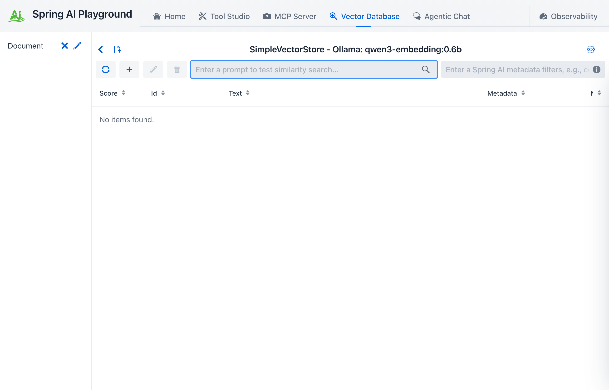

description: Vector Database - RAG ingestion and retrieval-validation. Document chunking, embedding, similarity search across Spring AI vector store providers.

# Vector Database

**Where:** top navigation → **Vector Database**.

Vector Database is the RAG preparation and retrieval-validation area.

It gives you an end-to-end environment for document ingestion, chunking, embedding, storage, and similarity search.

## What It Supports

This area acts as a vector database playground built on Spring AI vector store integrations.

That includes:

- switching between vector providers without changing application code
- using a unified Spring AI retrieval model
- validating retrieval quality before relying on it in chat

## Support for Major Vector Database Providers

Spring AI Playground follows the Spring AI vector store ecosystem and can be used with providers such as Apache Cassandra, Azure Cosmos DB, Azure Vector Search, Chroma, Elasticsearch, GemFire, MariaDB, Milvus, MongoDB Atlas, Neo4j, OpenSearch, Oracle, PostgreSQL/PGVector, Pinecone, Qdrant, Redis, SAP Hana, Typesense, Weaviate, and others supported by Spring AI.

## Major Capabilities

- Custom Chunk Input: enter raw text and test chunking directly
- Document Uploads: ingest PDF, Word, and PowerPoint-style content
- End-to-End Processing: extraction, chunking, embedding, and indexing
- Search and Scoring: run vector similarity search and inspect scores
- Spring AI Filter Expressions: narrow searches using metadata conditions

## Why It Matters

RAG often fails quietly when chunking, embeddings, or indexing are misaligned. This screen exists so those problems become observable:

- you can see whether ingestion completed
- you can inspect chunk quality
- you can verify retrieval relevance
- you can catch embedding-model changes that invalidate old vector data

That is why the desktop launcher warns users about changing embedding models after indexing content.

In practice, this is what turns the Vector Database page into a real RAG validation surface rather than a generic upload page. You can inspect ingestion quality, retrieval quality, and filter behavior before trusting the same data inside chat.

## Where it fits

Vector Database is the **preparation half** of the RAG pipeline; the **consumption half** lives in Agentic Chat (the `SpringAiPlaygroundRagAdvisor` reaches into the configured `VectorStore` whenever the user selects at least one document for the conversation - see [Application Architecture → Flow 4 - Chat advisor chain](../architecture.md#flow-4-chat-advisor-chain-memory-rag) for the per-call wiring).

Hands-on RAG paths:

- [Tutorial 3 - Index a Document](../tutorials/3-index-document.md) - end-to-end ingestion + retrieval validation
- [Tutorial 5 - Chat with RAG](../tutorials/5-chat-rag.md) - consume the indexed corpus from Agentic Chat
- [Tutorial 6 - Tools and RAG](../tutorials/6-tools-and-rag.md) - combine RAG with MCP-driven tool calls in one chat turn

Embedding-model setup (Ollama / OpenAI) is configured at launch time - see [Desktop App → Recommended First-Launch Flow](../getting-started/desktop.md#9-recommended-first-launch-flow). Changing the embedding model after indexing invalidates vector dimensionality, which is why the launcher surfaces a warning.
