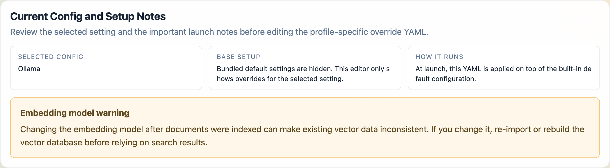
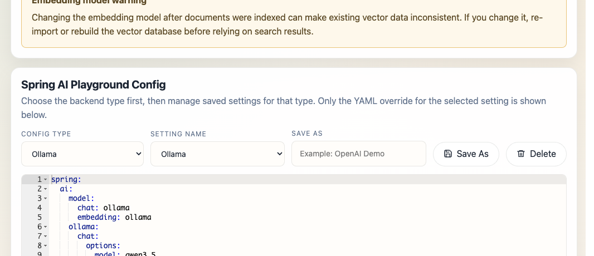
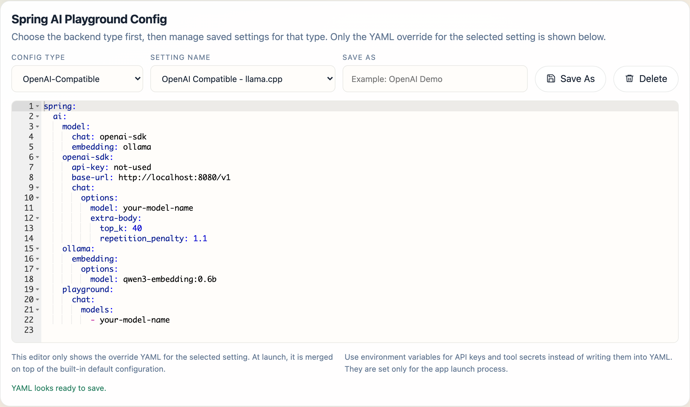
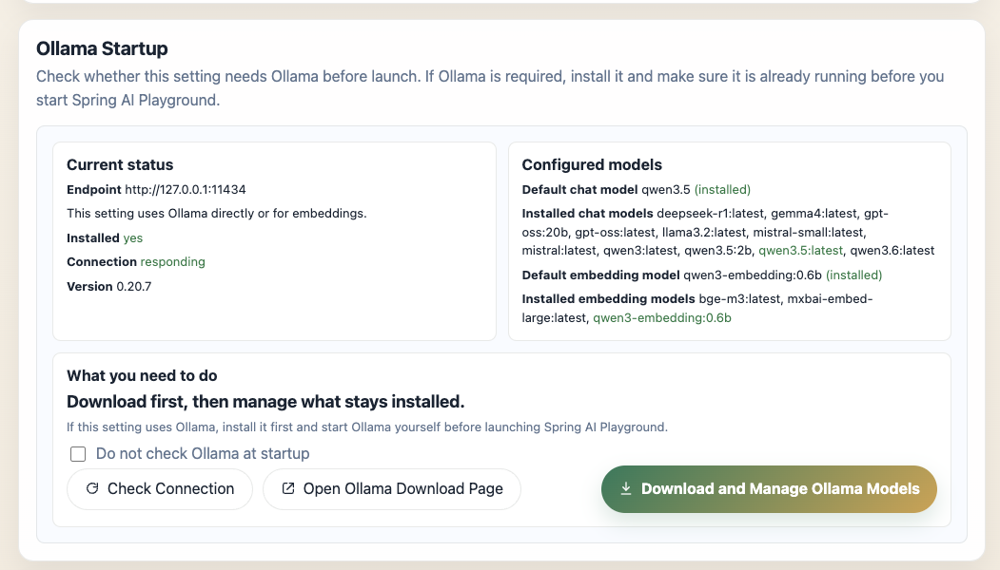
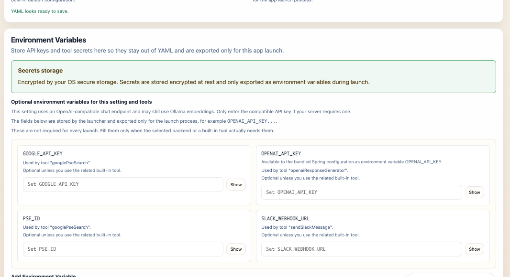
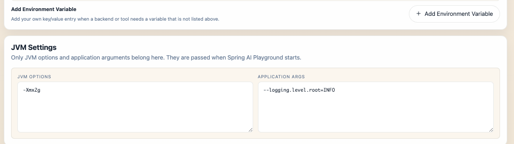
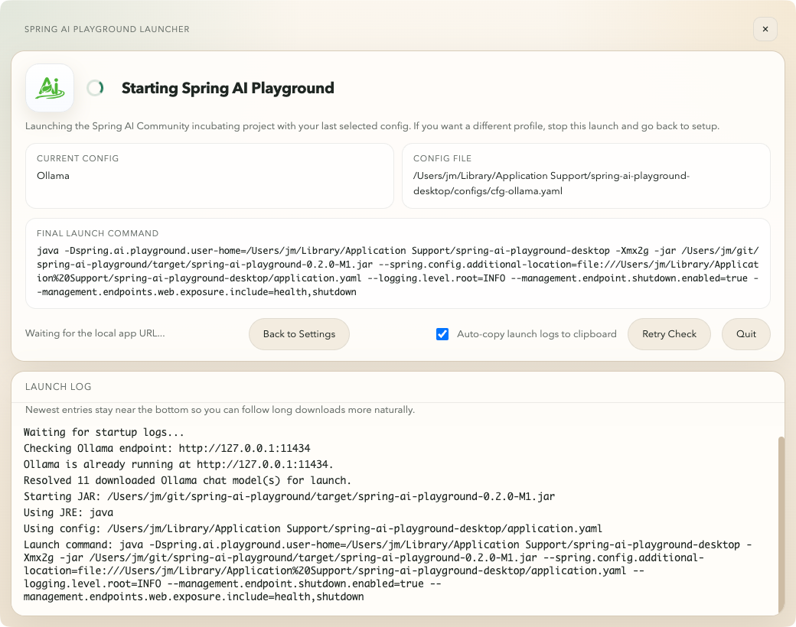
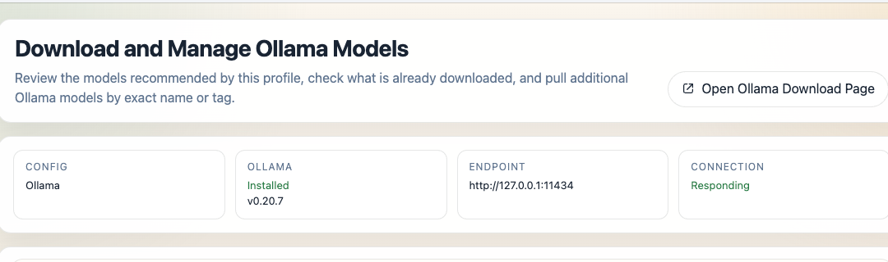
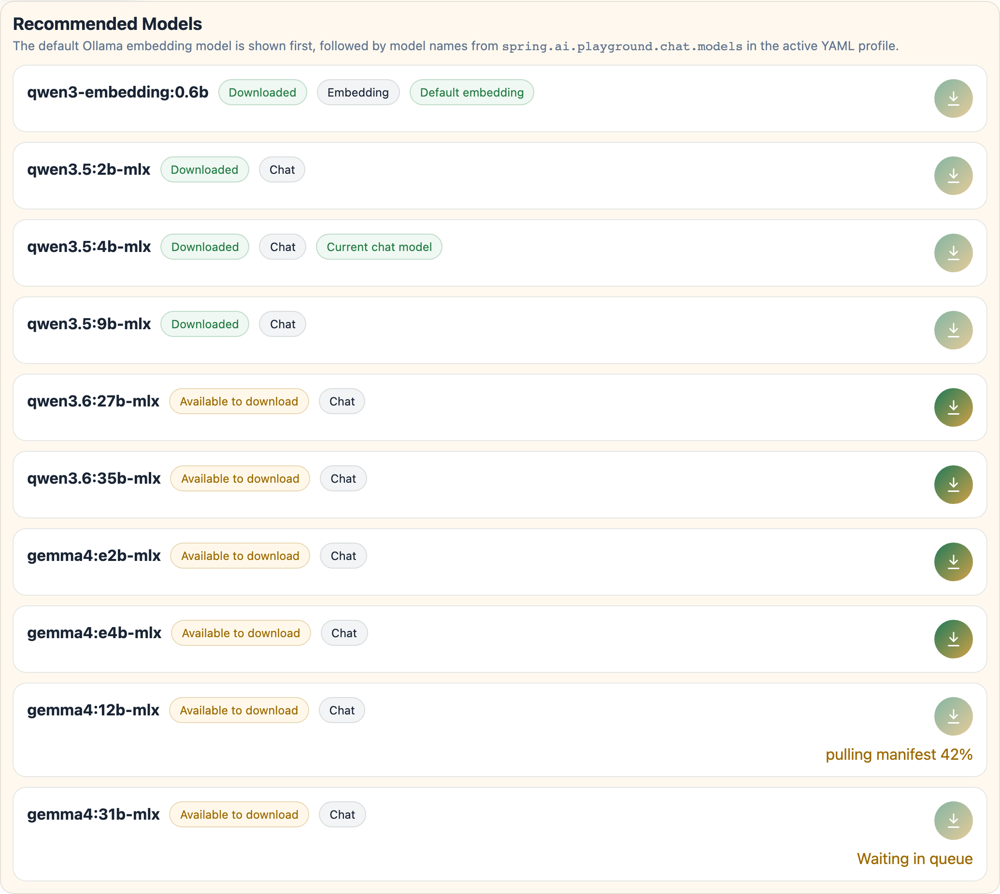
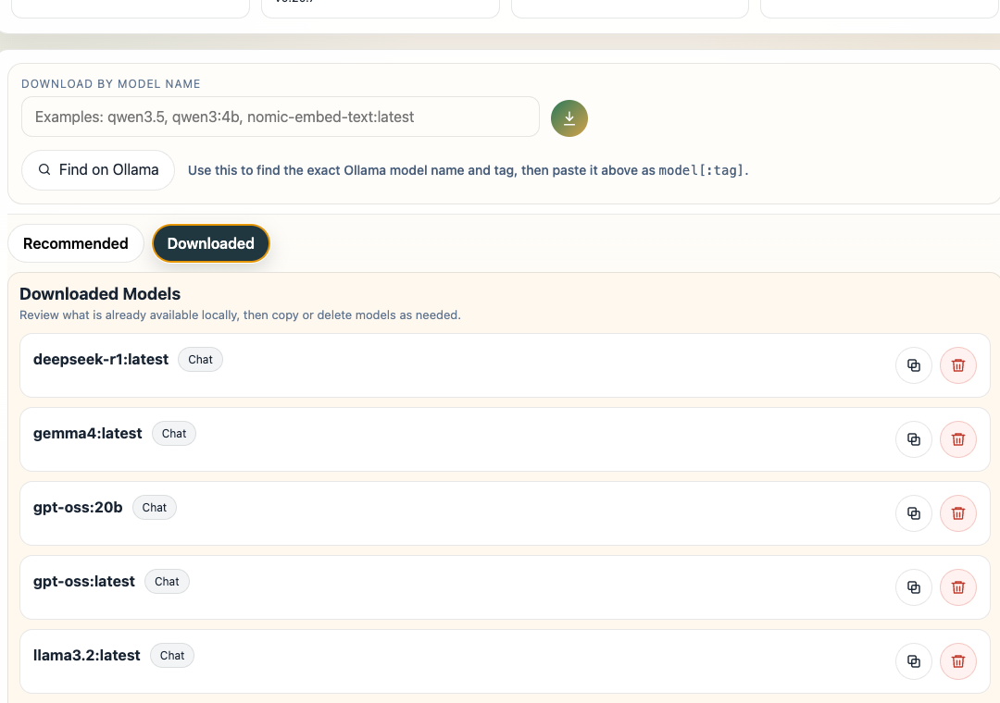

Description: Install Spring AI Playground, use the desktop launcher, configure Ollama or OpenAI, manage Ollama models and secrets, and launch the app, Docker image, or local source build.

# Getting Started

Spring AI Playground is best introduced through the desktop app. The desktop launcher gives you the easiest installation path, a built-in configuration editor, provider starter templates, secure environment-variable handling, and a one-click launch flow for the bundled runtime.

This page starts with the desktop app because that is the default installation experience. Docker and direct source execution are still supported and documented here as alternative runtimes.

## Desktop App First

The recommended default is the desktop build published through GitHub Releases.

### Download the Desktop Installer

Choose the installer for your platform from the latest release:

[](https://github.com/spring-ai-community/spring-ai-playground/releases/latest/download/Spring.AI.Playground.exe)
[](https://github.com/spring-ai-community/spring-ai-playground/releases/latest/download/Spring.AI.Playground-arm64.dmg)
[](https://github.com/spring-ai-community/spring-ai-playground/releases/latest/download/Spring.AI.Playground-x64.dmg)
[](https://github.com/spring-ai-community/spring-ai-playground/releases/latest/download/Spring.AI.Playground.deb)
[](https://github.com/spring-ai-community/spring-ai-playground/releases/latest/download/Spring.AI.Playground.rpm)

Or browse all available assets on the [Releases page](https://github.com/spring-ai-community/spring-ai-playground/releases).

The desktop package wraps the launcher and the backend runtime together, so this is the simplest way to get started without manually running Docker or Maven.

### Platform-specific install notes

#### macOS

If you install from a DMG, drag the app into **Applications** before launching it. Do not run it directly from the mounted DMG, and eject the DMG after copying.

Gatekeeper may block the install flow in two places:

##### 1. Open the installer (DMG)

When you open the downloaded DMG, macOS may show a warning such as “cannot be opened because the developer cannot be verified.”

If you trust the release source:

- Try opening the DMG.
- If macOS blocks it, go to **System Settings > Privacy & Security** and click **Open Anyway**.

##### 2. Launch the installed app

After copying `Spring AI Playground.app` into `/Applications`, macOS may block the first app launch again.

If that happens:

- Open the app once.
- Then go to **System Settings > Privacy & Security** and click **Open Anyway**.

If the app still doesn’t open because it remains quarantined, and you trust the app, one practical workaround is:

```bash
xattr -dr com.apple.quarantine "/Applications/Spring AI Playground.app"
```

#### Windows

The most common warning appears when you run the downloaded installer (`.exe`).

If Microsoft Defender SmartScreen shows a warning such as “Windows protected your PC” or says the app is unrecognized:

- Click **More info**
- Then click **Run anyway**

In most cases, the installer is the main warning point. Repeated blocking after installation is less common than on macOS.

#### Linux

Separate Gatekeeper- or SmartScreen-style reputation warnings are uncommon.

Install the package using the format that matches your distribution:

- `.deb` for Debian or Ubuntu-based systems
- `.rpm` for Fedora, RHEL, Rocky Linux, AlmaLinux, openSUSE, and similar RPM-based systems

You usually only need to complete the normal package-install confirmation steps, which may include an administrator password.

### What the Desktop App Gives You

The desktop launcher includes a built-in configuration editor. In practical terms, that means:

- provider-specific starter settings for Ollama, OpenAI, and OpenAI-compatible servers
- YAML override editing instead of forcing you to edit the full bundled config
- environment-variable entry for API keys and tool secrets
- JVM options and application arguments for launch-time tuning
- import, export, save-as, delete, factory reset, and save-and-launch workflows

### How the Desktop Config Works

The launcher does not expose the entire built-in config directly. Instead, the editor shows only the override YAML for the selected setting, and at launch that override is merged on top of the bundled default configuration.

That behavior is reflected in the desktop UI:

- selected config and setup notes
- provider type selector: `Ollama`, `OpenAI`, `OpenAI-Compatible`
- saved setting selection and `Save As`
- environment-variable management
- JVM settings
- `Save and Launch`

This makes it much easier to keep multiple clean launch profiles without hand-managing full runtime configuration files.

## Desktop Configuration Walkthrough

The first desktop launch opens **Configure Spring AI Playground**. Later launches reuse the selected saved setting automatically.

### 1. Read the Setup Notes First

The first card is **Current Config and Setup Notes**. It explains the active setting before you edit the YAML below.



- `Selected Config`: the active saved setting name
- `Base Setup`: the launcher hides bundled defaults and only lets you edit overrides
- `How It Runs`: the selected YAML is applied on top of the built-in default configuration at launch

If the selected setting includes an embedding model, the launcher also shows an **Embedding model warning**. That warning matters because changing the embedding model after documents were already indexed can leave existing vector data inconsistent until you re-import or rebuild the vector database.

### 2. Choose a Config Type

The main editor card is **Spring AI Playground Config**.



Within that card, `Config Type` chooses the backend family for the current setting:

- `Ollama`
- `OpenAI`
- `OpenAI-Compatible`

This selector changes the kind of starter setting you are working with. It does not expose the full bundled configuration. It switches the saved-setting list and the override YAML editor to the selected backend family.

### 3. Choose a Saved Setting

`Setting Name` selects a saved launcher profile for the chosen config type.



In the current desktop build:

- `Ollama` starts with the built-in `Ollama` setting
- `OpenAI` starts with the built-in `OpenAI` setting
- `OpenAI-Compatible` starts with built-in compatible profiles such as `OpenAI Compatible - Ollama`, `OpenAI Compatible - llama.cpp`, `OpenAI Compatible - TabbyAPI`, `OpenAI Compatible - LM Studio`, and `OpenAI Compatible - vLLM`

`OpenAI-Compatible` is intended for servers that expose an OpenAI-style API but are not the official OpenAI endpoint.

### 4. Save, Clone, Delete, or Reset Settings

The launcher lets you manage settings without editing the bundled base configuration directly.

- `Save As` creates a new saved setting from the current YAML and launcher state
- `Delete` removes the current saved setting
- `Export` writes a portable config bundle
- `Import` loads a previously exported bundle
- `Factory Reset` deletes all saved configs, profiles, and stored API keys, then restarts the launcher
- `Save` stores the current launcher state without starting the app
- `Save and Launch` saves first, then starts Spring AI Playground

Config export intentionally leaves out local environment-variable values for safety.

### 5. Edit Only the Override YAML

The YAML editor is intentionally scoped to override content, not the full base file. At launch, the selected YAML is merged on top of the bundled default configuration.

That design keeps the common configuration flow simpler:

- keep a stable bundled default
- store only what differs for this setting
- switch between clean launch profiles quickly

### 6. Understand the Ollama Startup Card

When `Config Type` is set to `Ollama`, the launcher shows an additional **Ollama Startup** section.



That section shows:

- the Ollama endpoint, install status, connection status, and detected version
- the configured default chat model and default embedding model
- installed chat and embedding models, with the currently configured defaults highlighted
- whether a configured model appears to be installed, not installed, or unknown because Ollama is unreachable

The action area also includes:

- `Check Connection`
- `Open Ollama Download Page`
- `Download and Manage Ollama Models`: opens the separate [Download and Manage Ollama Models](#11-download-and-manage-ollama-models) guide below
- `Do not check Ollama at startup`

This section is currently shown for the `Ollama` config type. Even if an `OpenAI-Compatible` profile still uses Ollama for embeddings, the dedicated Ollama startup card is not shown automatically in this first-page flow.

### 7. Use Environment Variables for Keys and Secrets

When the selected setting or bundled tools need secrets, the launcher shows an **Environment Variables** section. This is where you keep API keys and tool secrets out of YAML.



Typical entries include:

- `OPENAI_API_KEY`
- `GOOGLE_API_KEY`
- `PSE_ID`
- `SLACK_WEBHOOK_URL`
- custom variables added with `Add Environment Variable`

The launcher behavior is important here:

- values are stored per saved setting
- values are exported only for the app launch process
- values are not meant to be written into the YAML override
- the UI can list both backend-required keys and optional tool-related keys

The card also shows the current secret-storage mode. When Electron `safeStorage` is available, the launcher stores secrets encrypted at rest and exports them only as environment variables during launch.

For the current desktop behavior:

- `OpenAI` requires `OPENAI_API_KEY` before launch
- `OpenAI-Compatible` can show an API key field, but it is only needed when that compatible server expects one
- `Ollama` usually does not require an API key for the backend itself, but optional tool integrations may still use environment variables

### 8. Set JVM and App Args Only When Needed

The desktop editor also includes a **JVM Settings** section for launch-time runtime options.



That section includes:

- JVM options such as `-Xmx2g`
- application args such as `--logging.level.root=INFO`

These are launch-time settings, not provider secrets.

### 9. Recommended First-Launch Flow

For a clean first launch:

1. choose `Ollama`, `OpenAI`, or `OpenAI-Compatible`
2. review the generated YAML override instead of trying to recreate the full application config
3. fill only the environment variables required by that backend or by the tools you actually plan to use
4. for `Ollama`, make sure Ollama is installed, running, and has the models you selected
5. click `Save and Launch`

### 10. What You See After Save and Launch

After you click `Save and Launch`, the launcher opens a separate startup window while Spring AI Playground boots in the background.



That startup window shows:

- `Current Config`: the saved setting being launched
- `Config File`: the resolved YAML file path used for this launch
- `Final Launch Command`: the full Java command the launcher built for Spring AI Playground
- `Launch Log`: live startup output, including Ollama checks, config resolution, and server readiness messages

The action row also includes:

- `Back to Settings`: stops the current launch and returns to the configuration screen
- `Auto-copy launch logs to clipboard`: keeps launch logs copied automatically while the app starts
- `Retry Check`: reruns readiness checks if startup is taking longer than expected
- `Quit`: stops the launch and closes the launcher

If startup takes longer than expected, the launcher stays open and keeps streaming logs instead of failing immediately. This is especially helpful when local models are still warming up or downloads are still completing.

### 11. Download and Manage Ollama Models

From the `Ollama Startup` card, `Download and Manage Ollama Models` opens a separate model manager window.

The manager starts with profile context at the top, including the selected config name, Ollama install status, endpoint, and current connection state.



Below that, the `Download by model name` area is for manual downloads.

- enter an exact Ollama model identifier as `model` or `model:tag`
- use the download button to queue that exact model for download
- use `Find on Ollama` to open the Ollama search page and look up the correct model name first

The recommended flow is:

1. click `Find on Ollama`
2. search the Ollama model page for the model you want
3. copy the exact model name and tag shown there
4. paste it into `Download by model name`
5. click the download button to queue that model for download

The download button next to the input means `Queue download`. It adds the requested model to the manager's download queue rather than changing the current YAML profile by itself.

The default tab is `Recommended`.



That tab shows:

- the embedding model configured for the current profile first
- additional chat models from the active YAML profile
- whether each recommended model is already downloaded
- badges such as `Embedding`, `Chat`, `Default embedding`, and `Current chat model`
- a per-model download button that queues that exact recommended model when it is not already available locally

The `Downloaded` tab focuses on models that already exist in the local Ollama store.



In that tab, the UI groups downloaded models by type and lets you manage them directly.

- `Copy model as...` duplicates a model under a new Ollama name
- `Delete model` removes the selected model from the local Ollama store

This makes the model manager useful both for first-time setup and for cleaning up or cloning downloaded models later.

## Additional Setup for Specific Backends and Runtimes

The desktop app already bundles the launcher and application runtime, so you do not need extra setup just to install and open Spring AI Playground.

The items below apply only when you choose a specific backend or an alternative runtime path.

### If You Use Ollama

Use this setup when you want the default local-first chat and embedding flow.

- Download and install [Ollama](https://ollama.com/) on your machine.
- Run `ollama serve` or ensure the Ollama app is running.
- For prerequisite details, see the [Spring AI Ollama Chat Prerequisites](https://docs.spring.io/spring-ai/reference/api/chat/ollama-chat.html#_prerequisites).

Recommended models to pre-pull:

```bash
ollama pull qwen3.5
ollama pull qwen3-embedding:0.6b
```

### If You Use OpenAI Instead of Ollama

If you switch to the `OpenAI` setting, Ollama is not required at startup.

In that case, provide `OPENAI_API_KEY` in the desktop app Environment Variables section and launch with the OpenAI setting.

For `OpenAI-Compatible` settings, whether Ollama is still required depends on the selected backend and whether embeddings still use Ollama.

### If You Run the Docker Image

- Install Docker and make sure it is running if you plan to use the container runtime.

### If You Build from Source

- Install Java 21+ and Git.

## Running the Application

### Desktop App

This is the recommended default runtime for most users.

1. Download the installer from GitHub Releases.
2. Install it like a normal desktop application.
3. Choose a launcher setting.
4. Save and launch.

### Docker

Docker is a strong option when you want a server-style deployment instead of the desktop launcher.

```bash
docker run -d -p 8282:8282 --name spring-ai-playground \
  -e SPRING_AI_OLLAMA_BASE_URL=http://host.docker.internal:11434 \
  -v spring-ai-playground:/home \
  --restart unless-stopped \
  ghcr.io/spring-ai-community/spring-ai-playground:latest
```

Notes:

- application data is stored in the `spring-ai-playground` Docker volume
- the container expects to reach Ollama at `http://host.docker.internal:11434`
- on Linux, `host.docker.internal` may not resolve, so you may need host networking or a bridge IP such as `172.17.0.1`
- the `--restart unless-stopped` option keeps the container available after restarts

Docker is not suitable for MCP STDIO transport testing because STDIO-based MCP depends on direct process-to-process communication.

### Local Source Run

Use a local source run when you need development workflows or MCP STDIO transport features.

```bash
git clone https://github.com/spring-ai-community/spring-ai-playground.git
cd spring-ai-playground
./mvnw clean install -Pproduction -DskipTests=true
./mvnw spring-boot:run
```

Then open `http://localhost:8282`.

## PWA Installation

If you are running the browser-based version instead of the desktop installer, Spring AI Playground can also be installed as a Progressive Web App.

Complete either the Docker or local source setup first so the app is already available in the browser.

1. Open the application in your browser at `http://localhost:8282`.
2. Install it using the browser install prompt or the install option shown on the home page.
3. Complete the installation flow to add it as an app-like experience.

## Auto-configuration

Spring AI Playground uses Ollama by default for local chat and embedding models. No API key is required for that default setup, which makes the initial local-first experience straightforward.

## Model Configuration

Spring AI Playground is provider-agnostic, but the runtime defaults are intentionally optimized for a local-first Ollama experience.

### Support for Major AI Model Providers

Spring AI as a framework supports many providers, including Ollama, OpenAI, Anthropic, Microsoft, Amazon, Google, and other integrations.

For the broader list of officially supported chat model integrations, see the [Spring AI Chat Models Reference Documentation](https://docs.spring.io/spring-ai/reference/api/chatmodel.html#_available_implementations).

Spring AI Playground itself is currently centered on these runtime paths:

- Ollama
- OpenAI
- OpenAI-compatible servers

In the desktop app, OpenAI-compatible support is mainly provided through starter templates and YAML override configuration rather than a larger first-class provider matrix.

If you want to use other Spring AI provider integrations, that is not part of the default desktop app flow. In practice, you would need to modify the source dependencies and configuration, then build and run your own customized version.

### Selecting and Configuring Ollama Models

The default profile is `ollama`, and the default setup uses Ollama for both chat and embeddings.

The current default model choices are:

- chat model: `qwen3.5`
- embedding model: `qwen3-embedding:0.6b`
- selectable chat models: `gpt-oss`, `qwen3.5`, `qwen3`

Important notes:

- missing Ollama models are automatically pulled when needed
- the selectable chat model list controls what appears in the Playground model selector
- changing the chat or embedding model changes the runtime defaults used by the application

### Switching to OpenAI

To switch to OpenAI:

1. use the `OpenAI` setting in the desktop launcher, or activate the `openai` profile in another runtime
2. provide `OPENAI_API_KEY`
3. launch the application with that setting

If you want a broader overview of supported Spring AI provider options beyond the default Playground flows, see the main [Spring AI Documentation](https://spring.io/projects/spring-ai).

Desktop launcher:

- set `OPENAI_API_KEY` in the Environment Variables section
- launch the `OpenAI` setting

Docker:

```bash
docker run -d -p 8282:8282 --name spring-ai-playground \
  -e SPRING_PROFILES_ACTIVE=openai \
  -e OPENAI_API_KEY=your-openai-api-key \
  -v spring-ai-playground:/home \
  --restart unless-stopped \
  ghcr.io/spring-ai-community/spring-ai-playground:latest
```

Unix/macOS source run:

```bash
export OPENAI_API_KEY=your-openai-api-key
./mvnw spring-boot:run --spring.profiles.active=openai
```

Windows source run:

```bash
set OPENAI_API_KEY=your-openai-api-key
./mvnw spring-boot:run --spring.profiles.active=openai
```

### Switching to OpenAI-Compatible Servers

You can also connect to OpenAI-compatible servers such as `llama.cpp`, `TabbyAPI`, `LM Studio`, `vLLM`, `Ollama`, or others that expose OpenAI-compatible endpoints.

Typical configuration points are:

- `api-key`: a real key if the server requires authentication, otherwise a placeholder like `not-used`
- `base-url`: the server root endpoint, often including `/v1`
- `model`: the exact model name registered on that server
- `completions-path`: only override this if the server does not follow the standard OpenAI chat completions path
- `extra-body`: optional provider-specific parameters
- `http-headers`: optional custom authentication or transport headers
- streaming support: works when the target server supports OpenAI-style streaming responses
- token controls: use `maxTokens` for standard models or `maxCompletionTokens` for reasoning-style models, but avoid setting both

Quick example using Ollama in OpenAI-compatible mode:

```yaml
spring:
  ai:
    model:
      chat: openai-sdk
      embedding: ollama
    openai-sdk:
      api-key: "not-used"
      base-url: "http://localhost:11434/v1"
      chat:
        options:
          model: "llama3.2"
```

`llama.cpp`

```yaml
spring:
  ai:
    model:
      chat: openai-sdk
      embedding: ollama
    openai-sdk:
      api-key: "not-used"
      base-url: "http://localhost:8080/v1"
      chat:
        options:
          model: "your-model-name"
          extra-body:
            top_k: 40
            repetition_penalty: 1.1
```

`TabbyAPI`

```yaml
spring:
  ai:
    model:
      chat: openai-sdk
      embedding: ollama
    openai-sdk:
      api-key: "your-tabby-key"
      base-url: "http://localhost:5000/v1"
      chat:
        options:
          model: "your-exllama-model"
          extra-body:
            top_p: 0.95
```

`LM Studio`

```yaml
spring:
  ai:
    model:
      chat: openai-sdk
      embedding: ollama
    openai-sdk:
      api-key: "not-used"
      base-url: "http://localhost:1234/v1"
      chat:
        options:
          model: "your-loaded-model"
          extra-body:
            num_predict: 100
```

`vLLM`

```yaml
spring:
  ai:
    model:
      chat: openai-sdk
      embedding: ollama
    openai-sdk:
      api-key: "not-used"
      base-url: "http://localhost:8000/v1"
      chat:
        options:
          model: "meta-llama/Llama-3-8B-Instruct"
          extra-body:
            top_p: 0.95
            repetition_penalty: 1.1
```

For best compatibility, make sure the target server supports OpenAI-style endpoints and model listing.

In practice, it is worth testing the target with a `/v1/models` request first so you can confirm the exact model names and endpoint shape before launching the app against it.

For the complete Spring AI OpenAI chat configuration model, see the [Spring AI OpenAI Chat Documentation](https://docs.spring.io/spring-ai/reference/api/chat/openai-chat.html).

### Important RAG Note

If you change the embedding model after documents have already been indexed, existing vector data can become inconsistent. Re-import or rebuild the vector database before trusting retrieval results again.

## Built-in MCP Endpoint

No matter whether you run the app through the desktop launcher, Docker, or direct source execution, the built-in MCP endpoint is exposed at:

```text
http://localhost:8282/mcp
```

That endpoint is central to Tool Studio, MCP Inspector, and Agentic Chat with tools.

## Next Step

After the app is running and the model backend is configured:

1. read [Features](features.md) to understand the product structure
2. follow [Tutorials](tutorials.md) to create tools, connect MCP servers, register knowledge, and run Agentic Chat with tools and RAG

## Anonymous Usage Telemetry

The official build sends anonymous usage data (page views, app surface, device/browser
info) to help prioritize features. IPs are anonymized by Google. The same opt-out switch
applies to both the web app and every desktop launcher window (splash, server-splash,
config editor, Ollama manager).

To opt out, set `SPRING_AI_PLAYGROUND_TELEMETRY_ENABLED=false` before launching:

- **Server / Docker / `mvn`**: export the env var in your shell
- **Desktop launcher**: set it in your OS environment or launcher env config before starting
  the app — the launcher forwards it to every window and to the bundled Spring process
- **From source / IDE**: pass `-Dspring.ai.playground.telemetry.enabled=false` as a JVM arg

For more details, see the [README](https://github.com/spring-ai-community/spring-ai-playground#anonymous-usage-telemetry).

## Further Reading

- [Overview](index.md): see the product positioning, quick start path, and documentation map
- [Architecture](architecture.md): runtime layers, data flows, and extension points
- [Features](features.md): the main product areas and what they do
- [Tutorials](tutorials.md): follow end-to-end workflows for tools, MCP, vector search, and agentic chat
