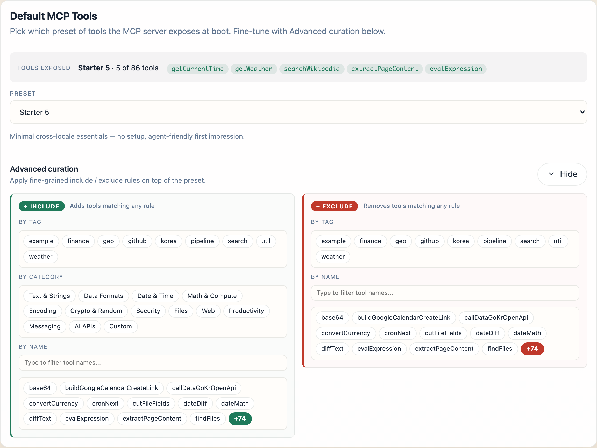
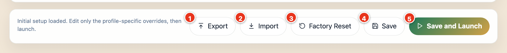
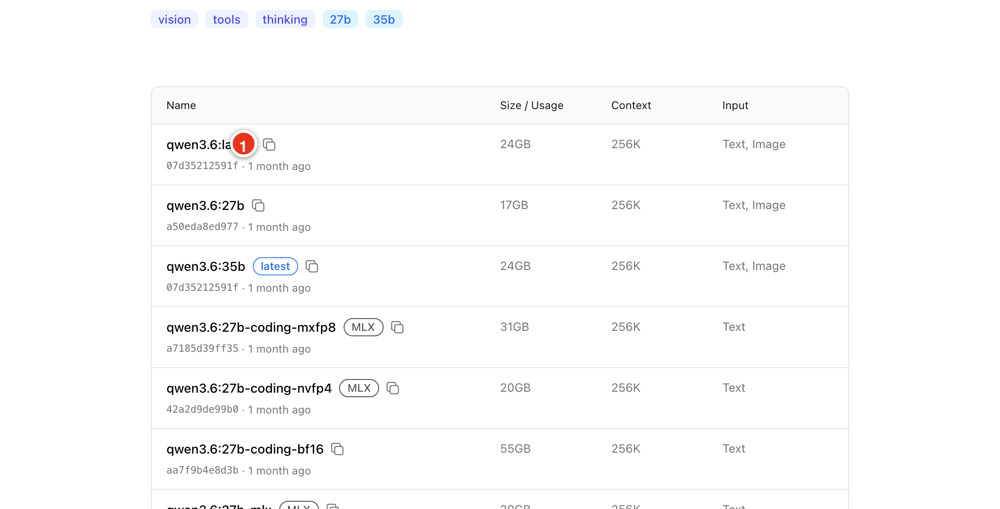
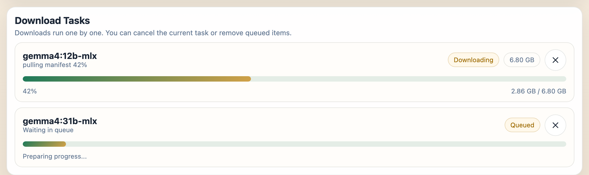
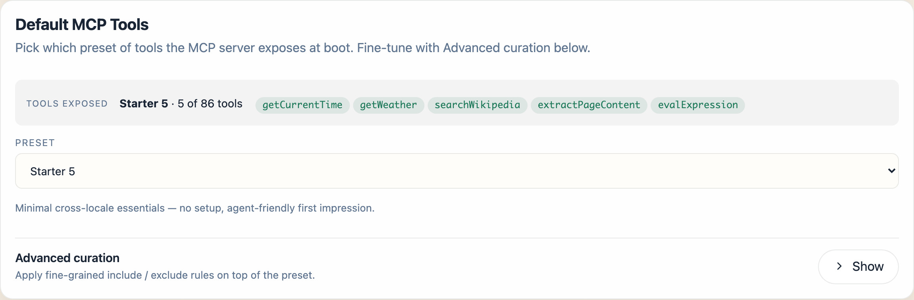

title: Desktop App
description: Install Spring AI Playground from the desktop installer - platform-specific install notes, configuration walkthrough, MCP tools curation, environment variables and secrets.

# Desktop App

The desktop installer is the recommended default. It wraps the Electron launcher, the JVM, and the Spring Boot fat JAR into a single platform installer (DMG / EXE / DEB / RPM) - no separate Java toolchain, no manual Docker setup. Compared with [Docker or From Source](alternative-runtimes.md), the desktop path adds a built-in configuration editor with provider starter templates, OS-encrypted secret storage for API keys, and an Ollama model manager.

For Docker or source / fat-JAR runs instead of the desktop installer, see [Alternative Runtimes](alternative-runtimes.md). For universal post-install steps (Your First Five Tasks, model configuration, telemetry), see [Getting Started](index.md).

## Download the Desktop Installer

Pick your installer from the [Home page](../index.md#1-download-the-desktop-app). Each badge resolves to the latest published release automatically and opens a confirm dialog with filename, size, and the typical OS save path. If you prefer the raw asset list, browse the [Releases page](https://github.com/spring-ai-community/spring-ai-playground/releases) directly.

The desktop package wraps the launcher and the backend runtime together, so this is the simplest way to get started without manually running Docker or Maven.

Want to confirm the file you downloaded is genuine? See [Verify Your Download](index.md#verify-your-download) on the hub page.

## Platform-specific install notes

### macOS

If you install from a DMG, drag the app into **Applications** before launching it. Do not run it directly from the mounted DMG, and eject the DMG after copying.

Gatekeeper may block the install flow in two places:

#### 1. Open the installer (DMG)

When you open the downloaded DMG, macOS may show a warning such as "cannot be opened because the developer cannot be verified."

If you trust the release source:

- Try opening the DMG.
- If macOS blocks it, go to **System Settings > Privacy & Security** and click **Open Anyway**.

#### 2. Launch the installed app

After copying `Spring AI Playground.app` into `/Applications`, macOS may block the first app launch again.

If that happens:

- Open the app once.
- Then go to **System Settings > Privacy & Security** and click **Open Anyway**.

If the app still doesn't open because it remains quarantined, and you trust the app, one practical workaround is:

```bash
xattr -dr com.apple.quarantine "/Applications/Spring AI Playground.app"
```

### Windows

The most common warning appears when you run the downloaded installer (`.exe`).

If Microsoft Defender SmartScreen shows a warning such as "Windows protected your PC" or says the app is unrecognized:

- Click **More info**
- Then click **Run anyway**

In most cases, the installer is the main warning point. Repeated blocking after installation is less common than on macOS.

### Linux

Separate Gatekeeper- or SmartScreen-style reputation warnings are uncommon.

Install the package using the format that matches your distribution:

- `.deb` for Debian or Ubuntu-based systems
- `.rpm` for Fedora, RHEL, Rocky Linux, AlmaLinux, openSUSE, and similar RPM-based systems

You usually only need to complete the normal package-install confirmation steps, which may include an administrator password.

## What the Desktop App Gives You

The desktop launcher includes a built-in configuration editor. In practical terms, that means:

- provider-specific starter settings for Ollama, OpenAI, and OpenAI-compatible servers
- YAML override editing instead of forcing you to edit the full bundled config
- environment-variable entry for API keys and tool secrets
- JVM options and application arguments for launch-time tuning
- import, export, save-as, delete, factory reset, and save-and-launch workflows
- automatic [MLX model selection](#apple-silicon-and-mlx-models) on Apple Silicon for faster local inference

## How the Desktop Config Works

The launcher does not expose the entire built-in config directly. Instead, the editor shows only the override YAML for the selected setting, and at launch that override is merged on top of the bundled default configuration.

That behavior is reflected in the desktop UI:

- selected config and setup notes
- provider type selector: `Ollama`, `OpenAI`, `OpenAI-Compatible`
- saved setting selection and `Save As`
- environment-variable management
- JVM settings
- `Save and Launch`

This makes it much easier to keep multiple clean launch profiles without hand-managing full runtime configuration files.

## Default MCP Tools Curation

Preset selection for the built-in MCP server happens **inside the configuration editor**, on the [Default MCP Tools card](#8-pick-your-default-mcp-tools) (step 8 of the walkthrough below). The first launch opens Configure Spring AI Playground; pick a preset before clicking Save and Launch and that choice is written to `<home>/spring-ai-playground/tool/save/default-tools-preference.json`. Without an explicit pick the app falls back to `Starter 5` - the cross-locale defaults that need no API keys.

The card writes `default-tools-preference.json`; the same preference can also be pinned via CLI / yaml. The app reads it at startup to decide which built-in tools are **Local-Passed (active)**. Tool Studio's **Built-in MCP Server Native Tools** drawer is a separate concern - it picks which Local-Passed tools the built-in MCP server *exposes*, not which are active.

The five presets:

- `Starter 5` (default, no API keys) - `getCurrentTime`, `getWeather`, `searchWikipedia`, `extractPageContent`, `evalExpression`.
- `Dev Essentials` - local dev utilities (`uuid`, `hash`, `base64`, `jwtDecode`, `regexExtract`) plus `getCurrentTime` and `evalExpression`.
- `Korea Toolkit (free)` - free Korean services (Upbit, Bithumb, iTunes K-pop, K-beauty search) plus `getCurrentTime` and `evalExpression`.
- `File Toolkit` - filesystem pipeline (`readTextFile`, `listDir`, `grepFile`, `findFiles`, `sliceFile`, `sortFile`, `cutFileFields`) plus `getCurrentTime` and `evalExpression`. Set `TOOL_STUDIO_FS_BASE` to pin a custom workspace root.
- `Everything` - exposes every default tool. Heavy MCP catalog.

The non-Starter presets each carry only `getCurrentTime` and `evalExpression` from Starter 5 by design - they do not stack on top of it.

**Advanced curation** stays folded by default in the editor - you click `Show` to open it. The details below mirror that folded section:

??? note "Show details"

    Clicking **Advanced curation → Show** expands an Include / Exclude pair: add tools by tag, by category, or by name; remove tools by tag or by name. The chip pickers populate from the live catalog when the section opens (a brief flash of `Loading...` is normal - that's the IPC fetch).

    
    *The same card with `Advanced curation` expanded - Include (`+`) on the left adds tools matching any rule; Exclude (`-`) on the right removes them. Rules layer in this order: name-add → tag-add → category-add → name-remove → tag-remove → category-remove.*

For the full preset contents, the CLI override, and the migration note from the prior `defaultToolOverrides.json`, see [Tool Studio → Pre-built Example Tools](../features/tool-studio/index.md#pre-built-example-tools).

## Desktop Configuration Walkthrough

The launcher's **Configure Spring AI Playground** screen opens on the very first launch and any later launch where you re-enter configuration mode. Once you have saved a configuration and chosen a preset, subsequent launches reuse them automatically and skip straight to the app.

### 1. Read the Setup Notes First

The first card is **Current Config and Setup Notes**. It explains the active setting before you edit the YAML below.


- `Selected Config`: the active saved setting name
- `Base Setup`: the launcher hides bundled defaults and only lets you edit overrides
- `How It Runs`: the selected YAML is applied on top of the built-in default configuration at launch

If the selected setting includes an embedding model, the launcher also shows an **Embedding model warning**. That warning matters because changing the embedding model after documents were already indexed can leave existing vector data inconsistent until you re-import or rebuild the vector database.

### 2. Choose a Config Type

The main editor card is **Spring AI Playground Config**.


Within that card, `Config Type` chooses the backend family for the current setting:

- `Ollama`
- `OpenAI`
- `OpenAI-Compatible`

This selector changes the kind of starter setting you are working with. It does not expose the full bundled configuration. It switches the saved-setting list and the override YAML editor to the selected backend family.

### 3. Choose a Saved Setting

`Setting Name` selects a saved launcher profile for the chosen config type.


In the current desktop build:

- `Ollama` starts with the built-in `Ollama` setting
- `OpenAI` starts with the built-in `OpenAI` setting
- `OpenAI-Compatible` starts with built-in compatible profiles such as `OpenAI Compatible - Ollama`, `OpenAI Compatible - llama.cpp`, `OpenAI Compatible - TabbyAPI`, `OpenAI Compatible - LM Studio`, and `OpenAI Compatible - vLLM`

`OpenAI-Compatible` is intended for servers that expose an OpenAI-style API but are not the official OpenAI endpoint. For the base URL and YAML each compatible runtime expects (LM Studio, vLLM, llama.cpp, TabbyAPI), see [External Connections → OpenAI-compatible servers](external-connections.md#switching-to-openai-compatible-servers).

### 4. Save, Clone, Delete, or Reset Settings

You manage settings without ever editing the bundled base configuration. Two buttons sit on the **Spring AI Playground Config** card itself (next to the `Save As` field, shown in the screenshot in step 2):

- `Save As` - creates a new saved setting from the current YAML and launcher state; type a name in the field first
- `Delete` - removes the currently selected saved setting

Every other action lives in the **action bar pinned to the bottom of the screen**, which stays visible no matter which cards are expanded. The numbered markers on the screenshot match the list below:



1. **Export** - writes the current setting to a portable config file you can share or back up
2. **Import** - loads a previously exported config file
3. **Factory Reset** - deletes all saved configs, profiles, and stored API keys, then restarts the launcher
4. **Save** - stores the current launcher state without starting the app
5. **Save and Launch** - saves first, then boots Spring AI Playground; this is the button you use for a normal launch

Config export intentionally leaves out local environment-variable values for safety.

### 5. Edit Only the Override YAML

The YAML editor is intentionally scoped to override content, not the full base file. At launch, the selected YAML is merged on top of the bundled default configuration.

That design keeps the common configuration flow simpler:

- keep a stable bundled default
- store only what differs for this setting
- switch between clean launch profiles quickly

For every property the bundled configuration supports and its default value, see the [Configuration reference](configuration.md).

### 6. Understand the Ollama Startup Card

When `Config Type` is set to `Ollama`, the launcher shows an additional **Ollama Startup** section.


That section shows:

- the Ollama endpoint, install status, connection status, and detected version
- the configured default chat model and default embedding model
- installed chat and embedding models, with the currently configured defaults highlighted
- whether a configured model appears to be installed, not installed, or unknown because Ollama is unreachable

The action area also includes:

- `Check Connection`
- `Open Ollama Download Page`
- `Download and Manage Ollama Models`: opens the separate [Download and Manage Ollama Models](#7-download-and-manage-ollama-models) guide below
- `Do not check Ollama at startup`

This section is currently shown for the `Ollama` config type. Even if an `OpenAI-Compatible` profile still uses Ollama for embeddings, the dedicated Ollama startup card is not shown automatically in this first-page flow.

On Apple Silicon the model names shown here are the MLX-optimized builds (for example `qwen3.5:4b-mlx`); see [Apple Silicon and MLX models](#apple-silicon-and-mlx-models) for why.

### 7. Download and Manage Ollama Models

The `Download and Manage Ollama Models` button on the [Ollama Startup card](#6-understand-the-ollama-startup-card) above opens a separate model-manager window. This is where you pull the chat and embedding models your setting needs before you launch. The window starts with profile context at the top: the selected config name, Ollama install status, endpoint, and current connection state.


#### Finding and downloading a model by name

The `Download by model name` field takes an exact Ollama model identifier (`model` or `model:tag`) and queues a download. The reliable way to get that identifier right is to copy it straight from the model's tag list on ollama.com.

`Find on Ollama` opens the Ollama model search in your browser, pre-filled with whatever you typed. Open the model you want - for example [qwen3.6](https://ollama.com/library/qwen3.6) - then open its **Tags** list. Every variant is listed there, and hovering a row reveals a **copy button** at the end of it. For an Apple-Silicon build, hover the `-mlx` tag you want (for example `qwen3.6:27b-mlx`) and click its copy button (marker 1):



Then it is just copy and paste:

1. in the tags list, hover the model variant you want and click its **copy button** (marker 1)
2. switch back to the manager and paste into `Download by model name` - keep only the model identifier (for example `qwen3.6:27b-mlx`)
3. click the download button - labelled `Queue download` - to add it to the queue

Queuing only pulls the model into Ollama; it does not change the current YAML profile by itself. To make a downloaded model the default, set it in the config YAML ([step 2](#2-choose-a-config-type) of the walkthrough).

#### Recommended and Downloaded tabs

The default `Recommended` tab lists the embedding model configured for the current profile first, then the chat models from the active YAML profile:


Each row shows whether the model is already downloaded, badges such as `Embedding`, `Chat`, `Default embedding`, and `Current chat model`, and a per-model download button that queues that model when it is not yet available locally.

The `Downloaded` tab focuses on models that already exist in the local Ollama store, grouped by type:


- `Copy model as...` duplicates a model under a new Ollama name
- `Delete model` removes the selected model from the local Ollama store

#### The download queue

Anything you queue - from `Download by model name`, the `Recommended` tab, or a per-model download button - lands in the **Download Tasks** panel at the top of the manager. Downloads run one at a time.



Each task shows a live progress bar, the downloaded / total size, and a status badge (`Queued`, `Preparing`, `Downloading`, `Completed`, `Canceled`, or `Failed`). While a task is still `Queued`, `Preparing`, or `Downloading`, the **Cancel (x)** button stops it; a `Failed` task shows a **Retry** button instead. Canceling the running download lets the next queued model start.

### 8. Pick Your Default MCP Tools

The next card down the screen is **Default MCP Tools**. It chooses which preset of built-in tools the MCP server exposes the moment it boots.



Pick a preset - the default `Starter 5` needs no API keys. The full per-preset tool lists, the include / exclude **Advanced curation** rules, and the CLI / YAML equivalents are all covered in [Default MCP Tools Curation](#default-mcp-tools-curation) above; the tools themselves live in [Tool Studio](../features/tool-studio/index.md).

### 9. Use Environment Variables for Keys and Secrets

When the selected setting or bundled tools need secrets, the launcher shows an **Environment Variables** section. This is where you keep API keys and tool secrets out of YAML. For the full list of configuration knobs (beyond secrets) and how each maps to a property or env var, see the [Configuration reference](configuration.md).


Typical entries include:

- `OPENAI_API_KEY`
- `GOOGLE_API_KEY`
- `GOOGLE_PSE_ID`
- `SLACK_WEBHOOK_URL`
- custom variables added with `Add Environment Variable`

The launcher behavior is important here:

- values are stored per saved setting
- values are exported only for the app launch process
- values are not meant to be written into the YAML override
- the UI can list both backend-required keys and optional tool-related keys

The card also shows the current **secret-storage mode**:

- **Encrypted by your OS secure storage** - Electron's `safeStorage` API is using the platform secure store under the hood: **macOS Keychain**, **Windows DPAPI** (current-user scope), or **libsecret / GNOME Keyring / KWallet** on Linux. The launcher writes the ciphertext to `<userData>/spring-ai-playground/config/secrets.store` on disk; the decryption key never leaves the OS keychain.
- **OS-backed encryption unavailable - stored as plain text in this session** - fallback when no platform secure store is reachable (typical on bare Linux without a keyring daemon, or in some sandboxed Linux containers). The same file is written in plain JSON so values still survive the launch, but they are no longer encrypted at rest.

The launcher's secret workflow is the same in both modes:

- values are stored **per saved setting** (`configId` keyed)
- values are **exported only as environment variables to the launched Spring AI Playground JVM** - they never get written into the YAML override or into chat history
- the secrets file is rewritten on every save; a legacy `secrets.json.enc` from older versions is auto-renamed to `secrets.store` on first read
- on macOS and Linux the secrets file is written with owner-only permissions (`chmod 600`) so other accounts on the machine cannot read it

This is why the env-var pathway is the recommended place for `OPENAI_API_KEY`, `SLACK_WEBHOOK_URL`, `GOOGLE_API_KEY`, and any other tool-side secret - the value reaches `Tool Studio` and the bundled tools through `System.getenv()` rather than through a config file checked into git.

**The resolved value is also masked from `console.log` output** in Tool Studio's Debug Console and in Agentic Chat's tool-call trace - any tool that references the env var as a static variable (or builds a string containing its resolved value) sees the secret substring replaced before the line surfaces in the UI. See [Tool Studio → Built-in JavaScript Helpers - `console.log`](../features/tool-studio/index.md#built-in-javascript-helpers) for the masking rule details (anchored full-string env-refs are auto-collected; substring-concatenated values are masked best-effort).

For the current desktop behavior:

- `OpenAI` requires `OPENAI_API_KEY` before launch
- `OpenAI-Compatible` can show an API key field, but it is only needed when that compatible server expects one
- `Ollama` usually does not require an API key for the backend itself, but optional tool integrations may still use environment variables

### 10. Set JVM and App Args Only When Needed

The **JVM Settings** card stays folded by default in the editor - you click `Show` to open it - because most launches do not need it. The details below mirror that folded card:

??? note "Show details"

    The desktop editor includes a **JVM Settings** section for launch-time runtime options.

    

    The expanded section has two fields:

    - **JVM Options** - flags passed to the Java process, such as `-Xmx2g` to raise the heap limit
    - **Application Args** - Spring Boot arguments appended to the launch, such as `--logging.level.root=INFO`

    These are launch-time settings, not provider secrets. The action row beneath every card - `Export`, `Import`, `Factory Reset`, `Save`, and `Save and Launch` - stays visible regardless of which sections are expanded.

### 11. Recommended First-Launch Flow

For a clean first launch:

1. choose `Ollama`, `OpenAI`, or `OpenAI-Compatible`
2. review the generated YAML override instead of trying to recreate the full application config
3. fill only the environment variables required by that backend or by the tools you actually plan to use
4. for `Ollama`, make sure Ollama is installed, running, and has the models you selected
5. click `Save and Launch`

### 12. What You See After Save and Launch

After you click `Save and Launch`, the launcher opens a separate startup window while Spring AI Playground boots in the background.


That startup window has four read-only fields:

- `Current Config` - the saved setting being launched
- `Config File` - the resolved YAML file path used for this launch
- `Final Launch Command` - the full Java command the launcher built for Spring AI Playground
- `Launch Log` - live startup output: Ollama checks, config resolution, server readiness messages, and (on Apple Silicon) the [MLX upgrade line](#apple-silicon-and-mlx-models)

The numbered markers on the screenshot point to the controls along the action row:

1. **Back to Settings** - stops the current launch and returns to the configuration screen
2. **Auto-copy launch logs to clipboard** (checkbox) - when ticked, each new log line is copied to the clipboard as it streams, so you can paste a complete startup log into a bug report without scrolling back
3. **Retry Check** - reruns the readiness checks if startup is taking longer than expected
4. **Quit** - stops the launch and closes the launcher
5. **close (x)** - the control in the top-right corner; does the same as `Quit`

If startup takes longer than expected, the launcher stays open and keeps streaming logs instead of failing immediately. This is especially helpful when local models are still warming up or downloads are still completing.

## Apple Silicon and MLX models

On Apple Silicon Macs, the launcher automatically prefers Apple's **MLX**-optimized Ollama model builds, which run significantly faster than the generic builds on M-series hardware. You do not need to enable anything - the launcher handles it whenever the config type is `Ollama` and it detects an `arm64` machine.

- **MLX starter defaults.** The Ollama starter setting ships `-mlx` model variants: the default chat model is `qwen3.5:4b-mlx`, and the `spring.ai.playground.chat.models` list is the `-mlx` build of each suggested model (`qwen3.5:2b-mlx`, `qwen3.5:9b-mlx`, `gemma4:e4b-mlx`, and so on). The Ollama Startup card and the Ollama model manager then surface those `-mlx` builds.
- **Launch-time upgrade.** When you click `Save and Launch`, the launcher looks at the configured chat model. If a matching `-mlx` build is already installed in Ollama, it transparently upgrades the launch to that build and records it in the Launch Log:

    ```
    Apple Silicon: upgraded chat model qwen3.5:4b to MLX build qwen3.5:4b-mlx for launch.
    ```

    Only plain `-mlx` builds are auto-selected; `-mlx-bf16` variants are left untouched. If the `-mlx` build is not installed locally, the configured model launches unchanged.

Because the launcher owns this decision, it passes `--spring.ai.playground.ollama.mlx-auto-select=false` to the JVM so the backend does not resolve the model a second time. On Intel Macs, Windows, and Linux the configured model name is used as-is.

To install the `-mlx` builds, open [Download and Manage Ollama Models](#7-download-and-manage-ollama-models); the `Recommended` tab lists the `-mlx` models for the active profile.

## Further Reading

- [Getting Started](index.md) - universal post-install steps, model configuration, telemetry
- [Configuration](configuration.md) - every property / env var / default, and how to set it per launch mode
- [Alternative Runtimes](alternative-runtimes.md) - Docker and source / fat-JAR alternatives
- [Features → Tool Studio](../features/tool-studio/index.md) - author tools that the built-in MCP server exposes
- [Tutorials](../tutorials/index.md) - end-to-end workflows
