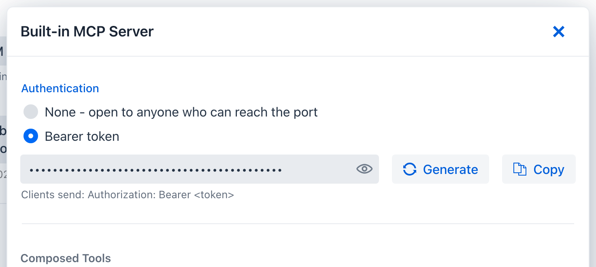

title: External connections
description: Connect Spring AI Playground to your AI client (Claude, Cursor, Codex, VS Code), set up model providers (Ollama, OpenAI), and add external MCP servers.

# External connections

Spring AI Playground sits between three kinds of connection - see [How it all connects](../index.md#how-it-all-connects) for the picture. This is the practical guide to wiring each one:

1. the **AI clients** that consume the built-in MCP server,
2. the **model providers** it runs on, and
3. the **external MCP servers** it proxies.

## Connect your AI clients

The app publishes a built-in MCP server in the same process as the UI:

- **Streamable HTTP** - `http://localhost:8282/mcp` (change the port with `SERVER_PORT`)
- **stdio** - start with the `mcp-stdio` profile (`SPRING_PROFILES_INCLUDE=mcp-stdio`) for hosts that spawn a local process; see [Alternative Runtimes](alternative-runtimes.md#docker)

Most clients connect over Streamable HTTP. Drop the matching config below in - it points at the default endpoint and uses `spring-ai-playground` as the server name (rename it to anything you like).

**{ .provider-icon } Claude Code** - run ([docs](https://code.claude.com/docs/en/mcp)):

```bash
claude mcp add --transport http spring-ai-playground http://localhost:8282/mcp
```

**{ .provider-icon } Cursor** - `~/.cursor/mcp.json` ([docs](https://cursor.com/docs/mcp)):

```json
{
  "mcpServers": {
    "spring-ai-playground": { "url": "http://localhost:8282/mcp" }
  }
}
```

**{ .provider-icon } VS Code** (Copilot) - `.vscode/mcp.json` ([docs](https://code.visualstudio.com/docs/agent-customization/mcp-servers)):

```json
{
  "servers": {
    "spring-ai-playground": { "type": "http", "url": "http://localhost:8282/mcp" }
  }
}
```

**{ .provider-icon } Codex** (CLI) - `~/.codex/config.toml` ([docs](https://developers.openai.com/codex/mcp)):

```toml
[mcp_servers.spring_ai_playground]
url = "http://localhost:8282/mcp"
```

**{ .provider-icon } opencode** - `~/.config/opencode/opencode.json` ([docs](https://opencode.ai/docs/mcp-servers/)):

```json
{
  "mcp": {
    "spring-ai-playground": { "type": "remote", "url": "http://localhost:8282/mcp", "enabled": true }
  }
}
```

**{ .provider-icon } OpenClaw** - `openclaw.json` ([docs](https://docs.openclaw.ai/cli/mcp)):

```json
{
  "mcpServers": {
    "spring-ai-playground": { "url": "http://localhost:8282/mcp" }
  }
}
```

Cline, Windsurf, Zed, and other MCP hosts follow the same pattern - add a Streamable HTTP server pointing at `http://localhost:8282/mcp`. Check your client's MCP docs for the exact field names.

> { .provider-icon } **Claude Desktop.** Its custom connectors (**Settings -> Connectors**) connect from Anthropic's cloud, so they cannot reach a `localhost` server. To use the playground from Claude Desktop, either run it as a stdio server with the `mcp-stdio` profile and add it to `claude_desktop_config.json`, or expose the HTTP endpoint through a tunnel. See [Build custom connectors via remote MCP](https://support.claude.com/en/articles/11503834-build-custom-connectors-via-remote-mcp-servers).

Once connected, the client sees your Local-Pass tools - and any proxied or composed external tools - in its `tools/list`.

### Require a bearer token { #bearer-token }

By default the built-in server answers anyone who can reach the port, which is fine on loopback and wrong anywhere else. A shared-secret bearer token closes it, and there are two ways to set one.

**In the app.** Open **MCP Server**, click the gear icon, and under **Authentication** switch from **None** to **Bearer token**. A 256-bit token is generated for you (the eye reveals it, **Generate** rotates it, **Copy** puts it on the clipboard); **Apply** turns the gate on immediately, with no restart. Switching back to **None** reopens the endpoint. The token is stored encrypted under `.security/` in the app home, bound to this machine and user, and the section can only be viewed and changed from a browser on the machine that runs the app.

{ loading=lazy }

**By configuration.** Set `spring.ai.playground.mcp-server.auth-token` - the declarative route for Docker and shared deployments. Configuration wins: while the property is set, the Authentication section is read-only and says so. Generate a token once:

```bash
openssl rand -hex 32
```

Then supply it through whichever launch mode you use. The environment-variable name is the relaxed-binding form of the property:

| Mode | How |
|---|---|
| **Desktop app** | Launcher -> environment-variable editor: `SPRING_AI_PLAYGROUND_MCP_SERVER_AUTH_TOKEN=<token>`. Or in the YAML editor: `spring.ai.playground.mcp-server.auth-token: <token>`. |
| **Docker** | `docker run -e SPRING_AI_PLAYGROUND_MCP_SERVER_AUTH_TOKEN=<token> ...` |
| **Source / JAR** | `export SPRING_AI_PLAYGROUND_MCP_SERVER_AUTH_TOKEN=<token>`, or `java -Dspring.ai.playground.mcp-server.auth-token=<token> -jar ...` |

Prefer the environment variable over YAML so the token stays out of files you might share.

What changes once it is set:

- `/mcp` requires `Authorization: Bearer <token>`. A missing or wrong token gets `401` with `WWW-Authenticate: Bearer`.
- The web UI is not gated. The app's own loopback client picks the token up automatically, so Tool Studio, the Inspector, and Agentic Chat keep working with no extra setup.
- While no token is set the app logs a startup warning that the built-in server is unauthenticated, and on a non-loopback bind the Home status pill reads `no auth`; with a token it reads `token required`.

Every external client then has to send the header:

```bash
claude mcp add --transport http spring-ai-playground http://localhost:8282/mcp --header "Authorization: Bearer <token>"
```

```json
{
  "mcpServers": {
    "spring-ai-playground": {
      "url": "http://localhost:8282/mcp",
      "headers": { "Authorization": "Bearer <token>" }
    }
  }
}
```

The `headers` map sits next to `url` in Cursor, VS Code, and most JSON-configured hosts; check your client's MCP docs for the exact field. Verify from a shell:

```bash
curl -i -X POST http://localhost:8282/mcp -H "Content-Type: application/json" -H "Accept: application/json, text/event-stream" -d '{"jsonrpc":"2.0","id":1,"method":"initialize","params":{"protocolVersion":"2025-06-18","capabilities":{},"clientInfo":{"name":"curl","version":"0"}}}'
```

Without the `Authorization` header this returns `401`; with it, `200` and an `Mcp-Session-Id`.

This is a static shared secret, not OAuth: one token, no expiry, rotated with **Generate** and **Apply** (or by changing the configured value and restarting). It is meant for a server you run for yourself or a small team behind TLS. The stdio transport needs no token because the client spawns the process itself. For per-user identity on the built-in server, the [OWASP MCP07 notes](../mcp-owasp-top-10.md) describe adding an OAuth2 resource server yourself; the app does not bundle one.

## Connect model providers

Spring AI Playground is provider-agnostic, but the runtime defaults are tuned for a **local-first Ollama** experience. The app is currently centered on three runtime paths: **Ollama**, **OpenAI**, and **OpenAI-compatible** servers. (Spring AI itself supports many more providers - Anthropic, Google, Amazon, and others - but those are not part of the default desktop flow; you would fork and rebuild for them. See the [Spring AI Chat Models reference](https://docs.spring.io/spring-ai/reference/api/chatmodel.html#_available_implementations).)

### { .provider-icon } Ollama (default)

The default profile is `ollama` - it serves both chat and embeddings locally, with **no API key**. Defaults:

- chat model: `qwen3.5:4b`
- embedding model: `qwen3-embedding:0.6b`
- selectable chat models: `qwen3.5:2b/4b/9b`, `qwen3.6:27b/35b`, `qwen3.8:27b`, `gemma4:e2b/e4b/12b/31b`, `gpt-oss:20b`, `deepseek-r1:8b`

Missing models are pulled automatically when first used; the selectable list controls the in-app model picker. In Docker, point at a host Ollama with `SPRING_AI_OLLAMA_BASE_URL`.

### { .provider-icon } OpenAI

1. provide `OPENAI_API_KEY`,
2. activate the `openai` profile (or pick the OpenAI setting in the desktop launcher),
3. launch.

Where you set the key depends on your install path: in the desktop app use the launcher's [Environment Variables section](desktop.md#9-use-environment-variables-for-keys-and-secrets) and pick the `OpenAI` config type; for Docker or source see [Alternative Runtimes -> Switching to OpenAI](alternative-runtimes.md#switching-to-openai).

### OpenAI-compatible servers { #switching-to-openai-compatible-servers }

Point the `openai` provider at any server that exposes an OpenAI-style `/v1` API - `LM Studio`, `vLLM`, `llama.cpp`, `TabbyAPI`, `Ollama`, and others:

```yaml
spring:
  ai:
    model:
      chat: openai
      embedding: ollama
    openai:
      api-key: "not-used"              # a real key if the server requires auth
      base-url: "http://localhost:1234/v1"
      chat:
        options:
          model: "your-loaded-model"
          # extra-body: { top_p: 0.95, repetition_penalty: 1.1 }   # provider-specific, optional
```

| Server | `base-url` | notes |
|---|---|---|
| { .provider-icon } Ollama (compatible mode) | `http://localhost:11434/v1` | local, no key |
| { .provider-icon } LM Studio | `http://localhost:1234/v1` | `model` = the loaded model |
| { .provider-icon } vLLM | `http://localhost:8000/v1` | `model` = the HF repo id |
| { .provider-icon } llama.cpp | `http://localhost:8080/v1` | accepts `extra-body` (e.g. `top_k`) |
| { .provider-icon } TabbyAPI | `http://localhost:5000/v1` | set a real `api-key` |

Other useful keys: `completions-path` (only if the server deviates from the standard chat-completions path), `http-headers` (custom auth/transport), and `maxTokens` / `maxCompletionTokens` (use one, not both). Test the target with a `/v1/models` request first to confirm the exact model names and endpoint shape. Full field reference: [Spring AI OpenAI Chat](https://docs.spring.io/spring-ai/reference/api/chat/openai-chat.html).

> **Embeddings and RAG.** If you change the embedding model after documents are already indexed, existing vector data can become inconsistent - re-import or rebuild the vector database before trusting retrieval again.

## Connect external MCP servers

The app ships a curated catalog of preset MCP servers (Gmail, Slack, GitHub, Notion, Stripe, BigQuery, and more). On the **MCP Server** screen, find the entry in the **Inactive MCP** section, click it to prefill the form, fill any `${ENV_VAR}` placeholders, and **Save & Connect**. See [Default MCP Servers](../features/default-mcp-catalog/index.md) for the full per-category browse.

For a server that is **not** in the catalog, use **Add Custom Server** on the same screen: pick the transport (Streamable HTTP / SSE / stdio), enter the URL or command, and set custom headers, OAuth 2.1, or `${ENV_VAR}` substitution as needed. See [MCP Server -> Add Custom Server](../features/mcp-server/index.md#add-custom-server).

Whatever you connect, you can re-publish it - **proxy and compose** its tools onto your own built-in server. Re-published tools are governed exactly like the ones you author: each gets a **Risk Level** score plus a description-poisoning scan ([AI Agent Tool Safety](../safety-architecture.md), [MCP Server Safety](../mcp-server-safety.md)), a per-tool **human-in-the-loop** approval gate ([Human-in-the-Loop](../features/human-in-the-loop.md)), and full **Observability** ([dashboards](../features/observability/index.md)) - even for a server you did not build. You set the risk cap and approval per tool on the [MCP Server Proxy](../features/mcp-server/proxy.md), so your AI clients reach everything on one governed endpoint.
