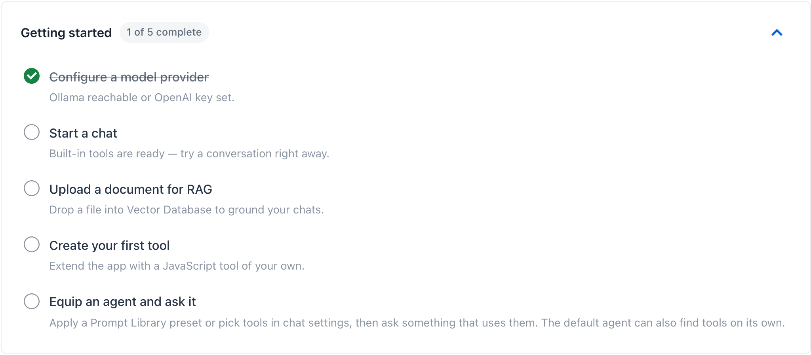

title: Getting Started
description: Pick your install path - desktop app, Docker, or source - then connect a model provider and run your first agentic chat.

# Getting Started

Spring AI Playground ships through three runtimes that all boot the same Spring Boot application: a Vaadin UI on `http://localhost:8282` and a built-in `streamable-http` MCP server in the same process. Pick the path that matches your situation, install, then return here for the post-install steps below.

## Pick your install path

| Path | Best for | Bundled | Java toolchain |
|---|---|---|---|
| **[Desktop App](desktop.md)** *(recommended)* | First-time users; anyone who wants a one-click installer with a configuration editor, OS-encrypted secret storage, and a built-in Ollama model manager | Electron launcher + JVM + Spring Boot fat JAR | not required (bundled) |
| **[Docker](alternative-runtimes.md#docker)** | Containerised deployments; users who already run Docker; quick MCP stdio setup for Claude Desktop without installing Java | Spring Boot fat JAR + JVM in the published container image | not required |
| **[From Source](alternative-runtimes.md#from-source)** | Developers modifying the codebase; Java users who want fat-JAR portability and full GraalVM speed for the JS sandbox | nothing - you build it | Java 21+ (GraalVM recommended) |

The desktop installer is the recommended default. Docker and direct source execution are equally supported alternatives - same product, same UI, same MCP server.

## Install at a glance

Quick start for each path; full details in the linked pages.

### Desktop installer

Pick your platform installer from the [Home page download badges](../index.md#1-download-the-desktop-app), or browse the [Releases page](https://github.com/spring-ai-community/spring-ai-playground/releases) directly. The package wraps the launcher and the Spring Boot runtime - no Docker or Maven required.

First-launch reputation warnings are common; if you trust the release source:

- **macOS** - Gatekeeper may block the DMG and the first app launch. Open **System Settings > Privacy & Security** and click **Open Anyway** in both places. Quarantine fallback if the app still refuses to open: `xattr -dr com.apple.quarantine "/Applications/Spring AI Playground.app"`.
- **Windows** - Microsoft Defender SmartScreen may flag the installer with "Windows protected your PC". Click **More info → Run anyway**.
- **Linux** - `.deb` / `.rpm` install with standard package confirmation; reputation warnings are uncommon.

Full platform notes, configuration walkthrough, MCP tools curation, and Ollama model manager: [Desktop App](desktop.md).

### Docker container

```bash
docker run -d -p 8282:8282 \
  -e SPRING_AI_OLLAMA_BASE_URL=http://host.docker.internal:11434 \
  -v spring-ai-playground:/root \
  ghcr.io/spring-ai-community/spring-ai-playground:latest
```

The container ships with Vaadin UI + `streamable-http` MCP on port 8282 by default. Add `-e SPRING_PROFILES_INCLUDE=mcp-stdio` for MCP stdio integration with Claude Desktop or Claude Code (the web UI keeps booting alongside).

Full options (volume layout, host networking, OpenAI switching, Claude Desktop config): [Alternative Runtimes → Docker](alternative-runtimes.md#docker).

### Local source clone

```bash
git clone https://github.com/spring-ai-community/spring-ai-playground.git
cd spring-ai-playground
./mvnw clean install -Pproduction -DskipTests=true
./mvnw spring-boot:run
```

Requires Java 21+ (GraalVM recommended for full-speed JS sandbox). The Vaadin UI opens at `http://localhost:8282`. A published fat JAR is also available alongside the desktop installers on the [Releases page](https://github.com/spring-ai-community/spring-ai-playground/releases) - handy for `java -jar` deployments without a source clone.

Full options (fat JAR, `mcp-stdio` profile, Claude Desktop config): [Alternative Runtimes → From Source](alternative-runtimes.md#from-source).

## Your First Five Tasks

Once Spring AI Playground is running through any of the three paths above, the **Home** screen shows a live checklist that mirrors the path below. Each item self-checks based on workspace state, so you can walk through them at your own pace.



1. **Configure a model provider** - Pick Ollama (default, local) or OpenAI. The provider pill on Home shows a green dot and "Ready" once the base URL is reachable (Ollama) or an API key is set (OpenAI). A red dot means the app cannot reach your provider - recheck the launcher config or env vars.
2. **Start a chat** - Agentic Chat is ready the moment a provider is connected. The app ships with the **Starter 5** tools exposed by default (`getCurrentTime`, `getWeather`, `searchWikipedia`, `extractPageContent`, `evalExpression`) and a wider 86-tool bundled catalog you can opt into through Tool Studio's **Built-in MCP Server Native Tools** drawer (or the launcher's **Default MCP Tools** card), so you can test end-to-end without writing any code.
3. **Upload a document for RAG** - Drop a PDF or text file into the Vector Database surface. The file is chunked, embedded, and indexed on the spot; retrieval becomes available inside chat immediately.
4. **Create your first tool** - Open Tool Studio, write a small JavaScript function, and define its sample arguments. A new tool starts as a **Draft** - invisible to MCP and to chat. Run it locally: if the test passes, it earns its **Local Pass** and is added live to the built-in MCP server the same moment. No restart, no redeploy. Agentic Chat picks it up immediately.
5. **Try an agentic workflow** - Ask the assistant: *"Use the weather tool for Seoul, then summarize what `searchWikipedia` returns about that city."* This exercises two Starter 5 tools in sequence and shows the full agentic path (plan → call tool → read result → call next tool → reply).

> Verifying your provider: the Home provider pill is the fastest sanity check. If it is stuck on "Checking..." or flips to red, open the desktop launcher startup card or run `curl $OLLAMA_BASE_URL` before proceeding.

## Built-in MCP Endpoint

No matter whether you run the app through the desktop launcher, Docker, or direct source execution, the built-in MCP endpoint is exposed at:

```text
http://localhost:8282/mcp
```

That endpoint is central to Tool Studio, MCP Inspector, and Agentic Chat with tools.

## External MCP Catalog

Beyond the built-in server, the app ships a **preset catalog of 57 MCP server connections** that appear in the MCP Server sidebar's **Inactive MCP** section - clicking an entry pre-fills the configuration form with the right transport, URL or stdio command, OAuth defaults, and `${ENV_VAR}` placeholders, so the easiest first external connection is a one-click activation. The catalog spans mail / calendar / chat / project trackers / code hosting / search / cloud / databases / payments / CRM / design plus two reference test servers (`MCP Everything`, `DeepWiki`). See the [MCP Catalog directory](../features/default-mcp-catalog/index.md) for the per-category browse and [MCP Server → Catalog & Sidebar Filtering](../features/mcp-server/index.md#catalog-sidebar-filtering) for the sidebar mechanics.

## Backend prerequisites

These prerequisites apply only when you choose a specific backend or runtime. The desktop installer already bundles the JVM and Spring Boot fat JAR, so no extra setup is needed just to install and open Spring AI Playground.

### If You Use Ollama

Use this setup when you want the default local-first chat and embedding flow.

- Download and install [Ollama](https://ollama.com/) on your machine.
- Run `ollama serve` or ensure the Ollama app is running.
- For prerequisite details, see the [Spring AI Ollama Chat Prerequisites](https://docs.spring.io/spring-ai/reference/api/chat/ollama-chat.html#_prerequisites).

Recommended models to pre-pull:

```bash
ollama pull qwen3.5
ollama pull gemma4
ollama pull qwen3-embedding:0.6b
```

`qwen3.5` is the recommended chat model for tool-calling and the [Tutorials](../tutorials/index.md). Pull `gemma4` as well if you want a stronger natural-language alternative for longer tool chains.

### If You Use OpenAI Instead of Ollama

If you switch to the `OpenAI` setting, Ollama is not required at startup. In that case, provide `OPENAI_API_KEY` in the desktop app's Environment Variables section (or as an env var to the Docker / source launch) and activate the OpenAI setting / profile.

For `OpenAI-Compatible` settings, whether Ollama is still required depends on the selected backend and whether embeddings still use Ollama.

The actual launch command for OpenAI depends on your install path - see [Switching to OpenAI](#switching-to-openai) below for cross-references.

## Model Configuration

Spring AI Playground is provider-agnostic, but the runtime defaults are intentionally optimized for a local-first Ollama experience.

### Auto-configuration

Spring AI Playground uses Ollama by default for local chat and embedding models. No API key is required for that default setup, which makes the initial local-first experience straightforward.

### Support for Major AI Model Providers

Spring AI as a framework supports many providers, including Ollama, OpenAI, Anthropic, Microsoft, Amazon, Google, and other integrations.

For the broader list of officially supported chat model integrations, see the [Spring AI Chat Models Reference Documentation](https://docs.spring.io/spring-ai/reference/api/chatmodel.html#_available_implementations).

Spring AI Playground itself is currently centered on these runtime paths:

- Ollama
- OpenAI
- OpenAI-compatible servers

In the desktop app, OpenAI-compatible support is mainly provided through starter templates and YAML override configuration rather than a larger first-class provider matrix.

If you want to use other Spring AI provider integrations, that is not part of the default desktop app flow. In practice, you would need to modify the source dependencies and configuration, then build and run your own customized version.

### Selecting and Configuring Ollama Models

The default profile is `ollama`, and the default setup uses Ollama for both chat and embeddings.

The current default model choices are:

- chat model: `qwen3.5:2b`
- embedding model: `qwen3-embedding:0.6b`
- selectable chat models: `qwen3.5:2b`, `qwen3.5:9b`, `qwen3.6:35b`, `gemma4:e4b`, `gpt-oss:20b`, `deepseek-r1:8b`

Important notes:

- missing Ollama models are automatically pulled when needed
- the selectable chat model list controls what appears in the Playground model selector
- changing the chat or embedding model changes the runtime defaults used by the application

### Switching to OpenAI

To switch to OpenAI:

1. provide `OPENAI_API_KEY`
2. activate the `openai` profile (or pick the OpenAI setting in the desktop launcher)
3. launch the application

The actual launch command depends on your install path:

- **Desktop App**: set `OPENAI_API_KEY` in the launcher's [Environment Variables section](desktop.md#7-use-environment-variables-for-keys-and-secrets), then pick the `OpenAI` config type and click `Save and Launch`.
- **Docker / From Source**: see [Alternative Runtimes → Switching to OpenAI](alternative-runtimes.md#switching-to-openai) for the `docker run -e ...` and `mvn` snippets.

If you want a broader overview of supported Spring AI provider options beyond the default Playground flows, see the main [Spring AI Documentation](https://spring.io/projects/spring-ai).

### Switching to OpenAI-Compatible Servers

You can also connect to OpenAI-compatible servers such as `llama.cpp`, `TabbyAPI`, `LM Studio`, `vLLM`, `Ollama`, or others that expose OpenAI-compatible endpoints.

Typical configuration points are:

- `api-key`: a real key if the server requires authentication, otherwise a placeholder like `not-used`
- `base-url`: the server root endpoint, often including `/v1`
- `model`: the exact model name registered on that server
- `completions-path`: only override this if the server does not follow the standard OpenAI chat completions path
- `extra-body`: optional provider-specific parameters
- `http-headers`: optional custom authentication or transport headers
- streaming support: works when the target server supports OpenAI-style streaming responses
- token controls: use `maxTokens` for standard models or `maxCompletionTokens` for reasoning-style models, but avoid setting both

Quick example using Ollama in OpenAI-compatible mode:

```yaml
spring:
  ai:
    model:
      chat: openai-sdk
      embedding: ollama
    openai-sdk:
      api-key: "not-used"
      base-url: "http://localhost:11434/v1"
      chat:
        options:
          model: "llama3.2"
```

`llama.cpp`

```yaml
spring:
  ai:
    model:
      chat: openai-sdk
      embedding: ollama
    openai-sdk:
      api-key: "not-used"
      base-url: "http://localhost:8080/v1"
      chat:
        options:
          model: "your-model-name"
          extra-body:
            top_k: 40
            repetition_penalty: 1.1
```

`TabbyAPI`

```yaml
spring:
  ai:
    model:
      chat: openai-sdk
      embedding: ollama
    openai-sdk:
      api-key: "your-tabby-key"
      base-url: "http://localhost:5000/v1"
      chat:
        options:
          model: "your-exllama-model"
          extra-body:
            top_p: 0.95
```

`LM Studio`

```yaml
spring:
  ai:
    model:
      chat: openai-sdk
      embedding: ollama
    openai-sdk:
      api-key: "not-used"
      base-url: "http://localhost:1234/v1"
      chat:
        options:
          model: "your-loaded-model"
          extra-body:
            num_predict: 100
```

`vLLM`

```yaml
spring:
  ai:
    model:
      chat: openai-sdk
      embedding: ollama
    openai-sdk:
      api-key: "not-used"
      base-url: "http://localhost:8000/v1"
      chat:
        options:
          model: "meta-llama/Llama-3-8B-Instruct"
          extra-body:
            top_p: 0.95
            repetition_penalty: 1.1
```

For best compatibility, make sure the target server supports OpenAI-style endpoints and model listing.

In practice, it is worth testing the target with a `/v1/models` request first so you can confirm the exact model names and endpoint shape before launching the app against it.

For the complete Spring AI OpenAI chat configuration model, see the [Spring AI OpenAI Chat Documentation](https://docs.spring.io/spring-ai/reference/api/chat/openai-chat.html).

### Important RAG Note

If you change the embedding model after documents have already been indexed, existing vector data can become inconsistent. Re-import or rebuild the vector database before trusting retrieval results again.

## Verify Your Download

Each release ships with two integrity guarantees. Verifying is optional, but recommended for production use.

Replace `<VERSION>` in the commands below with the version printed in the installer filename you downloaded (for example `0.2.0-M7`). On this page, JavaScript substitutes the latest release version automatically when GitHub is reachable.

### 1. SHA-256 checksum

Every installer has a matching `.sha256` file in the release assets. Compare the hash of your downloaded file with the contents of that file.

macOS / Linux:

```bash
shasum -a 256 -c spring-ai-playground-<VERSION>-mac-arm64.dmg.sha256
```

Windows (PowerShell):

```powershell
Get-FileHash spring-ai-playground-<VERSION>-win-x64.exe -Algorithm SHA256
# then compare the value with the one inside the .sha256 file
```

### 2. Sigstore build provenance (SLSA)

Every installer is signed at build time by the official GitHub Actions release workflow using a short-lived Sigstore key, and the attestation is recorded in the public transparency log. The [GitHub CLI](https://cli.github.com/) can verify the file came from this repo's release workflow:

```bash
gh attestation verify spring-ai-playground-<VERSION>-mac-arm64.dmg \
  --owner spring-ai-community
```

A successful verification proves the file was produced by this project's release workflow and was not modified after build.

## PWA Installation

If you are running the browser-based version instead of the desktop installer, Spring AI Playground can also be installed as a Progressive Web App.

Complete either the Docker or local source setup first so the app is already available in the browser.

1. Open the application in your browser at `http://localhost:8282`.
2. Install it using the browser install prompt or the install option shown on the home page.
3. Complete the installation flow to add it as an app-like experience.

## Anonymous Usage Telemetry

The official build sends anonymous usage data (page views, app surface, device/browser
info) to help prioritize features. IPs are anonymized by Google. The same opt-out switch
applies to both the web app and every desktop launcher window (splash, server-splash,
config editor, Ollama manager).

To opt out, set `SPRING_AI_PLAYGROUND_TELEMETRY_ENABLED=false` before launching:

- **Server / Docker / `mvn`**: export the env var in your shell
- **Desktop launcher**: set it in your OS environment or launcher env config before starting
  the app - the launcher forwards it to every window and to the bundled Spring process
- **From source / IDE**: pass `-Dspring.ai.playground.telemetry.enabled=false` as a JVM arg

For more details, see the [README](https://github.com/spring-ai-community/spring-ai-playground#anonymous-usage-telemetry) and the [Configuration reference → Telemetry](configuration.md#telemetry).

## Next Step

After the app is running and the model backend is configured:

1. read [Features](../features/index.md) to understand the product structure
2. follow [Tutorials](../tutorials/index.md) to create tools, connect MCP servers, register knowledge, and run Agentic Chat with tools and RAG

## Further Reading

- [Overview](../index.md): see the product positioning, quick start path, and documentation map
- [Desktop App](desktop.md): detailed install + Configuration Walkthrough for the recommended path
- [Alternative Runtimes](alternative-runtimes.md): Docker container and direct source / fat-JAR execution
- [Configuration](configuration.md): every property / environment variable / default, and how to set it from the app, Docker, or source
- [Architecture](../architecture.md): runtime layers, data flows, and extension points
- [Features](../features/index.md): the main product areas and what they do
- [Tutorials](../tutorials/index.md): follow end-to-end workflows for tools, MCP, vector search, and agentic chat
