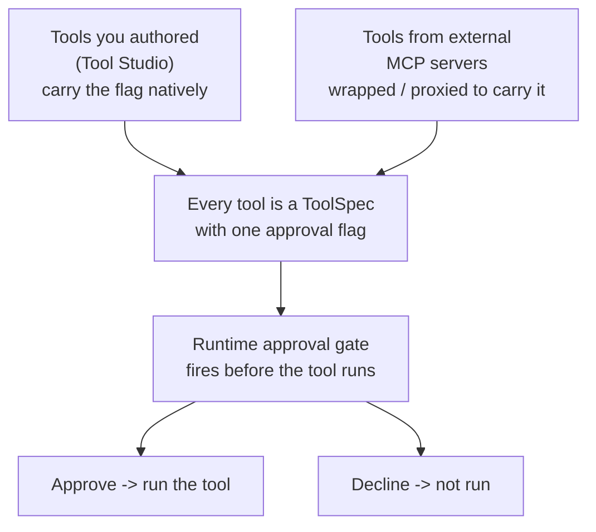
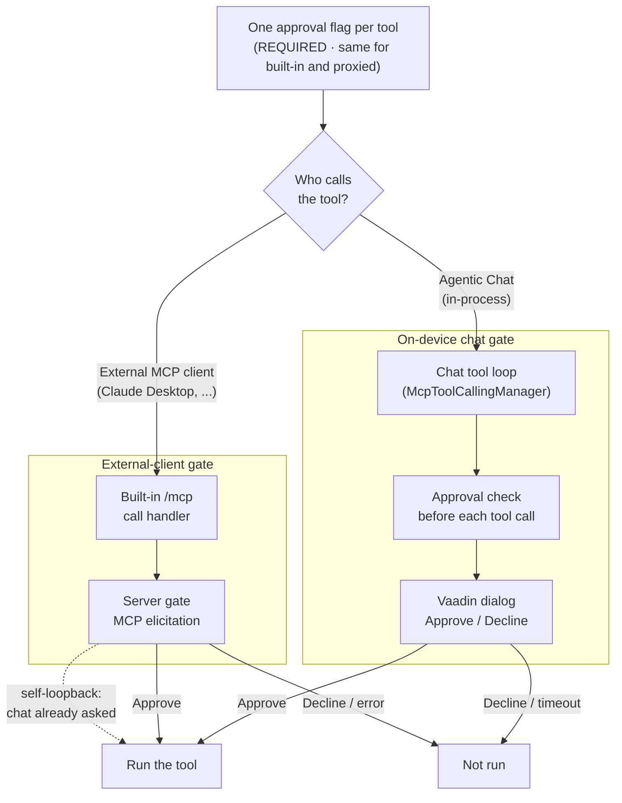
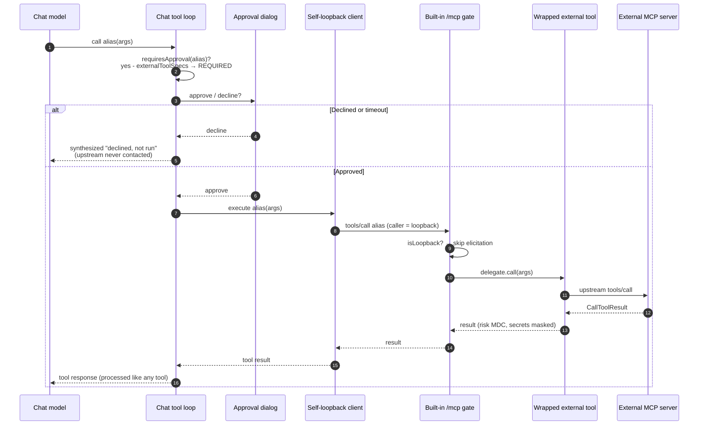

title: Human-in-the-Loop Approval
description: How Spring AI Playground gates tool calls behind explicit human approval - one per-tool flag enforced at the caller's entry point (chat dialog or MCP elicitation), why external tools are proxied through the built-in server to get the gate, and the full proxied call path from approval to upstream execution.

# Human-in-the-Loop Approval

A risk level tells you *how dangerous* a tool is. A sandbox limits *what* it can touch. **Human-in-the-loop (HITL) approval** decides *whether a specific call runs at all* - it pauses an individual tool call and waits for a person to approve or decline before the tool executes.

This is the runtime checkpoint that the [AI Agent Tool Safety](safety-architecture.md) and [MCP Server Safety](mcp-server-safety.md) pages refer to. It is the last gate before a call fires, and it sits *between* the sandbox (which judges what a tool **can** do) and the agent (which judges **when** to call it).

This is one of the architecture documents that complement each other:

- [Application](architecture.md) - runtime layers, feature modules, data flows
- [AI Agent Tool Safety](safety-architecture.md) - the **sandbox** that contains locally-authored JS tools
- [MCP Server Safety](mcp-server-safety.md) - the **risk model** for external servers and re-exposed tools
- **Human-in-the-Loop Approval** (this page) - the **runtime per-call approval gate**

## Overview { #overview }

The whole model is **one flag, enforced once, wherever the call enters**:

1. **One per-tool flag.** Every tool carries a `HumanInTheLoop` policy on its `ToolSpec` (`REQUIRED` / `DISABLED`). There is no second place to configure approval - both gates below read this one flag.
2. **A tool you authored carries the flag itself.** Set it in Tool Studio; publishing applies it automatically.
3. **A tool from an external MCP server is *wrapped* so it carries the flag too.** You cannot rely on a third-party server to implement approval, so the playground **proxies** the upstream tool through its own built-in server, wrapping it as one of its own `ToolSpec`s with the flag attached. From that point it is gated exactly like a tool you wrote.
4. **The gate fires at the caller's entry point** - an approval dialog for on-device Agentic Chat, an MCP `elicitation/create` round-trip for an external MCP client. Both consult the same flag, and a call is never asked twice.



The rest of this page details each piece: [what it guarantees](#guarantees), [the policy itself](#model), [where the flag comes from](#flag-source), [the two enforcement points](#gates), and - the part that ties it together - [the full path a proxied external tool takes](#proxied).

## What it guarantees { #guarantees }

When a tool is configured to require approval, **no caller can execute it without an explicit human ACCEPT**, and every decision fails safe:

- **No silent execution.** A `REQUIRED` tool always asks first.
- **Fail-safe default.** A timeout, a closed dialog, a client with no elicitation support, a transport error - every non-`ACCEPT` outcome is treated as a **decline**, and the tool does *not* run.
- **The model is told.** A decline returns a message back into the conversation so the agent does not silently retry.
- **Asked once, not twice.** A call that is already gated on this device is not gated again downstream (see [loopback de-duplication](#loopback)).

## The per-tool policy { #model }

Every tool carries an optional approval policy, defined by [`ToolManifest.HumanInTheLoop`](https://github.com/spring-ai-community/spring-ai-playground/blob/main/src/main/java/org/springaicommunity/playground/service/tool/ToolManifest.java) and stored on the tool's `ToolSpec`:

```java
record HumanInTheLoop(Mode mode, String promptTemplate) {
    enum Mode { DISABLED, REQUIRED }
}
```

| Mode | On-device Agentic Chat | External MCP client |
| --- | --- | --- |
| `REQUIRED` | Ask on **every** call | Ask on **every** call (MCP elicitation) |
| `DISABLED` | Never ask | Never ask |

The chat-side decision logic is centralized in [`ToolSpecService.requiresApproval`](https://github.com/spring-ai-community/spring-ai-playground/blob/main/src/main/java/org/springaicommunity/playground/service/tool/ToolSpecService.java), which gates a call only when its mode is `REQUIRED`. The server-side MCP gate likewise decorates only `REQUIRED` tools.

The optional **`promptTemplate`** customizes the question text. `{toolName}` and `{args}` are substituted at call time; the default is *"Run '{toolName}' with arguments {args}?"*.

## Where the approval flag comes from { #flag-source }

The single policy above is attached to a tool by one of two routes, depending on who authored the tool:

- **Authored (Tool Studio) tools** carry `humanInTheLoop` on their own `ToolSpec`. The author chooses the mode; publishing registers the tool on the built-in server *already wearing* the flag (`ToolSpecService.addMcpTool` decorates the registration through `McpServerHitlToolGate`).
- **External MCP server tools** are the interesting case. The playground has **no way to know whether a third-party server implements any approval step** - it only speaks the upstream tool's `tools/call` contract. So when you re-expose such a tool through the [Expose Tools drawer](features/mcp-server/proxy.md), the playground does not hand it to the agent raw. It **proxies** the tool: it wraps the upstream callback in a [`WrappedExternalToolCallback`](https://github.com/spring-ai-community/spring-ai-playground/blob/main/src/main/java/org/springaicommunity/playground/service/mcp/risk/WrappedExternalToolCallback.java) and registers it on the built-in server via [`ToolSpecService.addExternalMcpTool(callback, hitl)`](https://github.com/spring-ai-community/spring-ai-playground/blob/main/src/main/java/org/springaicommunity/playground/service/tool/ToolSpecService.java). When you tick **Approval** on that tool, the playground attaches a `REQUIRED` policy to a runtime `ToolSpec` entry in its `externalToolSpecs` registry. That entry is separate from authored tools and is not persisted or shown in Tool Studio's authored-tool list.

This is *why* proxying exists for the safety story: re-exposing an external tool through your own server is what lets **you** own the approval gate, instead of trusting a server you did not write. Once wrapped, the upstream tool is gated by exactly the same flag and the same two enforcement points as a tool you authored. (The [MCP Server Safety](mcp-server-safety.md) page covers the *other* things the wrapper adds at the same moment - risk scoring, secret masking, logging.)

## The two enforcement points { #gates }

There is **one per-tool policy**, enforced wherever a call enters - and the split is by **caller (entry point), not by tool type**. Built-in tools and re-exposed external tools carry the same flag and are gated the same way; what differs is *who* is calling:

- **Agentic Chat (in-process agent loop)** - every tool call the chat makes, built-in or re-exposed external, runs through a **single** [`McpToolCallingManager`](https://github.com/spring-ai-community/spring-ai-playground/blob/main/src/main/java/org/springaicommunity/playground/service/mcp/McpToolCallingManager.java) tool-calling loop. The `ChatClient` installs a Spring AI [`ToolCallAdvisor`](https://github.com/spring-ai-community/spring-ai-playground/blob/main/src/main/java/org/springaicommunity/playground/service/mcp/HitlToolCallAdvisor.java) (`HitlToolCallAdvisor`) that uses this manager; the manager asks for approval **before** any gated tool runs. The check is `requiresApproval(toolName)`, which finds the flag on the authored `ToolSpec` *or* on the wrapped external one.
- **External MCP client over `/mcp`** (Claude Desktop, another app) - this caller never touches the `ChatClient`, its advisor chain, or the `ToolCallingManager`. The MCP server SDK invokes the tool's `callHandler` directly, so the only place to gate it is by **wrapping that handler at registration** ([`McpServerHitlToolGate`](https://github.com/spring-ai-community/spring-ai-playground/blob/main/src/main/java/org/springaicommunity/playground/service/mcp/McpServerHitlToolGate.java)), which asks via MCP elicitation.

The two never fire for the same call: when Chat reaches a built-in or proxied tool through the self-loopback MCP client, the server-side gate sees the loopback caller and **skips** - the chat loop already asked (see [loopback de-duplication](#loopback)).



### On-device chat - approval dialog { #chat-gate }

When the on-device agent loop is about to execute tool calls, [`McpToolCallingManager`](https://github.com/spring-ai-community/spring-ai-playground/blob/main/src/main/java/org/springaicommunity/playground/service/mcp/McpToolCallingManager.java) intercepts each call. For every call whose tool `requiresApproval`, it raises a `HumanQuestion` and asks the [`HumanQuestionHandler`](https://github.com/spring-ai-community/spring-ai-playground/blob/main/src/main/java/org/springaicommunity/playground/service/tool/HumanQuestionHandler.java) carried in the tool context. In Agentic Chat that handler is [`ChatHumanQuestionHandler`](https://github.com/spring-ai-community/spring-ai-playground/blob/main/src/main/java/org/springaicommunity/playground/webui/chat/ChatHumanQuestionHandler.java), which opens a Vaadin **ConfirmDialog** (*Approve* / *Decline*) on the chat UI. This path uses a dialog, **not** MCP elicitation - chat is in-process, so there is no protocol round-trip to make.

- **Approve** → the call executes normally.
- **Decline** → the call is removed from the batch and a `ToolResponse` is synthesized telling the model the user declined, it was **not** executed, and not to call it again for this request. The model continues with the remaining (approved) calls, if any.
- **Timeout** (2 minutes), dialog closed, or UI error → **decline** (fail-safe).

Approved and declined calls in the same turn are handled together: approved ones run, declined ones get the decline response, and the original ordering is preserved so the conversation history stays consistent.

### External MCP client - elicitation { #server-gate }

When a tool is published on the built-in MCP server, [`ToolSpecService`](https://github.com/spring-ai-community/spring-ai-playground/blob/main/src/main/java/org/springaicommunity/playground/service/tool/ToolSpecService.java) wraps its specification with [`McpServerHitlToolGate`](https://github.com/spring-ai-community/spring-ai-playground/blob/main/src/main/java/org/springaicommunity/playground/service/mcp/McpServerHitlToolGate.java) when the tool's mode is `REQUIRED`. At call time the gate, before delegating to the real handler:

1. **Loopback?** If the caller is this device's own chat (the [self-loopback](#loopback) client), pass straight through - the chat dialog already asked.
2. **Elicitation capable?** If the calling client did not advertise the `elicitation` capability, **deny** - there is no way to ask, so the call cannot be approved.
3. **Ask.** Issue `exchange.createElicitation(prompt, schema)`. On `ACCEPT` run the tool; on `DECLINE` / `CANCEL` return a denied `CallToolResult` (`isError = true`).
4. **Any error** (transport drop, SDK timeout, exception) → **deny** (fail-safe).

The prompt schema is an empty object - this is a confirmation, not a data form - so a compliant client renders a plain *approve / decline* card. (In the playground's own [MCP Inspector](features/mcp-server/inspector.md#elicitation), that arrives as an `ElicitationRequestPrimitive` card.)

## Proxied external tools - the full runtime path { #proxied }

This is the path that ties the whole model together, and it is the reason proxying exists. When Agentic Chat (with the built-in MCP server enabled) calls a **re-exposed external tool**, the call is approved *once* on this device and only then reaches the upstream server. The flag was attached when the tool was wrapped ([above](#flag-source)); here is what happens at call time:



The key properties this path guarantees:

- **HITL happens first, the network call second.** The upstream external server is **not** contacted until after approval - a declined call never leaves the machine.
- **Approved once, not twice.** The chat dialog (step 3) is the only prompt; the server-side gate is on the path (step 7) but skips because the caller is the self-loopback client.
- **The result is processed identically.** After the upstream `CallToolResult` returns, it flows back through the same `McpToolCallingManager` as any built-in tool - same tool-result event, same conversation history, same observability spans.

The same proxied tool called by an **external** MCP client instead of on-device chat takes the other gate: step 3's dialog is replaced by the server-side **elicitation** in `McpServerHitlToolGate` (step 6 is no longer loopback, so it does **not** skip), and steps 8-13 are identical. Either way the upstream call is reached only after an explicit approval.

## Loopback de-duplication { #loopback }

Agentic Chat reaches the built-in server's tools through a **self-loopback MCP client**. Without care, such a call would be gated twice - once by the chat dialog and again by the server elicitation. `McpServerHitlToolGate` compares the caller's client info against `McpClientService.selfLoopbackServerName()` and, on a match, **skips the elicitation** and delegates immediately. The user is asked exactly once, by the chat dialog. External clients do not match the loopback name, so they are always gated by the server elicitation.

## Why fail-safe matters { #fail-safe }

Approval is a **deny-by-default** gate: the call runs only on an explicit, affirmative human ACCEPT. Every other path - no answer, a declined dialog, an incapable client, a dropped connection - resolves to *not run*. This is deliberate: a HITL tool is one a human decided is consequential enough to confirm, so the safe failure is to withhold execution, never to assume consent.

## How it relates to risk { #risk }

HITL and the L0-L5 risk model reinforce each other:

- **Defaults track risk.** When you author a tool, the approval mode defaults to `DISABLED` at `L0` and `REQUIRED` above `L0` - the more capable the tool, the more it asks by default. Lowering that protection prompts a confirmation.
- **Approval lowers *displayed* risk.** Marking a re-exposed external tool HITL also lowers its composed risk by one band (`McpToolRiskComposer.applyHitlMitigation`, floored at `L1`) - a human gating every call genuinely reduces exposure. See [MCP Server Safety → Composed risk and HITL mitigation](mcp-server-safety.md#composed-risk).

The risk level is the *advice*; HITL is the *enforcement* that makes a high-risk tool safe to keep within reach.

## Where it surfaces { #surfaces }

| Surface | What you set / see | Reference |
| --- | --- | --- |
| Tool Studio → **Sandbox & Capabilities** | The **Human-in-the-loop** mode (Required / Disabled) and an optional approval prompt for a tool you author | [Human-in-the-Loop feature](features/human-in-the-loop.md#author) |
| Expose Tools drawer → **Approval** column | Per-tool approval for a re-exposed external tool (attaches the `REQUIRED` flag to its wrapper) | [MCP Server Proxy](features/mcp-server/proxy.md) |
| Agentic Chat | The **Approve / Decline** dialog when a gated tool is called | [Tutorial 11 - Approve a Tool in Chat](tutorials/11-human-approval.md) |
| MCP Inspector → **Elicitation** | The approval card an external client would see | [MCP Inspector](features/mcp-server/inspector.md#elicitation) |

## Further reading

- [Human-in-the-Loop Approval (feature)](features/human-in-the-loop.md) - the user-facing how-to
- [Tutorial 11 - Approve a Tool in Chat](tutorials/11-human-approval.md) - end-to-end walkthrough
- [MCP Server Safety](mcp-server-safety.md) - risk scoring for external tools that this gate protects
- [Application](architecture.md) - where the approval gate sits in the runtime layers and chat advisor chain
- [AI Agent Observability](observability-architecture.md) - how approve/decline decisions surface (`mcp.hitl.decision` counter, `hitl.*` logs)
