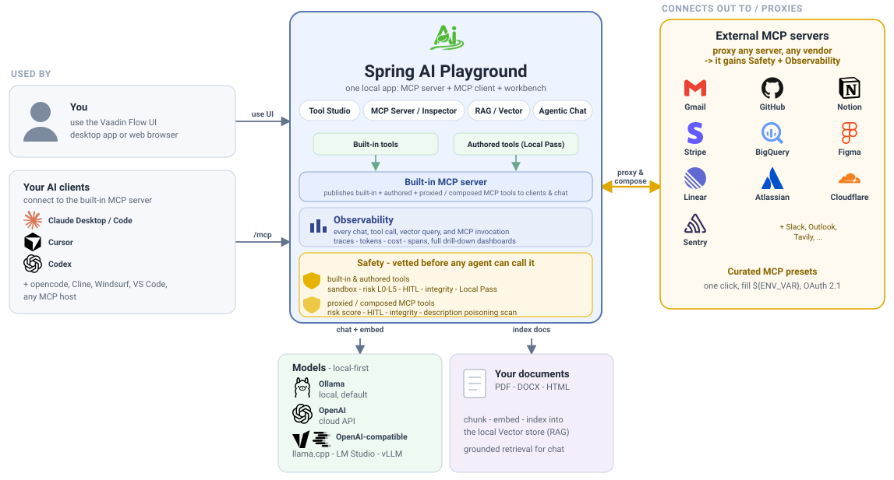
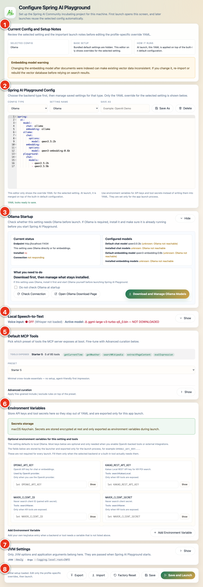
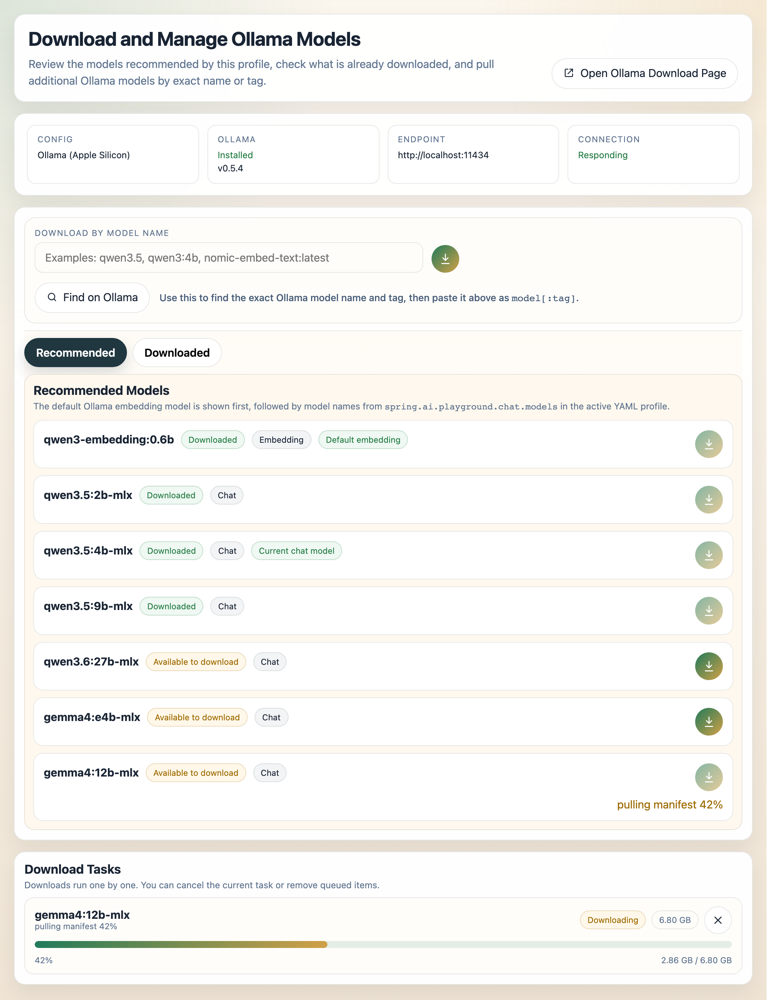

title: Safe Local Execution Layer for AI Agent Tools
description: Desktop app to build, test, and publish MCP tools - Tool Studio, a defense-in-depth sandbox, Risk Levels (L0-L5), Agentic Chat, RAG, and observability dashboards.

# Spring AI Playground

## Safe Local Execution Layer for AI Agent Tools

Spring AI Playground is a cross-platform desktop app for building, testing, validating, and executing MCP tools in a controlled local environment.

## How it all connects

Spring AI Playground is **one local app that plays three roles at once** - an MCP **server** that publishes tools to your agents, an MCP **client** that reaches out to external services, and a **workbench** where you build and vet those tools. You drive it through the Vaadin Flow UI (desktop app or browser); your AI clients - Claude Desktop and Code, Cursor, Codex, opencode, or any other MCP host - connect to the same built-in server over `/mcp`.

{ loading=lazy }

That server presents tools from three sources as one clean surface: a **built-in library**, tools you write in [Tool Studio](features/tool-studio/index.md) (each earns a **Local Pass** before it goes live), and external MCP servers you [proxy and compose](features/mcp-server/proxy.md) onto it - any vendor, any language. However a tool arrives, it is vetted before an agent can call it (see [AI Agent Tool Safety](safety-architecture.md)): locally-run tools (built-in and authored) execute in a defense-in-depth sandbox with a visible **Risk Level (L0-L5)**, human-in-the-loop approval, and an integrity check, while proxied and composed tools are risk-scored, HITL-gated, integrity-checked, and scanned for description poisoning.

Everything that runs - every chat, tool call, vector query, and MCP invocation - is captured in the built-in [Observability](features/observability/index.md) dashboards. And it all runs **local-first**: Ollama by default, with OpenAI and OpenAI-compatible runtimes (llama.cpp, LM Studio, vLLM) optional, and chat grounded on your own documents through the local vector store.

> **No pass, no run.**

Every tool you build earns a **Local Pass** - a local test-run with sample arguments. Only tools that pass are added live to the built-in MCP server and become callable from Agentic Chat. Nothing you author reaches an agent until you have seen it work on your own machine.

Safe execution does not end at publication. Every chat, tool call, vector lookup, and MCP invocation that runs in the app lands in the built-in **Observability dashboards** - twelve panels (Overview, Tokens & Cost, AI Models, Tool Studio, MCP Servers, MCP Inspector, Vector Database, Agentic Chat, Host, Web Application, Logs, Traces) backed by a ring buffer with dated disk persistence. Drill from any row into the trace timeline and raw spans, jump to the conversation thread, and deep-link back into Agentic Chat - the tools you let an agent call are also the tools you can audit in detail afterwards.

The desktop app is the recommended default experience, but Docker and local source execution are still supported when you want a server-style deployment or a development workflow.

Unlike many playgrounds that stop at prompt testing, this project connects AI conversations to real actions while making the tools it manages inside the app safer and easier to inspect before reuse:

- build JavaScript tools directly in the app
- earn a **Local Pass** by test-running each tool against sample arguments you define
- **add tools live to the built-in MCP server** the moment each passes - no restart, no redeploy
- start immediately with **85 pre-loaded default tools** spanning web fetch / datetime / math / security / encoding / crypto / filesystem / GitHub / Wikipedia / weather / finance / geo / Korean services - [see the spotlight section below](#what-used-to-take-an-afternoon-already-wired-in) for the categorised browse
- connect external surfaces in one click with **57 preset MCP server connections** (Gmail · Outlook · Notion · Slack · GitHub · Linear · Atlassian · Stripe · Figma · BigQuery · Cloudflare · Tavily · MCP Everything · ...) - same spotlight section below covers the full per-category browse
- validate retrieval pipelines against your own documents
- run agentic chat that combines tool use and grounded context (e.g. *"Get today's weather and send it to Slack"*)
- run every tool through a **defense-in-depth GraalVM sandbox** with a deny-first class allowlist, SSRF-guarded `fetch`, rooted `safety.fs`, statement + wall-clock limits, and a visible per-tool **Risk Level** (L0-L5) - with a parallel **risk score** scoring every external MCP server you connect (and a description poisoning scan on tools you re-expose) - see [AI Agent Tool Safety Architecture](safety-architecture.md)
- **see every chat, tool call, vector query, and MCP invocation** in the twelve built-in [Observability dashboards](features/observability/index.md) - drill into span timelines, jump back to the source conversation, watch token cost and latency live, deep-link from a trace into Agentic Chat

> **Security scope.** The in-process sandbox is defense-in-depth for the local build-and-vet loop. It is not adversarial-grade isolation and not a gateway. To run tool code you do not trust, nest it in container or microVM isolation. See [Isolation tiers](safety-architecture.md#isolation-tiers).

<div style="text-align: center;">
  <b>Spring AI Playground - Demo</b><br/>
  Connect an MCP server · compose a safe proxy · human-in-the-loop approval · full observability
</div>

<div style="text-align: center;">
  <video src="assets/images/spring-ai-playground-demo.mp4" width="820" autoplay loop muted playsinline controls
         poster="assets/images/spring-ai-playground-demo-poster.png">
    <a href="assets/images/spring-ai-playground-demo.mp4">Watch the demo</a>
  </video>
</div>

## :material-rocket-launch: Quick Start

The recommended default is the desktop app distributed from GitHub Releases.

Spring AI Playground is a standalone desktop app, so you can install it and start building MCP tools without setting up a Java project, Docker environment, or source build first.

### 1. Download the Desktop App

Pick the installer for your platform. Each link resolves to the latest published release automatically.

<p class="download-badges">
  <a id="win-x64" class="download-badge" href="https://github.com/spring-ai-community/spring-ai-playground/releases/latest" data-pattern="win-x64.exe" data-label="Windows (NSIS, x64)" rel="noopener"></a>
  <a id="mac-arm64" class="download-badge" href="https://github.com/spring-ai-community/spring-ai-playground/releases/latest" data-pattern="mac-arm64.dmg" data-label="macOS (Apple Silicon)" rel="noopener"></a>
  <a id="mac-x64" class="download-badge" href="https://github.com/spring-ai-community/spring-ai-playground/releases/latest" data-pattern="mac-x64.dmg" data-label="macOS (Intel)" rel="noopener"></a>
  <a id="linux-deb" class="download-badge" href="https://github.com/spring-ai-community/spring-ai-playground/releases/latest" data-pattern="linux-amd64.deb" data-label="Linux (DEB, amd64)" rel="noopener"></a>
  <a id="linux-rpm" class="download-badge" href="https://github.com/spring-ai-community/spring-ai-playground/releases/latest" data-pattern="linux-x86_64.rpm" data-label="Linux (RPM, x86_64)" rel="noopener"></a>
</p>

<p id="dl-resolved" class="dl-resolved-version" hidden></p>

<div id="dl-confirm" class="dl-confirm-overlay" hidden role="dialog" aria-modal="true" aria-labelledby="dl-confirm-title">
  <div class="dl-confirm-modal" role="document">
    <button id="dl-confirm-close" class="dl-confirm__close" type="button" aria-label="Close">&times;</button>
    <div class="dl-confirm__header">
      <span class="dl-confirm__icon" aria-hidden="true">
        <svg viewBox="0 0 24 24" fill="none" stroke="currentColor" stroke-width="2" stroke-linecap="round" stroke-linejoin="round"><path d="M12 3v12"/><path d="m6 11 6 6 6-6"/><path d="M5 21h14"/></svg>
      </span>
      <div class="dl-confirm__heading">
        <h4 id="dl-confirm-title" class="dl-confirm__title">Confirm download</h4>
        <p class="dl-confirm__platform"><span id="dl-confirm-label"></span></p>
      </div>
    </div>
    <dl class="dl-confirm__body">
      <div class="dl-confirm__row">
        <dt class="dl-confirm__row-label">File</dt>
        <dd class="dl-confirm__row-value">
          <code id="dl-confirm-filename"></code>
          <span id="dl-confirm-message" class="dl-confirm__message" hidden></span>
        </dd>
      </div>
      <div class="dl-confirm__row">
        <dt class="dl-confirm__row-label">Size</dt>
        <dd class="dl-confirm__row-value" id="dl-confirm-size">&mdash;</dd>
      </div>
      <div class="dl-confirm__row">
        <dt class="dl-confirm__row-label">Save to</dt>
        <dd class="dl-confirm__row-value dl-confirm__saveto">
          <span id="dl-confirm-saveto-path" class="dl-confirm__saveto-path">Downloads folder</span>
          <span class="dl-confirm__saveto-hint">(set by your browser)</span>
        </dd>
      </div>
    </dl>
    <div class="dl-confirm__actions">
      <a id="dl-confirm-go" class="download-button download-button--primary" href="#" rel="noopener">
        <svg viewBox="0 0 24 24" fill="none" stroke="currentColor" stroke-width="2" stroke-linecap="round" stroke-linejoin="round" aria-hidden="true"><path d="M12 5v14"/><path d="m19 12-7 7-7-7"/></svg>
        <span id="dl-confirm-go-label">Download</span>
      </a>
      <button id="dl-confirm-cancel" class="download-button download-button--ghost" type="button">Cancel</button>
    </div>
  </div>
</div>

<noscript>

JavaScript is disabled in your browser, so the buttons above link to the
[latest release page](https://github.com/spring-ai-community/spring-ai-playground/releases/latest).
Pick the asset that matches your platform.

</noscript>

<script>
(function () {
  const REPO = 'spring-ai-community/spring-ai-playground';
  const FALLBACK = `https://github.com/${REPO}/releases/latest`;
  const buttons = Array.from(document.querySelectorAll('a[data-pattern]'));
  if (buttons.length === 0) return;

  const confirmEl = document.getElementById('dl-confirm');
  const confirmLabel = document.getElementById('dl-confirm-label');
  const confirmFilename = document.getElementById('dl-confirm-filename');
  const confirmMessage = document.getElementById('dl-confirm-message');
  const confirmSize = document.getElementById('dl-confirm-size');
  const confirmSavetoPath = document.getElementById('dl-confirm-saveto-path');
  const confirmGo = document.getElementById('dl-confirm-go');
  const confirmGoLabel = document.getElementById('dl-confirm-go-label');
  const confirmGoSvg = confirmGo ? confirmGo.querySelector('svg') : null;
  const confirmCancel = document.getElementById('dl-confirm-cancel');
  const confirmClose = document.getElementById('dl-confirm-close');
  let lastTrigger = null;

  // Show the typical default download path for this OS (informational only).
  if (confirmSavetoPath) {
    const ua = navigator.userAgent || '';
    if (/Mac/i.test(ua)) confirmSavetoPath.textContent = '~/Downloads';
    else if (/Win/i.test(ua)) confirmSavetoPath.textContent = '%USERPROFILE%\\Downloads';
    else if (/Linux/i.test(ua)) confirmSavetoPath.textContent = '~/Downloads';
  }

  function formatBytes(bytes) {
    if (!bytes || bytes <= 0) return null;
    const units = ['B', 'KB', 'MB', 'GB'];
    let i = 0;
    let n = bytes;
    while (n >= 1024 && i < units.length - 1) {
      n /= 1024;
      i++;
    }
    return `${n.toFixed(n >= 10 || i === 0 ? 0 : 1)} ${units[i]}`;
  }

  function showConfirm(button) {
    if (!confirmEl) return;
    const isUnresolved = button.classList.contains('download-badge--unresolved');
    confirmLabel.textContent = button.dataset.label || button.textContent.trim();
    if (isUnresolved) {
      confirmFilename.hidden = true;
      confirmFilename.textContent = '';
      confirmMessage.hidden = false;
      confirmMessage.textContent = 'No matching asset in the latest release.';
    } else {
      confirmMessage.hidden = true;
      confirmFilename.hidden = false;
      confirmFilename.textContent = button.dataset.resolved || '';
    }
    confirmSize.textContent = (!isUnresolved && button.dataset.size) ? button.dataset.size : '-';
    confirmGo.href = button.href;
    if (confirmGoLabel) {
      confirmGoLabel.textContent = isUnresolved ? 'Open Releases page' : 'Download';
    }
    if (confirmGoSvg) {
      confirmGoSvg.style.display = isUnresolved ? 'none' : '';
    }
    if (!isUnresolved && button.dataset.resolved) {
      confirmGo.setAttribute('download', button.dataset.resolved);
    } else {
      confirmGo.removeAttribute('download');
    }
    lastTrigger = button;
    confirmEl.hidden = false;
    document.body.classList.add('dl-confirm-open');
    requestAnimationFrame(() => {
      if (confirmClose && typeof confirmClose.focus === 'function') confirmClose.focus();
    });
  }

  function hideConfirm() {
    if (!confirmEl || confirmEl.hidden) return;
    confirmEl.hidden = true;
    document.body.classList.remove('dl-confirm-open');
    if (lastTrigger && typeof lastTrigger.focus === 'function') {
      try { lastTrigger.focus(); } catch (_) {}
    }
    lastTrigger = null;
  }

  function attachClickHandlers() {
    buttons.forEach((button) => {
      button.addEventListener('click', (event) => {
        // Always intercept: resolved → confirm filename + size,
        // unresolved → friendly message with "Open Releases page".
        event.preventDefault();
        showConfirm(button);
      });
    });
  }

  if (confirmCancel) {
    confirmCancel.addEventListener('click', hideConfirm);
  }
  if (confirmClose) {
    confirmClose.addEventListener('click', hideConfirm);
  }
  if (confirmGo) {
    // Let the browser proceed with the link, then dismiss the modal
    confirmGo.addEventListener('click', () => setTimeout(hideConfirm, 0));
  }
  // Click on the overlay (outside the modal box) closes the modal
  if (confirmEl) {
    confirmEl.addEventListener('click', (event) => {
      if (event.target === confirmEl) hideConfirm();
    });
  }
  // Escape key closes the modal
  document.addEventListener('keydown', (event) => {
    if (event.key === 'Escape' && confirmEl && !confirmEl.hidden) {
      hideConfirm();
    }
  });

  fetch(`https://api.github.com/repos/${REPO}/releases/latest`, {
    headers: { Accept: 'application/vnd.github+json' }
  })
    .then((response) => response.ok ? response.json() : Promise.reject(new Error(`HTTP ${response.status}`)))
    .then((release) => {
      const assets = release.assets || [];
      // Defensive filter: only consider assets whose filename also contains
      // the release tag's version. Without this, a release whose draft was
      // polluted with older-version assets (the way `0.2.0-M4-*.dmg` lived
      // inside the `v0.2.0-M5` draft) would let `find()` return the older
      // file just because it appeared first in upload order.
      const releaseVersion = (release.tag_name || '').replace(/^v/, '');
      buttons.forEach((button) => {
        const pattern = button.dataset.pattern;
        const asset = assets.find((a) =>
          a.name &&
          a.name.endsWith(pattern) &&
          (!releaseVersion || a.name.includes(releaseVersion))
        );
        if (asset) {
          button.href = asset.browser_download_url;
          button.dataset.resolved = asset.name;
          const formatted = formatBytes(asset.size);
          if (formatted) button.dataset.size = formatted;
        } else {
          button.href = FALLBACK;
          button.classList.add('download-badge--unresolved');
        }
      });
      const tag = release.tag_name || release.name;
      if (tag) {
        const note = document.getElementById('dl-resolved');
        if (note) {
          note.textContent = `Latest release: ${tag}`;
          note.hidden = false;
        }
      }
      attachClickHandlers();
      autoOpenFromHash();
    })
    .catch(() => {
      buttons.forEach((button) => {
        button.href = FALLBACK;
        button.classList.add('download-badge--unresolved');
      });
      attachClickHandlers();
      autoOpenFromHash();
    });

  function autoOpenFromHash() {
    const hash = (window.location.hash || '').replace(/^#/, '');
    if (!hash) return;
    const target = buttons.find((b) => b.id === hash);
    if (!target) return;
    target.scrollIntoView({ behavior: 'smooth', block: 'center' });
    showConfirm(target);
  }
})();
</script>

Or browse all available assets on the [Releases page](https://github.com/spring-ai-community/spring-ai-playground/releases). Need [verification info](getting-started/index.md#verify-your-download)?

### 2. Install and Launch

Install the package the same way you would for a normal desktop application, then launch **Spring AI Playground** from your applications menu.

The desktop app bundles the backend runtime together with a launcher that provides provider starter templates, YAML override editing, environment-variable based secret handling, and one-click launch.

If you install the app, you can run Spring AI Playground immediately without setting up Docker or running the server manually.

> **macOS**
>
> Gatekeeper may block the install flow in two places:
>
> - When you open the downloaded DMG, macOS may show a warning such as "cannot be opened because the developer cannot be verified." If you trust the release source, go to **System Settings > Privacy & Security** and click **Open Anyway**.
> - After copying the app into **Applications**, macOS may block the first app launch again. If that happens, open the app once, then return to **System Settings > Privacy & Security** and click **Open Anyway**.
>
> If the app still doesn't open because it remains quarantined, and you trust the app, one practical workaround is:
>
> ```bash
> xattr -dr com.apple.quarantine "/Applications/Spring AI Playground.app"
> ```
>
> **Windows**
>
> The most common warning appears when you run the downloaded installer (`.exe`).
>
> If Microsoft Defender SmartScreen shows a warning such as "Windows protected your PC" or says the app is unrecognized:
>
> - Click **More info**
> - Then click **Run anyway**
>
> **Linux**
>
> Separate Gatekeeper- or SmartScreen-style reputation warnings are uncommon. When installing the `.deb` or `.rpm` package, you usually only need to complete the normal package-install confirmation steps.
>
> For more detailed platform guidance and first-launch configuration screens, see [Getting Started](getting-started/index.md).

<div style="text-align: center;">
  <b>First-Launch Configuration Screen</b><br/>
  The configuration editor stacks every card on one scrollable screen - numbered top to bottom below
</div>

<div style="text-align: center;">
  <a href="assets/images/launcher-first-launch.png">
    
  </a>
</div>

The markers run top to bottom, and each card has a detailed step in the [Desktop App configuration walkthrough](getting-started/desktop.md#desktop-configuration-walkthrough):

1. **Current Config and Setup Notes** - explains the selected setting before you edit it ([details](getting-started/desktop.md#1-read-the-setup-notes-first))
2. **Spring AI Playground Config** - pick the provider type, choose a saved setting, and edit the override YAML ([details](getting-started/desktop.md#2-choose-a-config-type))
3. **Ollama Startup** - Ollama endpoint, install / connection status, and the configured models ([details](getting-started/desktop.md#6-understand-the-ollama-startup-card))
4. **Default MCP Tools** - choose which preset of built-in tools the MCP server exposes at boot ([details](getting-started/desktop.md#8-pick-your-default-mcp-tools))
5. **Environment Variables** - API keys and tool secrets, encrypted by your OS keychain ([details](getting-started/desktop.md#9-use-environment-variables-for-keys-and-secrets))
6. **JVM Settings** - optional launch-time JVM options and application args ([details](getting-started/desktop.md#10-set-jvm-and-app-args-only-when-needed))
7. **Save and Launch action bar** - Export, Import, Factory Reset, Save, and Save and Launch ([details](getting-started/desktop.md#4-save-clone-delete-or-reset-settings))

<div style="text-align: center;">
  <b>Ollama Model Manager</b><br/>
  Review recommended models, search exact Ollama names on ollama.com, and manage downloaded models
</div>

<div style="text-align: center;">
  <a href="assets/images/launcher-ollama-config.png">
    
  </a>
</div>

The model manager opens from the Ollama Startup card; see [Download and Manage Ollama Models](getting-started/desktop.md#7-download-and-manage-ollama-models) for the full walkthrough, including how to copy an exact model name from ollama.com.

### 3. Start with the Built-in Desktop Runtime

The desktop build is intended to be the easiest way to get started without setting up Docker or running the server manually.

### 4. Optional: Use Docker Instead

By default the container behaves like the desktop / source app - Vaadin web UI on `http://localhost:8282` and a `streamable-http` MCP server in the same process. To use it as a stdio MCP server for Claude Desktop and other MCP clients instead, add `-e SPRING_PROFILES_INCLUDE=mcp-stdio` (see the [Docker section in Alternative Runtimes](getting-started/alternative-runtimes.md#docker)).

```bash
docker run -d -p 8282:8282 --name spring-ai-playground \
  -e SPRING_AI_OLLAMA_BASE_URL=http://host.docker.internal:11434 \
  -v spring-ai-playground:/root \
  --restart unless-stopped \
  ghcr.io/spring-ai-community/spring-ai-playground:latest
```

Then open `http://localhost:8282`.

## :material-flash: What used to take an afternoon - already wired in

Installing an external MCP server normally means cloning a repo, installing the right runtime, registering an OAuth app, exporting tokens, and restarting your host. We did that 57 times so you don't have to. The 85 default tools ship in the same box. Every tool carries a visible **Risk Level (L0-L5)** - the sandbox, Local Pass, `${ENV_VAR}` substitution, and SecretMasking handle the rest.

### Built-in tools - call from chat the moment you launch

<div class="tcg-grid--home" markdown>

<div class="tcg-card--home" markdown>
<a class="tcg-stretched-link" href="features/default-tools/examples/#getWeather" aria-label="Open getWeather"></a>
<span class="tcg-home-icon">:material-weather-partly-cloudy:</span>
<span class="tcg-home-name">getWeather</span>
<span class="tcg-home-pill risk-l3">L3</span>
</div>

<div class="tcg-card--home" markdown>
<a class="tcg-stretched-link" href="features/default-tools/global/#searchWikipedia" aria-label="Open searchWikipedia"></a>
<span class="tcg-home-icon">:material-book-search-outline:</span>
<span class="tcg-home-name">searchWikipedia</span>
<span class="tcg-home-pill risk-l3">L3</span>
</div>

<div class="tcg-card--home" markdown>
<a class="tcg-stretched-link" href="features/default-tools/examples/#extractPageContent" aria-label="Open extractPageContent"></a>
<span class="tcg-home-icon">:material-text-box-search-outline:</span>
<span class="tcg-home-name">extractPageContent</span>
<span class="tcg-home-pill risk-l3">L3</span>
</div>

<div class="tcg-card--home" markdown>
<a class="tcg-stretched-link" href="features/default-tools/examples/#getCurrentTime" aria-label="Open getCurrentTime"></a>
<span class="tcg-home-icon">:material-clock-outline:</span>
<span class="tcg-home-name">getCurrentTime</span>
<span class="tcg-home-pill risk-l0">L0</span>
</div>

<div class="tcg-card--home" markdown>
<a class="tcg-stretched-link" href="features/default-tools/utilities/#hash" aria-label="Open hash"></a>
<span class="tcg-home-icon">:material-shield-key-outline:</span>
<span class="tcg-home-name">hash (SHA-256)</span>
<span class="tcg-home-pill risk-l0">L0</span>
</div>

<div class="tcg-card--home" markdown>
<a class="tcg-stretched-link" href="features/default-tools/filesystem/#writeTextFile" aria-label="Open writeTextFile"></a>
<span class="tcg-home-icon">:material-file-edit-outline:</span>
<span class="tcg-home-name">writeTextFile</span>
<span class="tcg-home-pill risk-l4">L4</span>
</div>

</div>

<p class="home-spotlight-cta">→ <a href="features/default-tools/index.md">Browse all 85 default tools</a> across Examples (7) · Utilities (26) · Filesystem (10) · Global (21) · Korea (21).</p>

### External MCP - one click in the sidebar, fill `${ENV_VAR}`, done

<div class="tcg-grid--home" markdown>

<div class="tcg-card--home t-google" markdown>
<a class="tcg-stretched-link" href="features/default-mcp-catalog/productivity/#Gmail" aria-label="Open Gmail"></a>
<span class="tcg-home-icon">{ width="20" }</span>
<span class="tcg-home-name">Gmail</span>
<span class="tcg-home-oauth" title="OAuth 2.1">🔐</span>
</div>

<div class="tcg-card--home t-slack" markdown>
<a class="tcg-stretched-link" href="features/default-mcp-catalog/productivity/#Slack" aria-label="Open Slack"></a>
<span class="tcg-home-icon">:material-slack:</span>
<span class="tcg-home-name">Slack</span>
<span class="tcg-home-oauth" title="OAuth 2.1">🔐</span>
</div>

<div class="tcg-card--home t-github" markdown>
<a class="tcg-stretched-link" href="features/default-mcp-catalog/dev/#GitHub" aria-label="Open GitHub"></a>
<span class="tcg-home-icon">{ width="20" }</span>
<span class="tcg-home-name">GitHub</span>
<span class="tcg-home-oauth" title="OAuth 2.1 / PAT">🔐</span>
</div>

<div class="tcg-card--home" markdown>
<a class="tcg-stretched-link" href="features/default-mcp-catalog/productivity/#Notion" aria-label="Open Notion"></a>
<span class="tcg-home-icon">{ width="20" }</span>
<span class="tcg-home-name">Notion</span>
<span class="tcg-home-oauth" title="OAuth 2.1">🔐</span>
</div>

<div class="tcg-card--home t-google" markdown>
<a class="tcg-stretched-link" href="features/default-mcp-catalog/data-cloud/#BigQuery" aria-label="Open BigQuery"></a>
<span class="tcg-home-icon">{ width="20" }</span>
<span class="tcg-home-name">BigQuery</span>
<span class="tcg-home-oauth" title="OAuth 2.1">🔐</span>
</div>

<div class="tcg-card--home" markdown>
<a class="tcg-stretched-link" href="features/default-mcp-catalog/business/#Stripe" aria-label="Open Stripe"></a>
<span class="tcg-home-icon">{ width="20" }</span>
<span class="tcg-home-name">Stripe</span>
<span class="tcg-home-pill risk-l2">L2</span>
<span class="tcg-home-oauth" title="OAuth 2.1">🔐</span>
</div>

</div>

<p class="home-spotlight-cta">→ <a href="features/default-mcp-catalog/index.md">Browse all 57 preset MCP connections</a> across Productivity & Communication (8) · Dev & Project Management (12) · Data & Cloud (17) · Business (12) · Search (6) · Examples (2). New to this surface? Walk through <a href="tutorials/9-mcp-everything.md">Tutorial 9 - MCP Everything: All 8 Primitives in One Walkthrough</a>.</p>

## :material-view-grid-outline: What You Can Do

- [:material-robot-outline: AI Models](getting-started/external-connections.md#connect-model-providers): switch between Ollama, OpenAI, and OpenAI-compatible runtime paths.
- [:material-tools: Tool Studio](features/tool-studio/index.md): build low-code tools in JavaScript and expose them instantly through MCP.
- [:material-connection: MCP Server](features/mcp-server/index.md): inspect external MCP servers, read a live **risk score** (L0-L5) before connecting, and **proxy** their tools onto the built-in server - compose multiple servers into one surface - each gated by per-tool human-in-the-loop.
- [:material-server-network: Default MCP Servers](features/default-mcp-catalog/index.md): 57 preset external MCP server connections (Gmail, Notion, Slack, GitHub, Tavily, ...) gated on `${ENV_VAR}` placeholders.
- [:material-database-search: RAG](features/vector-database.md): upload content, chunk it, embed it, index it, and validate retrieval quality.
- [:material-chat-processing: Agentic Chat](features/agentic-chat/index.md): combine grounded context, built-in tools, and explicitly trusted MCP connections in one interaction flow - with a Prompt Library of ready-to-use [presets](features/agentic-chat/prompt-presets.md) and [`{{variable}}` templates](features/agentic-chat/prompt-templates.md), per-turn reasoning effort, and rich code/math/diagram rendering.
- [:material-chart-line: Observability](features/observability/index.md): twelve in-app dashboards covering token economics, tool and MCP behaviour, RAG quality, host runtime, and a live trace tail.

## :material-lightbulb-on-outline: Why This Project Exists

Spring AI Playground is intentionally positioned as a tool-first environment for building, testing, validating, and operationalizing MCP tools in a practical workflow.

Its current focus is:

- providing a UI-driven environment for building, testing, and validating MCP tools in a practical workflow
- making test-before-publish the default path for built-in local tool exposure
- testing tool execution flows, environment-backed tool configuration, and RAG integration in one place
- making tools easier to inspect, easier to test, and easier to operationalize before they are reused elsewhere
- supporting practical single-agent workflows through Agentic Chat with tools and grounded context. See [Agentic Chat Architecture Overview](features/agentic-chat/index.md#agentic-chat-architecture-overview).
- promoting validated built-in tools into reusable MCP-hosted runtimes that can be shared across multiple MCP-compatible hosts and clients

It is intentionally opinionated and scope-limited in its current stage. The goal is a stable, reproducible platform for practical MCP tool work rather than a feature-complete agent orchestration product.

## :material-book-open-page-variant: Documentation Flow

- Getting Started: install the desktop app first, configure models, and understand alternative runtimes
- Architecture: runtime layers, data flows, and extension points (Application + AI Agent Tool Safety)
- Features: the main product areas and what they do
- Tutorials: follow real workflows for tools, MCP, vector search, and agentic chat

## Further Reading

- [Getting Started](getting-started/index.md): install the desktop app, configure models, and understand alternative runtimes
- [Application Architecture](architecture.md): runtime layers, data flows, and extension points
- [AI Agent Tool Safety Architecture](safety-architecture.md): defense-in-depth sandbox model, policy resolution, threat model, and Risk Level reference
- [AI Agent Observability Architecture](observability-architecture.md): trace pipeline, storage tiers, configuration, and external export paths behind the twelve dashboards
- [Context Engineering Architecture](context-engineering-architecture.md): how each chat turn's context window is assembled from system prompt, retrieved documents, tools, memory, and per-request options
- [Features](features/index.md): the main product areas and what they do
- [Tutorials](tutorials/index.md): follow end-to-end workflows for tools, MCP, vector search, and agentic chat

## Analytics

This site uses Google Analytics to collect anonymous usage data - page views,
interaction events, and device/browser metadata - for product analysis.

To opt out, use your browser's tracker-blocking extension or Do Not Track setting.
