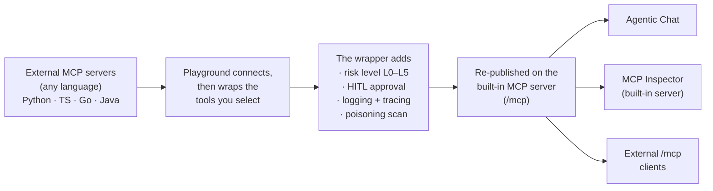
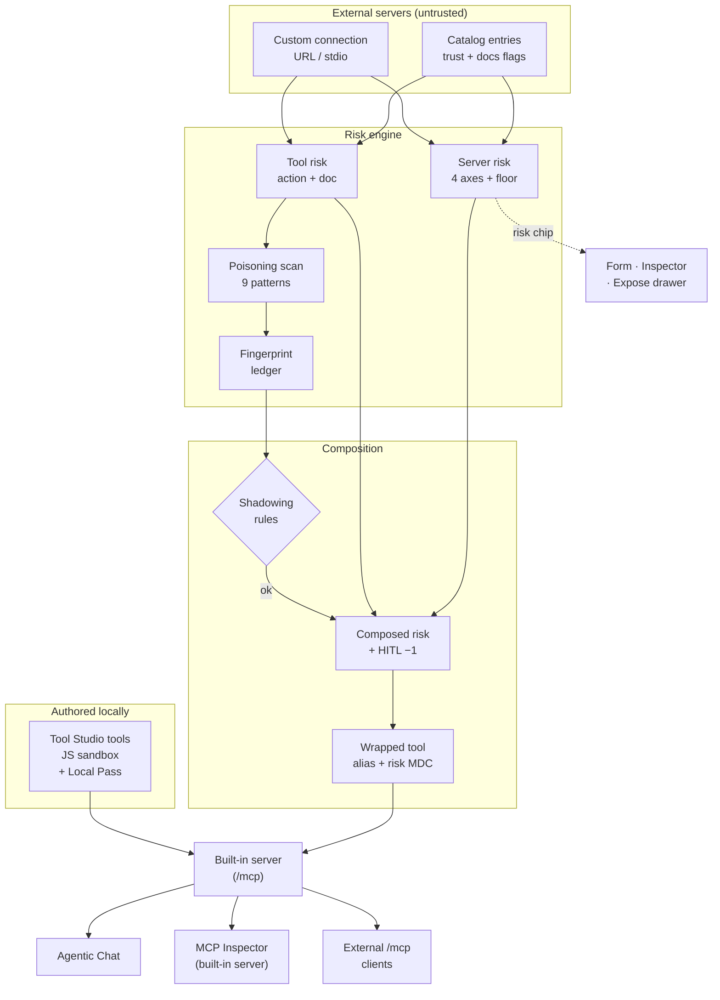

title: MCP Server Safety
description: How Spring AI Playground vets external MCP servers and the tools it re-exposes — L0–L5 connection risk, tool poisoning scan, fingerprint ledger, composition shadowing rules, and HITL mitigation.

# MCP Server Safety

[AI Agent Tool Safety](safety-architecture.md) covers the *inward* problem — keeping a locally-authored JavaScript tool from harming the host. **This page covers the *outward* problem** — how the playground vets the **external MCP servers it connects to** and the **upstream tools it re-exposes** on its own built-in server, before an agent can reach any of them.

This is one of five architecture documents that complement each other:

- [Application Architecture](architecture.md) — runtime layers, feature modules, data flows
- [Safe Tool Specification 1.0](safe-tool-specification.md) — normative spec for *authoring* local tools
- [AI Agent Tool Safety Architecture](safety-architecture.md) — the **sandbox** that contains locally-authored JS tools
- **MCP Server Safety** (this page) — the **client-side risk model** for external servers and re-exposed tools
- [AI Agent Observability Architecture](observability-architecture.md) — the visibility layer that makes prevention auditable

The engine lives in [`service/mcp/risk`](https://github.com/spring-ai-community/spring-ai-playground/tree/main/src/main/java/org/springaicommunity/playground/service/mcp/risk); its decisions surface as a colored **risk chip** wherever an external server or tool appears, and as structured events for the audit trail.

## Overview { #overview }

An external MCP server can be written in any language and run anywhere — you didn't write it and can't see inside it. Spring AI Playground never hands such a tool to an agent raw: it **connects, then wraps** each tool it re-exposes. The wrapper is where safety is added — every wrapped tool gets a risk level, optional human approval, full logging and tracing, and a poisoning scan — so a tool you didn't author becomes one you can govern.

You pick **which tools** to re-publish — individually or with *Select all*, across one or several active connections — and they all land on the playground's own **built-in MCP server** (`/mcp`), where **Agentic Chat**, the **MCP Inspector** (point it at the built-in server to verify exactly what you re-published — its Tools tab lists the composed tools and runs them), *and* **any external MCP client** reach them on one governed endpoint. A per-server *exposure mode* (built-in tools only / composed external tools only / both) controls what that endpoint serves. Choosing and re-publishing those tools is the [MCP Server Proxy](features/mcp-server/proxy.md) feature; this page is the safety model behind the wrapper it adds.

The [end-to-end flow below](#end-to-end-flow) expands each of those steps; the [safe-wrapping contract](#wrapping-contract) lists exactly what the wrapper guarantees.

## End-to-end flow { #end-to-end-flow }

A capability reaches Agentic Chat, the MCP Inspector, and any external client on `/mcp` — through exactly one door: the **built-in MCP server** (`spring-ai-playground-built-in-mcp`, published at `/mcp`). Two very different sources feed that door, and they are trusted very differently:

- **Locally-authored Tool Studio tools** run inside the [GraalVM sandbox](safety-architecture.md) and earn a Local Pass before they publish.
- **External MCP servers** (catalog entries or hand-typed connections) are *remote* and untrusted. Before any of their tools can be re-exposed through the built-in server, they pass through the risk engine — server scoring, per-tool scoring, a description poisoning scan, a fingerprint ledger, and composition shadowing rules — with the operator's per-tool HITL choice folded into the final risk.

The rest of this page works left to right through that diagram.

## The risk chip and its two rubrics { #risk-chip }

The MCP risk model reuses the `RiskLevel` enum (`L0`–`L5`) that the [sandbox](safety-architecture.md#risk-level-decision-matrix) uses — but the two are scored by **independent calculators** and never mix. A Tool Studio tool carries the *sandbox* level (how far it widens the local sandbox); an external server or tool carries the *MCP* level (how risky it is to connect and publish). Only the MCP chip carries an explicit label, defined in [`McpRiskChip`](https://github.com/spring-ai-community/spring-ai-playground/blob/main/src/main/java/org/springaicommunity/playground/webui/mcp/McpRiskChip.java):

| Chip (as shown in the app) | What it means for an MCP surface |
|---|---|
| L0 — Verified | Built-in trusted tool (the loopback `spring-ai-playground-built-in-mcp` server) — risk model bypassed |
| L1 — Safe | Local operations, no external access |
| L2 — Low | External read-only, or API-key / Bearer auth |
| L3 — Moderate | External write, network fetch, or community-curated trust |
| L4 — High | Admin-scope, exec capability, or irreversible actions |
| L5 — Critical | A **floor rule** tripped, or an unverified / unauthenticated server |

The chip surfaces in three places — the [connection risk preview](features/mcp-server/index.md#connection-risk-preview) on the config form, the per-server and per-tool chips in the [Expose Tools drawer](features/mcp-server/index.md#expose-external-tools), and beside each tool in the [Inspector Tools tab](features/mcp-server/inspector.md#tools). Every computation is also emitted as a structured event — `ServerRiskComputed`, `ToolPublishRiskComputed`, `FloorOverrideTriggered`, `PoisoningHit`, `HashLedgerMismatch`, `CompositionLifecycle` — and MCP tool-call spans are tagged with the resolved risk (see [Observability → MCP Servers](features/observability/ai-stack/mcp-servers.md)).

## Server risk — four axes plus floor overrides { #server-risk }

[`McpServerRiskCalculator`](https://github.com/spring-ai-community/spring-ai-playground/blob/main/src/main/java/org/springaicommunity/playground/service/mcp/risk/McpServerRiskCalculator.java) scores a registration on four axes, sums them, and buckets the total (`≤0 → L1`, `1 → L2`, `2 → L3`, `3 → L4`, `≥4 → L5`). Host class comes from `McpHostClassifier` — `STDIO` / `LOOPBACK` / `PRIVATE_LAN` / `PUBLIC`.

| Axis | Score | Drivers |
|---|---|---|
| **transport** | 0–1 | `PRIVATE_LAN` host → 1; STDIO / loopback / public → 0 |
| **auth** | 0–2 | STDIO / loopback → 0; otherwise none / OAuth-standard → 0, API-key / Bearer → 1, custom-OAuth → 2 |
| **trust** | 0–2 | user-typed URL → 1 if the host matches a catalog pattern else 2; catalog entry → 0 (vendor-official), 1 (community-curated), else 2 |
| **doc** | 0–2 | one point each for missing docs URL, `docsAdequate: false`, and not used within 90 days (capped at 2) |

Three **floor overrides** short-circuit straight to **L5** regardless of the sum (the chip shows the short name in parentheses):

| Trigger | Chip text | Condition |
|---|---|---|
| `non_loopback_no_auth_write_capability` | `no-auth-write` | remote host, no auth, and the server advertises write capability |
| `non_loopback_no_auth_trust_unknown` | `no-auth-unknown` | remote host, no auth, user-typed URL not matching any known catalog host |
| `privileged_oauth_scope` | `privileged-scope` | OAuth scopes contain `admin`, `write_all`, `delete_*`, `.all`, or `.admin` |

These states are visible live as you edit the connection form — a catalog vendor-official entry over HTTPS computes **L1 — Safe**, while typing an unknown public URL with no auth immediately trips `no-auth-unknown` and the chip turns **L5 — Critical**. See the [connection risk preview](features/mcp-server/index.md#connection-risk-preview).

## Tool risk — base action plus documentation penalty { #tool-risk }

[`McpToolPublishRiskCalculator`](https://github.com/spring-ai-community/spring-ai-playground/blob/main/src/main/java/org/springaicommunity/playground/service/mcp/risk/McpToolPublishRiskCalculator.java) scores an individual upstream tool on two axes (same bucketing as the server). The **base-action** axis reads the MCP tool annotations — `readOnlyHint` absent/false `+1`, `destructiveHint` `+2`, `openWorldHint` `+1`, `idempotentHint` `−1`, side-effect scope `REMOTE_WRITE +1` / `REMOTE_ADMIN +2`, sends-user-data `+1` (floored at 0). The **doc-penalty** axis (capped at 3) adds gaps for a missing/short/boilerplate description, an absent input schema, under-50%-described properties, and unspecified annotations.

Three tool **floor overrides**: an irreversible verb in the tool name (`delete_`, `drop_`, `purge_`, `wipe_`, `remove_`, `force_push`) → L5; `destructiveHint` without `idempotentHint` → L5; a description *and* annotations both entirely missing → L4.

!!! info "Trusted-server doc waiver"
    When a tool comes from a catalog server carrying any trust signal, the per-tool documentation penalty is **waived to zero** — the catalog's curation substitutes for per-tool docs, so a well-vetted vendor tool is not punished for a terse description. The base-action axis and all floor rules still apply.

## Composed risk and HITL mitigation { #composed-risk }

When an upstream tool is re-exposed on the built-in server, [`McpToolRiskComposer`](https://github.com/spring-ai-community/spring-ai-playground/blob/main/src/main/java/org/springaicommunity/playground/service/mcp/risk/McpToolRiskComposer.java) combines the two scores: if either side tripped a floor, the composed level is the **higher** of the two; otherwise the axis totals add and re-bucket. Marking the exposed tool **HITL** (require human approval) then lowers the effective level by **one band** (`applyHitlMitigation`, floored at L1) — a risk-accounting reflection that a human gates each call. The flag is persisted on the exposed member; the runtime approval gate itself is the MCP-elicitation checkpoint described in [AI Agent Tool Safety → Human-in-the-loop checkpoints](safety-architecture.md#human-in-the-loop-checkpoints) (shipping next), which honors the same flag.

This is why exposing `read_wiki_structure` with HITL shows `L1 — Safe` with a `HITL −1` annotation while its un-gated siblings stay `L2 — Low`:

{ loading=lazy }

## The safe-wrapping contract { #wrapping-contract }

Re-exposing an upstream tool does not copy it — it **wraps** it in a [`WrappedExternalToolCallback`](https://github.com/spring-ai-community/spring-ai-playground/blob/main/src/main/java/org/springaicommunity/playground/service/mcp/risk/WrappedExternalToolCallback.java). The wrapper is a thin, uniform safety envelope: whatever language or framework the upstream tool was built with, once wrapped it behaves like a first-class, governed tool on the built-in server. The upstream call itself is unchanged — but everything around it is now guaranteed:

| The wrapper adds | What it does |
|---|---|
| **Re-identification** | Publishes under the exposed alias and optional description override; the input schema passes through unchanged |
| **Risk level** | Carries the composed `L0`–`L5` level (server + tool, HITL-mitigated) as a chip and a span tag |
| **Logging & tracing** | Emits `mcp.tool.start` / `mcp.tool.done` / `mcp.tool.crash` with call duration on every invocation |
| **Risk MDC context** | Pushes `mcp.cid`, `mcp.origin`, `mcp.composition.*`, `mcp.upstream.*`, `mcp.risk.*`, and `mcp.risk.floor_trigger` for the duration of the call — so a chat tool call traces back to its upstream origin and computed risk (see [Observability → MCP Servers](features/observability/ai-stack/mcp-servers.md)) |
| **Secret masking** | Redacts upstream connection secrets from error messages before they reach logs or chat |
| **HITL gate (intent)** | Records the per-tool human-approval flag; the runtime [elicitation gate](safety-architecture.md#human-in-the-loop-checkpoints) (shipping next) honors it |

This is what makes *"any-language MCP server → wrap → safe"* concrete: a tool you did not author and cannot inspect becomes one that is identified, risk-rated, approval-gated, logged, traced, and secret-masked at the boundary — without touching the upstream implementation.

## Tool-description poisoning scan { #poisoning-scan }

A tool description is attacker-controlled text that the model reads as instructions. [`McpToolPoisoningScanner`](https://github.com/spring-ai-community/spring-ai-playground/blob/main/src/main/java/org/springaicommunity/playground/service/mcp/risk/McpToolPoisoningScanner.java) scans every name and description for nine injection signatures; any hit makes `shouldBlockPublish()` true and emits a `PoisoningHit` event.

| Pattern | Catches |
|---|---|
| `HIDDEN_INSTRUCTION` | "ignore (all) previous/prior/above instructions" |
| `SYSTEM_PROMPT_OVERRIDE` | `<system>` / `[system]` / ChatML role-boundary markers |
| `ROLE_HIJACK` | "you are now / actually / really a …" |
| `UNICODE_ZERO_WIDTH` | zero-width chars (U+200B/C/D, U+2060, U+FEFF) hiding text |
| `UNICODE_RTL_OVERRIDE` | right-to-left overrides (U+202A–202E, U+2066–2069) that reverse visible order |
| `UNICODE_HOMOGLYPH_RISK` | mixed Latin/Cyrillic look-alike characters |
| `ANSI_ESCAPE` | ANSI terminal escape sequences |
| `CROSS_SERVER_IMPERATIVE` | an imperative verb ("then call …") naming another exposed tool within 80 chars |
| `EXFILTRATION_DIRECTIVE` | "exfiltrate / send to / post to / forward all" + an email or URL |

## Tool fingerprint ledger — change detection { #fingerprint-ledger }

[`McpToolHashLedger`](https://github.com/spring-ai-community/spring-ai-playground/blob/main/src/main/java/org/springaicommunity/playground/service/mcp/risk/McpToolHashLedger.java) stores a SHA-256 of each tool's canonical content (name + description + input schema + annotations). A re-check returns `NEW` (first sight), `UNCHANGED` (hash matches), or `MISMATCH` — a silently redefined upstream tool flips the fingerprint status to `AWAITING_REREVIEW` and emits `HashLedgerMismatch`, so a "rug-pull" redefinition cannot ride in on a prior approval. Fingerprint lifecycle states are `ACTIVE` / `AWAITING_REREVIEW` / `REVOKED`.

## Composition shadowing rules { #shadowing-rules }

Before a composition is enabled, [`McpCompositionShadowingRules`](https://github.com/spring-ai-community/spring-ai-playground/blob/main/src/main/java/org/springaicommunity/playground/service/mcp/risk/McpCompositionShadowingRules.java) checks three rules; any violation refuses the enable:

- **`R1_ALIAS_COLLISION`** — the same exposed alias is claimed by more than one enabled composition (ambiguous tool resolution).
- **`R2_CROSS_SERVER_REFERENCE`** — a member's description imperatively references another member's tool name/alias (cross-server prompt injection).
- **`R3_SELF_SCOPE_VIOLATION`** — a member's description names another member's server id (scope/architecture leak).

## Where it surfaces { #surfaces }

| Surface | What the chip/scan shows | Page |
|---|---|---|
| Connection form | Live server risk chip as you type / pick an entry | [MCP Server → Connection risk preview](features/mcp-server/index.md#connection-risk-preview) |
| Expose Tools drawer | Per-server + per-tool chips, max-risk cap, HITL `−1` | [MCP Server → Expose external tools](features/mcp-server/index.md#expose-external-tools) |
| Inspector Tools tab | Per-tool risk chip beside each tool card | [MCP Inspector → Tools](features/mcp-server/inspector.md#tools) |
| Observability | `mcp.risk.*` / `mcp.composition.*` span tags | [Observability → MCP Servers](features/observability/ai-stack/mcp-servers.md) |

## Further reading

- [AI Agent Tool Safety Architecture](safety-architecture.md) — the sandbox that contains locally-authored JS tools (the inward counterpart to this page)
- [MCP Server feature guide](features/mcp-server/index.md) — the screens this model drives
- [Default MCP Servers → How catalog trust feeds the risk score](features/default-mcp-catalog/index.md#trust-and-risk)
- [AI Agent Observability Architecture](observability-architecture.md) — how risk-tagged tool calls become auditable
