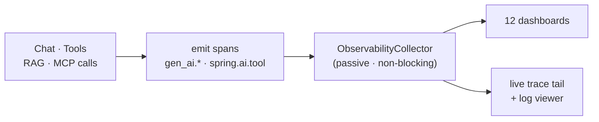
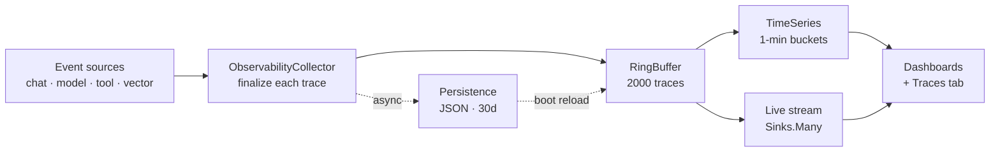
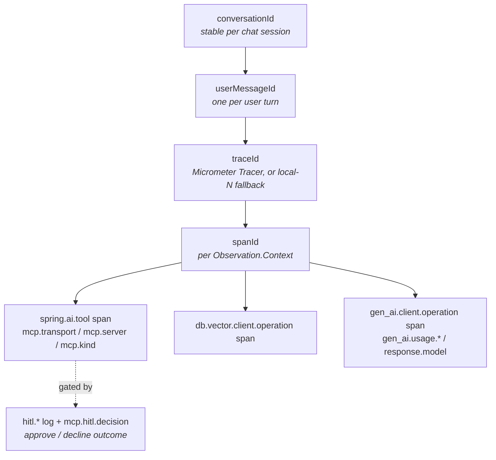
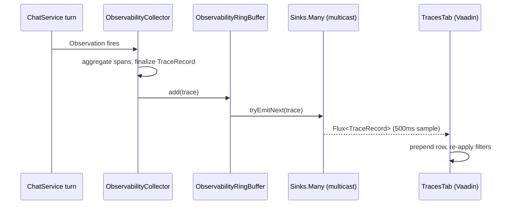

title: AI Agent Observability
description: Trace pipeline for AI agent execution - signal sources, ring buffer + time series + disk tiers, MDC log correlation, cost attribution, and configuration reference.

# AI Agent Observability

Spring AI Playground sits between a human author and a live agent: the same JVM compiles a tool, hosts an MCP server, talks to a model, and answers a chat turn. Once an agent is running, the question is no longer "could this do something unsafe" - the sandbox already settled that - but "what did it actually do, in what order, with which tokens, against which model, at what cost." This page is the system-level reference for the **observability** layer that answers those questions.

Two questions dominate when you debug a live agent: *which tool just ran with which arguments*, and *which MCP server fielded that call (or refused to)*. Model token counts and provider latency matter, but they are a well-understood problem that the upstream Spring AI Observation API - built on OpenTelemetry's GenAI semantic conventions - already records out of the box. The agentic value-add of this layer is everything *around* the model call: in-process tool execution, every external MCP server tied to the agent, their transports, their per-call success and failure. The dashboards documented under [Features → Observability](features/observability/index.md) split these into dedicated tabs precisely because separating "did my sandbox tool work" from "is my MCP server healthy" is the question operators actually have.

The sandbox documented in [AI Agent Tool Safety](safety-architecture.md) *prevents* unsafe tool execution at runtime. This collector *captures* every tool and MCP call that did happen - span by span, attribute by attribute - so prevention is auditable end-to-end. The two are two arms of the same safety model: sandbox is the prevention arm and the gate; observability is the visibility arm and the ledger. Prevention without visibility is unverifiable; visibility without prevention is unactionable. Visibility is itself a defensive guarantee - a system whose actions you cannot see is a system you cannot trust.

This is one of six architecture documents that complement each other:

- [Application](architecture.md) - runtime layers, feature modules, data flows, extension points
- [Safe Tool Specification](safe-tool-specification.md) - normative JSON spec for tool authoring (the document the sandbox enforces)
- [AI Agent Tool Safety](safety-architecture.md) - defense-in-depth sandbox model, policy resolution, threat-to-layer mapping
- [MCP Server Safety](mcp-server-safety.md) - client-side risk model for external MCP servers and re-exposed tools
- **AI Agent Observability Architecture** (this page) - signal sources, trace pipeline, storage tiers, log correlation, cost attribution

## Overview { #overview }

Every action the agent takes - a chat turn, a tool call, a vector query, an MCP invocation - emits OpenTelemetry-style spans. A **passive** collector assembles them into per-turn traces and serves twelve in-app dashboards plus a live trace tail. The sandbox prevents unsafe execution; this layer makes everything that *did* happen auditable.



The rest of this page details the signal sources, the trace pipeline, storage tiers, and cost attribution.

## Scope and naming

The Playground codebase reserves three closely related words for distinct purposes:

- **Observability** - the union of traces, metrics, and logs the collector records and exposes through the in-app dashboards. Everything in this document.
- **Telemetry** - the Spring AI / Micrometer event vocabulary on the wire (`spring.ai.chat.client`, `gen_ai.client.operation`, `db.vector.client.operation`, `spring.ai.tool`). These are the *inputs* to the observability layer; the names come from upstream Spring AI and OpenTelemetry conventions and are not invented here.
- **Monitoring** - the user-facing surface that reads from the observability store: the twelve dashboard tabs, the live trace tail, the log viewer. Documented as a feature under [Features → Observability](features/observability/index.md).

This document covers the pipeline between telemetry-on-the-wire and the monitoring surface - what flows in, where it sits, how it gets read.

The layer is **passive**: the collector listens to observations and never blocks the request path. A failure inside the collector cannot break a chat turn, and disabling it (`spring.ai.playground.observability.persist=false` plus removing the `ObservabilityCollector` bean) leaves chat, tool execution, and MCP unaffected.

## Leverage and build

The observability layer makes a clean separation between what comes from upstream and what this project contributes. Reinventing model-and-provider span vocabulary would fragment the ecosystem for no benefit; the engineering investment goes into the application-level concerns instead.

| Leveraged from upstream | Built in this project |
|---|---|
| Spring AI Observation API - the `spring.ai.*` and `gen_ai.*` span names, their lifecycle, the low / high-cardinality `KeyValue` attribute conventions | `ObservabilityCollector` - the `ObservationHandler` that consumes those events and assembles whole traces |
| OpenTelemetry GenAI semantic conventions - `gen_ai.system`, `gen_ai.response.model`, `gen_ai.usage.*`, `gen_ai.response.finish_reasons`, `db.vector.query.*` | Storage tiers - ring buffer, on-demand time series, JSON persistence with daily partitioning and retention cron |
| Micrometer `Tracer` - trace / span ID propagation (Brave or OpenTelemetry implementation) | MDC bridge in `ChatService` - `conversationId` / `userMessageId` correlation across reactive and sync paths |
| Spring Boot Actuator `MeterRegistry` - JVM, OS, HTTP, Tomcat, Logback gauges | `SystemMetricsCollector` + `SystemMetricsRingBuffer` + `SystemMetricsTimeSeries` - periodic capture of the curated MeterRegistry subset into a parallel time-series pipeline, surfaced on the Host and Web Application tabs |
| Apache ECharts 5.6 - chart rendering | All twelve dashboard tabs and two modal dialogs - KPI cards, chart compositions, live trace stream, log tail, Trace Detail dialog, Conversation Thread dialog |
| - | `McpToolObservationFilter` - `ObservationFilter` that injects `mcp.transport`, `mcp.server`, and `mcp.kind` attributes onto `spring.ai.tool` spans by looking up tool names in `McpClientService`. Drives the Tool Studio / MCP Servers tab split (see next section). |
| - | Pricing layer - `ModelPricingService` holds an in-memory table (edited only through the Model Pricing Manager dialog), computes cost at read time from `TraceRecord` token counts |

This document covers the **right column**. For the upstream vocabulary and attribute keys, defer to Spring AI's own observability documentation and the OpenTelemetry GenAI semantic conventions. A second consequence of building on standard interfaces: external export (OTLP traces, Prometheus metrics, structured logs) ships without custom adapters - see [External export](#external-export).

## What gets captured

The collector subscribes to the `ObservationRegistry` and accepts any context whose Java class lives under `org.springframework.ai.*`, or whose observation name matches the Spring AI / OpenTelemetry conventions. Five span families drive the entire system:

| Span name | Meaning | Key attributes lifted into the trace |
|---|---|---|
| `spring.ai.chat.client` | **Root** - one user turn through the `ChatClient` pipeline | `conversation.id`, `spring.ai.chat.client.conversation.id` |
| `gen_ai.client.operation` | Model call - chat, embedding, image gen | `gen_ai.system` (provider), `gen_ai.response.model`, `gen_ai.request.model`, `gen_ai.usage.{input,output,total}_tokens`, `gen_ai.response.finish_reasons` |
| `spring.ai.tool` | Tool invocation (in-process or MCP) | `mcp.transport` distinguishes in-process from STDIO / HTTP / SSE |
| `spring.ai.advisor` | Advisor pipeline step (RAG retrieval, memory, etc.) | Advisor-specific tags |
| `db.vector.client.operation` | Vector store query, add, or delete | `db.system` (Chroma / Pinecone / ...), `db.vector.query.top_k`, `db.vector.query.similarity_threshold`, `db.vector.query.response.documents.count` |

Any non-matching context (other Spring components, custom user observations) is ignored. The accept rule is widened by class FQN as well as by name because Spring AI sets the observation name only at start time - at `supportsContext()` the name is still `null`, and the collector has to make the keep / drop decision immediately.

Spring AI's content-bearing observations are silenced by default. Prompts, completions, tool arguments, and vector query responses are **not** logged at the Actuator boundary:

```yaml
spring:
  ai:
    chat:
      observations:
        log-prompt: false          # ChatModel prompt content
        log-completion: false      # ChatModel completion content
        include-error-logging: true
      client:
        observations:
          log-prompt: false        # ChatClient input
          log-completion: false    # ChatClient output
    tools:
      observations:
        include-content: false     # tool arguments + result
    vectorstore:
      observations:
        log-query-response: false  # retrieved documents
```

These toggles can be flipped per-environment if a deployment explicitly opts into content capture - for desktop / single-user defaults, the conservative posture is intentional. The secret-masking pass documented in [Safety Architecture → Output masking](safety-architecture.md#the-three-layers) catches env-backed values that slip through `console.log`; turning the Spring AI prompt/completion toggles on would bypass that mask, so do it deliberately.

## Tool and MCP observability - the agentic focus

Model calls are visible on the wire because Spring AI emits them with stable OpenTelemetry semantic conventions - that part is free. The contribution this layer makes lives one level up: telling an operator *what the agent decided to do*, against which integration, with which outcome. The dashboards split tool execution into **two** tabs - **Tool Studio** (in-process Spring AI tool callbacks, including everything the JS sandbox publishes) and **MCP Servers** (external MCP servers reached over stdio, Streamable HTTP, or the legacy SSE transport) - because debugging "did my sandbox tool return the right value" and "is my external MCP server actually online" are different operational questions, and lumping them into a generic "tool call" view forces operators to filter every panel themselves.

The discriminator is the `mcp.transport` attribute on the `spring.ai.tool` span. This attribute, together with `mcp.server` and `mcp.kind`, is injected by `McpToolObservationFilter` - an `ObservationFilter` that the project registers. At span start the filter looks up the tool's name in `McpClientService`: if the tool routes through an MCP transport, the matching transport label is attached; otherwise `mcp.kind=in-process` marks the span as an in-process callback. Spring AI's own MCP integration does not emit these attributes - they are this layer's contribution to the trace stream.

| Span shape | Where it surfaces | What it tells you |
|---|---|---|
| `spring.ai.tool` with `mcp.transport` absent or `=in-process` | Tool Studio tab | In-process call - a JS-sandbox tool from Tool Studio or a Spring AI `@Tool` method. Risk Level (sandbox layer) applies; latency is purely JVM-internal. |
| `spring.ai.tool` with `mcp.transport=stdio` | MCP Servers tab | External MCP server launched as a local subprocess. Latency includes JSON-RPC over stdio framing; cold-start spawn cost is invisible (one-time at connection). |
| `spring.ai.tool` with `mcp.transport=streamable-http` | MCP Servers tab | External MCP server reachable over Streamable HTTP - the MCP spec's modern HTTP transport. Latency is HTTP round-trip plus server processing; subject to retries and timeouts. |
| `spring.ai.tool` with `mcp.transport=sse` | MCP Servers tab | External MCP server using the legacy Server-Sent Events transport (superseded by Streamable HTTP in the current MCP spec). Similar latency profile to Streamable HTTP but with long-lived connection state. |

The MCP Servers tab additionally surfaces a **transport mix** donut and per-transport latency percentiles, so a degraded Streamable HTTP server is visible next to a healthy stdio server without one drowning the other.

Three operator-level signals fall out of this split:

- **Tool failure and MCP unavailability are distinct.** An in-process tool error is a sandbox-and-author concern (the sandbox caught an SSRF, an env-var fetch failed, a parser blew up). An MCP error is an external-dependency concern (the server is down, the transport timed out, the schema drifted). The dashboards never conflate them.
- **Transport-specific tuning is observable.** Adding hosts to a `fetch` allowlist (Risk Level L4 on the in-process side) shows up in the Tools tab latency. Bumping a Streamable HTTP MCP server's read timeout shows up in the MCP tab transport latency. Each tuning lever has a single panel where you see its effect.
- **The full audit chain reads as one trace.** A single `TraceRecord` contains the chat turn root, the model's tool-selection span, the tool call span (with the right tab tag), the resulting tool result, optionally a follow-up model call, and the final completion. The Traces tab and the Trace Detail dialog walk that chain in span order - visible audit for "what the agent decided to do, in what order, against which integration."

Cross-reference to the sandbox layer: every in-process tool call recorded here was authored, locally tested, and stamped with a Risk Level before publication. The observability ledger and the sandbox gate share the same notion of "tool call" - see [Safety Architecture → Risk badge](safety-architecture.md#the-three-layers) for what the L0-L5 badge means and where it is enforced.

## The pipeline



Event source span names: `spring.ai.chat.client` (ChatClient turn), `gen_ai.client.operation` (Model call), `spring.ai.tool` (Tool call), `db.vector.client.operation` (Vector op), `spring.ai.advisor` (Advisor step). The Collector implements Micrometer's `ObservationHandler` lifecycle: `supportsContext()` filters in Spring AI contexts; `onStart` stamps `t0` and captures trace/span IDs; `onStop` extracts attributes and builds a `SpanRecord`; `TraceBuilder` accumulates by `traceId`; on root-span detection the `TraceRecord` is finalized.

The journey from one Spring AI observation to a row in the Traces tab:

1. **Observation fires** - Spring AI's `ChatClient` instruments every turn via `ObservationRegistry`. Each phase (chat client root, model call, tool call, vector op) opens and closes an `Observation.Context`.
2. **`supportsContext()` filter** - `ObservabilityCollector` accepts contexts whose class FQN starts with `org.springframework.ai.` or whose name matches a Spring AI / OpenTelemetry convention. The class-FQN check is what lets the collector accept Spring AI's typed contexts before the convention has assigned a name.
3. **`onStart`** stamps `System.nanoTime()` into the context and pulls `traceId` / `spanId` / `parentSpanId` from Micrometer's `Tracer` if one is configured. When no `Tracer` bean is present, IDs are deferred and synthesized on `onStop` (`local-N` counter for the trace, UUID for the span).
4. **`onStop`** computes duration, copies all low- and high-cardinality `KeyValue`s into the span's attribute map, and reads MDC fallbacks for `conversation.id` and `user_message.id` so spans that bypass Reactor context still carry the correlation.
5. **`TraceBuilder` accumulation** - spans are appended to a per-`traceId` builder. The builder is bounded by `max-spans-per-trace` (default 200) so a runaway tool loop cannot blow up the trace record.
6. **Root detection** finalizes the trace. A span is root when its name (or contextual name) equals `spring.ai.chat.client`, or - as a defense against name-assignment timing - when its context class ends with `ChatClientObservationContext`.
7. **Aggregate to `TraceRecord`** - the builder walks every child span to compute `provider`, `model`, summed `inputTokens` / `outputTokens` / `totalTokens`, `finishReason`, `toolCallCount`, and the `hasRag` flag. Status is `ERROR` if any child errored, otherwise the root's status.
8. **Ring buffer add** - the finalized `TraceRecord` is appended to the in-memory ring buffer, which simultaneously emits it on a Reactor `Sinks.Many` multicast for the Traces tab's live subscription.
9. **Async persistence** (optional) - if `persist=true`, the trace is handed to `PersistenceExecutor` and written as a single JSON file under the day-partitioned directory. The collector never blocks on this step.

Every step from (3) onward runs on the calling thread of the observation. The only thread hops are (9) the persistence executor and the Reactor sink's multicast fan-out - both decoupled from the request path.

## Trace assembly

The collector reconstructs a coherent trace from a stream of unordered span lifecycle events. Three design choices matter:

**Trace ID provenance.** When `management.tracing.sampling.probability > 0` and a Brave or OpenTelemetry `Tracer` is on the classpath, IDs come straight from the tracer - propagating cleanly across thread switches and across the OTLP wire if an exporter is wired up. When tracing is disabled or unavailable, the collector falls back to `"local-" + counter` for the trace and a fresh `UUID.randomUUID()` for each span. This guarantees every trace has a stable ID regardless of distributed-tracing configuration, but a fallback trace cannot be correlated outside the JVM.

**Conversation and user message IDs.** Two correlation keys travel alongside every trace:

- `conversationId` - assigned by the Vaadin chat surface, stable for the entire conversation
- `userMessageId` - minted per turn (`UUID.randomUUID()`) inside [`ChatService`](https://github.com/spring-ai-community/spring-ai-playground/blob/main/src/main/java/org/springaicommunity/playground/service/chat/ChatService.java)

Both are set in two places to survive thread switches:

```java
.contextWrite(Context.of(
        MDC_CONVERSATION_ID, chatHistory.conversationId(),
        MDC_USER_MESSAGE_ID, userMessageId))
.doFirst(() -> {
    MDC.put(MDC_CONVERSATION_ID, chatHistory.conversationId());
    MDC.put(MDC_USER_MESSAGE_ID, userMessageId);
})
```

Reactor `Context` carries the values across operator boundaries; the MDC mirror lets non-reactive code (Spring AI's own observation handlers, sync tool callbacks) read the same correlation. A `try`/`finally` clears MDC even on cancellation. The collector reads MDC last as a fallback, so a span whose context attributes already include `conversation.id` is preferred over the MDC value.

These keys form a correlation hierarchy - one conversation fans out to turns, each turn to a trace, each trace to the tool, retrieval, and model spans (and, for a gated tool, its approve/decline outcome):



**Root span detection.** Three predicates resolve to the same result:

```java
boolean isRoot = ROOT_SPAN_NAME.equals(context.getName())
        || ROOT_SPAN_NAME.equals(context.getContextualName())
        || context.getClass().getName().endsWith("ChatClientObservationContext");
```

The triple-check exists because Spring AI assigns the observation name through an `ObservationConvention` that runs *after* `onStart`, so neither the name nor the contextual name are reliable in isolation. Matching the class FQN gives the collector a deterministic anchor.

**Conversation-level views.** The base assembly produces one `TraceRecord` per chat turn. Two helpers layer conversation-scoped summaries on top:

- `ConversationAggregator` groups records by `conversationId` and computes per-conversation totals (token sums, cost via `ModelPricingService`, tool call counts, RAG flags, distinct models / providers, error counts). This drives the Agentic Chat dashboard.
- `ConversationMessageExtractor` deserialises a single `TraceRecord` into structured user / assistant / tool messages by walking `gen_ai.prompt.*.content` and `gen_ai.completion.*.content` span attributes. This drives the Conversation Thread dialog opened by clicking a trace from the Agentic Chat dashboard.

## Storage tiers

Three tiers serve three access patterns:

| Tier | Lives in | Optimized for | Bounded by |
|---|---|---|---|
| **Ring buffer** | `ObservabilityRingBuffer` (`ConcurrentLinkedDeque` + `Sinks.Many`) | Fast point-in-time snapshots + live push | `ring-buffer-capacity` (default 2000 traces) - FIFO eviction |
| **Time series** | `ObservabilityTimeSeries` (computed on demand) | Bucketed aggregates for charts | Window length (max `LAST_3H` = 180 buckets); recomputed on every UI tick |
| **Persistence** | `ObservabilityPersistenceService` (JSON on disk) | Survives restart, hosts the historical lookback | `retain-days` (default 30) - daily cron at 04:00 |

**Ring buffer.** The hot path. Every finalized `TraceRecord` is enqueued and the oldest evicted when capacity is reached. Reads are non-blocking snapshots (`new ArrayList<>(buffer)`) so the UI can iterate freely without contending with the writer. The same buffer drives the live stream via `Sinks.Many.multicast().directBestEffort()` - multiple subscribers fan out, and a slow subscriber drops rather than blocks the producer (the Traces tab samples at 500 ms, so dropped frames are silently coalesced). On add, the ring buffer also scans the most recent 12 entries for a near-duplicate trace - matched by `traceId`, `userMessageId`, or `conversationId` within a 200 ms window - and merges spans into the existing record rather than appending a new one. This dedup pass handles overlapping observations from advisor pipelines without producing a separate "phantom" trace for each.

**Time series.** Not pre-aggregated. `ObservabilityTimeSeries.compute(Window)` walks the current ring buffer snapshot and assembles a `Series` record with per-bucket call counts, token sums, error rates, p50 / p95 / p99 latency, and per-model / per-provider rollups. Bucket size is fixed at one minute; the window enum offers seven presets - `LAST_1M`, `LAST_5M`, `LAST_10M`, `LAST_20M`, `LAST_30M`, `LAST_1H`, `LAST_3H`. Recomputation cost scales with ring-buffer size, not history depth - at 2000 traces and a five-second poll, the cost is negligible on desktop hardware.

**Persistence.** The persistence layer mirrors finalized traces and the pricing / currency tables to an application-internal store, partitioned by day. Each trace serialises through Jackson with `@JsonInclude(NON_NULL)` so null token counts (local models without usage reporting) do not pollute the record. Writes are submitted to the shared `PersistenceExecutor`; the collector returns immediately. A `@Scheduled(cron = "0 0 4 * * *")` cleanup deletes records older than `retain-days`. The same service implements `PersistenceServiceInterface<TraceRecord>` so its `onStart()` lifecycle hook runs an initial cleanup at boot.

The persistence layer is an internal mechanism - every supported configuration of pricing, currency, and observability properties happens through the in-app dialogs and Spring properties documented below. There is no supported workflow for editing the persisted records directly.

The persistence service is **opt-out via property**, not bean removal:

```java
@ConditionalOnProperty(prefix = "spring.ai.playground.observability", name = "persist",
        havingValue = "true", matchIfMissing = true)
```

Setting `OBS_PERSIST=false` disables the bean entirely, in which case the collector's `persistenceProvider.getIfAvailable()` returns `null` and the disk write is silently skipped.

## Parallel pipeline for system metrics

Host-level JVM / OS / HTTP / Tomcat metrics do not flow through the trace ring buffer. They are sampled by `SystemMetricsCollector` (a scheduled component) from the Spring Boot `MeterRegistry` at a fixed cadence and recorded into `SystemMetricsRingBuffer`. `SystemMetricsTimeSeries` then computes bucketed aggregates on demand for the Host and Web Application tabs. The trace pipeline and the metrics pipeline are independent - a noisy chat turn cannot crowd out system metric history and vice versa, and either pipeline can be inspected without the other being active.

## Live stream

The Traces tab subscribes to the ring buffer's `Sinks.Many` flux to surface new traces without polling:



`directBestEffort()` is deliberate. The UI is a single subscriber per browser tab, and the tab's `sample(500ms)` operator coalesces bursty traffic anyway. A backpressure-aware buffered sink would protect throughput we do not need at the cost of additional memory the desktop deployment cannot justify.

## Configuration surface

All observability properties live under `spring.ai.playground.observability` and are also exposed as environment variables:

| Property | Env | Default | What it controls |
|---|---|---|---|
| `ring-buffer-capacity` | `OBS_RING_CAPACITY` | `2000` | Max in-memory traces before FIFO eviction. Lower bound is 10 (set by the constructor) - values below are silently raised. |
| `retain-days` | `OBS_RETAIN_DAYS` | `30` | Disk persistence TTL. Directories older than this are deleted by the 04:00 cron. Has no effect when `persist=false`. |
| `persist` | `OBS_PERSIST` | `true` | Master switch for disk persistence. Setting `false` removes the `ObservabilityPersistenceService` bean entirely (`@ConditionalOnProperty matchIfMissing=true`). |
| `max-spans-per-trace` | `OBS_MAX_SPANS` | `200` | Hard cap on spans appended to a single `TraceRecord`. Excess spans are dropped silently - runaway tool loops cannot blow up a single trace. |
| `capture-prompt-content` | *(relaxed binding)* | `true` | Whether to copy prompt and completion text from `gen_ai.prompt.*.content` / `gen_ai.completion.*.content` span attributes into the persisted `TraceRecord`. Off → the Conversation Thread dialog can only reconstruct message counts and roles, not bodies. |
| `max-prompt-content-bytes` | *(relaxed binding)* | `4096` | Byte cap per captured prompt or completion. Long prompts are truncated silently - limits trace record size. |
| `max-captured-messages-per-span` | *(relaxed binding)* | `16` | Cap on conversation messages preserved per span. Excess messages are dropped silently. |
| `active-trace-ttl-seconds` | *(relaxed binding)* | `300` | Cleanup threshold for stale `TraceBuilder`s whose root span never fires - guards against memory leaks if an agent loop is cancelled mid-pipeline. |

Adjacent Spring Boot and Spring AI properties that shape what reaches the collector:

| Property | Env | Default | Effect |
|---|---|---|---|
| `management.tracing.sampling.probability` | `SPRING_AI_PLAYGROUND_TRACE_SAMPLE` | `1.0` | Fraction of traces sampled by the Micrometer Tracer. `1.0` captures everything; lower for production-style load. |
| `management.observations.annotations.enabled` | - | `true` | Enables `@Observed` on application-level methods. |
| `management.endpoints.web.exposure.include` | `SPRING_AI_PLAYGROUND_ACTUATOR_INCLUDE` | `health,info,metrics,prometheus,beans` | Which Actuator endpoints are HTTP-reachable. The Prometheus scrape endpoint is included by default so external systems can pull alongside the in-app dashboards. |
| `spring.ai.chat.observations.log-prompt` | `SPRING_AI_OBSERVE_LOG_PROMPT` | `false` | Whether prompt text is included in chat observation logs. Off by default - secret-masking only covers `console.log`. |
| `spring.ai.chat.observations.log-completion` | `SPRING_AI_OBSERVE_LOG_COMPLETION` | `false` | Whether completion text is included. Same caveat. |
| `spring.ai.tools.observations.include-content` | `SPRING_AI_TOOLS_OBSERVE_INCLUDE_CONTENT` | `false` | Whether tool argument and result content is included. |
| `spring.ai.vectorstore.observations.log-query-response` | `SPRING_AI_VECTORSTORE_OBSERVE_LOG` | `false` | Whether retrieved documents are included in vector store observations. |
| `management.otlp.tracing.endpoint` | `MANAGEMENT_OTLP_TRACING_ENDPOINT` | *(unset)* | Opt-in OTLP exporter. Leave unset for desktop; set to a collector URL to forward traces to an external system. The empty-endpoint case is intentionally absent from `application.yaml` because Spring Boot rejects a blank endpoint at startup. |

## Log correlation

Every log line carries six correlation keys, injected into the Logback pattern from MDC:

```text
%d{yyyy-MM-dd HH:mm:ss.SSS} [%thread] %-5level %logger{36} \
[user=%X{userId:-} sid=%X{sessionId:-} conv=%X{conversationId:-} msg=%X{userMessageId:-} traceId=%X{traceId:-} spanId=%X{spanId:-}] - %msg%n
```

- `userId` and `sessionId` are set per request by `MdcIdentityFilter` (see [Device-based identity](#device-identity) below).
- `conversationId` and `userMessageId` are set by `ChatService` (see [Trace assembly](#trace-assembly) above).
- `traceId` and `spanId` are populated by Micrometer's `Tracer` for any code that runs inside an active observation - Spring AI components, MCP tool callbacks, advisor pipeline.
- The `:-` Logback substitution prints an empty value (rather than literal `null`) when a key is unset, so non-chat logs (boot lines, scheduled cleanups) remain readable.

This pattern is what the Logs tab parses for its structured fields. Replacing `logback-spring.xml` with a custom pattern that omits the MDC block disables the row-to-trace drill-down - keep the keys (in any order) for the Logs tab to remain useful.

## Device-based identity { #device-identity }

The playground attributes activity to a stable **device id** with no login. `DeviceIdProvider` reads the OS machine id - `/etc/machine-id` (Linux), `IOPlatformUUID` (macOS), `MachineGuid` (Windows) - and returns a **salted SHA-256 hash** of it as a UUID, so the raw machine id never leaves the device. `UserIdentityService` persists the result to `<home>/identity/installation.json` (`{deviceId, source, createdAtEpochMs}`); if the machine probe fails it falls back to a random UUID (`source: random`). `MdcIdentityFilter` puts that id into MDC as `userId` (and the web session id as `sessionId`) for each request, so every log line and span is attributable to a device - the basis for the per-device grouping you see in the dashboards, all local to the user's own machine.

## External export

Because every signal in this pipeline rides on a standard interface - Spring AI's observation API (built on OpenTelemetry GenAI conventions), Micrometer's `MeterRegistry`, Logback MDC - exporting the same data to an external observability stack does not require any code in this project. Anyone who already runs Grafana / Tempo / Loki / Prometheus / Datadog / New Relic / Honeycomb can ingest the Playground's traces, metrics, and logs through their normal collectors. The in-app dashboards remain the right surface for desktop / single-user; the external paths are there when a deployment needs a cross-process view.

| Signal | How to export | Where it ends up |
|---|---|---|
| **Traces** | Set `MANAGEMENT_OTLP_TRACING_ENDPOINT=https://your-collector:4318/v1/traces`. The Spring Boot Actuator OTLP exporter is on the classpath but is not instantiated when the endpoint is absent - an empty endpoint fails Spring Boot validation, which is why the YAML block is omitted by default. | Any OTLP-compatible backend - Tempo, Jaeger, Honeycomb, Datadog APM, New Relic. The trace IDs there are the same IDs the local `traceId` MDC key carries, so log-to-trace correlation crosses the wire. |
| **Metrics** | The Prometheus scrape endpoint at `/actuator/prometheus` is included in the default Actuator exposure list (`management.endpoints.web.exposure.include` ships with `prometheus`). Point your Prometheus instance at it. | Any Prometheus-compatible system - Prometheus, Grafana Mimir, VictoriaMetrics, Cortex, Thanos. Every metric the Host and Web Application tabs read from `MeterRegistry` is the same metric Prometheus scrapes. |
| **Logs** | The Logback pattern emits structured MDC keys (`conv=`, `msg=`, `traceId=`, `spanId=`). A regex or grok parser at the log shipper (Vector, Fluentd, Promtail, Logstash) extracts them. For first-class structured logging, swap the console / file appenders for a JSON encoder. | Loki, Elasticsearch, Splunk, CloudWatch Logs. The same correlation keys that drive the Logs tab's row-to-trace drill-down work in the external store. |

Two consequences worth being explicit about:

- **The in-app dashboards are not the source of truth.** They are a desktop-friendly view onto an already-standard pipeline. Disabling them (or detaching the Vaadin UI for a headless deployment) does not change what is observable.
- **No vendor lock-in.** The pipeline is replaceable end-to-end without rewriting application code. Bring your own collector, your own metrics scraper, your own log shipper - the data is shaped for them already because the upstream Spring AI / OpenTelemetry conventions chose the shape.

## Cost attribution

Token-to-USD conversion is a separate, file-backed concern:

| Concern | Implementation |
|---|---|
| Per-model rates | Configured via the Model Pricing Manager dialog; held in `ModelPricingService`'s in-memory map (mirrored asynchronously by the persistence layer) |
| In-memory cache | `ModelPricingService` - `ConcurrentHashMap` keyed by exact model string, populated at boot, mutated by the dialog upsert |
| Computation | `cost(model, in, out)` returns `BigDecimal` with 6-decimal `HALF_UP` rounding; returns `ZERO` when the model is not in the table |
| Fallback | Models with no pricing entry are treated as zero-cost (local / open-weight models); the Tokens & Cost tab surfaces this as the "paid call share" KPI rather than a hard error |

The Model Pricing Manager dialog is the only supported edit surface. Upserts go through `PersistenceExecutor`: the in-memory map updates synchronously so the dashboard sees the change on the next refresh tick, and the persistence layer mirrors the change off the request path.

Cost is **derived** at read time from `TraceRecord.inputTokens` / `outputTokens` plus the in-memory pricing table - there is no stored cost column. This keeps the trace record neutral on monetary policy: change the pricing table and the historical Tokens & Cost view recomputes against the new rates.

`CurrencyService` adds a display-currency layer on top: 40+ shipped currencies (code · symbol · USD peg rate) plus an active selection, all mutated through the same dialog. Underlying USD figures are not rewritten; conversion happens at render time, so trace records stay currency-neutral.

Detailed user-facing reference (the dialog walk-through, worked examples, paid-vs-free interpretation) is documented inline on [Features → Observability → Tokens & Cost](features/observability/ai-usage/tokens-cost.md).

## Known limitations and gaps

**In-app dashboards are local-only.** The ring buffer and time series read from this JVM only. Forwarding signals to an external stack is opt-in (see [External export](#external-export)) - once enabled, the external store becomes the canonical cross-process view, and the Playground UI continues to surface only what the local ring buffer captured. This is by design: the in-app dashboards are a desktop convenience, not the source of truth.

**Time series is recomputed every poll.** `ObservabilityTimeSeries.compute()` walks the full ring buffer for every chart refresh. At the default 2000-trace capacity and a five-second poll this is fine; raising `ring-buffer-capacity` to 10× without lowering refresh frequency will noticeably increase CPU on the rendering thread.

**Span attribute keys depend on Spring AI conventions.** The collector pulls `gen_ai.usage.input_tokens`, `gen_ai.response.model`, and similar keys verbatim. A future Spring AI release that renames these breaks the per-model breakdown silently - the trace will still record, but the `model` and `inputTokens` fields on the `TraceRecord` go null. The integration test pins the current convention names; bump it when upgrading Spring AI.

**Logback pattern is load-bearing.** The Logs tab regex extracts the four MDC keys positionally. Custom Logback configs that reorder fields, drop the `[conv= ...]` block, or change the timestamp format break the tab's row parsing. The architecture-level fix is to switch to a JSON encoder; today the pattern is the contract.

**Content masking only covers `console.log`.** Secret-masking ([Safety Architecture → Output masking](safety-architecture.md#the-three-layers)) intercepts `console.log` in the JS sandbox. It does **not** scrub Spring AI's chat completions or tool call arguments - that is why `log-prompt` / `log-completion` / `include-content` default to `false`. Anyone flipping these toggles on takes responsibility for downstream log scrubbing.

**No span-level sampling.** `management.tracing.sampling.probability` is the only sampling knob, and it drops at the Micrometer Tracer layer - entire traces, not individual spans. There is no in-collector sampler that, for example, keeps every error trace and 1-in-10 success traces.

## What this data could support

Observability here is the visibility arm of the project's safety model - the complement to the sandbox's prevention arm. The in-app dashboards are the primary consumer of the trace data, and the shape of that data was chosen with that purpose in mind. A live `Sinks.Many` stream, daily-partitioned JSON persistence, per-tool / per-MCP attribution, conversation-scoped correlation IDs - each of those is necessary for the dashboards, and each is also sufficient for downstream policy layers if they are ever built. That alignment is deliberate, not incidental.

Examples of the kind of policy layer the trace stream documented above could support: rate limits per tool, operator-initiated kill switches on a misbehaving MCP server, anomaly checks against rolling baselines, replays of historical traces against a candidate rule. There is a loose analogy with the Web Application Firewall - a layer that reads observed traffic and applies operator policy. An equivalent for agent tool and MCP traffic would read from this layer's traces, not from anything new. These are illustrations of *what the data could support*, not commitments. This document does not design any of them; the milestone shipping this layer does not ship any of them.

Three bridges connect the safety layers to this observability layer - two shipped, the third a wired-but-NOOP seam:

- **`SandboxGuardMetrics`** - a Micrometer counter (`sandbox.guard.blocked`) tagged by `category` and `reason`. The sandbox increments it every time it blocks an unsafe action; operators see policy enforcement as a time series in the in-app dashboard, and external observability stacks scrape the same counter via `/actuator/prometheus`. Every prevention decision is observable - this is the *visibility* side of the Sandbox-Observability pairing, already shipped.
- **Per-call HITL approval gate** (shipped) - see [Human-in-the-Loop Approval](hitl-architecture.md). Tools flagged `humanInTheLoop` are gated before they run, by two paths: an on-device chat dialog and, for external MCP clients, MCP `elicitation/create`. The server-side gate records every decision as the `mcp.hitl.decision` Micrometer counter (tagged `outcome` = approved/declined/denied/elicit-failed, `side` = server) plus `hitl.server.*` logs; the chat-side gate records the **same** `mcp.hitl.decision` counter, tagged `side` = chat. The `mcp.hitl.decision` counter is scrapable via `/actuator/prometheus`; it is not yet surfaced on an in-app dashboard tab.
- **`McpRiskSignalSink`** - the seam for risk-signal events (external-server / re-exposed-tool risk computation, floor override, fingerprint mismatch, composition-lifecycle change). It is currently wired to a NO-OP default (`McpRiskSignalSink.NOOP`), so these events are not yet emitted as scrapable metrics - wiring a metric-publishing sink is the planned visibility side of the [MCP Server Safety](mcp-server-safety.md) risk engine.

Anything else, if it ships, will be documented under [Features → Observability](features/observability/index.md) by the milestone that ships it. Sandbox layers ([Safety Architecture](safety-architecture.md)) prevent unsafe *actions* at the boundary of a single call. The observability layer documented here records what those calls were. Whether the two are ever combined into a behavioural layer that catches unsafe *patterns* across calls is a question for later milestones, not for this document.

## Source map

Backend pipeline (all under `org.springaicommunity.playground.observability`):

- [`ObservabilityCollector`](https://github.com/spring-ai-community/spring-ai-playground/blob/main/src/main/java/org/springaicommunity/playground/observability/ObservabilityCollector.java) - `ObservationHandler` entry point, trace assembly
- [`ObservabilityRingBuffer`](https://github.com/spring-ai-community/spring-ai-playground/blob/main/src/main/java/org/springaicommunity/playground/observability/ObservabilityRingBuffer.java) - hot-path store + live `Sinks.Many`
- [`ObservabilityTimeSeries`](https://github.com/spring-ai-community/spring-ai-playground/blob/main/src/main/java/org/springaicommunity/playground/observability/ObservabilityTimeSeries.java) - on-demand bucketed aggregation
- [`ObservabilityPersistenceService`](https://github.com/spring-ai-community/spring-ai-playground/blob/main/src/main/java/org/springaicommunity/playground/observability/ObservabilityPersistenceService.java) - trace persistence + retention cron
- [`ObservabilityAutoRegistration`](https://github.com/spring-ai-community/spring-ai-playground/blob/main/src/main/java/org/springaicommunity/playground/observability/ObservabilityAutoRegistration.java) - `@PostConstruct` registration into every `ObservationRegistry` bean
- [`ObservabilityProperties`](https://github.com/spring-ai-community/spring-ai-playground/blob/main/src/main/java/org/springaicommunity/playground/observability/ObservabilityProperties.java) - `@ConfigurationProperties` for its eight knobs (ring buffer size, retention days, persistence toggle, max spans per trace, prompt-content capture + byte cap, max captured messages per span, active-trace TTL)
- [`SystemMetricsSnapshot`](https://github.com/spring-ai-community/spring-ai-playground/blob/main/src/main/java/org/springaicommunity/playground/observability/system/SystemMetricsSnapshot.java) - direct `MeterRegistry` read for the Host, Web Application, Tool Studio, MCP Servers, and MCP Inspector tabs; does not flow through the trace ring buffer
- [`TraceRecord`](https://github.com/spring-ai-community/spring-ai-playground/blob/main/src/main/java/org/springaicommunity/playground/observability/TraceRecord.java) / [`SpanRecord`](https://github.com/spring-ai-community/spring-ai-playground/blob/main/src/main/java/org/springaicommunity/playground/observability/SpanRecord.java) - serialised data models
- [`ModelPricingService`](https://github.com/spring-ai-community/spring-ai-playground/blob/main/src/main/java/org/springaicommunity/playground/observability/pricing/ModelPricingService.java) / [`ModelPricing`](https://github.com/spring-ai-community/spring-ai-playground/blob/main/src/main/java/org/springaicommunity/playground/observability/pricing/ModelPricing.java) - per-model rate lookup + cost computation

Instrumentation hand-off:

- [`ChatService`](https://github.com/spring-ai-community/spring-ai-playground/blob/main/src/main/java/org/springaicommunity/playground/service/chat/ChatService.java) - sets `conversationId` / `userMessageId` into Reactor context and MDC
- `src/main/resources/application.yaml` - observability properties + Spring AI observation toggles
- `src/main/resources/logback-spring.xml` - MDC pattern shared by console and rolling-file appenders

UI surface - see [Features → Observability](features/observability/index.md) for the twelve dashboards (and the Conversation Thread / Trace Detail dialogs) built on top of this pipeline.

## Further reading

- [Features → Observability](features/observability/index.md) - twelve per-tab field references (Overview, AI Usage, AI Stack, Runtime)
- [Features → Observability → Tokens & Cost](features/observability/ai-usage/tokens-cost.md) - Model Pricing Manager dialog, multi-currency, cost computation
- [AI Agent Tool Safety](safety-architecture.md) - the sandbox the collector observes
- [Application](architecture.md) - where the observability layer fits in the runtime stack
