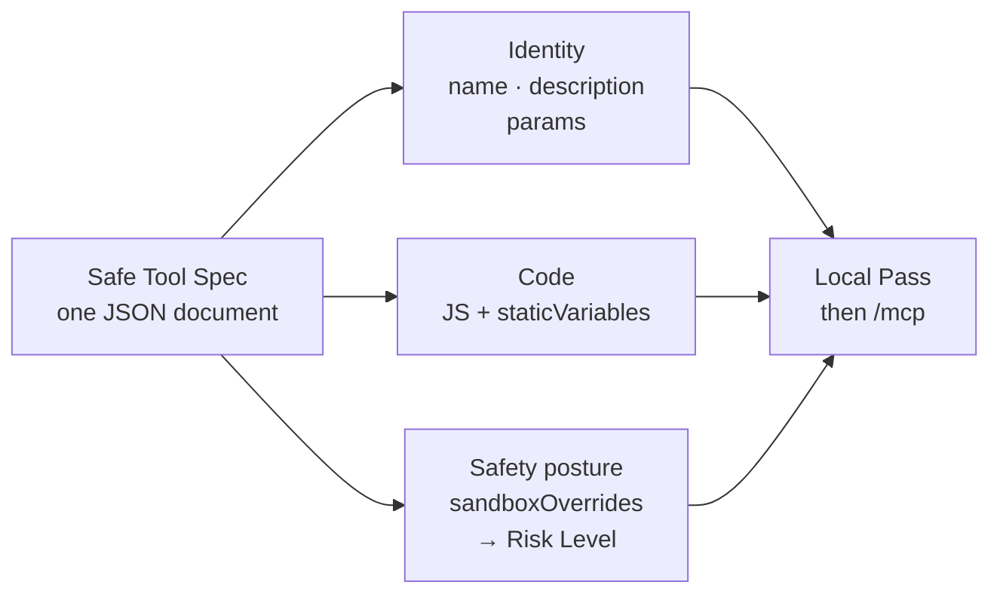
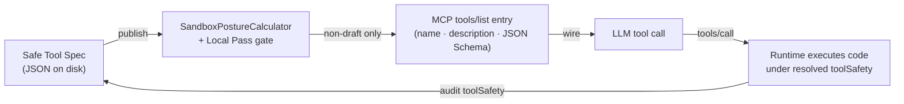
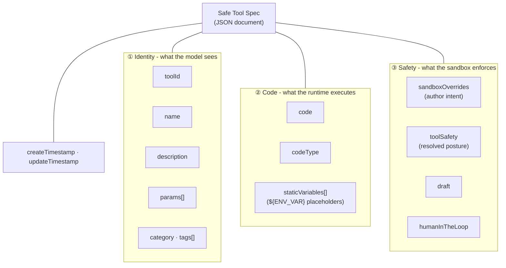
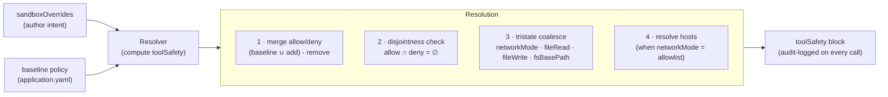
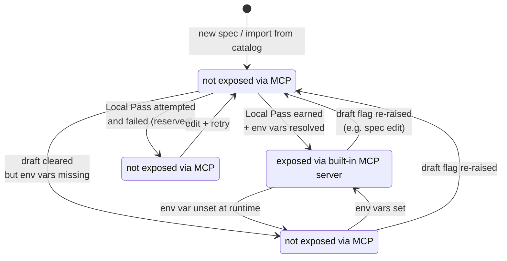

# Safe Tool Specification

**Version 1.0** · Status: stable for the 0.2.x line.

The Safe Tool Specification (this document) defines the on-disk JSON document format for a *tool* that Spring AI Playground's [Safe Local Execution Layer](architecture.md#design-goals) will load, validate, sandbox, and publish to Model Context Protocol clients. It is the artifact a tool author writes (directly or through Tool Studio's form), the artifact the runtime reads to compute an enforced safety posture, and the artifact the audit log records on every invocation.

This document complements but does not replace:

- [Application](architecture.md) - where the spec fits in the system
- [AI Agent Tool Safety](safety-architecture.md) - defense-in-depth model, threat-to-layer mapping, known limitations
- [Human-in-the-Loop Approval](hitl-architecture.md) - the runtime per-call approval gate that honors this spec's `humanInTheLoop` block
- [Tool Studio → Sandbox & Capabilities](features/tool-studio/index.md#sandbox-capabilities) - the UI surface that edits one of these documents

## 1. Introduction

### 1.1 Scope

A Safe Tool Spec is a self-contained JSON document. It declares:

- **Identity** the LLM sees (`name`, `description`, `params`)
- **Code** the playground executes (`code`, `codeType`, `staticVariables`)
- **Safety posture** the sandbox enforces (`sandboxOverrides`, `toolSafety`, `draft`)
- **Cataloging metadata** (`category`, `tags`, `toolId`, timestamps)

The spec is not concerned with how a tool is *invoked* through MCP, only with how a tool is *defined*. Invocation semantics belong to the [MCP `tools/list` and `tools/call` schemas](https://modelcontextprotocol.io).

At a glance, a Safe Tool Spec is one JSON document that binds three concerns, which together earn a Local Pass before publish:



### 1.2 Terminology

The key words **MUST**, **MUST NOT**, **SHOULD**, **SHOULD NOT**, **MAY**, and **OPTIONAL** in this document are to be interpreted as described in [RFC 2119](https://www.rfc-editor.org/rfc/rfc2119) and [RFC 8174](https://www.rfc-editor.org/rfc/rfc8174) when, and only when, they appear in all capitals.

Throughout this document:

- *Spec* refers to a single conforming JSON document.
- *Resolver* refers to the implementation that turns `sandboxOverrides` into `toolSafety`. The reference resolver is `SandboxPostureCalculator` in the Spring AI Playground codebase.
- *Runtime* refers to the JavaScript executor that runs the tool's `code` after the posture is resolved.
- *Catalog* refers to the bundled set of specs shipped with the playground (`src/main/resources/tool/default-tool-specs-*.json`).

### 1.3 Conformance

A document conforms to this specification if:

1. It parses as JSON (RFC 8259).
2. Every field present validates against [Section 16 JSON Schema](#16-json-schema).
3. Every cross-field invariant defined in this document holds (notably the allow/deny disjointness in Section 10.1 and the env-var grammar in Section 7.2).

A resolver conforms if, given a conforming spec, it produces a `toolSafety` block that matches Section 10.3 and a Risk Level that matches the algorithm in Section 10.6.

A runtime conforms if it enforces the policy described by `toolSafety` - never more permissive, possibly less - and records what was actually enforced (see Section 11 audit contract).

### 1.4 Relationship to existing tool specs

Several schemas exist today to declare a tool an LLM can call: MCP `tools/list`, OpenAI function calling, Anthropic tool use, Google function declarations, and framework-internal formats like LangChain's `BaseTool` or LlamaIndex's `FunctionTool`. They are all narrower than this specification - they declare *what the model is allowed to ask for*, but leave *how the tool runs and what guarantees apply* outside the document. The Safe Tool Spec is built to carry both halves in one artifact.

| Schema | name + JSON-schema args | Code body | Safety posture | Test value | Persisted on disk |
|---|---|---|---|---|---|
| MCP `tools/list` | ✅ | - | - | - | - (runtime emission only) |
| OpenAI function calling | ✅ | - | - | - | - |
| Anthropic tool use | ✅ | - | - | - | - |
| Google function declarations | ✅ | - | - | - | - |
| LangChain `BaseTool` | ✅ | ✅ (Python class) | partial (rate-limit / auth args) | - | - (the code is the spec) |
| LlamaIndex `FunctionTool` | ✅ | ✅ (Python callable) | - | - | - (the code is the spec) |
| **Safe Tool Spec** (this doc) | ✅ | ✅ (JS string) | ✅ (`sandboxOverrides` → `toolSafety`) | ✅ (`testValue` + Local Pass) | ✅ (JSON file) |

The pattern the other formats share: declare a function signature the model invokes, leave the implementation to host application code or framework conventions. The signature is the wire format the LLM consumes; the implementation lives outside the spec - in compiled code, in a framework's registry, or in a hand-written request handler.

The gap they leave open:

- **Where is the tool body?** In MCP, OpenAI, Anthropic, and Google function specs, the body is application code, not part of the document. Two engineers receiving the same spec write two different implementations.
- **What enforcement runs around the body?** None of the wire-format specs has a field that says "this tool needs filesystem read access" or "this tool's egress is restricted to `api.example.com`." Safety is something the host application implements separately - if it does at all.
- **How is the tool validated before publish?** None of the others define a publish gate. The Safe Tool Spec's `testValue` + Local Pass turns the spec into its own validation artifact: a spec that does not pass its own declared test does not reach the wire.
- **What does the audit log record?** Wire-format specs are silent on this. The Safe Tool Spec writes the resolved `toolSafety` block into the audit log on every invocation, so "what was actually enforced at this call" is a property of the spec, not of out-of-band instrumentation.

#### 1.4.1 How Safe Tool Spec composes with the wire formats

The Safe Tool Spec is *not* a replacement for MCP or function-calling schemas. It is a superset that the playground's runtime projects down to those wire formats on the way out:



What flows through each boundary:

- **Spec → MCP entry**: the playground's MCP server emits each non-draft Safe Tool Spec as an MCP `tools/list` entry containing exactly the model-visible subset - `name`, `description`, and `params` lowered into JSON Schema. `code`, `staticVariables`, `sandboxOverrides`, `toolSafety`, `testValue`, and `draft` are stripped. The model never sees them.
- **MCP entry → LLM**: identical to any other MCP-served tool. The LLM treats it as an opaque named function with typed arguments. A Safe Tool Spec is indistinguishable from any other tool at this layer.
- **`tools/call` → runtime**: when the LLM invokes the tool, the playground executes `code` under the resolved `toolSafety`. From the LLM's perspective this is a normal MCP `tools/call`; from the runtime's perspective it is a sandboxed JS invocation with the audit trail described in Section 11.4.
- **Audit ← runtime**: every invocation records the resolved `toolSafety` block alongside the request. Operators reading the audit log can answer "what posture was active when this tool was called" *from the spec itself*, without re-running the resolver or correlating across logs.

The pattern is the same separation MCP itself draws: protocol vs. execution. MCP standardizes the wire; the Safe Tool Spec standardizes the on-disk artifact that produces the wire output, gates publication on Local Pass, and writes the enforcement record back into the audit log when the wire call returns.

#### 1.4.2 What this specification is not

- **Not a protocol.** Safe Tool Spec is a document format; it does not define a transport, a handshake, or a capability-negotiation pass. MCP fills that role.
- **Not a function-calling schema replacement.** A Safe Tool Spec is *projected to* a JSON Schema when published; it does not compete with OpenAI / Anthropic / Google function declarations at the wire layer.
- **Not a framework binding.** Unlike LangChain or LlamaIndex tools, a Safe Tool Spec is portable across hosts that implement this specification - the artifact is JSON, the runtime contract is what executes it. A spec written for Spring AI Playground can be loaded by any conformant runtime.

## 2. Document structure at a glance

A Safe Tool Spec is a JSON object that groups its fields into three conceptual blocks plus bookkeeping. The diagram below shows how the top-level fields cluster; Section 3 catalogues them in a single table.



The three blocks correspond to three of the four product-positioning words from Section 1.1: **Identity** is "for AI Agent Tools" (the model-visible surface), **Code** is "Execution Layer" (the JS the runtime actually runs), **Safety** is "Safe" (what the sandbox guarantees). Sections 4-9 cover Identity and Code, Section 10 is the entire Safety block, Sections 11-12 cover lifecycle and bookkeeping.

The literal JSON shape:

```json
{
  "toolId":            "<UUID v5 derived from name>",
  "name":              "<slug>",
  "description":       "<model-visible description>",
  "category":          "<category enum>",
  "tags":              ["<cohort label>", "..."],
  "params":            [ /* ToolParamSpec, see Section 6 */ ],
  "staticVariables":   [ /* {key: value} entries, see Section 7 */ ],
  "code":              "<JavaScript action body>",
  "codeType":          "Javascript",
  "sandboxOverrides":  { /* author intent, see Section 10.1 */ },
  "toolSafety":        { /* resolved posture, see Section 10.3 */ },
  "draft":             true,
  "createTimestamp":   <epoch ms>,
  "updateTimestamp":   <epoch ms>
}
```

All fields listed above except `code`, `name`, and `codeType` MAY be omitted; defaults are defined per Section 3 below.

## 3. Top-level object

The spec is a JSON object. Each field is defined in its own section. Defaults in this table govern serialization; consumers reading a spec MUST apply the same defaults when a field is absent or `null`.

| Field | Type | Required | Default | Section |
|---|---|---|---|---|
| `toolId` | string (UUID) | SHOULD | derived (Section 4.1) | Section 4 |
| `name` | string | MUST | - | Section 4.2 |
| `description` | string | SHOULD | empty string | Section 5 |
| `category` | string | SHOULD | `null` | Section 9.1 |
| `tags` | array of string | MAY | `[]` | Section 9.2 |
| `params` | array of `ToolParamSpec` | MAY | `[]` | Section 6 |
| `staticVariables` | array of single-entry objects | MAY | `[]` | Section 7 |
| `code` | string | MUST | - | Section 8 |
| `codeType` | enum string | MUST | - (only `"Javascript"` today) | Section 8.1 |
| `sandboxOverrides` | object | MAY | empty overrides (baseline) | Section 10.1 |
| `toolSafety` | object | SHOULD | empty `{}` | Section 10.3 |
| `humanInTheLoop` | object | MAY | `null` (= DISABLED) | Section 10.7 |
| `draft` | boolean | MAY | `true` (catalog), `false` after Local Pass | Section 11 |
| `createTimestamp` | integer (epoch ms) | SHOULD | now | Section 12.2 |
| `updateTimestamp` | integer (epoch ms) | SHOULD | now | Section 12.2 |

Unknown top-level fields MUST be preserved on round-trip (load → save) and MUST NOT cause validation failure. This is the extension point for future minor versions; see Section 14.

## 4. Identity

### 4.1 `toolId`

A stable string identifier, normally a [UUID v5](https://www.rfc-editor.org/rfc/rfc4122#section-4.3) derived deterministically from `name` against a fixed namespace defined by the implementation.

- `toolId` MUST be unique within a catalog.
- `toolId` SHOULD remain stable across renames so that audit logs, presets, and catalog overrides can refer to a tool by identity rather than by display name.
- Implementations MAY accept opaque non-UUID strings if internal identity is provided by another mechanism, but UUID v5 from `name` is the reference scheme.

### 4.2 `name`

The MCP tool name. This is what models see in `tools/list` and what they invoke in `tools/call`.

- `name` MUST be a non-empty string.
- `name` SHOULD be a slug: lowercase alphanumeric plus `-` or `_`, no whitespace, no path separators.
- `name` MUST be unique within the set of *published* specs that share an MCP server. Drafts (Section 11) are exempt.

Implementations MAY enforce a stricter slug regex; consumers reading a foreign spec MUST NOT reject a non-empty string solely on slug grounds.

## 5. Description

`description` is the model-visible prose attached to the tool. It is the primary signal a model uses for tool selection and SHOULD therefore describe (in order of decreasing importance):

1. What the tool does in one clause.
2. Which arguments are required and what they mean.
3. The shape of the response.

Descriptions in the bundled catalog follow conventions worth borrowing:

- **Locale prefix**: tools that target a specific non-English locale prefix their description with `"<Locale> tool - <description of locale requirements>."`. The placeholder takes any ISO-style locale name and the trailing clause describes what the locale binding implies (response language, parameter language, regional API surface, ...). Examples: `"Korea-locale (KR) tool - Korean responses; some parameters require Korean input."`, `"Japan-locale (JP) tool - responses in Japanese; queries SHOULD be Japanese for relevance."`, `"China-locale (CN) tool - Simplified Chinese responses; mainland-China API surface only."`. The operational paragraph follows.
- **Return-shape literal**: closing the description with a literal JSON-ish sketch of the return value (e.g. `Returns an array of { market, tradePrice, openingPrice, ... }`) measurably improves model tool selection on small open-weight models.
- **Auth signal in prose**: tools requiring env-backed credentials describe both injection paths inline (`"set NAVER_CLIENT_ID + NAVER_CLIENT_SECRET on the tool's staticVariables, or inject as env var"`).

A description MUST NOT contain secrets, host names with embedded credentials, or environment-variable values; the audit log captures `description` verbatim.

## 6. Parameters

`params` is an ordered array of `ToolParamSpec` objects. Order is preserved by the catalog reader, by the persistence layer (see Section 12), and on the wire when the MCP server emits the tool's JSON Schema.

### 6.1 `ToolParamSpec` shape

```json
{
  "name":        "city",
  "description": "Name of the city",
  "required":    true,
  "type":        "STRING",
  "testValue":   "Seoul"
}
```

| Field | Type | Required | Notes |
|---|---|---|---|
| `name` | string | MUST | Slug; identifies the argument in the model's `tools/call` payload |
| `description` | string | SHOULD | Model-visible argument hint |
| `required` | boolean | MUST | If `true`, the runtime refuses to execute without this argument |
| `type` | `STRING` · `INTEGER` · `NUMBER` · `BOOLEAN` · `OBJECT` · `ARRAY` | MUST | Stored uppercase; see Section 6.2 |
| `testValue` | string | MUST when `required=true` | Sample value the Local Pass executes the tool with |

### 6.2 Type enum and JSON Schema mapping

The `type` field is serialized in the spec document in **uppercase** (`"STRING"`). When the MCP server emits the tool's JSON Schema for a model, it lowers the value to its JSON Schema spelling (`"string"`). The asymmetry is intentional: the spec document is the authoring artifact, and uppercase names match the Java enum that backs them; the JSON Schema is the wire format the LLM consumes.

| Spec value | JSON Schema value |
|---|---|
| `STRING` | `string` |
| `INTEGER` | `integer` |
| `NUMBER` | `number` |
| `BOOLEAN` | `boolean` |
| `OBJECT` | `object` |
| `ARRAY` | `array` |

`OBJECT` and `ARRAY` MAY be used. Models sometimes serialize an object as a JSON-string into a `STRING`-typed param when the agent loop does not support nested schemas; tools accepting structured input SHOULD document both call patterns in `description`.

### 6.3 `testValue` contract

`testValue` is not metadata: it is the value the Local Pass actually runs the tool with. A spec whose `testValue`s are placeholder garbage publishes a tool whose only validated execution path is garbage.

- `testValue` MUST be a string. For non-string `type`s the runtime parses the string into the declared type before invoking `code`.
- `testValue` MUST be a representative sample that exercises the same code path the model will hit in production. Pick `"Seoul"`, not `"abc"`.
- `testValue` MUST NOT contain a secret. If the tool needs a secret, declare it in `staticVariables` (Section 7) and let the Local Pass resolve it from the environment.
- For tools bound to a non-English locale, `testValue` MAY use that locale's script (e.g. Korean `'스프링 AI'`, Japanese `'東京駅'`, Simplified Chinese `'北京天安门'`, Arabic `'مرحبا'`) even though the rest of the spec is English. `testValue` is the only field where non-English content is normative; see Section 9.3.

## 7. Static variables

`staticVariables` is the spec's mechanism for server-side configuration: values the tool reads at execution time but the model never sees. It is the right place for API keys, account IDs, base URLs, and any other input the author controls but the agent does not.

### 7.1 Shape and ordering

```json
"staticVariables": [
  { "naverClientId":     "${NAVER_CLIENT_ID}" },
  { "naverClientSecret": "${NAVER_CLIENT_SECRET}" }
]
```

`staticVariables` is an **ordered list of single-entry objects**, not a JSON object. Order is preserved on disk, in memory, and when the runtime constructs the variable bag passed to `code`. The ordered-list shape exists to permit duplicate keys (rare but legal - later wins on read), to keep deterministic diffs when specs are edited, and to make `${ENV_VAR}` audit trails reproducible.

### 7.2 `${ENV_VAR}` placeholder grammar

A value MAY embed environment variable references using the placeholder grammar `\$\{([A-Z_]+[A-Z0-9_]*)}`:

- Placeholder names match `[A-Z_]+[A-Z0-9_]*` - one-or-more uppercase letters or underscores, then any combination of uppercase / digits / underscore. The reference resolver MUST NOT resolve lowercase placeholders.
- A value MAY mix literal text and placeholders: `"https://${API_HOST}/v2"` is legal. The reference grammar distinguishes *anchored* references (the whole value is a single placeholder, e.g. `"${API_KEY}"`) from *embedded* references (placeholder appears inside literal text).
- A spec MAY declare more than one placeholder per value; resolution applies to every match.

Resolution order (`EnvVarResolver`):

1. `System.getenv(name)` - process environment.
2. `System.getProperty(name)` - JVM system properties (fallback).
3. Unresolved - the literal `${NAME}` is left in place and the spec transitions to `MISSING_REQUIREMENTS` (Section 11.2).

The resolver MUST treat unset, empty, or whitespace-only values as missing. Implementations MAY layer additional resolution sources (a project-local secret store, a vault) ahead of the OS env, but the contract above is the floor: every conforming resolver MUST consult the OS env at minimum.

### 7.3 Secret storage

The Safe Tool Spec defines a *resolution contract* (Section 7.2), not a storage contract. The on-disk storage of resolved static-variable values is constrained to one rule:

| Secret surface | Storage model | Encryption at rest | Decryption scope |
|---|---|---|---|
| **Static `${ENV_VAR}` secrets** (this section) | OS environment / JVM properties | None (the playground does not persist them) | n/a - value is only in memory while the process holds it |

Static-variable secrets are deliberately *not* persisted by the playground. The resolution model places trust at the host boundary: if the OS env (or JVM properties) holds the value, the playground reads it for the lifetime of one tool invocation, masks it on output (Section 7.4), and forgets it when the process exits. A spec's `staticVariables` block records only the placeholder, never the resolved value.

Implementations of this specification SHOULD adopt the same posture: do not persist static-variable secrets at all, and if persisting other credentials (OAuth tokens, MCP-connection bearer tokens, ...) on a separate surface, encrypt them with a host-bound or user-bound key so that disk-copy alone is not sufficient to recover plaintext. The reference runtime's OAuth-token storage is documented at [safety-architecture → Encrypted OAuth token storage](safety-architecture.md#encrypted-oauth-token-storage) - it is a separate surface and outside this specification.

### 7.4 Secret masking pipeline

Once resolved, a static-variable value is treated as a secret for the rest of its lifetime in the process. Masking is **value-based**, not placeholder-based - the runtime tracks the resolved string and substring-replaces every occurrence of it with `***` on the way to any text egress.

The contract has two operations:

| Operation | Behavior |
|---|---|
| **Collect** | Walk every `${NAME}` reference in the template, resolve each via the env-var resolver (Section 7.2), and collect values of length ≥ 4 into a `Set<String>` of secrets. Values shorter than 4 characters MUST be excluded from the set to avoid masking incidental words. |
| **Mask** | Substring-replace each member of the secret set with `***` on the egress text. The replacement MUST be plain string substitution - no regex, no partial-prefix matching, no structural awareness of the surrounding text. |

Properties of this pipeline that implementations MUST preserve:

- **Egress-only**: masking is applied at every text-egress point, not at resolution time. The resolved value is what gets passed into `code`, and `code` is allowed to use it for outbound network calls / FS writes - the spec does not censor the value while it is still inside the sandbox.
- **Value identity, not placeholder identity**: a secret that is set via `${API_TOKEN}` and one that is set via `${OTHER_NAME}` to the same string are both masked once that string appears in any output. The resolver tracks resolved values, not placeholder names.
- **Minimum length guard**: values shorter than 4 characters MUST NOT be added to the mask set. A spec author SHOULD NOT assume a 3-character secret will be masked.
- **No structural understanding of the output**: masking is substring replacement on the final text. JSON, YAML, log lines, error messages, MCP `tools/call` results - all are masked the same way.
- **Per-call collection**: the secret set MUST be rebuilt per call from the spec's `staticVariables` (and equivalents for MCP-connection params). A change to the env between calls is picked up on the next invocation without restart.

Egress points a conformant implementation MUST cover:

- Every published MCP tool-call log line
- Every MCP client connection / error / event log line
- Every UI surface that renders an MCP connection's JSON
- Every audit log entry (Section 11.4)
- `console.log` output from inside the tool's JavaScript `code`

A resolver-conformant runtime that adds new text-egress channels (Slack notifier, error reporter, telemetry sink) MUST extend the masking call to those channels as well. For the reference runtime's wiring of these egress points (class names, call sites, mermaid), see [safety-architecture → Secret masking](safety-architecture.md#secret-masking).

### 7.5 Both injection paths are first-class

A spec may declare a `staticVariables` entry with a literal value (`"clientId": "12345-abc"`) for a tool that does not need a secret, or with a `${ENV_VAR}` placeholder for a tool that does. Catalog conventions strongly prefer placeholders for any value that looks like a secret - both because of the storage posture above and because masking only applies to values that came through a placeholder. A hard-coded secret literal is *not* automatically masked, since the masking pipeline has no way to distinguish "secret hard-coded in spec" from "URL fragment hard-coded in spec." Consumers MUST NOT assume the placeholder vs literal distinction beyond what the value itself declares.

## 8. Code

`code` is the JavaScript action body. The runtime evaluates it in a sandboxed [GraalVM Polyglot Context](https://www.graalvm.org/jdk21/reference-manual/embed-languages/) with all variables from `params`, `staticVariables`, and the host-injected `safety.*` helpers in scope.

### 8.1 `codeType`

`codeType` is an enum with a single accepted value today:

| Value | Meaning |
|---|---|
| `Javascript` | The body in `code` is JavaScript executed by GraalJS, with ECMAScript 2024 syntax support. |

`codeType` is enumerated rather than free-form to leave the door open for future runtimes (`Python`, `Wasm`) without ambiguous content sniffing.

### 8.2 Runtime contract

- The runtime MUST execute `code` in a sandboxed context that enforces the resolved `toolSafety` posture from Section 10.3.
- Within `code`, params are bound to their declared `name`s as top-level identifiers.
- `staticVariables` entries are bound to their declared keys as top-level identifiers (with `${ENV_VAR}` placeholders pre-resolved).
- The host injects (subject to `toolSafety.runtime.helpers`): `console`, `fetch`, `URL`, `URLSearchParams`, `atob`, `btoa`, `crypto`, and `safety.*` helpers.
- The runtime MUST enforce a wall-clock timeout and a statement-count limit. Defaults: 30 s timeout, 500 000 statements. Implementations MAY tune these.
- Resource breaches (timeout, statement-limit, helper exception) MUST surface as deterministic errors to the audit log.

### 8.3 The `safety.*` helper surface

When the resolved posture grants the corresponding capability, the runtime exposes the following helpers. The version tag in `toolSafety.runtime.helpers[]` (Section 10.3) records which helpers the spec was authored against; any new major version (e.g. `safety.fs/v2`) is a breaking change at the helper level and MUST trigger a spec version bump.

| Helper | Required posture | Purpose |
|---|---|---|
| `safety.fs/v1` (read group) | `capabilities.fileRead = true` | `readText`, `list`, `exists`, `stat`, `grep`, `lineCount`, `slice`, `cut`, `sort`, `find` - all rooted at `fsBasePath` with path-escape protection |
| `safety.fs/v1` (write) | `capabilities.fileWrite = true` | `writeText` only |
| `safety.parser/v1` (or `tool-safety-helpers/v1#parser`) | always available | Jsoup HTML, SnakeYAML `load`, RFC 4180 CSV, DTD/XXE-hardened XML - see Section 8.4 for the per-helper contract and known security caveats |
| `safety.http/v1` | `capabilities.network.mode != "blocked"` | Outbound HTTP via `fetch` with the SSRF four-layer guard active in `strict` mode (in `allowlist` mode only the explicit host allow-list is enforced - no IP/DNS-rebind guard) |
| `tool-safety-helpers/v1#crypto` | always available | The `crypto.subtle` API and related primitives |
| `tool-safety-helpers/v1#encoding` | always available | `atob` / `btoa` plus `TextEncoder` / `TextDecoder` |

Two helper-string conventions are in active use. Both are normative and may be mixed within a single spec:

- **Namespaced** - `<namespace>/v<n>`, e.g. `safety.http/v1`, `safety.fs/v1`. Used for helpers that gate on a runtime capability (network, FS).
- **Anchor-suffixed** - `<bundle>/v<n>#<group>`, e.g. `tool-safety-helpers/v1#crypto`. Used for grouped utility helpers that share a single bundle version but expose distinct call surfaces.

Tools authored against v1 MUST list every helper group they use in `toolSafety.runtime.helpers`; a runtime MAY refuse to publish a spec that references a helper version it cannot provide.

### 8.4 Parser helpers

The four parser entry points live under `safety.parser.*` and are exposed whenever the runtime declares `safety.parser/v1` (or `tool-safety-helpers/v1#parser`) in its helper set:

| Call | Behavior |
|---|---|
| `safety.parser.html(input)` | Jsoup parse with default settings. ⚠ Returns the host `org.jsoup.nodes.Document` directly (not wrapped in a plain proxy tree like XML / CSV / YAML); JS code can call jsoup methods on the returned object. Implementations MAY wrap the return to match the proxy-tree convention. See [safety-architecture → `safety.parser.html` returns host `Document`](safety-architecture.md#safetyparserhtml-returns-host-document). |
| `safety.parser.yaml(input)` | SnakeYAML `load`. ⚠ Reference runtime uses default `Constructor` (not `SafeConstructor`) - `!!class.name` tags trigger class instantiation; implementations SHOULD use `SafeConstructor`, and consumers MUST treat untrusted YAML input as security-relevant. See [safety-architecture → `safety.parser.yaml` constructor choice](safety-architecture.md#safetyparseryaml-constructor-choice). |
| `safety.parser.csv(input, opts?)` | RFC 4180 CSV with optional `{header, delimiter}` |
| `safety.parser.xml(input)` | DTD/XXE-hardened DocumentBuilder |

## 9. Categorization

### 9.1 `category`

`category` is a single-string label used for UI grouping in the catalog browser. It is *not* enforced as an enum at the document level - consumers MUST accept arbitrary string values - but the bundled catalog defines and uses the following 13 values:

`TEXT` · `DATA` · `DATETIME` · `MATH` · `ENCODING` · `CRYPTO` · `SECURITY` · `FILE` · `WEB` · `PRODUCTIVITY` · `MESSAGING` · `AI` · `CUSTOM`

Catalog-conformant authors SHOULD pick from the list above. Authors publishing private specs MAY introduce new categories; consumers presenting an unknown category MUST render it as a string verbatim.

### 9.2 `tags`

`tags` are cohort labels distinct from `category`. Where `category` answers "*what does the tool do?*" `tags` answers "*what cohort does it belong to?*"

- `tags` MUST contain at most **2** values per spec. Catalog tooling rejects specs that exceed this on import.
- `tags` are drawn from a controlled vocabulary in the bundled catalog: `korea` · `example` · `util` · `pipeline` · `github` · `search` · `finance` · `weather` · `geo`. Future minor versions of this spec MAY enlarge the vocabulary; vocabulary additions are non-breaking.
- `tags` MUST NOT carry capability or auth signals. Capability lives in `sandboxOverrides`; secret-backing lives in `staticVariables`. Encoding the same fact in two places is a maintenance hazard.

### 9.3 Locale rule

Specs published in a multilingual catalog MUST follow these locale rules. The rules apply uniformly to every non-English locale (Korean, Japanese, Chinese, Arabic, Hebrew, Thai, ...) so that machine-readable fields stay English while human-targeted examples can carry locale-bound content:

- `name`, slug-like identifiers, JSON keys, and JSON values that look like identifiers MUST be ASCII English.
- `description` is English prose, possibly with **quoted** non-English fragments inside it. Quote the fragment in the locale the upstream API or end-user actually uses - e.g. `"Korean queries typical (e.g. '스프링 AI'); other languages also accepted."` or `"Japanese station names typical (e.g. '東京駅')."`. The base prose is English; locale-bound *examples* are quoted.
- `params[].testValue` MAY be in any locale required by the upstream API. This is the *only* field where non-English content is normative.
- JavaScript code in `code` MUST follow English-only naming; `//` comments MAY be in any locale.

## 10. Safety

The two sandbox-related blocks below are the core of this specification, plus a third per-call approval block (`humanInTheLoop`, Section 10.7). The first two look similar but serve opposite directions:

| Block | Direction | Editable by | Stored verbatim |
|---|---|---|---|
| `sandboxOverrides` | Author *intent* (declarative) | Tool Studio's Sandbox & Capabilities pane | Yes |
| `toolSafety` | Runtime *enforcement* (resolved) | Computed by the resolver | Yes (informational) |

Implementations MUST treat `sandboxOverrides` as the author's declared widening of the baseline; the resolver MUST compute `toolSafety` from `sandboxOverrides` + the configured baseline policy.

### 10.1 `sandboxOverrides` shape

```json
"sandboxOverrides": {
  "addAllowClasses":    [],
  "removeAllowClasses": [],
  "addDenyClasses":     [],
  "removeDenyClasses":  [],
  "networkMode":        "allowlist",
  "hostsAllow":         ["api.upbit.com"],
  "fileRead":           null,
  "fileWrite":          null,
  "fsBasePath":         null
}
```

| Field | Type | Tristate? | Meaning of absent / null |
|---|---|---|---|
| `addAllowClasses` | array of Java class names | no | empty array - baseline allowlist unchanged |
| `removeAllowClasses` | array of Java class names | no | empty array - baseline allowlist unchanged |
| `addDenyClasses` | array of Java class names | no | empty array - baseline denylist unchanged |
| `removeDenyClasses` | array of Java class names | no | empty array - baseline denylist unchanged |
| `networkMode` | enum (Section 10.4) | **yes** | inherit baseline (default = `blocked`) |
| `hostsAllow` | array of hostnames | no | empty - no hosts; `["*"]` is the wildcard sentinel |
| `fileRead` | boolean OR null | **yes** | inherit baseline (default = `false`) |
| `fileWrite` | boolean OR null | **yes** | inherit baseline (default = `false`) |
| `fsBasePath` | string OR null | **yes** | inherit baseline path |

Notes:

- For `networkMode`, `fileRead`, `fileWrite`, `fsBasePath` the distinction between `null` (inherit) and an explicit value (override) is significant. Setting `fileRead: false` explicitly is different from omitting the field - explicit `false` MUST clear any baseline that would have granted read access.
- `addAllowClasses` ∩ `addDenyClasses` MUST be empty after merge with baseline. A resolver detecting overlap MUST raise a deterministic resolver error rather than silently picking one.
- An empty `SandboxOverrides` block (all fields null/empty) is equivalent to no block at all; consumers MUST treat them interchangeably.

### 10.2 Resolution algorithm

The reference resolver (`SandboxPostureCalculator`) computes the enforced posture from `sandboxOverrides` plus the configured baseline. The two inputs flow through merge and tristate-coalesce steps and emerge as the `toolSafety` block:



Pseudocode:

```text
input:  overrides : SandboxOverrides
        baseline  : { allowClasses, denyClasses, fsBasePath, networkMode, allowedHosts, fileRead, fileWrite }

step 1  effectiveAllow = (baseline.allow ∪ overrides.addAllow) - overrides.removeAllow
step 2  effectiveDeny  = (baseline.deny  ∪ overrides.addDeny ) - overrides.removeDeny
step 3  if effectiveAllow ∩ effectiveDeny ≠ ∅ → reject (resolver error)
step 4  effectiveNetwork = overrides.networkMode ?? baseline.networkMode      (tristate)
step 5  effectiveHosts   = overrides.hostsAllow ∪ baseline.allowedHosts        when network=allowlist; else []
step 6  effectiveFileR   = overrides.fileRead   ?? baseline.fileRead           (tristate)
step 7  effectiveFileW   = overrides.fileWrite  ?? baseline.fileWrite          (tristate)
step 8  effectiveBase    = overrides.fsBasePath ?? baseline.fsBasePath
step 9  populate toolSafety = {
            version: "1.0",
            runtime: { id, minVersion, ecmaVersion, javaInterop, helpers, console },
            category: { source, id },
            capabilities: {
              network: { mode: effectiveNetwork, hosts: effectiveHosts },
              fileRead: effectiveFileR,
              fileWrite: effectiveFileW
            }
        }
```

The algorithm is **monotonic with respect to risk**: nothing in `sandboxOverrides` can make the baseline *less* permissive than its already-allowed reach (that would be a no-op or a reduction). Removals from the baseline denylist are escalations; removals from the baseline allowlist are restrictions. See Section 10.6 for how this drives Risk Level.

### 10.3 `toolSafety` shape

```json
"toolSafety": {
  "version": "1.0",
  "runtime": {
    "id":            "spring-ai-playground/polyglot-js",
    "minVersion":    "0.2.0",
    "ecmaVersion":   "2024",
    "javaInterop":   false,
    "helpers":       ["safety.http/v1"],
    "console":       true
  },
  "category": {
    "source": "builtin",
    "id":     "WEB"
  },
  "capabilities": {
    "network": { "mode": "allowlist", "hosts": ["api.upbit.com"] },
    "fileRead":  false,
    "fileWrite": false
  }
}
```

| Path | Type | Notes |
|---|---|---|
| `version` | string | Spec-schema version this block was written against. Today: `"1.0"`. |
| `runtime.id` | string | Stable runtime identifier. Today: `"spring-ai-playground/polyglot-js"`. |
| `runtime.minVersion` | string (semver) | Minimum Spring AI Playground version that can execute the tool |
| `runtime.ecmaVersion` | string | `"2024"` for v1 |
| `runtime.javaInterop` | boolean | Whether the tool reaches into host JVM classes |
| `runtime.helpers` | array of `"<namespace>/v<n>"` strings | Versioned helper surface the spec relies on |
| `runtime.console` | boolean | Whether `console.log` is bound (output still passes env-var masking) |
| `category.source` | string | `"builtin"` for catalog specs, `"user"` for Tool Studio specs, or a custom origin |
| `category.id` | string | Resolved category (see Section 9.1) |
| `capabilities.network.mode` | enum (Section 10.4) | Resolved network mode |
| `capabilities.network.hosts` | array of hostnames | Resolved egress allow list |
| `capabilities.fileRead` | boolean | Resolved read capability |
| `capabilities.fileWrite` | boolean | Resolved write capability |

`toolSafety` is the auditable record of what the runtime is committed to enforce. The audit log records this block per invocation; downstream consumers SHOULD treat it as authoritative for "what posture was active at this call."

> **Implementation note.** In the reference Spring AI Playground runtime (v0.2.x), `toolSafety` is written by Tool Studio at publish-time but is **not** re-derived on every load - the persisted block is the writer's last snapshot. Downstream consumers that need byte-fresh policy MUST re-run the resolver against `sandboxOverrides` rather than trusting `toolSafety` for enforcement decisions on a foreign spec.

### 10.4 Network mode behavioral table

`capabilities.network.mode` takes one of four values. Each defines a distinct `fetch` behavior. The SSRF four-layer guard (DNS pinning, IP-range filter, redirect-chain pinning, response-body size cap) is active in `strict` only. `allowlist` enforces an explicit host allow-list - internal-network hosts may be included - but does **not** perform IP-range / DNS-rebind guarding; `open` bypasses everything. For a local single-user tool this is the right split: use `allowlist` for hosts you trust (vendor APIs, an internal service) and `strict` for untrusted public hosts:

| Mode | `fetch` exposed? | Host gate | SSRF guard | When to use |
|---|---|---|---|---|
| `blocked` | no | n/a | n/a | Tool does no network - the safe default; the `fetch` global is not installed at all. |
| `allowlist` | yes | only hosts in `capabilities.network.hosts` (internal-network hosts allowed) | off - host allow-list only, no IP/DNS-rebind guard | Tool talks to one or more **trusted** hosts (vendor APIs or an internal service). For untrusted public hosts use `strict`. |
| `strict` | yes | any public host | active | Tool talks to arbitrary public hosts but the playground enforces SSRF guards on every request. |
| `open` | yes | any host including private networks | **bypassed** | Strongly discouraged; should never appear in a published catalog spec. Authoring private tools on a trusted host only. |

The default at the *baseline* level is `blocked`. Authors who do not declare `networkMode` in `sandboxOverrides` publish a tool that cannot reach the network.

### 10.5 File access behavioral table

| `fileRead` | `fileWrite` | `safety.fs/v1` exposed? | Notes |
|---|---|---|---|
| `false` (or null inheriting false) | `false` | not exposed | The helper is not even installed in the runtime's `safety` object. |
| `true` | `false` | exposed, read-only group | `writeText` throws; all other `fs.*` work, scoped under `fsBasePath`. |
| `false` | `true` | exposed, write-only | Only `writeText` works; all other `fs.*` throw. |
| `true` | `true` | exposed, full | All `fs.*` work. |

`fsBasePath` is the root the helper enforces. Any path argument the tool passes to `fs.*` is resolved relative to `fsBasePath` and then re-normalized; arguments that escape (`..` traversal) MUST be refused with a `SECURITY` `JsHelperException`.

### 10.6 Risk Level

`toolSafety` is human-readable; Risk Level is the UI-friendly distillation. Levels run from `L0` (no detected risk) to `L5` (escape-class allowed). The reference resolver computes Risk Level as a **monotonic max-merge**:

```text
risk := L0
if capabilities.network.mode == "allowlist":
    risk := max(risk, hosts contains "*" ? L4 : L3)
elif capabilities.network.mode == "strict":  risk := max(risk, L3)
elif capabilities.network.mode == "open":    risk := max(risk, L4)
if fileWrite:                                risk := max(risk, L4)
elif fileRead:                               risk := max(risk, L3)

for cls in (baseline.deny - sandboxOverrides.removeDenyClasses):
    if cls matches System|Runtime|Process|ProcessBuilder:  risk := max(risk, L5)
if |removed-from-baseline-deny| ≥ 3:                       risk := max(risk, L4)
elif |removed-from-baseline-deny| ≥ 1:                     risk := max(risk, L3)

for cls in (sandboxOverrides.addAllowClasses - baseline.allow):
    if cls is critical (System / Runtime / Process):       risk := max(risk, L5)
    elif cls is FileWrite-related:                         risk := max(risk, L5)
    elif cls is reflection / network / FileRead-related:   risk := max(risk, L4)
    else:                                                  risk := max(risk, L3)
```

The Risk Level is computed for UI badging and audit-log decoration. Implementations MUST NOT store the computed level in `toolSafety` itself - Risk Level is a *view* on the posture, not a property of it. If the algorithm changes, recomputing yields a different answer from the same `toolSafety`; this is intentional.

### 10.7 Human-in-the-loop approval { #human-in-the-loop }

The optional `humanInTheLoop` block declares whether a tool call must be confirmed by a person **at call time**. It is independent of the sandbox (which decides *what* a tool may do) and of the Risk Level (which is observational): this block decides *whether a specific call runs at all*. Where the sandbox and risk score are evaluated before publication, this gate fires on every invocation.

```json
{
  "humanInTheLoop": {
    "mode": "REQUIRED",
    "promptTemplate": "Allow '{toolName}' to run with {args}?"
  }
}
```

| Field | Type | Required | Meaning |
|---|---|---|---|
| `mode` | enum | no | `DISABLED` · `REQUIRED`. Absent or the whole block `null` ⇒ `DISABLED`. |
| `promptTemplate` | string \| null | no | Approval-prompt text. `{toolName}` and `{args}` are substituted at call time (flat substitution - `{args}` is the whole argument map; there is no dotted-path form like `{args.path}`). Null ⇒ a built-in default prompt. |

The two modes:

- **`REQUIRED`** - every call is gated. In Agentic Chat the user sees an approve/decline dialog; an external MCP client is asked through MCP `elicitation/create`. A decline (or timeout, or a client that cannot ask) means the tool does **not** run - approval is deny-by-default.
- **`DISABLED`** - the tool runs without any approval step (the sandbox still applies).

Enabling this block does **not** change the tool's computed Risk Level - the two are orthogonal. The runtime enforcement (the two gates, the loopback de-duplication, and the fail-safe behavior) is specified in **[Human-in-the-Loop Approval](hitl-architecture.md)**; this section only defines the on-disk shape.

## 11. Lifecycle

### 11.1 States

A spec is in exactly one of the following states at any time:



| State | Condition | MCP exposure |
|---|---|---|
| `DRAFT` | `draft == true` (or `spec == null`) | not exposed |
| `MISSING_REQUIREMENTS` | any `${ENV_VAR}` referenced by `staticVariables` resolves to unset / empty / whitespace-only | not exposed |
| `ACTIVE` | `draft == false` AND every env-var reference resolves | exposed via the built-in MCP server |
| `TEST_FAILED` | reserved | not exposed |

`TEST_FAILED` is reserved for future use; the reference resolver never returns it from the current calculator. Drafts MAY exist with arbitrary or empty `toolSafety` - the runtime does not enforce posture invariants until the spec is published.

### 11.2 Env-var requirement check

Before publishing, the runtime walks every `staticVariables` value, extracts each `${VAR}` placeholder, and verifies the OS environment defines a non-blank value for it. The check uses the placeholder grammar from Section 7.2.

- Implementations MUST treat unset, empty, and whitespace-only environment values as **missing**.
- Implementations MAY consult a project-local secret store before the OS env; the result of the lookup is what the requirement check inspects.
- A spec with any missing requirement is transitioned to `MISSING_REQUIREMENTS` and is not exposed.

### 11.3 Local Pass - the publish gate

`draft` flips from `true` to `false` only when the spec earns its **Local Pass**: a successful test run with the declared `testValue`s, executed in the same sandbox the published tool will run in, with the resolved `toolSafety` posture in effect.

- The Local Pass MUST execute `code` with every `required` param set from its `testValue`.
- The Local Pass MUST be repeatable; non-deterministic tools (random, time-sensitive) MUST choose `testValue`s that exercise the deterministic path.
- A passing Local Pass updates the in-memory state and persists `draft: false`.
- A failing Local Pass leaves `draft: true` and surfaces a structured error to the audit log.

### 11.4 Audit contract

Every invocation MUST record (at minimum):

- `toolId`, `name`, `category.id`
- Resolved `toolSafety` block (verbatim)
- The Risk Level computed from Section 10.6
- Parameters as received (post-validation, pre-execution); secrets MUST be masked
- Outcome: `OK` / `ERROR` with structured cause
- Elapsed duration

The audit record is the source of truth for "what was actually enforced." Implementations MAY append additional fields (`cid`, request id, MCP client metadata).

## 12. Persistence

### 12.1 File layout

The reference implementation persists user-authored specs into a **single bundle file** under the playground's home directory:

```text
~/spring-ai-playground/tool/save/toolSpecsMcpSetting.json
```

The bundle file contains both the spec list and the MCP server settings:

```json
{
  "toolSpecs": [ /* spec, spec, ... */ ],
  "toolMcpServerSetting": { /* MCP transport + autoAdd flag */ }
}
```

Specs that originate from the bundled catalog (`src/main/resources/tool/default-tool-specs-*.json`) are excluded from the bundle on save - they are reloaded from the classpath on startup, with user overrides matched by `toolId` and merged on top.

Implementations are free to choose a different file layout (one file per spec, sharded by category, database-backed) as long as the round-trip JSON shape of each spec conforms to this specification.

### 12.2 Atomic write contract

Writers MUST commit changes atomically:

1. Serialize the bundle to a sibling temp file (`toolSpecsMcpSetting.json.tmp`).
2. `renameSync` the temp file over the target. POSIX rename guarantees atomicity within the same filesystem.

Readers MUST read after the rename completes - a writer that crashes mid-rename leaves the previous bundle intact.

`createTimestamp` is set once when the spec is first written; `updateTimestamp` is updated on every subsequent persist. Both are epoch milliseconds.

### 12.3 Catalog mirror invariant (build-time)

The Spring AI Playground build ships the catalog twice:

- `src/main/resources/tool/default-tool-specs-*.json` - the JVM resource classpath
- `electron/resources/catalog/default-tool-specs-*.json` - the Electron-bundled mirror

The two MUST be byte-identical. The build is responsible for enforcing this (the reference build uses `prepare-resources.mjs`); the spec format itself is silent on it. Catalog publishers consuming this spec independently MAY omit the mirror requirement.

## 13. Versioning policy

The version namespace lives in `toolSafety.version` (today: `"1.0"`). The bump rules:

- **Patch** (`1.0 → 1.0.1`): editorial clarification, additional examples, new tag vocab entries, new category enum values. No behavioral change. Patch bumps are not visible in the version field - the field captures major + minor only.
- **Minor** (`1.0 → 1.1`): backward-compatible additive change. New optional fields, new network mode values, new helper versions added to the vocabulary (e.g. `safety.http/v2` alongside `v1`). Existing conforming specs continue to parse and resolve identically.
- **Major** (`1.0 → 2.0`): backward-incompatible change. Field renames, removed enum values, semantics changes to existing fields. Documents written against v1 MUST continue to be readable for at least one major-version transition window.

Helper-level versions (`safety.fs/v1` → `safety.fs/v2`) are independent of the spec version; they bump the helper-namespace number when their JS API surface changes. A spec MAY mix v1 and v2 helpers from different namespaces.

## 14. Extension points

Unknown top-level fields MUST be preserved on round-trip. This is the dedicated extension surface - a future minor version can introduce new fields without invalidating today's documents.

Implementations adding their own fields SHOULD:

- Prefix custom field names with a vendor identifier (`x-acme-cost-cap`) to avoid collision with future standard fields.
- Document the field's semantics in their own docs and link this spec for the surrounding shape.
- Treat unknown vendor-prefixed fields with the same round-trip rule - do not strip them on save.

Custom additions inside `sandboxOverrides`, `toolSafety`, or `params[]` are out of scope for this version - those blocks have closed shapes today. Future minor versions may open named extension sub-objects within them.

## 15. Validation and error model

Validation has three layers:

1. **Document validation** - does the spec parse and conform to the JSON Schema (Section 16)?
2. **Cross-field validation** - do the invariants in Section 6 (`required` ⟹ `testValue` present), Section 7 (env-var grammar), Section 10.1 (allow/deny disjointness) hold?
3. **Runtime validation** - does the resolver accept the spec, and does the Local Pass succeed?

Validation errors SHOULD be reported with at least:

- A stable error code (`SPEC_PARSE`, `SPEC_INVARIANT`, `RESOLVER_REJECT`, `LOCAL_PASS_FAILED`)
- A pointer to the offending field (`params[2].testValue`)
- A human-readable message
- For runtime errors, the resolved `toolSafety` block under which the failure occurred

The reference runtime classifies helper errors as `INVALID_INPUT`, `HELPER_RUNTIME`, or `SECURITY`; the spec layer adds the four codes above.

## 16. JSON Schema

A normative JSON Schema 2020-12 document is bundled alongside this page:

[**safe-tool-spec.schema.json**](safe-tool-spec.schema.json){download}

Validate any candidate spec by loading the schema and checking it with a 2020-12 compatible validator (`ajv`, `jsonschema`, `python-jsonschema`).

## 17. Canonical examples

The bundled catalog ships every example variant below. Each is shown abbreviated; the full version is in `src/main/resources/tool/default-tool-specs-*.json`.

### 17.1 Pure compute - `base64`

No network, no filesystem, no env. The baseline `sandboxOverrides` (all-null) is sufficient.

```json
{
  "toolId": "e30d037d-20cf-55f2-b43a-1b89560417da",
  "name": "base64",
  "description": "Encodes UTF-8 text to base64, or decodes base64 back to UTF-8 text. Use mode='encode' (default) or 'decode'.",
  "category": "ENCODING",
  "tags": ["util"],
  "params": [
    { "name": "text", "type": "STRING", "required": true,  "testValue": "hello world", "description": "Text to encode/decode" },
    { "name": "mode", "type": "STRING", "required": false, "testValue": "encode",      "description": "encode | decode" }
  ],
  "staticVariables": [],
  "code": "/* ... */",
  "codeType": "Javascript",
  "sandboxOverrides": {},
  "toolSafety": {
    "version": "1.0",
    "runtime": { "id": "spring-ai-playground/polyglot-js", "javaInterop": false, "helpers": [], "console": true },
    "capabilities": { "network": { "mode": "blocked", "hosts": [] }, "fileRead": false, "fileWrite": false }
  },
  "draft": false
}
```

Risk Level: **L0**.

### 17.2 Single-host network - `getUpbitTicker`

`allowlist` mode with one host. No env-backed secret; the upstream API is unauthenticated.

```json
{
  "name": "getUpbitTicker",
  "category": "WEB",
  "tags": ["korea"],
  "params": [{ "name": "markets", "type": "STRING", "required": true, "testValue": "KRW-BTC,KRW-ETH",
              "description": "Comma-separated KRW markets (e.g. 'KRW-BTC,KRW-ETH')" }],
  "staticVariables": [],
  "sandboxOverrides": {
    "networkMode": "allowlist",
    "hostsAllow":  ["api.upbit.com"]
  },
  "toolSafety": {
    "version": "1.0",
    "runtime":  { "id": "spring-ai-playground/polyglot-js", "javaInterop": false, "helpers": ["safety.http/v1"], "console": true },
    "capabilities": { "network": { "mode": "allowlist", "hosts": ["api.upbit.com"] }, "fileRead": false, "fileWrite": false }
  }
}
```

Risk Level: **L3** (non-wildcard allowlist).

### 17.3 Env-backed multi-secret - `searchNaver`

Two env-backed credentials, allowlist mode.

```json
{
  "name": "searchNaver",
  "category": "WEB",
  "tags": ["korea"],
  "params": [
    { "name": "query", "type": "STRING", "required": true, "testValue": "스프링 AI",
      "description": "Korean queries typical (e.g. '스프링 AI'); other languages also accepted." }
  ],
  "staticVariables": [
    { "naverClientId":     "${NAVER_CLIENT_ID}" },
    { "naverClientSecret": "${NAVER_CLIENT_SECRET}" }
  ],
  "sandboxOverrides": {
    "networkMode": "allowlist",
    "hostsAllow":  ["openapi.naver.com"]
  }
}
```

Without both env vars set, the spec sits in `MISSING_REQUIREMENTS` and is not exposed (Section 11.2).

### 17.4 Strict-mode external HTTP - `extractPageContent`

Tool fetches arbitrary user-supplied URLs; SSRF guard runs in `strict` mode.

```json
{
  "name": "extractPageContent",
  "category": "WEB",
  "tags": ["util"],
  "params": [
    { "name": "url", "type": "STRING", "required": true, "testValue": "https://example.com" }
  ],
  "sandboxOverrides": { "networkMode": "strict" },
  "humanInTheLoop": {
    "mode": "REQUIRED",
    "promptTemplate": "The assistant wants to fetch and read a web page. Allow '{toolName}' with {args}?"
  }
}
```

Risk Level: **L3** (`strict`). This is the bundled `extractPageContent`, which ships `humanInTheLoop.mode = REQUIRED` - every call is confirmed before the fetch runs (Section 10.7).

### 17.5 Filesystem read - `readTextFile`

No network, scoped read access to the configured `fsBasePath`.

```json
{
  "name": "readTextFile",
  "category": "FILE",
  "params": [
    { "name": "path", "type": "STRING", "required": true, "testValue": "README.md" }
  ],
  "sandboxOverrides": { "fileRead": true }
}
```

Risk Level: **L3** (read only).

### 17.6 Filesystem write - `writeTextFile`

Write access. Highest risk level the bundled catalog ships.

```json
{
  "name": "writeTextFile",
  "category": "FILE",
  "params": [
    { "name": "path",    "type": "STRING", "required": true, "testValue": "notes.txt" },
    { "name": "content", "type": "STRING", "required": true, "testValue": "hello" }
  ],
  "sandboxOverrides": { "fileWrite": true }
}
```

Risk Level: **L4** (write).

### 17.7 Object-typed argument - `evalExpression`

Demonstrates `OBJECT` parameter type. Models that cannot pass nested JSON drop down to `STRING` and pre-serialize.

```json
{
  "name": "evalExpression",
  "category": "MATH",
  "params": [
    { "name": "expr",      "type": "STRING", "required": true,  "testValue": "x + 2 * y" },
    { "name": "variables", "type": "OBJECT", "required": false, "testValue": "{\"x\":3,\"y\":4}",
      "description": "Variable bindings (JSON-stringified object: {\"x\":3,\"y\":4})" }
  ]
}
```

### 17.8 Draft - unpublished

A spec freshly imported from the catalog ships with `draft: true`. Until activation (by preset + rules), it remains invisible to MCP.

```json
{ "name": "experimentalThing", "code": "/* ... */", "codeType": "Javascript", "draft": true }
```

## 18. References

- [RFC 2119](https://www.rfc-editor.org/rfc/rfc2119) - Key words for use in RFCs to Indicate Requirement Levels
- [RFC 8174](https://www.rfc-editor.org/rfc/rfc8174) - Ambiguity of Uppercase vs Lowercase in RFC 2119 Key Words
- [RFC 8259](https://www.rfc-editor.org/rfc/rfc8259) - The JavaScript Object Notation (JSON) Data Interchange Format
- [RFC 4122 Section 4.3](https://www.rfc-editor.org/rfc/rfc4122#section-4.3) - UUID v5
- [JSON Schema 2020-12](https://json-schema.org/draft/2020-12/release-notes.html)
- [Model Context Protocol](https://modelcontextprotocol.io) - `tools/list` and `tools/call`
- [Human-in-the-Loop Approval](hitl-architecture.md) - the runtime per-call approval gate that honors `humanInTheLoop`
- [AI Agent Tool Safety](safety-architecture.md) - defense-in-depth, threat-to-layer mapping, known limitations
- [Application Architecture → Safe Tool Spec](architecture.md#safe-tool-spec) - where the spec fits in the system

## 19. Document history

| Version | Date | Notes |
|---|---|---|
| 1.0 | 2026-05-20 | Initial publication. Codifies the shape shipping in Spring AI Playground 0.2.0-M7. |
