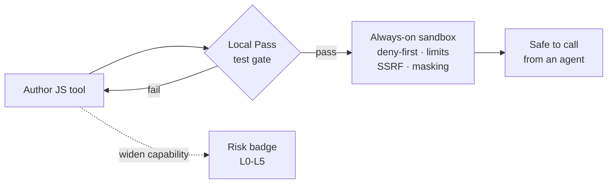
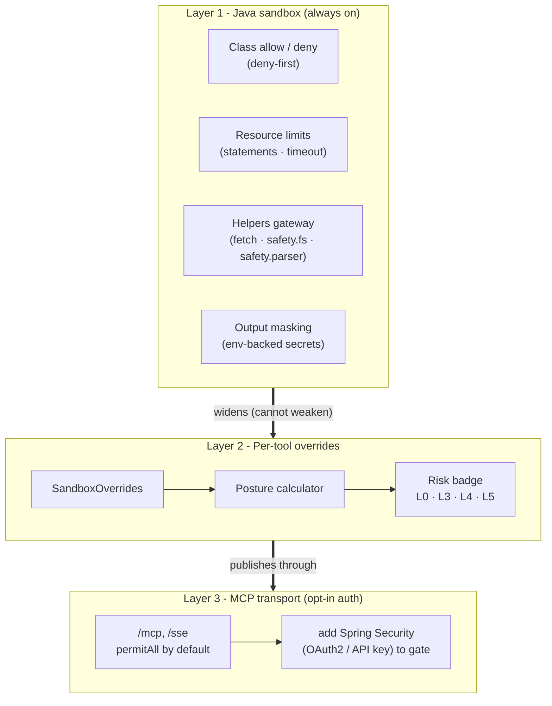
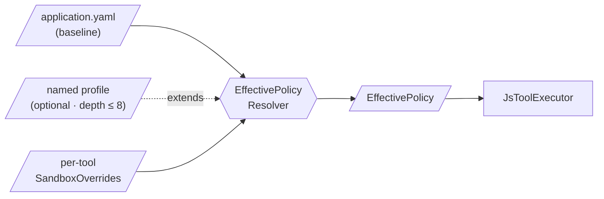
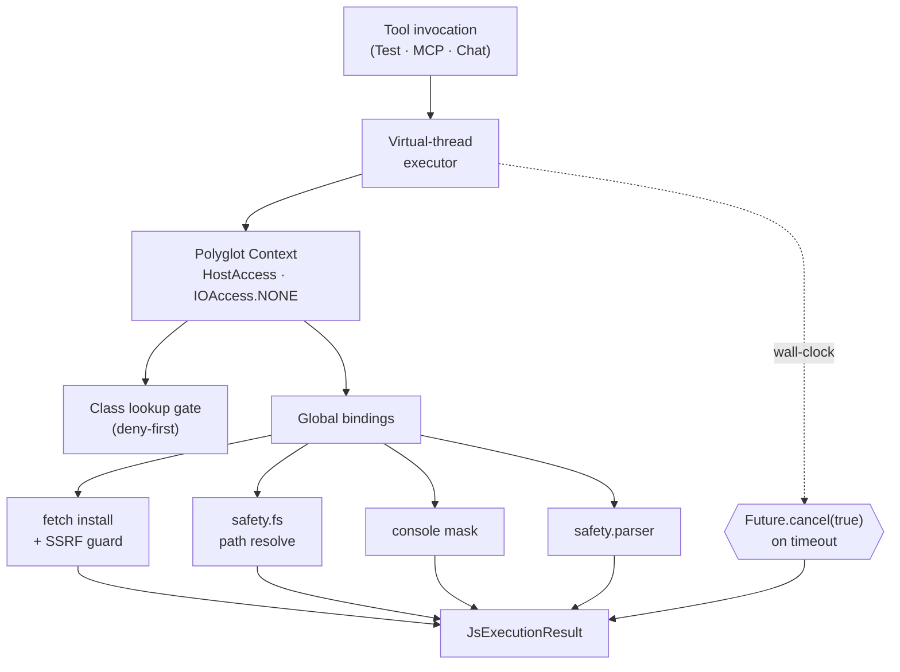
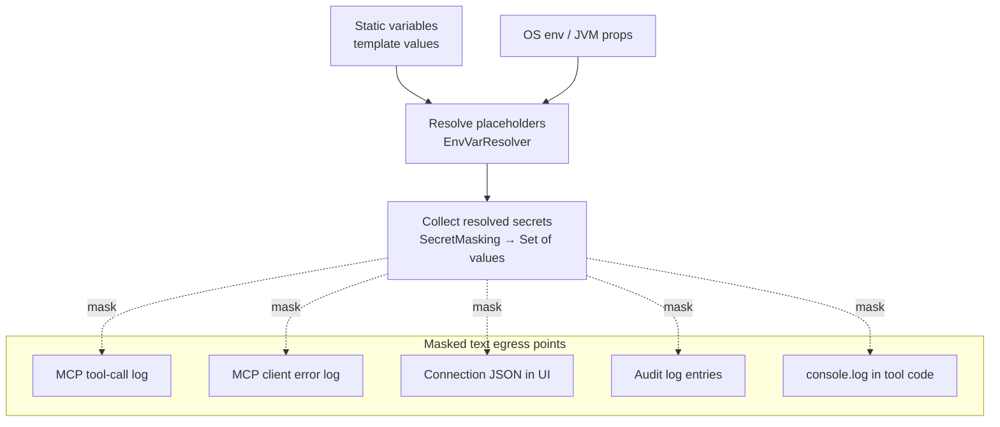
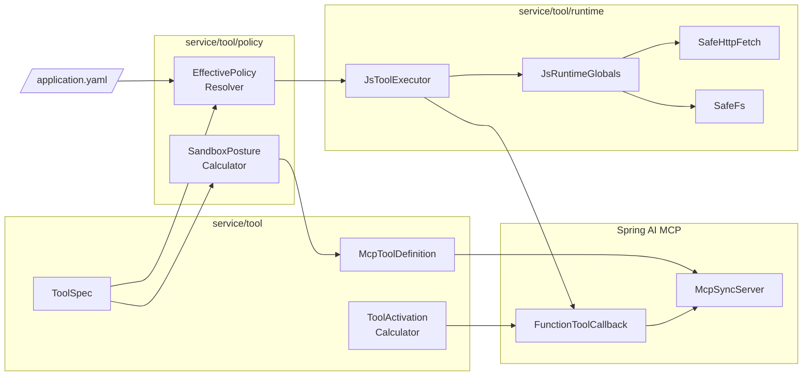
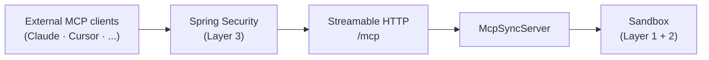

title: AI Agent Tool Safety
description: Defense-in-depth sandbox for AI agent tools - three-layer model, deployment isolation tiers, policy resolution, and a Risk Level (L0-L5) reference.

# AI Agent Tool Safety

Spring AI Playground is a Spring Boot application that executes user-authored JavaScript inside its own JVM. Tool Studio's value proposition - author, test, and publish a tool without restart on the same machine that runs the model - puts tool code on the critical path: any tool you author becomes reachable to MCP clients (and ultimately to an agent) as soon as it earns a **Local Pass**.

This page is the system-level reference for how the sandbox is shaped. For the user-facing surface (the override fields, the Sandbox & Capabilities pane, the Risk Level badge), see [Tool Studio → Safety](features/tool-studio/index.md#safety) and [Tool Studio → Sandbox & Capabilities](features/tool-studio/index.md#sandbox-capabilities).

This is one of six architecture documents that complement each other:

- [Application](architecture.md) - runtime layers, feature modules, data flows, extension points
- [Safe Tool Specification](safe-tool-specification.md) - normative JSON spec for tool authoring (the document the sandbox enforces)
- **AI Agent Tool Safety** (this page) - defense-in-depth sandbox model, policy resolution, threat-to-layer mapping, known limitations
- [MCP Server Safety](mcp-server-safety.md) - client-side risk model for external MCP servers and re-exposed tools
- [Human-in-the-Loop Approval](hitl-architecture.md) - the runtime per-call approval gate
- [AI Agent Observability](observability-architecture.md) - the visibility layer that makes the sandbox's prevention auditable

## Overview { #overview }

A tool a model can call is just code on someone's machine. The sandbox makes that code declare and prove what it touches *before* it can run: you author a JavaScript tool, it must earn a **Local Pass** by running against its own test values, and it executes only inside an always-on Java sandbox (deny-first class allowlist, statement + time limits, SSRF-guarded `fetch`, secret masking). Widening any capability raises a visible **Risk Level** badge before publish.

The sections below detail each layer, the policy resolution, and the threat-to-layer mapping.

## Scope and naming

The Playground codebase uses **safety** for the sandbox surface (`safety.fs`, `safety.parser.*`) and reserves **security** for the adversarial-threat layer (Spring Security on the MCP transport). This document follows the same convention:

- **Safety** - keeping a small JavaScript action from doing things its author did not intend: runaway resource use, accidental egress to private networks, reading the wrong file, leaking secrets to logs. Sandbox boundaries are deterministic and bypass-resistant from inside JS, but they are not adversarial-grade for code that escapes into the host JVM through unforeseen paths.
- **Security** - who can talk to the MCP endpoint at all, which authentication and transport guarantees apply. Handled by Spring Security on top of the sandbox, independent of how individual tools are authored.

The two are layered but separate, and they fail to different threats. The diagrams below split them accordingly. For where the in-process sandbox sits inside operating-system and container isolation, see [Isolation tiers](#isolation-tiers).

## Threat surface

A tool author writes a small JavaScript action with structured input parameters and optional static variables. Tool Studio compiles that into an `McpToolDefinition`, runs it once locally against the declared test values to earn a Local Pass, then registers the callback with the built-in `McpSyncServer`. From that moment the tool is reachable through Streamable HTTP at `/mcp` and callable from Agentic Chat.

The threats this design has to defend against fall into three categories, listed in roughly increasing trust granted to the actor:

1. **Runaway code** - accidental infinite loop, recursive blow-up, unbounded buffer growth, deadlock. The author did not intend harm; the code does the wrong thing anyway.
2. **Misuse by author** - the author writes a tool that calls a private network endpoint, reads a path outside the readable roots, leaks an env-backed secret into a log line, or pulls in a Java class the default policy denies. The author may not realise these are escalations.
3. **External callers** - anything calling `/mcp` from outside the local machine. This is the adversarial-security layer, distinct from sandbox safety.

The three layers below catch categories (1) and (2) at the JS-execution boundary, and category (3) at the MCP transport. The split matters because most engineering choices - `safety.fs`, deny-first allowlist, virtual-thread timeout, env-var masking - exist to protect *the local author's environment from accidents*, not to protect a deployed cluster from external attackers. The latter is a Spring Security configuration choice, not a sandbox capability.

## The three layers

The high-level model is three independent layers. Layer 1 cannot be disabled from JS. Layer 2 widens specific dimensions per tool, with the resulting elevation visible as a badge before publish. Layer 3 sits in front of the MCP transport.

What each layer controls, in detail:

| Layer | Component | What it enforces |
|---|---|---|
| **1** | Class allow / deny | Deny-first lookup gate (`JsToolExecutor.isClassAllowed`). Default deny-list covers `System` / `Runtime` / `Process` / `ProcessBuilder` / `Class` / reflect / invoke / `Thread` / `ThreadGroup` / `ClassLoader` / `ServiceLoader` / `java.util.spi.*`. Default allow-list covers only `java.lang/math/time/util/text.*` - pure compute. |
| **1** | Resource limits | `max-statements: 500000` via GraalVM `ResourceLimits` + wall-clock timeout via `Future.cancel(true)` on a virtual-thread executor. |
| **1** | Helpers gateway | `fetch` (SSRF four-layer guard in `strict` by default), `safety.fs` (reads bounded to the readable roots, writes to the working directory, both symlink-resolved via `toRealPath` before the boundary check), `safety.parser.{html,xml,csv,yaml}`. These are the only network and filesystem paths from JS. |
| **1** | Output masking | `console.log` substring-masks env-backed static-variable values before they reach the debug pane or chat tool-call trace. The mask applies to **all** env-vars surfaced by the secret store below - values exported from the OS-encrypted secret store are still treated as secrets at the log boundary. |
| **1** | Secret store at rest | The desktop launcher persists tool-side secrets through Electron `safeStorage` - encrypted by **macOS Keychain** / **Windows DPAPI** / **libsecret** on Linux; the cipherkey never leaves the OS keychain. Secrets are exported as environment variables only to the launched JVM process, never written to YAML or chat history, and the JS-side `console.log` mask above redacts their resolved values from any tool output. See [Desktop App → Use Environment Variables for Keys and Secrets](getting-started/desktop.md#9-use-environment-variables-for-keys-and-secrets). |
| **2** | `SandboxOverrides` | Per-tool widening: `networkMode`, `hostsAllow`, `fileRead`/`fileWrite`, `addAllow/DenyClasses`, `fsBasePath`. |
| **2** | Posture calculator | `SandboxPostureCalculator.compute()` - pure function from overrides to `RiskLevel`. |
| **2** | Risk badge | L0 baseline · L3 narrow widening · L4 broad widening · L5 critical class re-enabled. |
| **3** | MCP transport auth | The app `SecurityFilterChain` is present (for Vaadin and outbound MCP-client OAuth) but `/mcp` and `/sse` are `permitAll`, so the built-in server is **unauthenticated by default**. Gate it by adding Spring AI MCP Security (OAuth2 resource server / API key) for deployed scenarios. |
| **3** | MCP transport | Streamable HTTP at `/mcp`. Binds to **all interfaces (0.0.0.0) by default** because `server.address` is unset; set it to `127.0.0.1` to restrict to localhost. |

Layer 1 is fixed code in [`JsToolExecutor`](https://github.com/spring-ai-community/spring-ai-playground/blob/main/src/main/java/org/springaicommunity/playground/service/tool/runtime/JsToolExecutor.java), [`JsRuntimeGlobals`](https://github.com/spring-ai-community/spring-ai-playground/blob/main/src/main/java/org/springaicommunity/playground/service/tool/runtime/JsRuntimeGlobals.java), [`SafeHttpFetch`](https://github.com/spring-ai-community/spring-ai-playground/blob/main/src/main/java/org/springaicommunity/playground/service/tool/runtime/SafeHttpFetch.java), and [`SafeFs`](https://github.com/spring-ai-community/spring-ai-playground/blob/main/src/main/java/org/springaicommunity/playground/service/tool/runtime/SafeFs.java). Layer 2 lives in `SandboxOverrides` per `ToolSpec` and `SandboxPostureCalculator` for the badge. Layer 3 is the MCP transport perimeter: the app Spring Security permits `/mcp` by default (it is wired for Vaadin and outbound MCP-client OAuth), so gating the built-in server is an opt-in you add - independent of the sandbox.

## Isolation tiers (deployment trust boundaries) { #isolation-tiers }

The three-layer model above lives entirely inside one JVM process. That is the right boundary for the threats it targets - author accidents and misuse on a single-user machine - but the in-process sandbox is not an adversarial boundary on its own. Where you need a harder one, the whole process nests inside the operating-system and container isolation you already run it under. The sandbox is the innermost tier, not the only one.

{ loading=lazy }

| Tier | How you run it | Outer boundary it adds | What that tier defends against | Use it when |
|---|---|---|---|---|
| **Tier 0** - in-process only | Desktop app, or from source | OS process and JVM | Author accidents, runaway code, accidental private-network egress, secret leakage to logs | Single-user local authoring (the default) |
| **Tier 1** - plus container | The shipped Docker image | Linux namespaces and cgroups | Host filesystem and process isolation, resource caps, a reproducible runtime | Shared or server-style deployment, CI |
| **Tier 2** - plus hardened isolation | The container under gVisor, Kata, or a Firecracker microVM | User-space kernel or VM boundary | Untrusted or multi-tenant tool code, kernel-level escape attempts | You run tools you do not trust |

The split is deliberate: the in-process sandbox is **defense-in-depth at Tier 0**. Spring AI Playground does not reimplement Tiers 1 and 2 - container and microVM isolation are a deployment choice, and the project **composes** with them rather than replacing them. If you need to run tool code you genuinely do not trust, raise the tier; the sandbox keeps enforcing its policy inside whichever boundary you pick.

## Human-in-the-loop checkpoints

The fourth and final layer is **human judgment**: a tool can require explicit approval before it runs. When configured (`ToolManifest.HumanInTheLoop` = `REQUIRED`), the runtime pauses and waits for a person to approve or decline - and every non-approval outcome fails safe to *not run*. This is enforced at two points (an on-device chat dialog and an MCP elicitation gate for external clients).

This page does not repeat that design. See **[Human-in-the-Loop Approval](hitl-architecture.md)** for the two enforcement points, the proxied-tool path, loopback de-duplication, and fail-safe details.

## Policy resolution

Every tool execution runs against an `EffectivePolicy` computed at call time. Three inputs feed it: the baseline from `application.yaml`, an optional named profile chain, and the per-tool `SandboxOverrides`. The resolver enforces three invariants - the same class in both allow and deny throws, removing a baseline deny-entry only succeeds when the override explicitly removes it, and profile-chain depth is capped at 8.

`EffectivePolicy` fields: `allowClasses`, `denyClasses`, `network` (mode + hosts), `fs` (read/write/basePath), `maxStatements`, `timeoutSeconds`.

The `EffectivePolicy` is what the executor uses for the lifetime of one call. It does not get cached across calls - every Test Run, every MCP invocation, every Agentic Chat tool call resolves a fresh policy from the current override state. That property is what lets the Sandbox & Capabilities pane behave as a *live* widening rather than a deploy-time configuration.

## Per-execution enforcement

Inside `JsToolExecutor.execute()`, the policy is applied at six distinct points. None of these are reachable from inside the JS context - they sit between the policy object and the GraalVM `Context` that runs user code.

Each gate is configured by `EffectivePolicy` and lives outside the JS context. Detail:

- **Class lookup gate** - `JsToolExecutor.isClassAllowed`. Deny list is evaluated first.
- **fetch install + SSRF guard** - `JsRuntimeGlobals.installFetch`. Skips installation entirely when egress is `blocked`; otherwise the SSRF four-layer guard runs in `strict`.
- **safety.fs path resolve** - `SafeFs.resolveRead` / `resolveWrite`. Every helper call resolves symbolic links (`toRealPath`) and checks the real path against the readable roots (for reads) or the working directory (for writes).
- **console mask** - `installConsoleLog` + `maskKnownSecrets`. Env-backed static variables substring-masked.
- **safety.parser** - XML is XXE-hardened; XML/CSV return plain proxy trees; YAML and HTML have caveats documented at [Tool Studio → Built-in Helpers](features/tool-studio/index.md#built-in-javascript-helpers).
- **Future.cancel(true) on timeout** - host-side kill on the virtual-thread executor. Interrupts propagate into the Polyglot Context.

Three enforcement points are worth calling out:

- **`Future.cancel(true)` on a virtual-thread executor** - the wall-clock timeout is a host-side kill, not a JS-side promise rejection. A tool that infinite-loops without yielding statements still terminates within the timeout because the thread interrupt propagates through GraalVM's context. Virtual threads matter because hung tools cannot pin platform threads.
- **`installFetch()` short-circuit at `blocked`** - when a tool's `SandboxOverrides.networkMode` is `blocked`, `JsRuntimeGlobals.installFetch` does not bind `fetch` at all. Calling `fetch(...)` from JS throws `ReferenceError`. This is stricter than `strict` mode (which installs `fetch` and enforces the SSRF guard).
- **`isClassAllowed` runs deny-first** - even when an override adds a class via `addAllowClasses`, the deny list is checked first. A tool author cannot re-enable `java.lang.Runtime` by adding it to allow; the resolver rejects conflicting allow/deny entries at policy build time.

## Secret masking { #secret-masking }

This section is the reference-runtime wiring for the masking contract declared in [safe-tool-specification → Section 7.4 Secret masking pipeline](safe-tool-specification.md#74-secret-masking-pipeline). Two surfaces share the same `SecretMasking` filter: the JS-side `console.log` mask inside Layer 1, and the MCP-transport-side connection/error/per-call mask.

The reference implementation lives in `org.springaicommunity.playground.service.util.SecretMasking`:

| Method | Behavior |
|---|---|
| `collectFromTemplate(String template) → Set<String>` | Walks every `${NAME}` reference, resolves each via `EnvVarResolver.lookup`, collects values whose length is ≥ `MIN_MASK_LENGTH` (= 4) into an immutable `Set<String>`. |
| `mask(String text, Set<String> secrets) → String` | Iterates `secrets` and `String.replace`s each match with `***` in `text`. Plain substring substitution - prefixes / suffixes around the secret survive; only the secret itself is redacted. |

The `MIN_MASK_LENGTH = 4` floor prevents the mask from accidentally redacting `""`, `"a"`, or other near-empty resolutions that would otherwise blanket-replace innocuous substrings.

Reference-runtime call sites (each is a MUST for conformant implementations per Section 7.4):

| Surface | Reference call site |
|---|---|
| Every published MCP tool-call log line | `LoggingMcpToolCallback` |
| MCP client startup exception | `McpClientService.startMcpClient` |
| MCP **Test Connection** transient failure | `McpClientService.testConnection` |
| Tool Studio UI rendering of an MCP connection's JSON | `McpServerConfigView` |
| `console.log` from inside the tool's JavaScript `code` | `JsToolExecutor.installConsoleLog` (via `maskKnownSecrets`) |

What this layer does *not* cover:

- The MCP server payload itself. If a server's tool *response* contains a credential, that text reaches chat unchanged - at that point it's tool output, not a connection-level message. Use `console.log` masking inside the tool wrapper if you need to redact tool-response content.
- Encrypted OAuth tokens. They live on a separate surface keyed on a host-bound passphrase - see [Encrypted OAuth token storage](#encrypted-oauth-token-storage) below.

Cross-references: [MCP Server → `${ENV_VAR}` substitution](features/mcp-server/index.md#custom-http-headers-and-env_var-substitution) for the placeholder syntax; [Default MCP Servers → Environment variables](features/default-mcp-catalog/index.md#environment-variables-short-list) for the catalog-context summary.

## Encrypted OAuth token storage

A separate surface from the env-backed static-variable secrets above: when an MCP server connection uses OAuth 2.1, the resulting tokens are persisted to disk encrypted, keyed on a host- and user-bound passphrase.

| Concern | Reference runtime |
|---|---|
| **Token path** | `~/spring-ai-playground/mcp/oauth-tokens/` (one file per authorized client), written by `EncryptedFileOAuth2AuthorizedClientRepository`. |
| **Encryption** | AES via Spring Security's `Encryptors.text(passphrase, salt)` (`OAuthTokenEncryptor`). |
| **Passphrase** | `hostname + ":" + user.home`, derived at process start. Never persisted to disk. |
| **Salt** | `~/spring-ai-playground/.security/oauth.salt`, generated by `KeyGenerators.string()` on first use and `chmod 0600` on POSIX platforms. |

The host-bound passphrase is what gives the tokens their geographic lock: copying the token directory to a different host or a different user account makes the same playground build unable to decrypt them - a backup restore requires both `mcp/oauth-tokens/` and `.security/oauth.salt`. This is intentional. Disk-copy alone is not sufficient to recover plaintext tokens.

OAuth tokens are independent of the `SecretMasking` pipeline above: tokens never appear in connection JSON in plaintext, so there is nothing to mask at egress for them - the encrypted on-disk file is the only artifact, and the in-memory plaintext is short-lived inside Spring Security's `OAuth2AuthorizedClient`.

## Component view

The components in Layer 1 form a small, single-direction graph: the resolver builds an `EffectivePolicy` once per call, the executor reads it to configure GraalVM, the global bindings consult it for per-helper limits, and the posture calculator reads the same overrides to produce the badge.

Two design choices are worth noting:

- **`SandboxPostureCalculator` is pure** - it has no I/O and no shared state. Same inputs always yield the same `RiskLevel`. That property makes the badge testable and predictable; the resolver can call it during draft editing to show the badge live before any execution happens.
- **`JsRuntimeGlobals.installFetch` is the only place `SafeHttpFetch` is wired** - there is no other path that reaches `HttpClient` from JS. If the install short-circuits (`blocked`), no HTTP at all.

## Spring AI / Spring Security integration

Tool Studio sits on top of two distinct Spring projects:

- **Spring AI** - `spring-ai-starter-mcp-server` exposes the built-in MCP server over Streamable HTTP at `/mcp`. Every Local-Passed tool registers itself with the server's `McpSyncServer` via `addTool(FunctionToolCallback)`. The sandbox runs *inside* the callback, so MCP never sees a tool that hasn't been through `JsToolExecutor`.
- **Spring Security** - present for Vaadin and outbound MCP-client OAuth; it permits `/mcp` and `/sse`, so the built-in MCP server is unauthenticated by default. Add Spring AI's official [MCP Security](https://docs.spring.io/spring-ai/reference/api/mcp/mcp-security.html) configuration to gate it for deployed scenarios.

The arrows go one way: callers cannot reach the sandbox without traversing the transport and (when enabled) the security filter chain. `SecurityFilterChain` permits `/mcp` and `/sse` by default, so the built-in server is unauthenticated; OAuth2 / API key are the typical choices when you gate it. The sandbox in the bottom box is everything from the previous two diagrams - the sandbox is what gives Spring AI's MCP server a safe runtime for user-authored tools; Spring Security is what gives it an adversarial perimeter once the transport is gated. Both fail to different threats.

## Risk Level decision matrix

Each tool's safety posture is summarised by a single badge - the **Risk Level**. The code calls it `RiskLevel` (an enum in `ToolManifest.Sandbox.RiskLevel`); it is the inverse of "how safe the tool is":

!!! note "Two rubrics, one enum"
    The same `ToolManifest.Sandbox.RiskLevel` enum (`L0`-`L5`) is scored by **two independent calculators**. This section is the **sandbox** rubric - how far a JavaScript tool authored in Tool Studio widens the local sandbox. The MCP client side reuses the enum for a different question - how risky an **external MCP server, or an upstream tool re-exposed on the built-in server, is to connect and publish** - with its own axes, floor rules, and chip labels (`Verified` · `Safe` · `Low` · `Moderate` · `High` · `Critical`). The two never mix: a Tool Studio tool carries the sandbox level; an external server/tool carries the MCP level. See [MCP server and tool risk](#mcp-risk).

- **Lower Risk Level = safer / more sandboxed.** `L0` means the tool runs entirely on the default sandbox surface with no widening - the strongest safety guarantees.
- **Higher Risk Level = less safe / less sandboxed.** Each step up is the result of a declared `SandboxOverrides` widening, computed by `SandboxPostureCalculator.compute()`.

There is no separate "Safety Level" knob - the Risk Level *is* the safety indicator, expressed from the risk side so that "higher number = needs more attention before publish" maps directly to review effort. The user-facing meaning of the L0-L5 badge, summarised:

| Level | Posture | Typical capabilities | Publish recommendation |
|---|---|---|---|
| **L0** | Safest. Baseline defaults. | No I/O. Pure-compute helpers only. | Auto-publish on Local Pass. |
| **L3** | Safe with scoped widening. | `networkMode: allowlist` to specific hosts, OR `fileRead: true`, OR 1-2 non-critical deny removals. | Default-publish - review the host list / paths. |
| **L4** | Broader access. Review before publish. | `networkMode: allowlist` with `*`, `networkMode: open`, `fileWrite: true`, file-read class added, reflection class added, ≥3 deny removals. | **Review before publish.** Justify the breadth. |
| **L5** | Effectively unsandboxed. | `System` / `Runtime` / `Process` / `ProcessBuilder` re-enabled, OR file-write classes added directly. | **Trusted authors only.** Process spawn or raw write means the tool has the same authority as the JVM itself. |

The full bullet-by-bullet rule set (which signal pushes the badge to which level) is in [Tool Studio → Risk Level Reference](features/tool-studio/index.md#risk-level-reference).

The Local Pass gate runs against the tool's *effective* policy, so a tool that exceeds its own declared capabilities fails its test before publish. This matters because the badge is not enforcement - the policy is. The badge advertises what the policy implies.

## MCP server and tool risk { #mcp-risk }

The sandbox model above contains *locally-authored* tools. The parallel model for *external* MCP servers and the upstream tools the playground re-exposes - L0-L5 connection scoring, floor overrides, the tool-description poisoning scan, the fingerprint ledger, composition shadowing rules, and HITL mitigation - now has its own page: **[MCP Server Safety](mcp-server-safety.md)**.

The two share the `RiskLevel` enum but are scored by independent calculators and never mix: a Tool Studio tool carries the *sandbox* level (this page), an external server or re-exposed tool carries the *MCP* level (the linked page).

## Threat-to-layer mapping

Concrete threats, the layer that catches each, and the mechanism. This is the reference an operator uses to reason about deployment risk.

| Threat | Layer | Mechanism |
|---|---|---|
| Tool calls `Java.type("java.lang.Runtime").getRuntime().exec(...)` | Layer 1 | `deny-classes` evaluated before allow-classes (`JsToolExecutor.isClassAllowed`) |
| Tool calls `fetch("http://169.254.169.254/...")` to reach cloud metadata | Layer 1 (strict egress) | SSRF four-layer guard - literal-IP private/reserved check rejects |
| Tool calls `fetch("attacker.example")` where DNS resolves to RFC 1918 | Layer 1 (strict egress) | DNS resolve - every returned address checked against private/reserved |
| Tool calls `fetch` with a host in CGNAT (`100.64.0.0/10`) | Layer 1 (strict egress) | Explicit CGNAT range rejection (not covered by `isSiteLocalAddress`) |
| Tool reads `safety.fs.readText("../../etc/passwd")` | Layer 1 | `SafeFs.resolveRead` - `toRealPath` resolve + `startsWith(root)` |
| Tool runs `while (true) {}` or unbounded recursion | Layer 1 | `max-statements` GraalVM budget + virtual-thread `Future.cancel(true)` |
| Tool calls `console.log` with an env-backed Bearer token | Layer 1 | `maskKnownSecrets` substring-masks resolved env values |
| Tool author wants to call a private API server | Layer 2 (declared widening) | `networkMode: allowlist` + `hostsAllow` - badge becomes L3, visible before publish |
| Tool author wants raw `java.io.File` read | Layer 2 (declared widening) | `addAllowClasses: [java.io.File*]` - badge becomes L4 |
| Tool author wants raw `java.io.FileWriter` write | Layer 2 (declared widening) | `addAllowClasses: [java.io.FileWriter*]` - badge becomes **L5** |
| External attacker calls `/mcp` from another machine | Layer 3 (opt-in) | Add Spring Security (auth / network ACL) on the MCP transport - not enforced by default |
| Built-in server reachable off-host (default bind-all) | Layer 3 (opt-in) | **Not mitigated by default** - `server.address` is unset, so the server binds all interfaces; set `server.address=127.0.0.1` (and/or add MCP Security) before running outside a trusted host |

The first seven threats are blocked at the **always-on Java sandbox** - no per-tool configuration can disable them. The next three are *opt-in widenings* that surface as risk-level badges before publish, so the gate is review rather than runtime. The last two live entirely on the **MCP transport** layer and are independent of how individual tools were authored.

## Known limitations

The sandbox is intentionally defense-in-depth rather than adversarial-grade. Each limitation below is a current-state caveat with a documented mitigation; concrete follow-up work is tracked in [GitHub Issues](https://github.com/spring-ai-community/spring-ai-playground/issues) under the `sandbox` label rather than here, so the architecture page does not drift out of sync with what's actually being worked on.

### Reflection-after-load gap

`JsToolExecutor.allowHostClassLookup` gates `Java.type(...)` calls, but once a tool holds a `Class` object obtained through another path (for example a `Class.forName` analogue or a method that returns one), reflection on that handle can route around the lookup gate. The deny-list catches the obvious cases (`java.lang.Class`, `java.lang.reflect.*`, `java.lang.invoke.*`), but a tighter `HostAccess` builder or a `Class.forName`-specific interceptor would close the residual surface.

**Mitigation today**: the deny-list already rejects `java.lang.Class`, `java.lang.ClassLoader`, `java.lang.reflect.*`, `java.lang.invoke.*`, `ServiceLoader`, and `java.util.spi.*`. The gap is theoretical for any tool that runs against the default allow-classes (`java.lang/math/time/util/text.*`), because none of those packages return arbitrary `Class` objects. The gap matters only for tools that have opted into `addAllowClasses` for something exotic - which already raises the badge to L4 or L5.

### Allow-classes pattern granularity

Today `java.lang.*` in `allow-classes` matches `java.lang.reflect.Method` because the pattern matcher uses `startsWith(prefix + ".")`. The deny-list catches reflection explicitly, so the practical effect is contained - but the pattern semantics are wider than the dotted-name suggests. A future pass could either tighten the matcher to single-package (so `java.lang.*` does not match `java.lang.reflect.*`) or require explicit nested allow entries.

**Mitigation today**: `deny-classes` lists `java.lang.reflect.*`, `java.lang.invoke.*`, `java.lang.Thread`, `java.lang.ThreadGroup`, `java.lang.ClassLoader` explicitly, and deny wins. The pattern looseness is documented but does not weaken the default posture.

### `safety.parser.yaml` constructor choice

The YAML helper uses SnakeYAML's regular `Constructor` rather than `SafeConstructor`. Global tags such as `!!class.name` cause class instantiation during `load`. The output gets coerced through `jsonToProxy` before reaching JS, so user code never sees the resulting host object directly, but the instantiation has already happened in the JVM.

**Mitigation today**: documented in [Tool Studio → Built-in Helpers](features/tool-studio/index.md#built-in-javascript-helpers). Treat YAML input as trusted-source-only.

### `safety.parser.html` returns host `Document`

The HTML helper uses jsoup and returns the raw `org.jsoup.nodes.Document` host object rather than a plain proxy tree (unlike the XML helper, which returns a plain `{tag, attrs, text, children}` proxy). The class itself is not in the default allow-classes, so JS code cannot construct new jsoup instances via `Java.type(...)`, but it can call methods on the returned object. A future pass could either wrap jsoup methods into a fixed surface or move to a plain proxy tree like the XML helper.

**Mitigation today**: documented. The deny-list still blocks every escape vector, so the worst case is the tool author calls jsoup methods that already exist on the returned object.

### Env-var masking substring-only

`maskKnownSecrets` does substring replacement on console output. If an env-backed static variable is *not* referenced as an anchored full-string `${VAR}`, the secret value is not auto-collected, and a `console.log` that constructs the same value through string concatenation will not be masked. The Test Run path collects the actual resolved value, so any later log that contains it is masked; the gap is for values constructed after collection.

**Mitigation today**: anchored env references are the documented contract; the substring mask is best-effort secondary.

## Configuration reference

Authoritative configuration lives in two places:

- **Baseline policy**: `src/main/resources/application.yaml` under `spring.ai.playground.tool-studio.js-sandbox`. See [Tool Studio → JavaScript Runtime](features/tool-studio/index.md#javascript-runtime) for the keys and defaults.
- **Per-tool overrides**: the `sandboxOverrides` block of each `ToolSpec` (in `default-tool-specs*.json` for bundled tools, or in user-authored tools saved through Tool Studio). See [Tool Studio → SandboxOverrides JSON shape](features/tool-studio/index.md#sandboxoverrides-json-shape).

Operational reference for the wider system runtime - UI surfaces, service layer, MCP transport, advisor chain - is on the [Application](architecture.md) page.

## Further reading

- [Application](architecture.md) - runtime layers, feature modules, data flows
- [Tool Studio → Safety](features/tool-studio/index.md#safety) - the user-facing three-layer summary, in context
- [Tool Studio → Sandbox & Capabilities](features/tool-studio/index.md#sandbox-capabilities) - `SandboxOverrides` JSON shape, egress modes, SSRF four-layer steps, Risk Level rules
- [GraalVM Security Guide](https://www.graalvm.org/latest/security-guide/sandboxing/) - Polyglot sandbox policies, `HostAccess`, `IOAccess`, `ResourceLimits`
- [Spring AI MCP Security](https://docs.spring.io/spring-ai/reference/api/mcp/mcp-security.html) - Layer 3 configuration
