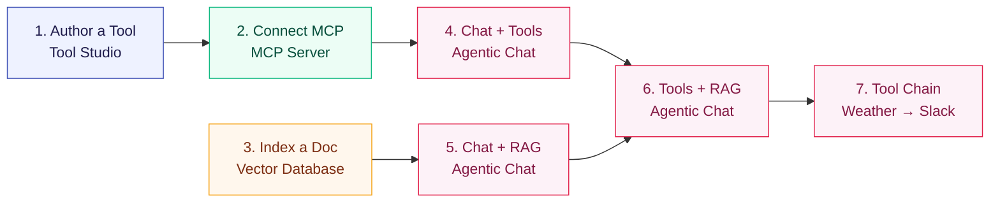

Description: End-to-end Spring AI Playground tutorials covering Tool Studio, MCP servers, vector RAG, and Agentic Chat — from a first locally-validated tool to a full RAG-plus-tools chat workflow with gemma4 and qwen3.5.

# Tutorials

These seven tutorials walk you from creating a single tool to running a chat that combines tool execution with grounded knowledge. They follow the natural product workflow: build → validate → ground → compose.

The shipped chat default is **`qwen3.5:2b`** — fast, fine for the early tutorials. Switch to **`qwen3.5:latest`** or **`gemma4:latest`** when you reach tutorials 4–7, where tool-calling reliability matters. Embeddings use **`qwen3-embedding:0.6b`** throughout. See [Picking a model](#picking-a-model) for the tradeoffs.

## How these tutorials connect



Tutorials 1–3 produce reusable assets (a tool, an MCP connection, an indexed document). Tutorials 4–7 compose those assets in chat. Each tutorial is independently runnable in 3–8 minutes; the full sequence takes about 30 minutes.

!!! abstract "What you'll need"
    - Spring AI Playground running on `http://localhost:8282`. Follow [Getting Started](getting-started.md) first if you haven't.
    - Ollama running, with `qwen3.5:latest` and `qwen3-embedding:0.6b` pulled.
        ```bash
        ollama pull qwen3.5
        ollama pull gemma4
        ollama pull qwen3-embedding:0.6b
        ```
    - For Tutorial 7 only: `SLACK_WEBHOOK_URL` set in the launcher's Environment Variables.

## Picking a model

Tool calling and tool chaining quality depend heavily on the model. The selectable list in **Agentic Chat → Settings → Model** is driven by `application.yaml`'s `playground.chat.models`. The shipped default is the small one — start there, and only upgrade if a tool turn comes back empty.

=== "qwen3.5:2b (default)"
    The shipped default. **2.7 GB**. Fast on Apple Silicon. Use this for the chat sanity check **before** wiring up tools or RAG. Tool calling is best-effort — if a tool turn comes back empty, that is the signal to upgrade, not to rewrite the prompt.

=== "qwen3.5:latest"
    **6.6 GB**. Stronger tool calling and multi-turn reasoning. The first upgrade target when `qwen3.5:2b` skips a tool call.

=== "gemma4:latest"
    **9.6 GB**. Strongest natural-language quality. Pick this for tutorial 7 (multi-step tool chains) where the model has to *reason about* a tool result rather than just call it.

=== "gpt-oss:latest"
    **13 GB**. OpenAI's open-weights reasoning model. A good cross-check when you suspect a result depends heavily on which model family you picked.

!!! tip "Where the model selector lives"
    Open Agentic Chat, click the **gear** icon at the top right, change `Model`, then click **Apply & New Chat**. The chat header reflects the change.

---

## Tutorial 1 — Author and Validate a Tool

**Time** 8 min · **Difficulty** ★☆☆ · **Surfaces** Tool Studio, MCP Server

!!! abstract "Goal"
    Take a built-in example tool (`getWeather`), run its local test, and verify it shows up on the built-in MCP server. This is the canonical *no-pass-no-run* flow: every tool earns its **Local Pass** before going live.

### What Tool Studio is for

Tool Studio wraps an HTTP API — or any small piece of JavaScript — into an MCP-callable tool. The runtime is GraalVM Polyglot JavaScript inside the JVM with a tight sandbox: network I/O is allowed; file I/O, native access, and thread creation are blocked. That's enough for REST API wrappers and small computations, which is most of what a model needs.

The seven examples shipped with the app cover the common shapes:

| Tool | Pattern |
|---|---|
| `getCurrentTime` | Pure computation with an optional parameter |
| `getWeather` | External REST call, normalized JSON output |
| `googlePseSearch` | REST call with secrets in static variables |
| `extractPageContent` | HTTP fetch + HTML parse via `org.jsoup` |
| `sendSlackMessage` | Webhook POST with environment-backed config |
| `openaiResponseGenerator` | Calls another model from a tool |
| `buildGoogleCalendarCreateLink` | Pure URL builder, no network |

### Steps

1. Open **Tool Studio** and click `getWeather` in the left rail. It's a small REST-API wrapper — exactly the shape Tool Studio is built for.
2. Review the schema, parameters, and the JavaScript action. Notice the description tells the model *when* to use it — that's what the LLM uses for tool selection. The `location` parameter is **Required** (the checkbox is on), so its name and Test Value both show a `•` to mark them mandatory.
3. **Fill in the `Test Value` for every required parameter.** This is not just a form field — the Test Value is the **sample input** the local sandbox actually executes the tool with. The output of that run is what earns (or fails) the **Local Pass**, which is what gates publishing the tool to MCP. Garbage values here mean a garbage Local Pass.
4. Click **Test & Update Tool**. The local test runs the action with your Test Values. If it passes, the tool earns its Local Pass and is published to the built-in MCP server in the same step — no restart, no redeploy.


*① the seven built-in tools, ② tool name and description (shown to the model for selection), ③ structured parameters with the **Required** checkbox on, ④ **Test Value — required** (note the `•`), the sample input the sandbox runs with to earn the Local Pass, ⑤ **Test & Update Tool** runs the test then publishes if it passes.*

!!! warning "No Test Value, no Local Pass, no MCP"
    A tool with empty Test Values for required parameters cannot run locally — and a tool that cannot run locally never reaches the MCP server. Pick a representative sample (e.g. `seoul` for `getWeather`) that exercises the same code path the model will hit in production.

After the test passes, you'll see a confirmation banner. Tool name and description match the entry in MCP from this point on.


*The Local Pass is what gates publication. Tools that haven't earned it never reach an MCP client.*

5. Switch to **MCP Server**. The built-in connection `spring-ai-playground-tool-mcp` is selected by default. Scroll down to the **MCP Inspector** section to see the tools as any MCP client would.


*① the **Call Tool** play icon (here on the `getCurrentTime` row, the same tool Tutorial 4 will call from chat) runs the tool through the full MCP transport — not just the local sandbox. Your `getWeather` from step 4 lives in the same list; scroll the inspector to find it.*

!!! tip "Why this matters"
    Validating a tool *through MCP* (not just via Tool Studio's local test) catches schema mismatches and serialization issues that would otherwise only show up the first time a model invokes the tool in chat.

!!! warning "Common pitfalls"
    - Spaces in tool names break MCP. Use `camelCase` or `snake_case`.
    - Don't hardcode secrets. Use environment-backed `static variables` (`${OPENAI_API_KEY}`, `${SLACK_WEBHOOK_URL}`, …) so they're injected at launch time only.
    - Keep results compact JSON. Long free-text outputs balloon the chat token count and crowd the context window.

→ Next: [Tutorial 2 — Connect an External MCP Server](#tutorial-2-connect-an-external-mcp-server)

---

## Tutorial 2 — Connect an External MCP Server

**Time** 5 min · **Difficulty** ★☆☆ · **Surfaces** MCP Server

!!! abstract "Goal"
    Add an external MCP server connection (Streamable HTTP, STDIO, or SSE), validate the schema in the inspector, and run a tool through it directly — *before* relying on it from chat.

### Steps

1. Open **MCP Server** and click the `+` icon next to **MCP Server Connections** to start a new connection.
2. Pick the transport type. **Streamable HTTP** is the modern default; STDIO is for proxy-style local processes (Claude Desktop's `mcp-remote`); SSE is the legacy HTTP+SSE shape.
3. Fill in the connection name and the JSON config for your transport.


*① pick a transport (Streamable HTTP is the default; STDIO and SSE are also supported), ② name + description, ③ **Save & Connect** validates and registers the connection.*

4. Once connected, scroll to **MCP Inspector** to browse tools and run them directly.


*① the **MCP Inspector** is the same panel for built-in and external connections — schemas, descriptions, and a `Call Tool` action per row.*

!!! tip "Validate here, not in chat"
    Tools that fail in MCP Inspector will fail in Agentic Chat too — but the chat error message is wrapped in the agent's reasoning trace and harder to debug. Save yourself a turn: run every new tool through the inspector once before letting a model invoke it.

!!! example "Useful external MCP servers"
    - Claude Desktop / Claude Code via Streamable HTTP
    - Cursor's MCP server entry
    - Awesome MCP Servers list — a directory of community servers

→ Next: [Tutorial 3 — Index a Document for RAG](#tutorial-3-index-a-document-for-rag)

---

## Tutorial 3 — Index a Document for RAG

**Time** 6 min · **Difficulty** ★☆☆ · **Surfaces** Vector Database

!!! abstract "Goal"
    Upload a document, watch it pass through the ETL pipeline (extract → chunk → embed → store), and verify retrieval quality with a similarity search before relying on it in chat.

### Steps

1. Open **Vector Database**. The header shows the active store and embedding model: `SimpleVectorStore — Ollama: qwen3-embedding:0.6b`.


*① indexed-doc sidebar (single source of truth), ② similarity-search input (hit Enter to query), ③ Spring AI metadata filter expression — same syntax you'd use in code.*

2. Click the document-add icon next to the sidebar to open the **New Document & ETL Pipeline** dialog. Drop in a PDF, DOCX, or PPTX — up to 20 MB.
3. Tune the splitter only if the defaults don't match your content shape. `Chunk Size` and `Min Chunk Size Chars` are the two that move retrieval quality the most.


*① upload the file (drag-drop also works), ② token-splitter settings — `Chunk Size` and `Min Chunk Size Chars` move retrieval quality the most, ③ `Chunk Document` runs extraction + splitting and shows the chunks before embedding, so you can adjust the splitter without re-uploading.*

4. After embedding, run a similarity search to confirm retrieval works. Use a phrase that should be in the document.


*① cosine similarity score (0.0–1.0), ② the retrieved chunk text, ③ metadata used by Spring AI filter expressions (`source`, `chunk_index`, custom fields).*

!!! tip "Why this matters"
    Bad RAG starts here, not in chat. If the chunk you expect to be retrieved doesn't show up here at a reasonable similarity score (≥ 0.6 for most cases), the chat answer will be ungrounded — no amount of prompting fixes that.

!!! warning "Don't change the embedding model after indexing"
    The vector store stores raw vectors. Switching from `qwen3-embedding:0.6b` to a different model leaves the old vectors in place but indexed in a different space. Re-import or rebuild before trusting retrieval again.

→ Next: [Tutorial 4 — Chat With Tools](#tutorial-4-chat-with-tools)

---

## Tutorial 4 — Chat With Tools

**Time** 5 min · **Difficulty** ★★☆ · **Surfaces** Agentic Chat

!!! abstract "Goal"
    Call a built-in MCP tool from a real chat turn. Watch the model decide to call it, see the tool result, then read the final answer. The example below uses `getCurrentTime` because it returns instantly — but any tool published in Tutorial 1 (`getWeather` and the rest) works the same way.

### Steps

1. Open **Agentic Chat**. Click the gear icon to open **Chat Model Setting** and switch the model.


*① `Model` dropdown — open it to switch from the default `qwen3.5:2b`, ② recommended models for tool use are `qwen3.5:latest` and `gemma4:latest`. Pick one and click **Apply & New Chat**.*

2. With the chat started under the new model, enable the built-in MCP connection in the **tools** combo at the bottom, then type a prompt that should trigger a tool call.


*① MCP connection enabled — its tools are now in the model's tool inventory. ② prompt typed but not sent — click the send arrow on the right to dispatch.*

3. Send the prompt. The chat stream interleaves the model's reasoning, the tool call, and the final answer.


*The collapsible **THINK** section shows the model's reasoning. **MCP TOOLS** shows the actual tool invocation (here `getCurrentTime`, 330 ms, 1 call). **ASSISTANT** is the final user-facing answer that uses the tool result.*

### What to observe

- The model decides on its own whether to call a tool — there's no forced tool-use directive.
- The tool name in the MCP TOOLS block matches the one you saw in MCP Inspector.
- If the tool fails or returns garbage, the model explains it instead of fabricating an answer (assuming you picked a tool-capable model).

!!! tip "Why this matters"
    `qwen3.5:2b` (the default) sometimes skips tool calls or returns empty tool turns. `qwen3.5:latest` is much more reliable for this. If a tool turn comes back empty, that is the signal to upgrade the model — not to rewrite the prompt.

→ Next: [Tutorial 5 — Chat With RAG](#tutorial-5-chat-with-rag)

---

## Tutorial 5 — Chat With RAG

**Time** 5 min · **Difficulty** ★★☆ · **Surfaces** Agentic Chat, Vector Database

!!! abstract "Goal"
    Use the document you indexed in Tutorial 3 as grounded context in a chat answer — no tools yet, just retrieval-augmented generation.

### Steps

1. Open **Agentic Chat** with the `qwen3.5:latest` model already selected (from Tutorial 4 — it sticks until you change it).
2. Open the **documents** combo at the bottom and pick the indexed document. The chip appears in the combo; the model now has the document available as a RAG source.


*① the indexed `test-rag.pdf` is selected — every prompt in this chat will retrieve relevant chunks from the document before the model answers.*

3. Ask a question that should be answerable from the document.


*① grounded prompt — the model will retrieve chunks first, then answer using their content rather than generic memory.*

### What to observe

- The chat trace shows a **retrieval** step before the final answer — that's the chunks pulled from the vector store.
- If the answer doesn't reflect the document, go back to Tutorial 3 and re-check the similarity search. Ungrounded answers usually mean retrieval failed, not generation.

!!! warning "RAG only as good as your chunks"
    A great chat model can't recover from poorly chunked content. If your document has tables or code blocks, look at the chunked output in Vector Database before relying on it in chat — the splitter may have cut at unhelpful boundaries.

→ Next: [Tutorial 6 — Tools and RAG Together](#tutorial-6-tools-and-rag-together)

---

## Tutorial 6 — Tools and RAG Together

**Time** 6 min · **Difficulty** ★★★ · **Surfaces** Agentic Chat (full)

!!! abstract "Goal"
    Run a single chat turn that needs both grounded knowledge *and* live tool execution. This is the full product workflow — what the rest of the tutorials build toward.

### Setup

Before sending the prompt, make sure you have:

- a tool you trust — any built-in (`getCurrentTime`, `getWeather`, …) is fine, or one you authored in Tool Studio
- an indexed document from Tutorial 3
- a tool-capable model — `qwen3.5:latest` or `gemma4:latest`

### Steps

1. Enable both controls at the bottom: the **MCP connection** chip and the **document** chip.


*① the MCP connection is active — every tool the connection exposes is in the inventory, ② the RAG source is active — the model will retrieve chunks before answering. The model can use either, both, or neither, per turn.*

2. Send a prompt that requires both. The example below asks for a document summary *and* a current ISO time — the model should retrieve from the doc and call `getCurrentTime` in the same turn.


*① one prompt that needs RAG + tools — the model decides on its own which to use when.*

### What to observe

- The trace shows **both** a retrieval step and an MCP tool call.
- The final answer references concrete document content (not generic) **and** uses the tool result (not made up).
- If only one happens, that's a model-quality signal — switch to `gemma4:latest` and try again.

!!! tip "Why this is the most important tutorial"
    Spring AI Playground is built around composition. Tool Studio creates capabilities, MCP Server validates them, Vector Database prepares grounded knowledge, and Agentic Chat composes all of that. This tutorial is where the architecture becomes visible from a single chat turn.

→ Next: [Tutorial 7 — Weather to Slack: A Two-Tool Chain](#tutorial-7-weather-to-slack-a-two-tool-chain)

---

## Tutorial 7 — Weather to Slack: A Two-Tool Chain

**Time** 4 min · **Difficulty** ★★★ · **Surfaces** Agentic Chat

!!! abstract "Goal"
    Trigger a chain of two built-in tools (`getWeather` → `sendSlackMessage`) in a single chat turn. Watch the agent loop in action: plan → call tool A → read result → call tool B with that result → summarize.

This is the canonical *"try an agentic workflow"* task on the Home checklist. No Tool Studio authoring required — both tools are pre-loaded and already passed their Local Pass.

!!! warning "Slack webhook required"
    `sendSlackMessage` posts to whatever URL is in `SLACK_WEBHOOK_URL`. Set it in the desktop launcher's **Environment Variables** (or as a shell env var when running from source) **before** launching the app. Without it, the second tool call will fail and the chain breaks at step 2.

### Steps

1. In **Agentic Chat**, switch to a tool-capable model (`qwen3.5:latest` works; `gemma4:latest` chains more reliably for longer prompts) and enable the built-in MCP connection.
2. Send this prompt verbatim:

    ```text
    Get today's weather for Seoul and send a short summary to Slack.
    ```


*① MCP connection enabled — `getWeather` and `sendSlackMessage` are both in the inventory, ② one prompt that requires two tool calls in the right order.*

3. Watch the chat stream:
    - the assistant calls `getWeather` with `Seoul`
    - the tool returns a compact weather payload
    - the assistant reasons over the result and calls `sendSlackMessage` with a short natural-language summary
    - the assistant's final turn confirms the post

4. Open Slack and verify the message landed.

### What to validate

- **Two distinct tool calls in order**, not one. The MCP TOOLS block in the trace should list both, with `getWeather` before `sendSlackMessage`.
- The Slack message body is **derived from** the weather result — the agent is chaining, not guessing.
- If either tool fails, the failure surfaces in the chat with the tool name and error. The same failure would have blocked the tool from earning its Local Pass — so `sendSlackMessage` failing here means the webhook URL is wrong, not the tool itself.

### Where to go from here

- Replace `sendSlackMessage` with a Tool Studio tool of your own. The moment it passes its Local Pass, it's live on the built-in MCP server and the chat can use it the same way.
- Combine this flow with a RAG document — *"summarize this policy document and post the summary to Slack"* — and you've got Tutorial 6's composition phrased as a real task.

---

## Further Reading

- [Overview](index.md): return to the main product overview and documentation map
- [Getting Started](getting-started.md): install the app, configure providers, and choose a runtime
- [Architecture](architecture.md): runtime layers, data flows, and extension points
- [Features](features.md): the main product areas and what they do
