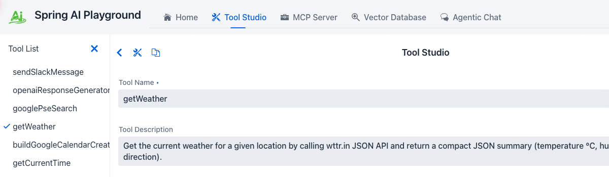
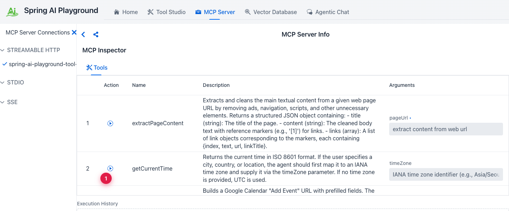

description: Tutorial 1 - author a tool in Tool Studio, earn its Local Pass, and verify it shows up on the built-in MCP server.

# Tutorial 1 - Author and Validate a Tool

**Time** 8 min · **Difficulty** ★☆☆ · **Surfaces** Tool Studio, MCP Server

!!! abstract "Goal"
    Take a built-in example tool (`getWeather`), run its local test, and verify it shows up on the built-in MCP server. This is the canonical *no-pass-no-run* flow: every tool earns its **Local Pass** before going live.

## What Tool Studio is for

Tool Studio wraps an HTTP API - or any small piece of JavaScript - into an MCP-callable tool. The runtime is GraalVM Polyglot JavaScript inside the JVM with a deny-first sandbox: raw network, file, native, and thread access are all blocked at the Java level. Tools reach the outside world through built-in helpers - `fetch` (with a 4-layer SSRF guard), `safety.fs` (rooted at a configurable base path), and `safety.parser.{html,yaml,csv,xml}` - which is enough for REST API wrappers and small computations, which is most of what a model needs.

The bundled catalog ships 86 default tools. The **Starter 5** preset is exposed through the built-in MCP server out of the box - that's what this tutorial picks from:

| Tool | Pattern |
|---|---|
| `getCurrentTime` | Pure computation with an optional parameter |
| `getWeather` | External REST call through `fetch`, normalized JSON output |
| `searchWikipedia` | REST call with no API key required |
| `extractPageContent` | `fetch` + `safety.parser.html` to extract clean main text |
| `evalExpression` | Pure expression evaluator, no network |

Other presets (`Dev Essentials`, `Korea Toolkit (free)`, `File Toolkit`, `Everything`, `Custom`), chosen at setup in the desktop launcher (or via CLI / yaml), unlock more of the catalog when you need it.

## Steps

1. Open **Tool Studio** and click `getWeather` in the left rail. It's a small REST-API wrapper - exactly the shape Tool Studio is built for.
2. Review the schema, parameters, and the JavaScript action. Notice the description tells the model *when* to use it - that's what the LLM uses for tool selection. The `location` parameter is **Required** (the checkbox is on), so its name and Test Value both show a `•` to mark them mandatory.
3. **Fill in the `Test Value` for every required parameter.** This is not just a form field - the Test Value is the **sample input** the local sandbox actually executes the tool with. The output of that run is what earns (or fails) the **Local Pass**, which is what gates publishing the tool to MCP. Garbage values here mean a garbage Local Pass.
4. Click **Test & Publish** (the button is labeled **Test & Update** when the tool was already published once). The local test runs the action with your Test Values. If it passes, the tool earns its Local Pass and is published to the built-in MCP server in the same step - no restart, no redeploy. **Save Draft** beside it stores the form without running the test.

*① the Starter 5 built-in tools (the default preset), ② tool name and description (shown to the model for selection), ③ structured parameters with the **Required** checkbox on, ④ **Test Value - required** (note the `•`), the sample input the sandbox runs with to earn the Local Pass, ⑤ **Test & Publish** / **Test & Update** runs the test then publishes if it passes - until it does, the tool sits in the **Drafts** section and is not exposed through MCP.*

!!! warning "No Test Value, no Local Pass, no MCP"
    A tool with empty Test Values for required parameters cannot run locally - and a tool that cannot run locally never reaches the MCP server. Pick a representative sample (e.g. `seoul` for `getWeather`) that exercises the same code path the model will hit in production.

After the test passes, you'll see a confirmation banner. Tool name and description match the entry in MCP from this point on.

*The Local Pass is what gates publication. Tools that haven't earned it never reach an MCP client.*

5. Switch to **MCP Server**. The built-in connection `spring-ai-playground-built-in-mcp` is selected by default. Scroll down to the **MCP Inspector** section to see the tools as any MCP client would.

*① the **Call Tool** play icon (here on the `getCurrentTime` row, the same tool Tutorial 4 will call from chat) runs the tool through the full MCP transport - not just the local sandbox. Your `getWeather` from step 4 lives in the same list; scroll the inspector to find it.*

!!! tip "Why this matters"
    Validating a tool *through MCP* (not just via Tool Studio's local test) catches schema mismatches and serialization issues that would otherwise only show up the first time a model invokes the tool in chat.

!!! warning "Common pitfalls"
    - Spaces in tool names break MCP. Use `camelCase` or `snake_case`.
    - Don't hardcode secrets. Use environment-backed `static variables` (`${OPENAI_API_KEY}`, `${SLACK_WEBHOOK_URL}`, ...) so they're injected at launch time only.
    - Keep results compact JSON. Long free-text outputs balloon the chat token count and crowd the context window.

