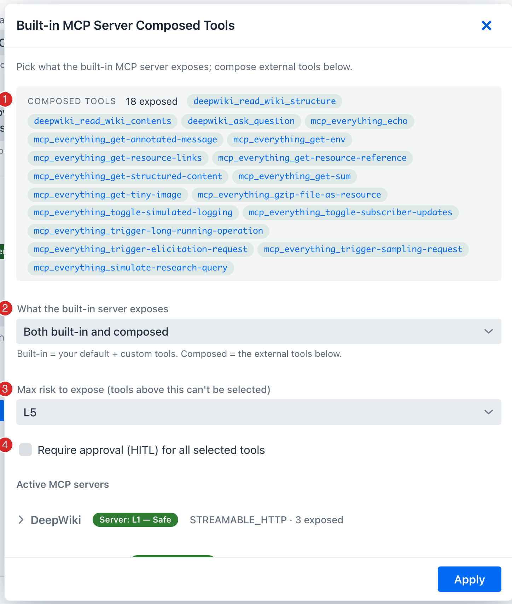
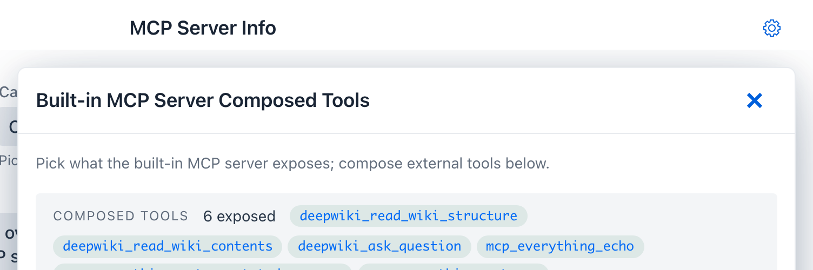
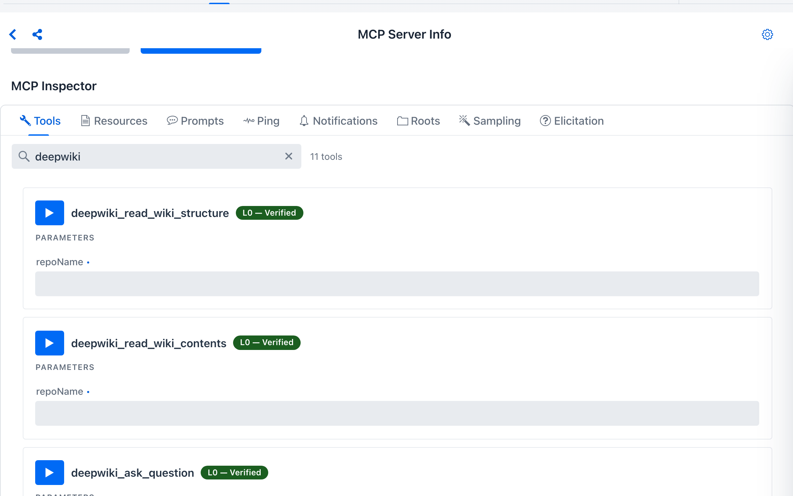
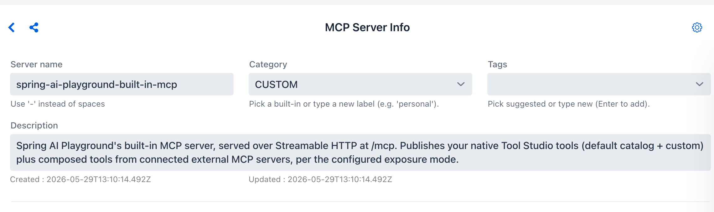

description: Tutorial 10 - proxy an MCP server through the playground's own built-in server: expose a whole server or a curated subset (even combine several), each tool wrapped with a risk level, HITL, logging, and secret masking, then call it from Agentic Chat or any external /mcp client.

# Tutorial 10 - Proxy an MCP Server

**Time** 8 min · **Difficulty** ★★☆ · **Surfaces** MCP Server

!!! abstract "Goal"
    Re-publish the tools of the external MCP servers you've connected **through the playground's own built-in MCP server** - the [MCP Server Proxy](../features/mcp-server/proxy.md). Expose a **whole server**, a **curated subset**, or a **combination of several servers** on one governed endpoint (`/mcp`). Every proxied tool is wrapped with a risk level, optional human approval (HITL), logging, and secret masking, and becomes callable from **Agentic Chat *and* any external `/mcp` client**.

!!! tip "No-credential examples - DeepWiki + MCP Everything"
    This walkthrough connects two Default MCP Servers from the *Example* category: **DeepWiki** (free, no-auth Streamable HTTP; three read tools - `read_wiki_structure`, `read_wiki_contents`, `ask_question`) and **MCP Everything** (the reference test server; stdio). Any active connection proxies the same way - these two just need no credentials.

## How the proxy works

The built-in server (`spring-ai-playground-built-in-mcp`, Streamable HTTP at `/mcp`) is the **single endpoint** your agent - and any external MCP client - connects to. The proxy lets that one server **front the tools of the external servers you've connected**: it serves your Tool Studio tools *plus* the upstream tools you select, each wrapped and governed per tool. You never expose a raw upstream connection to a client; you expose a curated, risk-capped slice of it through your own server.

## Step 1 - Connect the upstream server(s)

In **MCP Server**, open the sidebar's **Inactive MCP** section and activate the servers you want to proxy - here **DeepWiki** and **MCP Everything** - each via **Save & Connect**. (For the manual / authenticated path, see [Tutorial 2](2-external-mcp.md).) Confirm each server's tools in the [Inspector](../features/mcp-server/inspector.md#tools); every tool carries its own risk chip (DeepWiki's read tools score `L2 - Low`).

## Step 2 - Open the Expose Tools drawer

Click the **gear icon** at the top-right of the *MCP Server Info* header. The **Built-in MCP Server Composed Tools** drawer lists every active server.

{ loading=lazy }

## Step 3 - Set the proxy-wide options

The top of the drawer governs what the whole built-in server publishes:

{ loading=lazy }

1. **COMPOSED TOOLS** - a live summary of every tool currently selected across *all* servers, by exposed alias. This is the merged set the built-in server will publish.
2. **What the built-in server exposes** - `Both built-in and composed` (default), `Built-in tools only`, or `Composed tools only`. "Built-in" = your Tool Studio default + custom tools; "Composed" = the external tools you pick below. Pick `Composed tools only` to turn the playground into a *pure* proxy for upstream servers.
3. **Max risk to expose** - a ceiling; any tool whose effective risk exceeds it is disabled in the list, so you can't accidentally publish something over your bar.
4. **Require approval (HITL) for all selected tools** - gate every proxied tool at once (or do it per tool in Step 6).

## Step 4 - Proxy a whole server

To front an *entire* server, expand its row and tick **Select all** (1). Every tool shows its own **risk chip** (2) and a per-tool **HITL** checkbox (3); any tool over the max-risk cap stays disabled.

{ loading=lazy }

## Step 5 - ...or combine tools across several servers

You don't have to take a whole server. Expand **multiple** servers and tick exactly the tools you want - the **COMPOSED TOOLS** summary at the top shows the merged set drawn from every server. Each exposed alias defaults to `<server>_<tool>` (normalized), e.g. `deepwiki_read_wiki_structure` from DeepWiki and `mcp_everything_echo` from MCP Everything, all served from your one endpoint.

{ loading=lazy }

## Step 6 - (Optional) rename, re-describe, or gate per tool

Click a selected tool to edit its **exposed alias** or **description** (the input schema passes through unchanged), and tick its **HITL** box to require human approval before each call - which also lowers its effective risk by one band (shown as a `HITL -1` badge).

## Step 7 - Apply

Click **Apply**. The selected tools join the built-in server immediately - no restart. Select the built-in server in the sidebar and its [Inspector](../features/mcp-server/inspector.md#tools) now lists the proxied tools alongside your native ones. (They show `L0 - Verified` here because the built-in server bypasses the risk model for its own tools; the upstream's real level still shows on *its* connection's Inspector.)

{ loading=lazy }

## Step 8 - Name the proxy endpoint (what clients see)

External `/mcp` clients see your built-in server's **name** and **description** in their server list. These come from **configuration**, not the connection form - the built-in identity is sourced from your settings so it stays stable (and keeps matching the `L0 - Verified` bypass). The sidebar shows the current values:

{ loading=lazy }

Set them in `application.yaml` (or via the matching env vars), alongside the exposure mode:

```yaml
spring:
  ai:
    playground:
      built-in-mcp-server:
        name: my-team-tools                 # SPRING_AI_PLAYGROUND_MCP_NAME
        description: Curated tools for my team   # SPRING_AI_PLAYGROUND_MCP_DESCRIPTION
        exposure-mode: both                  # builtin-only | composed-only | both
```

Defaults are `spring-ai-playground-built-in-mcp` and a generated description. You can also pin the composed tool set declaratively - see [Configuration → MCP built-in server & exposure](../getting-started/configuration.md#mcp) and [Proxy → Configure exposure via YAML](../features/mcp-server/proxy.md#yaml-exposure).

## Step 9 - Use it

- **Agentic Chat** - the proxied tools are now selectable alongside your Tool Studio tools. Ask *"What does the spring-ai-community/spring-ai-playground repo's wiki cover?"* and the model can call `deepwiki_read_wiki_structure`.
- **Any external MCP client** pointed at the playground's `/mcp` endpoint sees the proxied tools in `tools/list` under their exposed aliases - your built-in server has become a governed front for several upstreams at once.

!!! info "What the proxy guarantees"
    Each proxied tool is wrapped, not copied: it carries a composed risk level, emits `mcp.tool.start` / `done` / `crash` spans tagged with the upstream origin and risk, masks upstream secrets in errors, and (when marked HITL) persists the approval flag. Before it's published it also passes a description **poisoning scan**, a **fingerprint ledger** (so a silently-redefined upstream tool is flagged for re-review), and **shadowing rules**. See [MCP Server Safety → The safe-wrapping contract](../mcp-server-safety.md#wrapping-contract).

## Where to go next

- [MCP Server Proxy](../features/mcp-server/proxy.md) - the full feature reference (caps, aliases, exposure modes, YAML config, external-client reach)
- [MCP Server Safety](../mcp-server-safety.md) - how the composed `L0`-`L5` risk, poisoning scan, ledger, and shadowing rules are computed
- [Tutorial 4 - Chat With Tools](4-chat-tools.md) - drive a tool from a chat turn end-to-end
