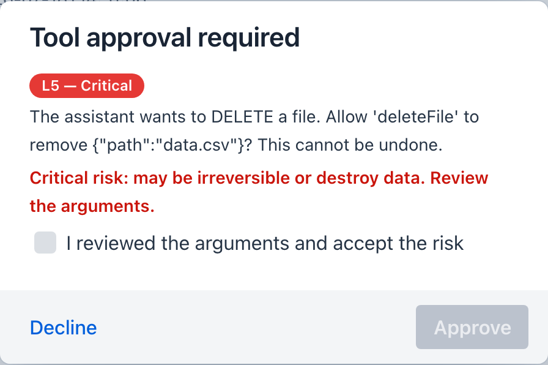

description: Turn on human-in-the-loop approval for a tool, then approve and decline its calls from inside Agentic Chat - the runtime safety gate that asks before a tool runs.

# 11. Approve a Tool in Chat (Human-in-the-Loop)

**Goal:** require approval on a tool, then watch Agentic Chat **pause and ask you** before it runs - and see what happens when you decline.

This is the runtime half of the safety story: the [sandbox](../safety-architecture.md) and [risk model](../mcp-server-safety.md) decide *what a tool may do*; **human-in-the-loop (HITL)** decides *whether this call runs at all*. See the [feature page](../features/human-in-the-loop.md) and [architecture](../hitl-architecture.md) for the full picture.

**Prerequisites:**

- A published tool you can call from chat - the one from [Tutorial 1 - Author a Tool](1-author-tool.md) is perfect. Any tool works.
- A chat model configured in **Agentic Chat** (see [Tutorial 4 - Chat with Tools](4-chat-tools.md)).

## 1. Require approval on the tool { #require }

1. Open **Tool Studio** and select your tool.
2. Expand **Sandbox & Capabilities**.
3. Under **Human-in-the-loop**, choose **Required - ask every run**.
4. *(Optional)* Set an **Approval prompt** such as `About to run '{toolName}' with {args}. Proceed?` - `{toolName}` and `{args}` are filled in at call time.
5. Click **Test & Update** to save.

!!! note "Above L0, this may already be on"
    A tool above risk `L0` defaults to **Required** the moment you author it. If it's already set, just confirm the mode and move on.

## 2. Make the tool reachable from chat { #reach }

Agentic Chat reaches your published tools through the built-in MCP server.

1. Open **Agentic Chat**.
2. In the tool menu above the prompt, tick **Manual built-in tool selection**.
3. Confirm your tool appears in the exposed-tools list.

## 3. Trigger the tool and approve { #approve }

Ask the agent to do the thing your tool does - for example, *"Use the tool to get me the current time."*

When the model decides to call the gated tool, chat **stops** and a dialog appears:

- Title: **Tool approval required**
- A colored **risk-level chip** (L0-L5) for the tool being called - hover it for the rationale
- Body: your approval prompt, with the real tool name and arguments
- Buttons: **Approve** and **Decline**

Click **Approve**. The tool runs, its result returns to the model, and the answer streams in as usual.

!!! tip "Inspect the arguments before you approve"
    The dialog shows the exact arguments the model chose. This is your chance to catch a wrong path, a bad amount, or an unintended recipient *before* the call fires.

The dialog escalates with the tool's risk level: at **L4 (High)** a warning line appears and **Approve** turns red; at **L5 (Critical)** - the filesystem delete and move tools, for example - **Approve** stays disabled until you tick *"I reviewed the arguments and accept the risk"*. Try it with `deleteFile` from the [filesystem tools](../features/default-tools/filesystem.md) to see the full escalation:

{ width="420" }

## 4. Try declining { #decline }

Ask again, but this time click **Decline**.

The tool does **not** run. Instead the model is told you declined approval and that it should not retry - so it either finds another way or replies that the action couldn't be completed because you declined. Nothing executed; the decline is recorded in the run.

!!! warning "Approval fails safe"
    If you don't answer within two minutes (the `agent-loop.approval-timeout-seconds` [setting](../getting-started/configuration.md#agent-loop)), or close the dialog, the call is treated as **declined** and does not run. A gated tool only runs on an explicit **Approve**.

## What you learned { #recap }

- Set a tool's **Human-in-the-loop** mode to **Required** in Tool Studio.
- Agentic Chat **pauses** on a gated call and asks you to **Approve** or **Decline**.
- **Decline** (and timeout) block the call and tell the model - execution is deny-by-default.

## Next steps

- Re-expose an **external** tool with approval: [Tutorial 10 - Proxy an MCP Server](10-proxy-external-tool.md) + the [HITL column](../features/human-in-the-loop.md#expose).
- Understand the two gates and loopback de-duplication: [Human-in-the-Loop architecture](../hitl-architecture.md).
