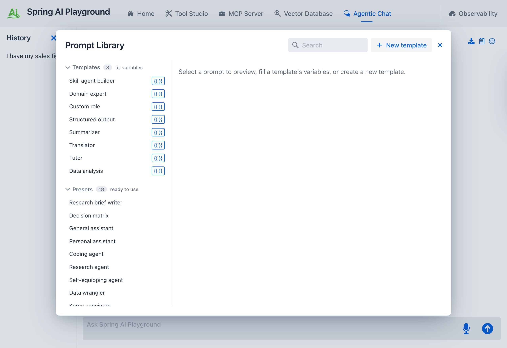
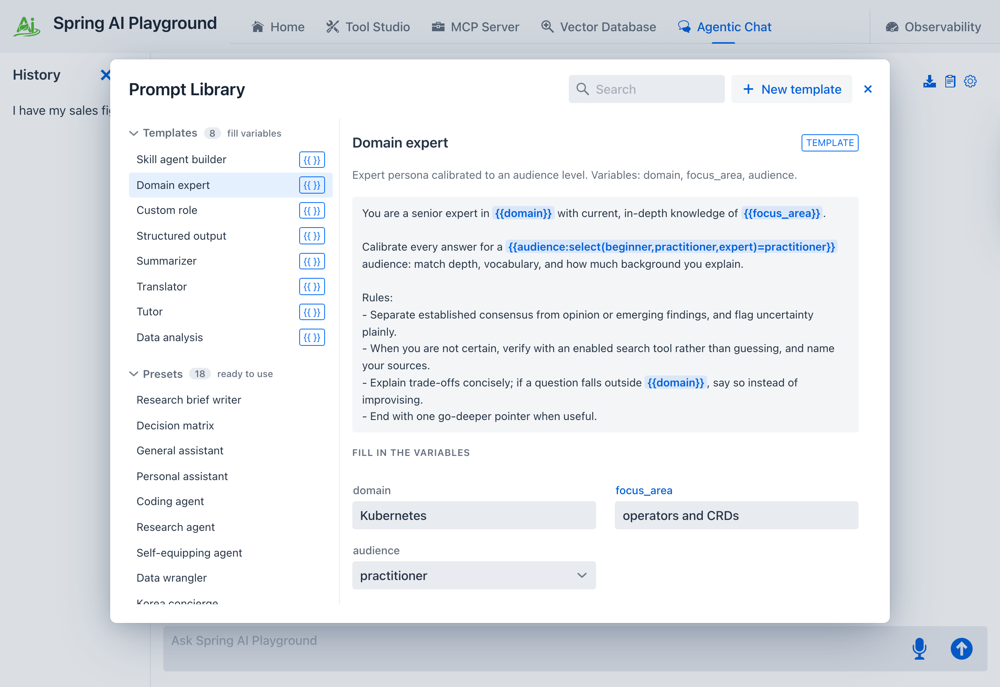
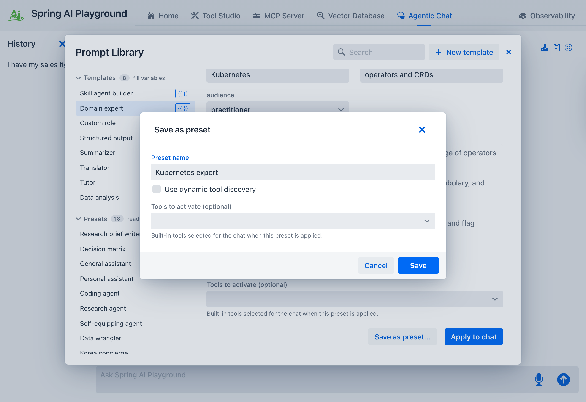
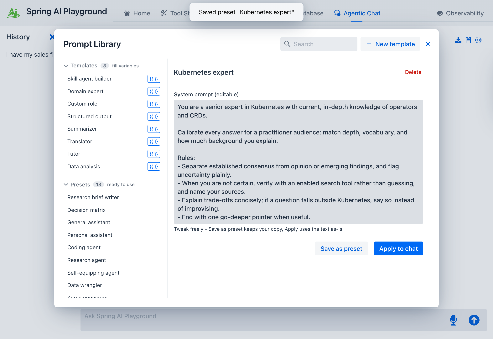

description: Tutorial 12 - fill a Prompt Library template's variables and save the assembled prompt as a named, reusable preset with the Save as preset dialog.

# Tutorial 12 - Build a Preset from a Template

**Time** 6 min · **Difficulty** ★★☆ · **Surfaces** Agentic Chat

!!! abstract "Goal"
    Turn a Prompt Library **template** into a named, reusable **preset**. You fill a template's variables, watch the final prompt assemble live, then save it as a preset you can apply again any time. A preset is a complete prompt applied as-is; a template is the parameterized form that *produces* one. Here you use **Domain expert** - fill three fields and you have a specialist persona saved under **My presets**.

## Steps

1. Open **Agentic Chat** and click the **Prompt Library** (clipboard) icon in the header. The library lists **Templates** (parameterized, each with a `{{ }}` badge) above ready-to-use **Presets**. Pick **Domain expert** from the Templates group.

*① The **Templates** group - each carries a `{{ }}` badge marking its variables. ② The **Presets** group below (ready-to-use, no variables). ③ Click **Domain expert**.*

2. Fill the variables on the right - a **domain**, a **focus_area**, and an **audience** level. The **Final prompt (preview)** assembles live as you type. A **Use dynamic tool discovery** checkbox sits above the tools picker: leave it off to keep a fixed tool set, or tick it to let the saved preset search the catalog on demand.

*① **domain** and **focus_area** - what the expert knows. ② **audience** - the level to calibrate to. ③ The **Final prompt (preview)** updates as you type; the **Use dynamic tool discovery** toggle is just below it.*

3. Click **Save as preset...**. A dialog opens with a suggested **Preset name** (built from your filled values) that you can edit, plus the tool and dynamic-discovery settings. Name it something memorable - `Kubernetes expert` - and click **Save**.

*You choose the name - the filled values are only a suggested default. The preset is stored under **My presets**, persisted across restarts.*

4. The new preset now lives in the **My presets** group with the name you gave it. Select it and click **Apply to chat** to start a chat with the assembled prompt as its system prompt - then ask a domain question and the persona answers.

*Your filled template is now a first-class, reusable preset - apply it as-is whenever you need that expert.*

## What to observe

- A template *produces* a preset: **Save as preset...** is the bridge between the two halves of the Prompt Library, and it always asks you to **name** the result.
- **Apply to chat** uses the filled prompt right away without saving; **Save as preset...** keeps a named copy under **My presets** for reuse - two distinct buttons for two intents.
- Your variable values are substituted into the system prompt **before** the chat starts - the model never sees `{{domain}}`, only your text.
- Leaving a variable blank falls back to its default, so a template is runnable even before you touch the form. The **Use dynamic tool discovery** toggle is editable right in the fill view, not only in the editor.

!!! tip "Why this matters"
    Author the structure once, reuse it forever. The same **Domain expert** template becomes a *Kubernetes expert*, a *tax-law expert*, or a *perinatal-nutrition expert* - each saved as its own named preset - without rewriting the instructions. Reach for a **preset** when you want to start fast as-is; reach for a **template** when you want the same structure with different specifics each run. For loading a file into a preset's workflow, see [Tutorial 13 - Upload and Analyze a File](13-upload-a-file.md). The full reference is in [Prompt Templates](../features/agentic-chat/prompt-templates.md) and [Prompt Presets](../features/agentic-chat/prompt-presets.md).
