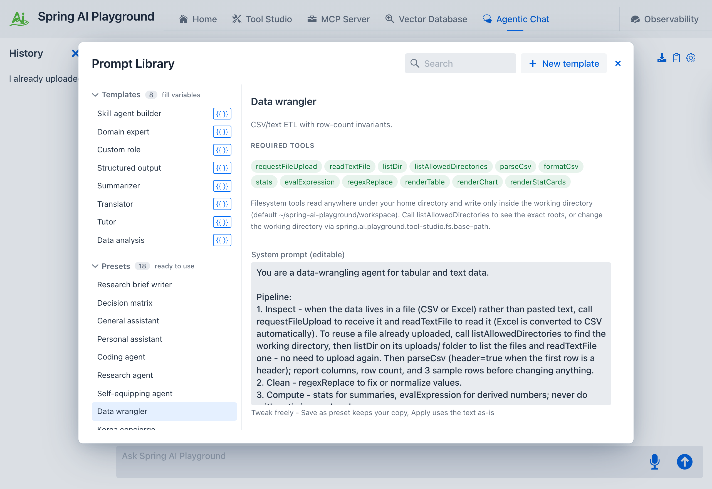
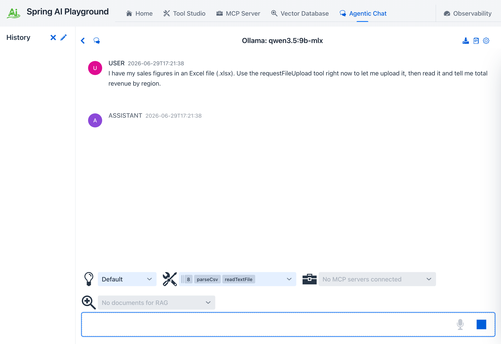
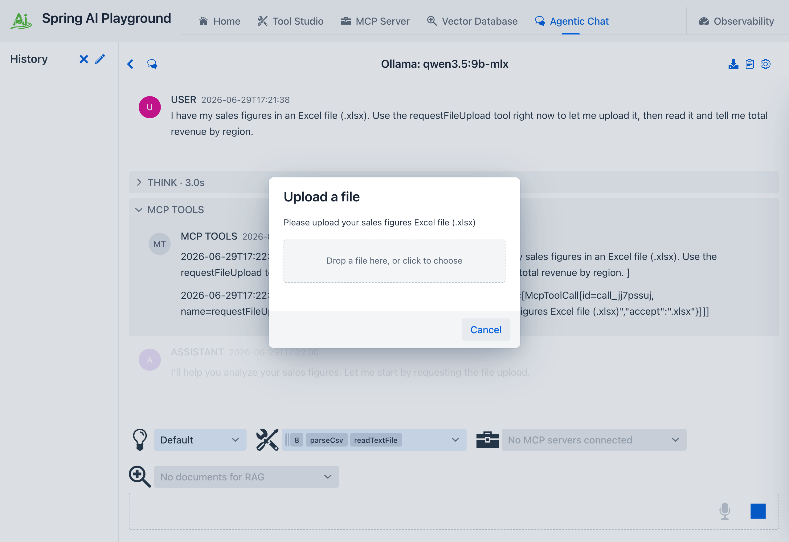
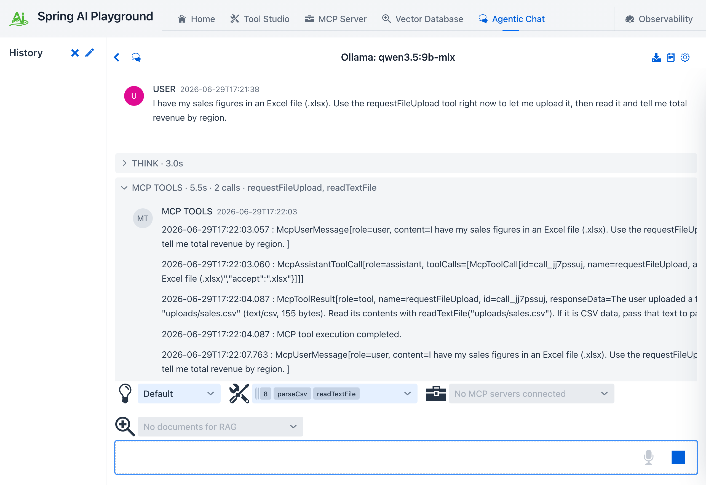
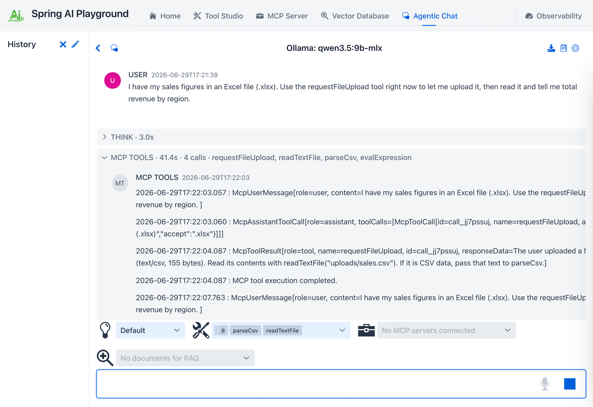

description: Tutorial 13 - upload a CSV or Excel file into Agentic Chat with the interactive requestFileUpload tool, then have the agent read and analyze it.

# Tutorial 13 - Upload and Analyze a File

**Time** 7 min · **Difficulty** ★★☆ · **Surfaces** Agentic Chat

!!! abstract "Goal"
    Hand the agent a file from your computer and let it analyze the contents. You apply a data preset, ask a question about a file you have not pasted, and the model calls the interactive **`requestFileUpload`** tool - the chat opens an upload dialog, converts Excel to CSV in your browser, saves the file to the conversation workspace, and the agent reads it back with `readTextFile` and `parseCsv`. This is the bridge between "paste your data into the chat" and "work with the files you already have."

## Steps

1. Open **Agentic Chat**, click the **Prompt Library** (clipboard) icon, and apply the **Data wrangler** preset from the **Presets** group. When the **Apply preset tools** dialog appears, click **Apply** so the chat exposes the preset's tools - including `requestFileUpload`, `readTextFile`, and `parseCsv`.

*① Pick **Data wrangler** from the **Presets** group. ② Its **Required tools** row now leads with `requestFileUpload` and `readTextFile`. ③ Apply it to a new chat.*

2. Ask a question about a file you have **not** pasted - for example `I have my sales figures in an Excel file. Ask me to upload it, then tell me total revenue by region.` The model recognizes it needs the data and calls `requestFileUpload`.

*The agent does not guess at data it cannot see - it reaches for the upload tool first.*

3. The chat opens an **Upload a file** dialog (the same human-in-the-loop pause used for tool approvals). Drop your `.csv` or `.xlsx` file onto it, or click to choose one.

*The model can pass a short prompt (here "upload your sales figures") and an `accept` filter; the dialog accepts CSV, Excel, images, or any document.*

4. Pick an Excel file and the browser converts it to CSV with **SheetJS** before anything leaves your machine, then saves it under the conversation workspace at `uploads/<name>.csv`. The tool returns that path to the model.

*Excel (`.xlsx` / `.xls`) is converted to CSV in the browser - the server only ever stores text. The model then calls `readTextFile("uploads/...")` to read it back.*

5. The agent reads the file, parses it, and answers - here summarizing revenue by region from the rows it actually loaded.

*The agent grounds its answer in the file you uploaded, not in anything it invented. Pair the preset's render tools (`renderTable`, `renderChart`, `renderStatCards`) to turn the result into cards.*

## What to observe

- `requestFileUpload` is **model-initiated and interactive**: the agent decides it needs a file and pauses the turn until you upload one - the same seam as a tool-approval prompt.
- Excel files are converted to CSV **in the browser** (SheetJS); the server stores only text, so `parseCsv` works unchanged and no extra Java dependency is involved.
- The uploaded file lands in the conversation workspace `uploads/` directory, exactly where the filesystem tools (`readTextFile`, `findFiles`) can read it.
- The tool is file-type agnostic - it also accepts images, PDFs, and plain text, returning the saved path for whatever tool comes next.

!!! tip "Why this matters"
    Data tools are only half useful if you have to paste everything in by hand. `requestFileUpload` lets an agent pull a real file into the conversation on demand, so the same **Data wrangler** or **Data analysis** preset works on the spreadsheet sitting in your Downloads folder - not just on rows you retype. The tool reference is in [Default Tool Examples](../features/default-tools/examples.md#requestFileUpload).
