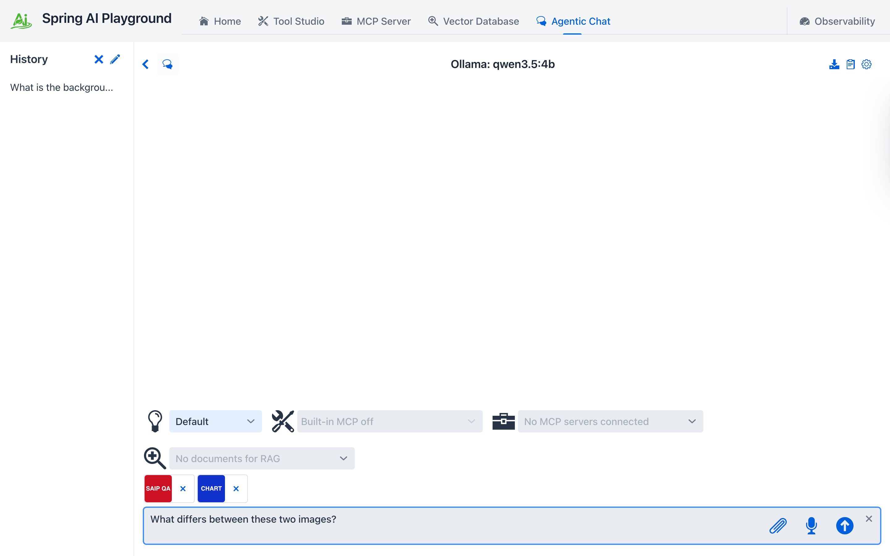
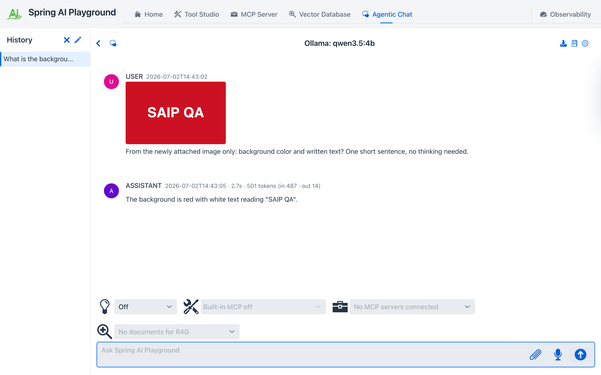
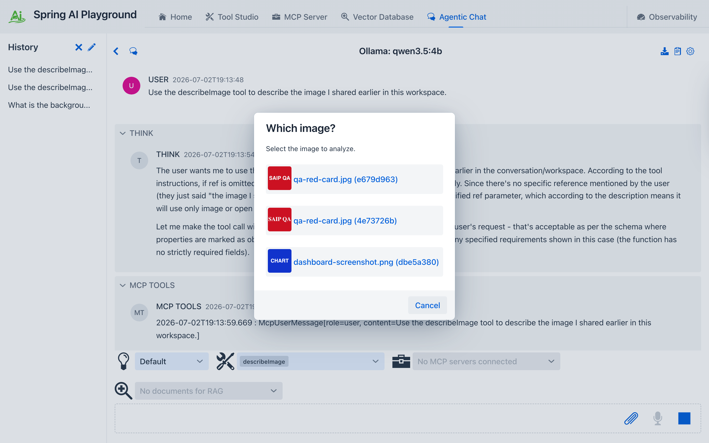

# Tutorial 14 - Attach and Analyze an Image

**Time** 5 min · **Difficulty** ★☆☆ · **Surfaces** Agentic Chat

!!! abstract "Goal"
    Hand the model a picture and ask about it. You attach an image with the picture button (or drag-drop, or paste), send a question, and a **vision-capable model** answers from the actual pixels - resized and EXIF-tagged in your browser, stored content-addressed on your machine, never sent to a third party. Then you re-summon the same image in a later turn with the **`describeImage`** tool.

## Before you start

Pick a model that can actually see. On Ollama that means a standard GGUF vision model such as **`qwen3.5:4b`** or **`gemma3`** - not an `-mlx` variant, which advertises vision without shipping vision tensors (the playground warns you if you try). On Apple Silicon the model list in the chat settings drawer shows the curated `-mlx` catalog, so type `qwen3.5:4b` into the model box directly - custom names are accepted. OpenAI GPT-5 family models work out of the box. See [Image Attachments](../features/agentic-chat/image-attachments.md#vision-capability-check) for the capability check details.

## Steps

1. Open **Agentic Chat** and click the **picture** icon in the prompt field (or drop an image file onto it, or paste a screenshot). The image appears as a **chip** above the prompt - attach several if you like (up to 5 per message, the chip bar counts them), and remove any with its **x** button.

*The chip is your pre-send staging area: the image is already optimized (resized to at most 2048px, EXIF captured from the original) and stored locally, but nothing has gone to the model yet.*

2. Type a question about the image - for example `What is the background color and what text do you see?` - and send. The image rides along with your message as native multimodal input, and the thumbnail renders inside your message bubble.

3. The vision model answers from the pixels. With a local Ollama model the first image turn can take a minute or two (the vision projector loads and the image is encoded) - later turns are faster.

*The answer is grounded in the attached image, not a guess. The thumbnail stays with the conversation - reopen the chat later and it is restored from the local image store.*

4. Later in the conversation - even after the original turn has scrolled out of the model's context window - ask about the image again: `What was in that image I sent earlier?`. If the **`describeImage`** tool is exposed to the chat, the model calls it, the chat re-attaches the stored image, and the model answers with the pixels in front of it again.

*One image attached once, referenced any time - `describeImage` resolves by hash or file name. When several images match, a chooser lists each with a thumbnail and its short hash; when none exist, an upload dialog opens instead.*

## What to observe

- The browser does the heavy lifting **before upload**: EXIF (including GPS, capture time, camera) is read from the original file, then the image is rotation-corrected and resized to at most 2048px on its longest edge.
- Storage is **content-addressed and per-conversation**: the same image attached twice lands at the same `workspace/<conversation>/images/<sha-256>` path once. The `.json` sidecar keeps the original file name, MIME type, and EXIF.
- The **vision capability check** runs at attach time: a non-vision model (or an mlx false-positive) gets a warning, but you can still send - the provider error is translated into an actionable message if it fails.
- Conversation files persist only image **references**; reopening the chat reloads thumbnails from the local store.

!!! tip "Why this matters"
    Screenshots, photos of whiteboards, receipts, charts - much of what you want an agent to work with is not text. Native image input plus `describeImage` re-referencing means one attachment keeps working across the whole conversation without re-uploading or burning context on re-sent pixels. The full feature reference is at [Agentic Chat → Image Attachments](../features/agentic-chat/image-attachments.md).
