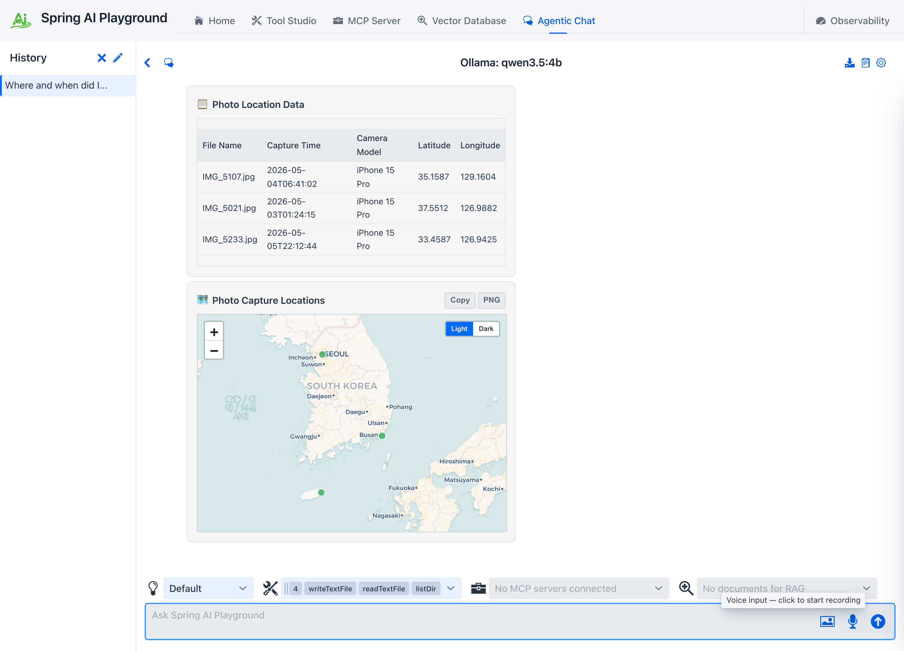

# Tutorial 14 - Attach and Analyze Images

**Time** 8 min · **Difficulty** ★☆☆ · **Surfaces** Agentic Chat

!!! abstract "Goal"
    Hand the model pictures and ask about them. You attach images with the picture button (or drag-drop, or paste), send a question, and a **vision-capable model** answers from the actual pixels - resized and EXIF-tagged in your browser, stored content-addressed on your machine, never sent to a third party. Then you go past the pixels: with the **Image analyst** preset the agent reads each photo's stored **EXIF**, tabulates capture time, camera, and GPS with `renderTable`, and plots where the shots were taken on a `plotPointsOnMap` card. Finally you re-summon an image in a later turn with the **`describeImage`** tool.

## Before you start

Pick a model that can actually see. On Ollama that means a standard GGUF vision model such as **`qwen3.5:4b`** (the shipped default) or **`gemma3`** - not an `-mlx` variant, which advertises vision without shipping vision tensors (the playground warns you if you try). On Apple Silicon the model list keeps the standard GGUF builds alongside the `-mlx` catalog exactly for this - pick `qwen3.5:4b` from the list, or type any custom name into the model box. OpenAI GPT-5 family models work out of the box. See [Multimodal Vision Input](../features/agentic-chat/image-attachments.md#vision-capability-check) for the capability check details.

## Steps

1. Open **Agentic Chat** and click the **picture** icon in the prompt field (or drop image files onto it, or paste a screenshot). Each image appears as a **chip** above the prompt - attach several at once (up to 5 per message, the chip bar counts them), and remove any with its **x** button.

*The chips are your pre-send staging area - here three vacation photos, counter at 3 / 5. Each image is already optimized (resized to at most 2048px, EXIF captured from the original) and stored locally, but nothing has gone to the model yet.*

2. Type a question about the image - for example `What is this image? Read the title text and tell me what the map at the bottom shows.` - and send. The image rides along with your message as native multimodal input, and the thumbnail renders inside your message bubble.

3. The vision model answers from the pixels. With a local Ollama model the first image turn can take a minute or two (the vision projector loads and the image is encoded) - later turns are faster.

*The answer is grounded in the attached image, not a guess - here the model reads the exact title text and identifies what the map plots. The thumbnail stays with the conversation - reopen the chat later and it is restored from the local image store.*

4. Photos carry more than pixels. The EXIF captured at attach time (capture date, camera, GPS) lands in a `.json` sidecar next to each stored image, and the filesystem tools can read it. Apply the **Image analyst** preset from the **Prompt Library** (confirm the **Apply preset tools** dialog - it exposes `listDir`, `readTextFile`, `renderTable`, and `plotPointsOnMap` alongside `describeImage`), attach a few geotagged photos, and ask: `Where and when did I take these three photos? Read each photo's EXIF sidecar, show a table with file name, capture time, camera, and GPS coordinates, then plot the three locations on a map.`

*The agent lists `images/`, reads each `<hash>.json` sidecar with `readTextFile`, tabulates file, capture time, camera, and GPS per photo with `renderTable`, then drops one marker per photo with `plotPointsOnMap` - three shots, three markers. The answer ends in a table and a map you can read at a glance, not a paragraph of coordinates.*

5. Later in the conversation - even after the original turn has scrolled out of the model's context window - ask about the image again: `What was in that image I sent earlier?`. If the **`describeImage`** tool is exposed to the chat, the model calls it, the chat re-attaches the stored image, and the model answers with the pixels in front of it again.

*One image attached once, referenced any time - `describeImage` resolves by hash or file name. When several images match, a chooser lists each with a thumbnail and its short hash; when none exist, an upload dialog opens instead.*

## What to observe

- The browser does the heavy lifting **before upload**: EXIF (including GPS, capture time, camera) is read from the original file, then the image is rotation-corrected and resized to at most 2048px on its longest edge.
- Storage is **content-addressed and per-conversation**: the same image attached twice lands at the same `workspace/<conversation>/images/<sha-256>` path once. The `.json` sidecar keeps the original file name, MIME type, and EXIF.
- That sidecar makes EXIF **queryable data, not just provenance**: it sits inside the conversation workspace, so the same filesystem tools that read uploaded files turn camera metadata into `renderTable` rows and `plotPointsOnMap` markers - no vision call needed for the *where* and *when*.
- The **vision capability check** runs at attach time: a non-vision model (or an mlx false-positive) gets a warning, but you can still send - the provider error is translated into an actionable message if it fails.
- Conversation files persist only image **references**; reopening the chat reloads thumbnails from the local store.

!!! tip "Why this matters"
    Screenshots, photos of whiteboards, receipts, charts - much of what you want an agent to work with is not text. Native image input plus `describeImage` re-referencing means one attachment keeps working across the whole conversation without re-uploading or burning context on re-sent pixels. And because EXIF lands as readable workspace data, the [Image analyst](../features/agentic-chat/prompt-presets.md#image-analyst) preset turns a batch of vacation photos into a sortable table and a pin map in one question. The full feature reference is at [Agentic Chat → Multimodal Vision Input](../features/agentic-chat/image-attachments.md).
