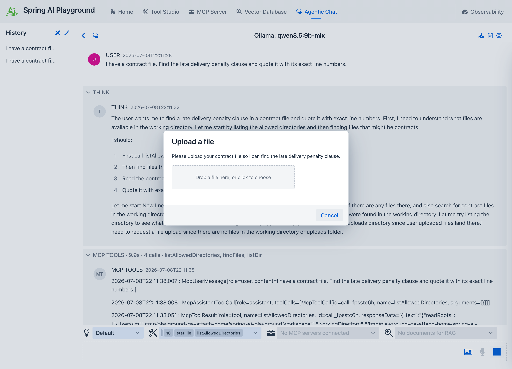
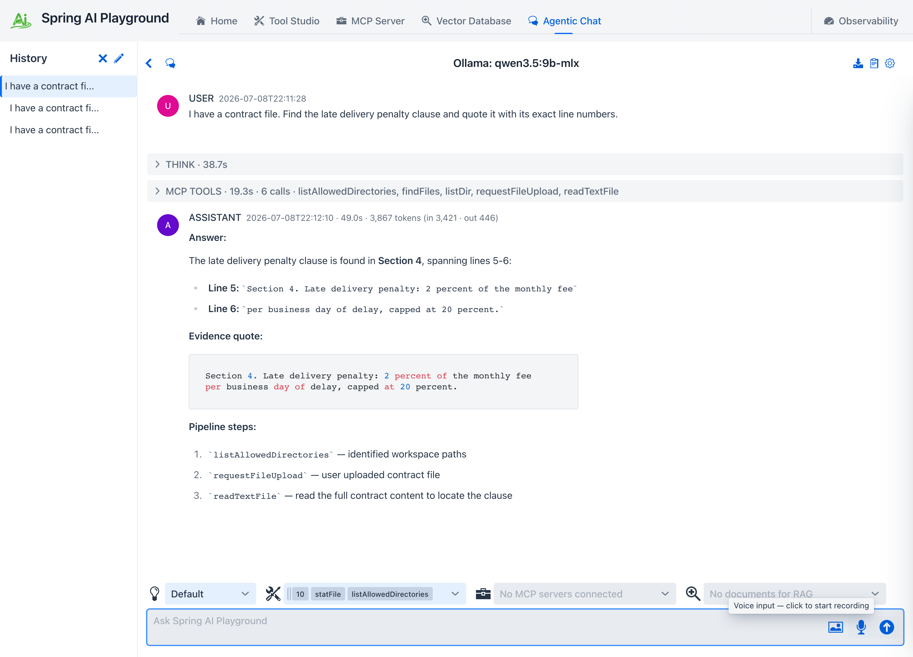

# Tutorial 15 - Investigate Documents with a Pipeline

**Time** 6 min · **Difficulty** ★★☆ · **Surfaces** Agentic Chat

!!! abstract "Goal"
    Point the agent at a document it has never seen and let it dig the facts out with filesystem primitives - the Unix pipeline way (`find | grep -C | wc -l`), one tool call per step. You apply the **Document detective** preset and ask about a contract you have not pasted; the model calls **`requestFileUpload`**, you pick the file, and the agent hunts the clause down with `grepFile` and `sliceFile`, quoting it back with exact line numbers.

## Steps

1. Open **Agentic Chat**, click the **Prompt Library** (clipboard) icon, and apply the **Document detective** preset from the **Presets** group. When the **Apply preset tools** dialog appears, click **Apply** so the chat exposes the preset's twelve tools - `requestFileUpload` plus the read pipeline (`findFiles`, `searchInFiles`, `grepFile`, `sliceFile`, `lineCount`, ...).

2. Ask about a document you have **not** pasted - for example `I have a contract file. Find the late delivery penalty clause and quote it with its exact line numbers.` The model realizes it cannot read what it does not have and calls `requestFileUpload` - the chat opens an **Upload a file** dialog mid-conversation.

*The same human-in-the-loop seam as tool approvals: the turn pauses until you hand over a file or cancel. Excel converts to CSV in the browser before anything is stored.*

3. Pick the file. It lands under the conversation workspace at `uploads/<name>` and the tool returns that path to the model, which reads it and answers with the clause quoted at its exact line numbers - evidence, not paraphrase. The preset scales the tooling to the file: a small contract like this one is read whole with `readTextFile`; on a large document it switches to `grepFile numbered=true` to pin the matching line and `sliceFile` to pull a context window around it.

*Every claim carries a verbatim quote and a line number - the `grep -n` discipline as an agent behavior - and the answer ends with the pipeline steps it ran.*

4. No upload needed when the documents are already on disk: give it a **folder path** instead - `Search every file under ~/contracts for the word "penalty"` - and the agent sweeps it with `findFiles` + `searchInFiles`, then slices context around each hit, exactly like the [preset card's captured run](../features/agentic-chat/prompt-presets.md#document-detective).

## What to observe

- The upload is saved under the **conversation workspace** (`workspace/<conversationId>/uploads/`) - each chat keeps its own files, and deleting the conversation removes them.
- The pipeline idiom maps one-to-one: `findFiles` = `find`, `grepFile numbered=true` = `grep -n`, `sliceFile` = `sed -n 'a,bp'`, `lineCount` = `wc -l`, `sortFile` / `cutFileFields` = `sort` / `cut`.
- Everything here is **read-only** (`L3`) - unlike the write tools in [Tutorial 13](13-upload-a-file.md), no approval prompt is needed to search and quote.
- Excel (`.xlsx` / `.xls`) converts to CSV **in the browser** before upload; the server only ever stores text.

!!! tip "Why this matters"
    Contracts, reports, exports, logs from another machine - most real documents are files, not paste-able text. The upload dialog plus the read pipeline turns "let me summarize what I think it says" into "line 5 says exactly this", with the evidence trail to prove it. The full preset reference is at [Prompt Presets → Document detective](../features/agentic-chat/prompt-presets.md#document-detective).
