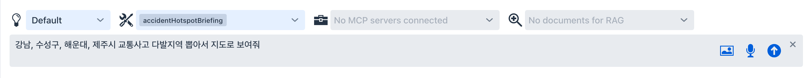
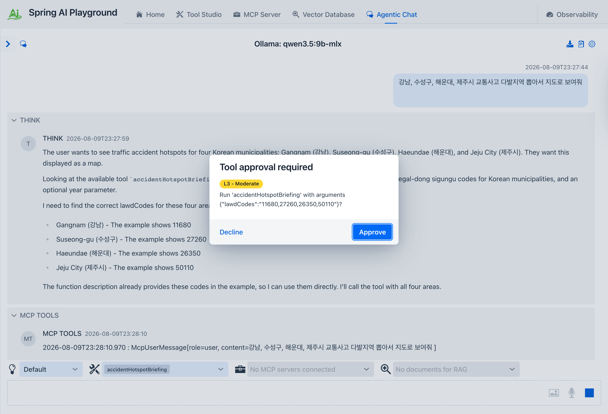
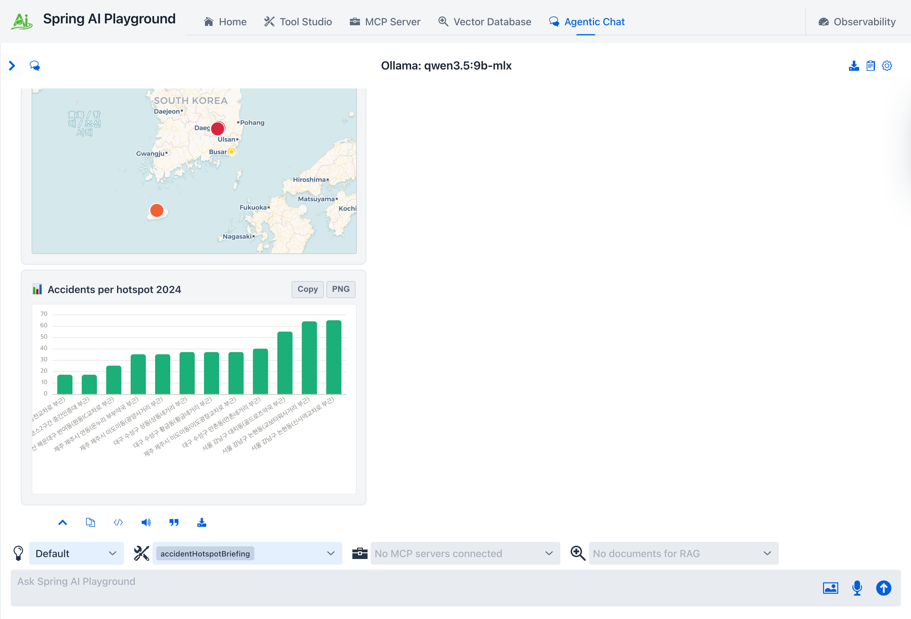
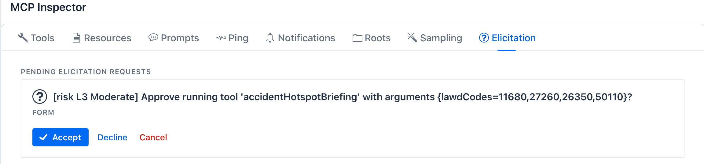
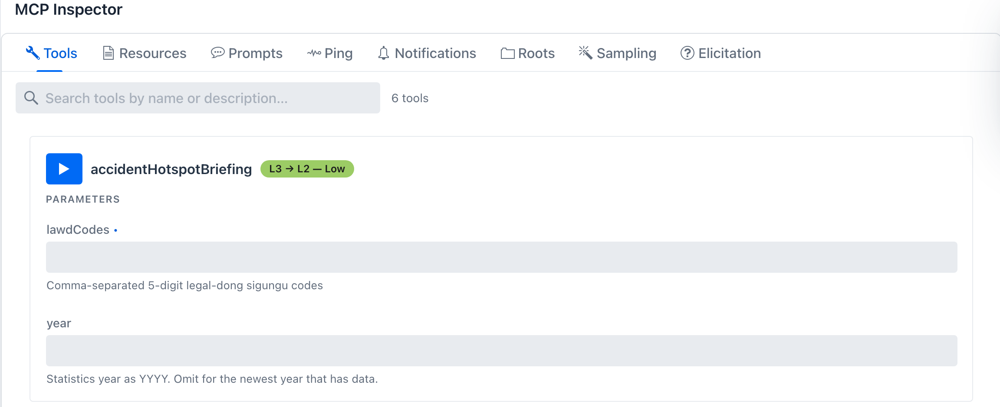

description: Tutorial 16 - wrap a public REST API you already have access to as a tool, gate it behind human approval, and hand the same configuration to Docker so any MCP client can call it.

# Tutorial 16 - From a Public API to Your Own MCP Server

**Time** 25 min · **Difficulty** ★★★ · **Surfaces** Tool Studio + Agentic Chat + MCP Server + Docker

!!! abstract "Goal"
    Take a REST API your organisation already has credentials for, wrap it in Tool Studio, put a **human approval gate** in front of it, and watch it go live on the built-in MCP server the moment it earns its Local Pass. Then lift that same configuration into a **Docker container** so Claude Desktop, Claude Code, or any other MCP client can call it - with the approval gate still in force and the API key still outside the file.

This is the end-to-end path the earlier tutorials cover in pieces. [Tutorial 8](8-default-tool-recipes.md) composes default tools inside one JS action; [Tutorial 11](11-human-approval.md) approves a call from chat. Here the two meet, and the result is shipped: a running MCP server that is yours, that publishes exactly the tools you vetted, and that asks before it acts.

The walkthrough uses a Korean government open-data service, because "we already have this API, can an agent use it?" is where most of these projects actually start. Any JSON REST API works the same way - substitute your own URL and key.

## What you need { #prerequisites }

- Spring AI Playground running (see [Getting Started](../getting-started/index.md)).
- Docker installed and running, for the last two sections.
- A **data.go.kr service key**. The walkthrough calls [KoROAD traffic-accident hotspots by municipality](https://www.data.go.kr/data/15057467/openapi.do). Sign in, click **활용신청**, and the development account is approved automatically.

!!! tip "No key? Run the same capstone against USGS"
    Every step below except the exact numbers is API-agnostic. To do the whole walkthrough with no credentials, copy [`getRecentEarthquakes`](../features/default-tools/global.md) instead of the traffic tool - it calls the USGS public catalog with no auth and already returns `latitude`, `longitude` and `magnitude`, so the same two action cards (a `plotPointsOnMap` weighted by magnitude and a ranked bar chart) fall out of it. Name the copy `earthquakeBriefing`, set **Network mode (fetch)** to `strict`, and skip straight to section 3. The approval dialog, the `L3 → L2 - Low` chip, the elicitation card and the Docker hand-off all behave identically.

!!! warning "Use the Decoding key, not the Encoding key"
    data.go.kr issues both forms. The Encoding key ends in `%3D%3D`, which is already URL-escaped. Every data.go.kr tool in this catalog runs the key through `encodeURIComponent`, so an Encoding key gets escaped twice and the service rejects it. Copy the **일반 인증키 (Decoding)** value.

    A freshly approved key can take a while to become active. If the first call returns `SERVICE_KEY_IS_NOT_REGISTERED_ERROR`, the key is probably fine and not yet propagated - wait and retry before you go hunting for a bug.

Set the key as an environment variable so it never lands in a file. In the desktop launcher use the **Environment Variables** card; for a source or Docker run, export it:

```bash
export DATA_GO_KR_TRAFFIC_KEY=your-decoding-key
```

## 1. Start from the bundled tool { #copy }

The catalog already ships a thin wrapper for this service, so you do not start from an empty editor.

1. Open **Tool Studio** and select [`getTrafficAccidentHotspots`](../features/default-tools/korea.md#getTrafficAccidentHotspots) in the left rail.
2. Read the action. It takes a `lawdCode`, calls one endpoint, and normalises the response. That is the shape of a minimal API wrapper.
3. Click **Copy And New Tool**. You get the same parameters and code under a fresh `toolId`, named `getTrafficAccidentHotspots_COPY`, with a `Draft` badge.
4. Rename it to `accidentHotspotBriefing`.

!!! note "Why the copy needs a different name"
    Shipped default tools are pinned in an integrity manifest. If you keep a reserved default name but change the code, the content hash stops matching the baseline and the built-in server refuses to publish the tool. Renaming the copy is what keeps you out of that check. See [Default integrity](../mcp-server-safety.md).

!!! tip "The undocumented part of this API"
    The service wants `siDo` and `guGun` codes and publishes no code table. They are the 5-digit legal-dong sigungu code split in two: first 2 digits are `siDo`, last 3 are `guGun`. Seongdong `11200` becomes `11` / `200`, Gangnam `11680` becomes `11` / `680`. The bundled tool takes the single `lawdCode` and splits it internally, which is also what [`getApartmentTradePrice`](../features/default-tools/korea.md#getApartmentTradePrice) takes, so one code works across both tools.

## 2. Rewrite the action { #action }

One municipality returns only its top 3 hotspots, which is thin. A briefing wants several municipalities at once, ranked, and drawn on a map. Spread them across the country rather than picking neighbouring districts: the map card fits its view to the points and caps the zoom, so a set confined to one city collapses into a single cluster.

Change **Parameter #1** from `lawdCode` to `lawdCodes` and set its Test Value to `11680,27260,26350,50110` (Gangnam in Seoul, Suseong in Daegu, Haeundae in Busan, and Jeju City). Leave `year` as is and delete `numOfRows`. Then replace the JS action:

````javascript
const codes = String(lawdCodes).split(',').map(s => s.trim()).filter(Boolean);
if (codes.length === 0) throw new Error('lawdCodes required');

const asked = (year == null || year === '') ? null : String(year).trim().slice(0, 4);
const thisYear = new Date().getFullYear();
const years = asked ? [asked] : [String(thisYear - 1), String(thisYear - 2), String(thisYear - 3)];
const num = v => v == null || v === '' ? null : Number(String(v).replace(/,/g, '').trim());

const spots = [];
let usedYear = null;

for (const code of codes) {
  for (const y of years) {
    const url = 'https://apis.data.go.kr/B552061/frequentzoneLg/getRestFrequentzoneLg'
              + '?serviceKey='   + encodeURIComponent(dataGoKrTrafficKey)
              + '&searchYearCd=' + y
              + '&siDo='         + code.slice(0, 2)
              + '&guGun='        + code.slice(2)
              + '&type=json&numOfRows=10&pageNo=1';
    const resp = await fetch(url, { headers: { 'Accept': 'application/json' }, maxLength: 3_000_000 });
    if (!resp.ok) continue;
    const d = resp.json();
    if (d && d.OpenAPI_ServiceResponse) continue;
    let raw = (d.items && d.items.item) || [];
    if (raw && !Array.isArray(raw) && typeof raw === 'object') raw = [raw];
    if (raw.length === 0) continue;
    if (!usedYear) usedYear = y;
    for (const s of raw) spots.push({
      name: s.spot_nm, accidents: num(s.occrrnc_cnt), casualties: num(s.caslt_cnt),
      deaths: num(s.dth_dnv_cnt), lat: num(s.la_crd), lng: num(s.lo_crd),
    });
    break;
  }
}

if (spots.length === 0) return { ok: false, reason: 'no hotspot data for ' + codes.join(', ') };
spots.sort((a, b) => b.accidents - a.accidents);

// plotPointsOnMap sizes and colours a marker from `weight` on an earthquake-magnitude
// scale (radius = 4 + (weight - 4) * 3.5), so raw accident counts would draw 200px blobs.
// Rank the spots into the 4-9 band instead: smallest stays yellow and small, worst goes red.
const most = spots[0].accidents;
const least = spots[spots.length - 1].accidents;
const band = a => most === least ? 6 : 4 + ((a - least) / (most - least)) * 5;

const map = {
  type: 'pointmap',
  title: 'Traffic accident hotspots ' + usedYear,
  points: spots.map(s => ({
    lat: s.lat, lng: s.lng,
    label: s.name + ' (' + s.accidents + ')',
    weight: Math.round(band(s.accidents) * 10) / 10,
  })),
};
const chart = {
  type: 'chart', chartType: 'bar', sort: 'asc',
  title: 'Accidents per hotspot ' + usedYear,
  labels: spots.map(s => s.name),
  series: spots.map(s => s.accidents),
  seriesName: 'accidents',
};

return 'Collected ' + spots.length + ' hotspots across ' + codes.length + ' municipalities for ' + usedYear + '.'
     + '\n\n```saip-action\n' + JSON.stringify(map) + '\n```'
     + '\n\n```saip-action\n' + JSON.stringify(chart) + '\n```';
````

Three things in that action are worth naming.

**The year walks backwards.** This dataset lags roughly 18 months, so the current year returns `resultCode 03` with no rows. Rather than hard-coding a year that goes stale, an omitted `year` tries the last three and stops at the first one with data.

**The coordinates are already WGS84.** `la_crd` and `lo_crd` come back as plain latitude and longitude, so they feed [`plotPointsOnMap`](../features/default-tools/visualization.md) directly. Many Korean public datasets ship central-origin TM coordinates that need converting first; this one does not.

**Two action cards from one call.** The chat renderer scans a tool result for every ` ```saip-action ` block, not just the first, so one tool call can return a map *and* a chart. See [action cards](../features/agentic-chat/index.md#action-cards).

## 3. Test and publish { #publish }

Click **Test & Publish**. The sandbox runs the action with your Test Values, and on success three things happen at once:

- the `Draft` badge is replaced by a green **Local Pass** chip
- the tool count in the **LOCAL PASS** section of the left rail goes up by one
- the tool joins the built-in MCP server immediately - open **Built-in MCP Server Native Tools** and the exposed count includes it, with no restart


*The copy has earned its Local Pass, so it moved out of `DRAFTS` and the button now reads **Test & Update**. `lawdCodes` carries the Test Value the sandbox actually runs with.*

Run it once more with **Test Run** and read the Debug Console.


*Twelve hotspots from four municipalities in one call. The static variable line is the important one: the key is printed **masked** because it resolved from `${DATA_GO_KR_TRAFFIC_KEY}` at call time rather than being stored on the tool.*

!!! warning "No Test Value, no Local Pass, no MCP"
    This is the same gate as [Tutorial 1](1-author-tool.md). A tool that cannot run locally never reaches an MCP client.

## 4. Confirm the approval gate { #hitl }

Expand **Sandbox & Capabilities**. **Copy And New Tool** does not carry the original's sandbox over - a fresh copy reads `Locked L0` with **Human-in-the-loop** on `Disabled`, and in that state `fetch` is not even defined in the action. Set **Network mode (fetch)** to `strict` (or `allowlist` plus the host). The posture badge flips to `Network strict L3`, and *that* is what pulls **Human-in-the-loop** to `Required - ask every run` on its own - every tool above `L0` defaults to Required. So you do not have to turn the gate on; you have to decide whether to leave it on.

Leave it on, and optionally set an **Approval prompt** so the question names what is about to happen:

```
Query accident hotspots for {args}. Proceed?
```

`{toolName}` and `{args}` are substituted at call time. Click **Test & Update** to save.

!!! note "Read-only data still deserves the gate"
    The gate is not only about destructive actions. It is also where you see the exact arguments a model chose before a call leaves your machine against a credentialed government endpoint. Full picture: [Human-in-the-Loop Approval](../features/human-in-the-loop.md).

## 5. Call it from chat { #chat }

1. Open **Agentic Chat**.
2. In the tool menu above the prompt, tick **Manual built-in tool selection**. A tool you authored is a **custom** tool, so it is in the **Custom tools for this chat** picker - the one above **Built-in tools for this chat**, which lists only the shipped catalog. Pick `accidentHotspotBriefing` there.
3. Ask for it in plain language:

    *"강남, 수성구, 해운대, 제주시 교통사고 다발지역 뽑아서 지도로 보여줘"*


*One tool selected, one question. The model has to map the district names to codes on its own.*

Chat stops and the **Tool approval required** dialog appears with an `L3` chip, your prompt, and the arguments the model chose. Check that the `lawdCodes` it picked are the municipalities you asked about, then click **Approve**.


*The gate fired before the call left the machine. The arguments are the point: the model turned "강남, 서초, 송파" into `11680,11650,11710`, and this dialog is where you catch it if it did not.*

The tool runs, and the answer comes back with the map and the bar chart rendered inline as action cards.


*One tool call, two cards. The marker size and colour come from the `weight` the action computed, so the worst spot in the country reads at a glance.*


*The same twelve spots as a ranked bar chart. `sort: 'asc'` is what makes the ranking read left to right.*

!!! note "You may be asked more than once"
    Nothing forces the model to batch all three districts into one call. If it decides to call the tool once per district, each call opens its own dialog, and an unanswered dialog is declined after two minutes. Approve each one, or write the tool description so the batched form is the obvious call.

!!! tip "If the model does not call the tool"
    Small models are best-effort at tool selection. The shipped default is `qwen3.5:4b`; switch to `qwen3.5:9b` in **Settings → Model** if a turn comes back without a tool call. See [Picking a model](index.md#picking-a-model).

## 6. What an external client sees { #external }

Chat is one caller. Any MCP client that connects to the built-in server at `/mcp` is another, and the gate follows the tool rather than the surface.

Open **MCP Server**, scroll to the **Inspector**, and on the **Tools** tab fill `lawdCodes` on the `accidentHotspotBriefing` card and press its play button. Two things then happen.

The tool's chip reads **`L3 → L2 - Low`** rather than plain `L3`. That is the [HITL mitigation credit](../features/human-in-the-loop.md#expose): the inherent level is still L3, but because a human gates every call the *effective* band drops one.

The call itself does not return yet. The approval leaves the server as an MCP **elicitation** request, and it lands on the Inspector's **Elicitation** tab, not in a dialog.


*The same gate, one protocol layer down. The message is prefixed with `[risk L3 Moderate]` because the elicitation protocol has no severity field of its own.*

!!! warning "Switch to the Elicitation tab or the call just expires"
    Nothing pops up on the Tools tab. If you press play and wait there, the request sits unanswered on the Elicitation tab and the server records `hitl.server.declined ... action=CANCEL` - the call is refused, fail-safe. Answer it on that tab.

!!! warning "A client that cannot ask cannot approve"
    If an MCP client does not support elicitation, a `Required` tool is **denied** rather than silently executed. That is the fail-safe direction, but it does mean a gated tool is unusable from clients without elicitation support. Check your client before you gate a tool it needs.

## 7. Hand the configuration to Docker { #docker }

Everything you just built is in one file:

```
~/spring-ai-playground/tool/save/toolSpecsMcpSetting.json
```

It carries the tool's JavaScript, its sandbox posture, its human-in-the-loop mode and prompt, and the list of tool ids the MCP server exposes. What it does **not** carry is the API key - the static variable holds the literal text `${DATA_GO_KR_TRAFFIC_KEY}`, and the value is injected from the environment at call time. That is what makes the file safe to copy to a server or commit to a private config repo.

!!! note "Export Tool Specification is a different thing"
    The **Export Tool Specification** button in the Tool Studio header dumps the model-facing schema only - name, description, and the parameter JSON Schema. It has no code and no approval settings, so it is not a migration artifact. Copy the file above.

Stage the file and start the container:

```bash
mkdir -p /tmp/saip-home/tool/save
cp ~/spring-ai-playground/tool/save/toolSpecsMcpSetting.json /tmp/saip-home/tool/save/
```

```bash
docker run -d --name saip-mcp -p 8282:8282 -e SPRING_AI_OLLAMA_BASE_URL=http://host.docker.internal:11434 -e DATA_GO_KR_TRAFFIC_KEY="$DATA_GO_KR_TRAFFIC_KEY" -v /tmp/saip-home:/root/spring-ai-playground ghcr.io/spring-ai-community/spring-ai-playground:latest
```

The bind mount lands on `/root/spring-ai-playground`, which is where the container's app home lives. Open `http://localhost:8282`, and your tool is there with its Local Pass, its risk chip, and its approval gate intact.


*The container's own MCP server, serving the tool you authored on your laptop. Nothing was rebuilt and no image was published - one JSON file moved.*

!!! warning "The container needs a model provider to finish booting"
    Without `SPRING_AI_OLLAMA_BASE_URL` the app fails during startup on the embedding model and the container exits with code 1. Inside a container `localhost` is the container itself, not your machine. On Linux, `host.docker.internal` may not resolve - use host networking or a bridge address such as `172.17.0.1`. Add `-e SPRING_AI_OLLAMA_INIT_PULL_MODEL_STRATEGY=never` if you do not want it pulling models on first boot.

## 8. Point an MCP client at it { #client }

For an HTTP client, the endpoint is `http://localhost:8282/mcp`.

!!! tip "Locking the container down"
    If the container is reachable from anything other than your own machine, add `-e SPRING_AI_PLAYGROUND_MCP_SERVER_AUTH_TOKEN=<token>` to the `docker run` line and send `Authorization: Bearer <token>` from the client - see [Require a bearer token](../getting-started/external-connections.md#bearer-token). From 0.2.0-M13 a tools-only container can also skip the model provider with `-e SPRING_AI_MODEL_CHAT=none -e SPRING_AI_MODEL_EMBEDDING=none`.

For Claude Desktop, run the same image in stdio mode instead. Add this to `claude_desktop_config.json`:

```json
{
  "mcpServers": {
    "accident-hotspots": {
      "command": "docker",
      "args": [
        "run", "-i", "--rm",
        "-e", "SPRING_PROFILES_INCLUDE=mcp-stdio",
        "-e", "SPRING_AI_OLLAMA_BASE_URL=http://host.docker.internal:11434",
        "-e", "DATA_GO_KR_TRAFFIC_KEY",
        "-v", "/tmp/saip-home:/root/spring-ai-playground",
        "ghcr.io/spring-ai-community/spring-ai-playground:latest"
      ]
    }
  }
}
```

`SPRING_PROFILES_INCLUDE` layers the stdio transport **on top of** the default profile, so model configuration keeps applying. `SPRING_PROFILES_ACTIVE` would replace the list and drop it. Passing `-e DATA_GO_KR_TRAFFIC_KEY` with no value forwards it from the client's environment, so the key stays out of the config file too.

Ask Claude Desktop for the hotspots, and the approval card renders in its UI before the call runs.

## What you learned { #recap }

- A REST API you already have credentials for becomes an agent-callable tool by wrapping it in one JS action.
- **Local Pass publishes**. The moment the local test passes, the tool is live on the built-in MCP server - no restart, no redeploy.
- **The approval gate travels with the tool**, not with the UI. Chat shows a dialog; external MCP clients get an elicitation card; clients that cannot elicit are denied.
- **The configuration is one file** and the credential is not in it. Copy the file, inject the key as an environment variable, and the same vetted tool runs anywhere the container runs.

## Next steps

- Swap the endpoint for one of your own. [`callDataGoKrOpenApi`](../features/default-tools/korea.md#callDataGoKrOpenApi) reaches any other data.go.kr service, and the same pattern applies to any JSON API.
- Widen the briefing: [pedestrian](https://www.data.go.kr/data/15105289/openapi.do) and [bicycle](https://www.data.go.kr/data/15056681/openapi.do) accident hotspots use the same request shape, so one tool can layer all three on a single map.
- Re-expose someone else's MCP server through yours with the same gate: [Tutorial 10 - Proxy an MCP Server](10-proxy-external-tool.md).
- Understand the two gates and loopback de-duplication: [Human-in-the-Loop architecture](../hitl-architecture.md).
