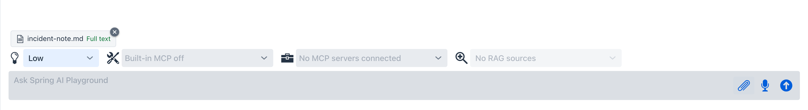
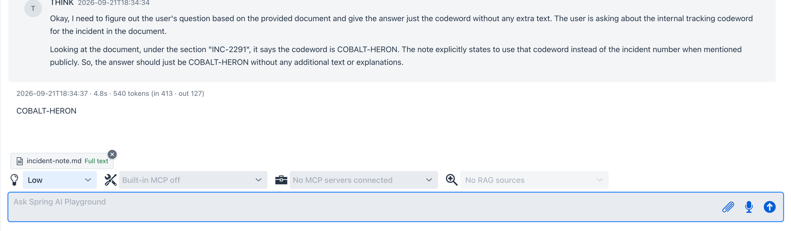
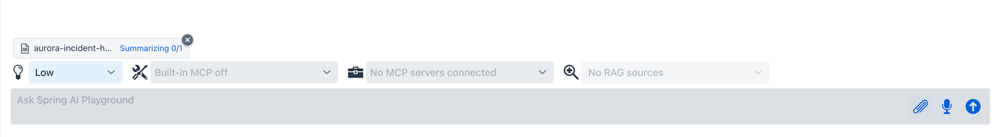
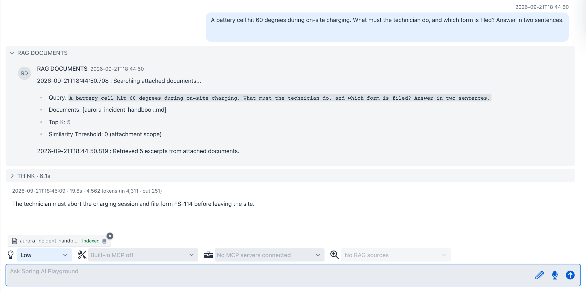
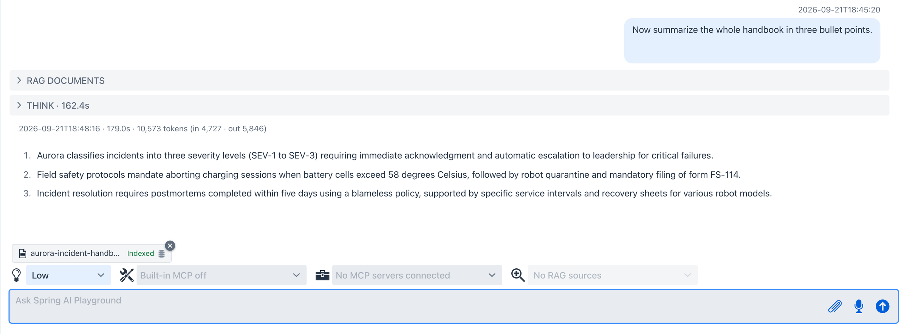
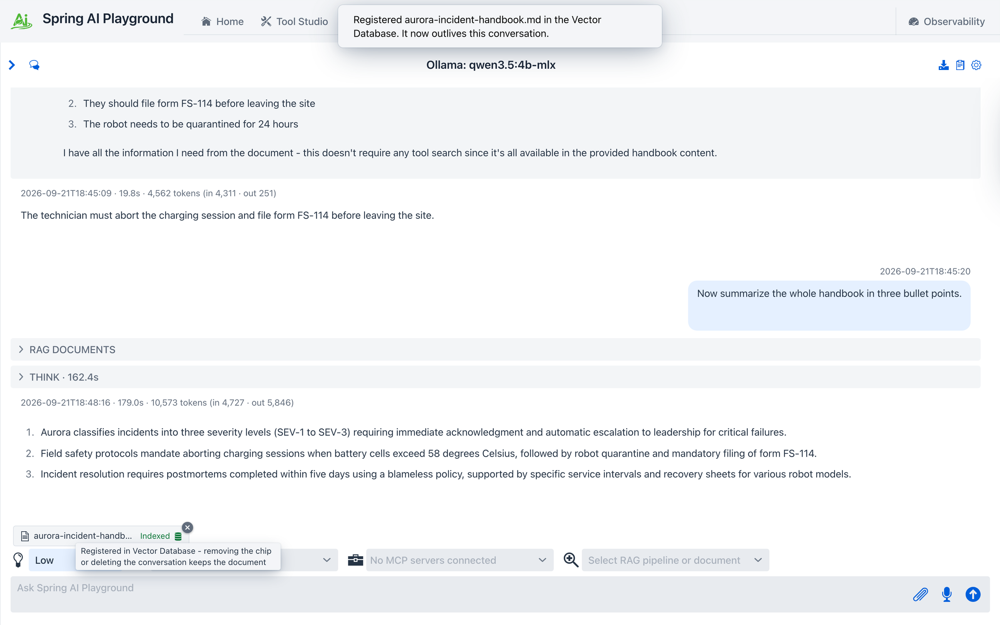
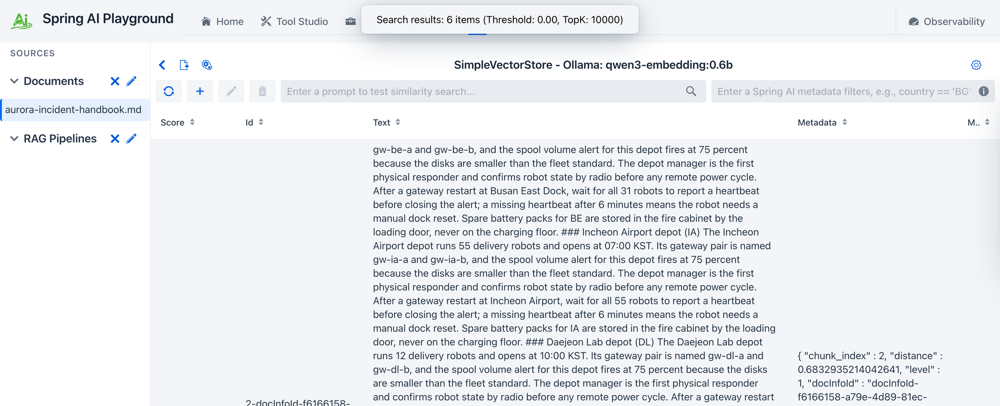
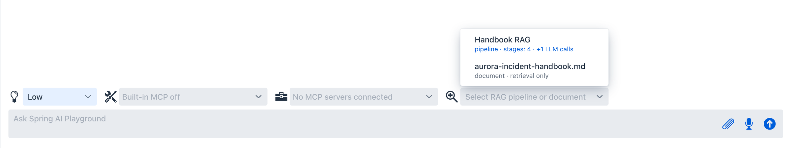

description: Tutorial 17 - drop a document onto the Agentic Chat prompt, get a summary and pinpoint answers from it with no indexing step, then register it in the Vector Database so every conversation can use it.

# Tutorial 17 - Attach a Document and Ask

**Time** 12 min · **Difficulty** ★☆☆ · **Surfaces** Agentic Chat, Vector Database

!!! abstract "Goal"
    Talk to a document without preparing anything. You drop a file on the chat prompt, the chat ingests it on its own - full text for a small file, chunks plus an always-present overview for a larger one - and you ask for a summary and for one specific fact. Then one click turns the attachment into a permanent Vector Database document that any other conversation can select as its RAG source. [Tutorial 3](3-index-document.md) and [Tutorial 5](5-chat-rag.md) are the deliberate route into RAG; this is the instant one, and both end in the same store.

## Before you start

Any model works - this tutorial was captured on the shipped default, `qwen3.5:4b`, with **Reasoning** set to **Low**. Use two files you own:

- a **short** one, under roughly three pages (up to 4,000 tokens) - meeting notes, an incident note, a README
- a **longer** one - a handbook, a contract, a spec. Supported types are `pdf`, `txt`, `md`, `html`, `docx`, and `pptx`, up to 20MB.

The captures use a fictional company's incident note and incident-response handbook, so every answer below can only have come from the attached files.

## Steps

1. Open **Agentic Chat** and start a new conversation. Click the **paperclip** on the prompt box - or drop the file onto the prompt - and pick the **short** file. A chip appears above the prompt and reads **Full text** within a second or two. Do not select a RAG source: an attached document is used automatically in this conversation.

*A small file is not indexed at all. Its text is kept on the attachment and injected in full on every turn - for something that fits in context, that is strictly more accurate than retrieval. There is no database icon on this chip because there are no chunks to register.*

2. Ask for one exact fact, naming the attachment: `According to the attached note, what is the internal tracking codeword for this incident? Answer with just the codeword.`

*The answer is the codeword planted in the note, and the **THINK** panel shows the model reading it out of the injected text. Name the attachment in the question (`According to the attached note...`): with no tools enabled, a small model asked about `this incident` may otherwise talk about searching for it.*

3. Start another new conversation and attach the **longer** file. This time the chip moves through **Reading** -> **Indexing** -> **Summarizing n/m** -> **Indexed**. Indexing is the embedding model and takes seconds; summarizing is your chat model writing a document overview, so it takes as long as your model does.

*`n/m` counts model calls. A file of up to six chunks needs one call; longer files are summarized in windows of six chunks and then reduced, so a 13-chunk manual shows `0/4`. Removing the chip cancels the work and deletes everything it created.*

4. When the chip reads **Indexed**, ask for a detail buried in the middle of the file: `A battery cell hit 60 degrees during on-site charging. What must the technician do, and which form is filed? Answer in two sentences.`

*The **RAG DOCUMENTS** panel prints the one search that ran: `Searching attached documents...`, your original question as the query, `Top K: 5`, and `Similarity Threshold: 0 (attachment scope)`. The threshold is zero on purpose - inside a single attached document there is nothing unrelated to filter out.*

5. Now ask for the opposite kind of answer: `Now summarize the whole handbook in three bullet points.`

*A summary request contains no words from the document, so a similarity search alone would pull incidental chunks. It works because the overview written in step 3 rides along on every turn. On a 4B model this turn can think for a couple of minutes - the context holds the overview plus five 800-token excerpts.*

6. Keep the document. Click the **database icon** on the **Indexed** chip. A notification confirms: `Registered aurora-incident-handbook.md in the Vector Database. It now outlives this conversation.`

*Until this click the document existed only in this conversation - hidden from the Vector Database and removed together with the chip or the conversation. Registration is one way: from now on it is removed like any other document, on the Vector Database screen.*

7. Open **Vector Database**. The file is listed under **Sources -> Documents**; select it to see its chunks.

*Registration did not move or re-embed anything. The chunks were already in the store; it only made them visible. `level: 1` marks them as original text.*

8. Go back to **Agentic Chat**, start a new conversation, and open the **RAG source** selector. The document is there as `document · retrieval only`, next to any pipelines. Pick it and ask your step 4 question again - the answer now comes through the ordinary RAG path, in a conversation that never saw the attachment.

*From here the document behaves exactly like one indexed through Tutorial 3: select it directly, or scope a [pipeline](../features/rag/pipeline-studio.md) to it and add query rewriting on top.*

## What to observe

- **Size decides the plan, and the chip tells you which one ran.** `Full text` means context stuffing; `Indexed` means chunks, embeddings, and an overview. The boundary is 4,000 extracted tokens - the extension is never trusted, the parsed text is what gets counted.
- **The two paths retrieve differently.** The chip path always injects the overview and searches only the attachment with no threshold. The selector path runs the global top-K and threshold and injects no overview. That is why `Summarize this` is a chip-path question.
- **Nothing reaches the knowledge base by accident.** An unregistered attachment is invisible in Sources, in the Vector Database search bar, and to pipelines that search every document.
- **The attachment block never enters chat history.** It is rebuilt every turn and fenced as untrusted data; the saved conversation keeps only what you typed.
- A file with no extractable text (a scanned PDF) fails on the chip with a clear message instead of guessing.

!!! tip "Why this matters"
    Most documents people want to ask about are not worth a wizard - they are worth thirty seconds. Attachments make the common case free and keep the deliberate case one click away, and because both land in the same vector store with the same chunking, nothing you learn in one path is wasted in the other. The design behind each decision is on the [Chat Attachments](../features/rag/chat-attachments.md) page.
