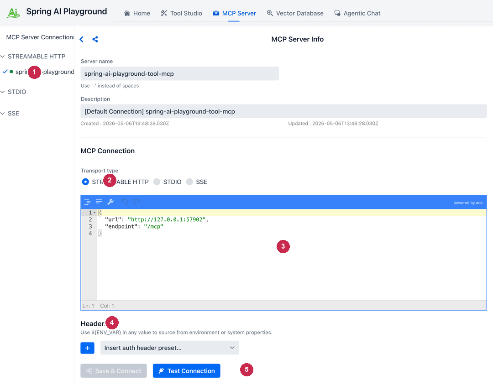
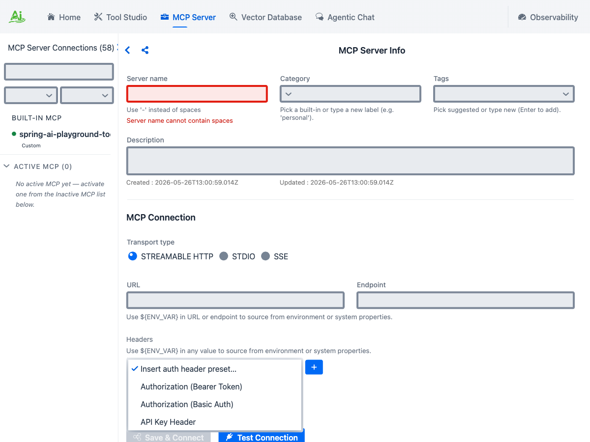
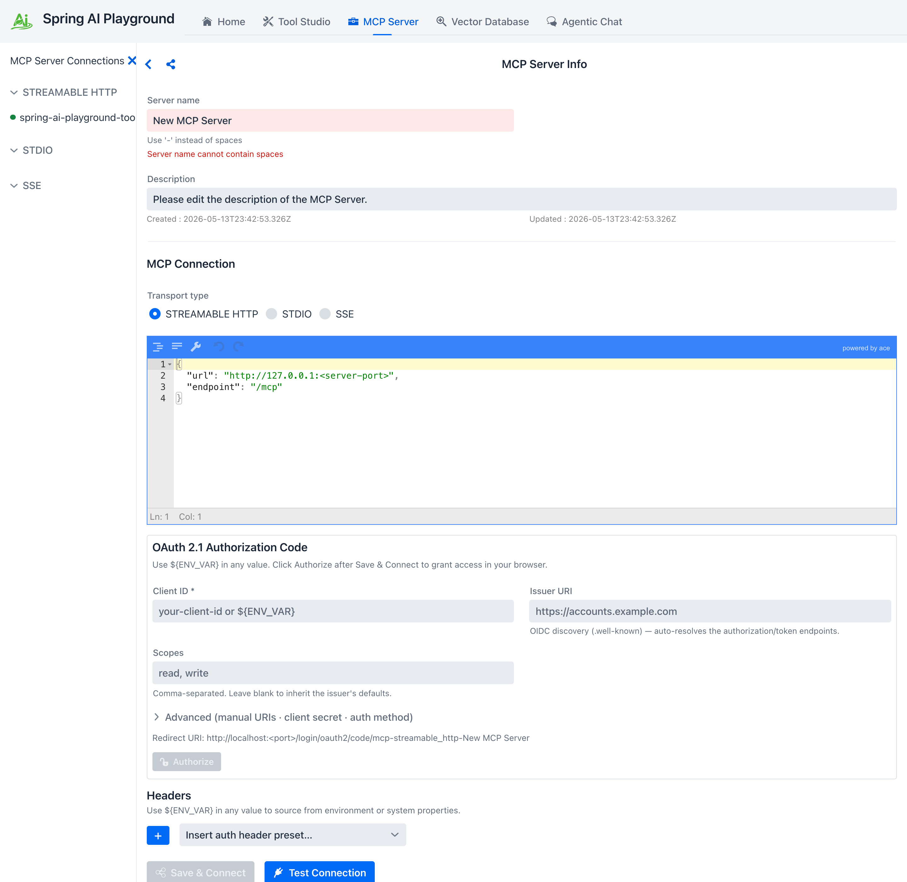
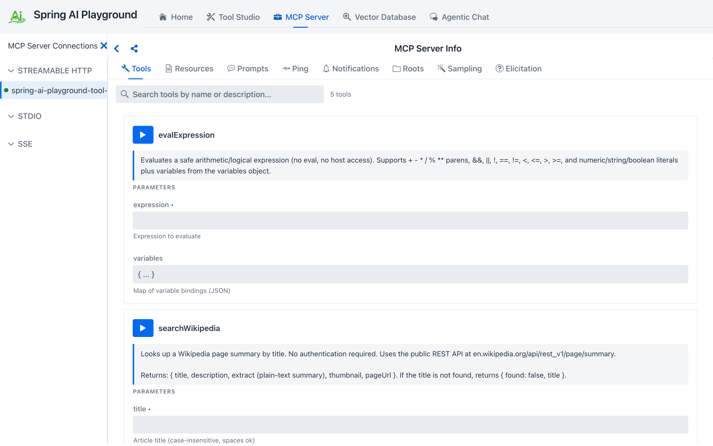
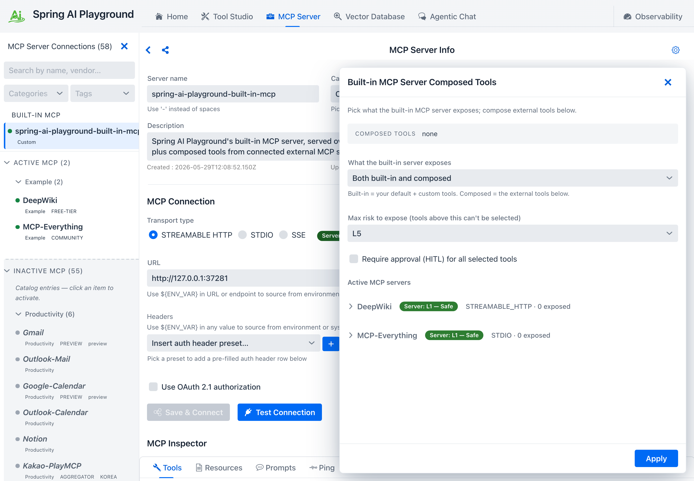
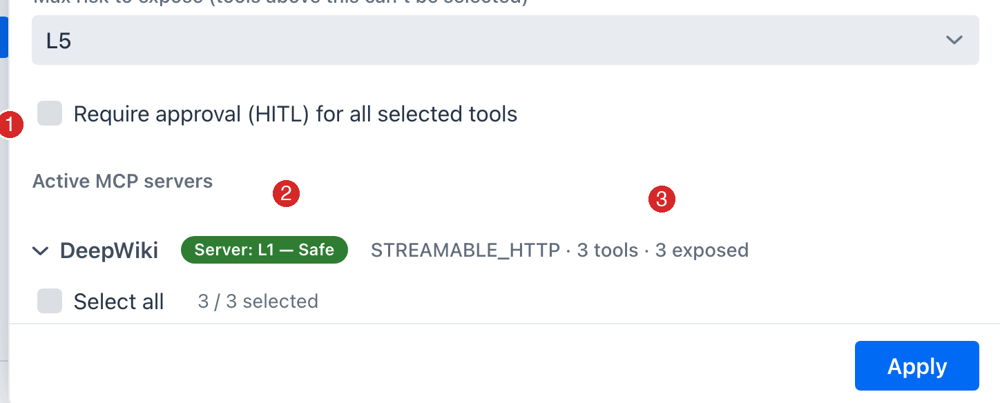

description: Tutorial 2 - connect an external MCP server (Streamable HTTP / STDIO / SSE / OAuth 2.1) and validate the schema in the Inspector before relying on it from chat.

# Tutorial 2 - Connect an External MCP Server

**Time** 8 min · **Difficulty** ★★☆ · **Surfaces** MCP Server

!!! abstract "Goal"
    Add an external MCP server connection (Streamable HTTP, STDIO, or SSE), wire up authentication if the server requires it, validate the schema in the Inspector, and run a tool through it directly - *before* relying on it from chat.

!!! tip "Shortcut - use the built-in catalog"
    For 58 of the most common external surfaces (Gmail, Outlook, Notion, Slack, GitHub, Linear, Atlassian, Stripe, BigQuery, MCP Everything, ...) the playground ships a preset catalog. Look in the sidebar's **Inactive MCP** section, click the entry you want, and the configuration form pre-fills with the right transport, URL or stdio command, OAuth defaults, and `${ENV_VAR}` placeholders - you fill in only your key/tenant and click **Save & Connect**. The rest of this tutorial covers the **manual path** for anything *not* in the catalog. See the [MCP Catalog directory](../features/default-mcp-catalog/index.md) for the full per-category listing.

## Steps

1. Open **MCP Server** and click the **Add Custom Server** header button (top right of the screen) to start a new manual connection.
2. Pick the transport type. **Streamable HTTP** is the modern default; STDIO is for proxy-style local processes (Claude Desktop's `mcp-remote`); SSE is the legacy HTTP+SSE shape.
3. Fill in the connection name, category, optional tags, and the JSON config for your transport.

*① the sidebar shows a colored status dot per connection (green OK · gray offline · red error). ② transport - Streamable HTTP is the modern default; STDIO and SSE are also supported. ③ JSON connection config (URL + endpoint, or stdio command + args). ④ **Headers** section, with a `${ENV_VAR}` substitution hint - values like `${MY_API_KEY}` resolve from the OS environment at connect time. ⑤ **Save & Connect** registers the connection; **Test Connection** spins up a transient client to validate the config without touching the live one.*

### Add an Authorization header

Many remote MCP servers require an API key or bearer token. Use the **Insert auth header preset...** dropdown to drop in a templated row instead of hand-typing the header name, or click the **+** button next to it to add a blank row. Picking a preset fills the first empty row if one exists, otherwise appends a new row.

*① **Insert auth header preset...** drops a templated row when you pick one. ② the **+** button next to it adds a blank row. ③ **Authorization (Bearer Token)** templates `Authorization: Bearer <value>` - fill in the token. ④ **Authorization (Basic Auth)** templates a base64 user:pass row. ⑤ **API Key Header** templates a custom header (e.g. `X-API-Key`). OAuth 2.1 lives in its own section below, behind a checkbox toggle.*

!!! tip "Don't paste secrets into the form"
    The Headers section accepts `${ENV_VAR}` placeholders - set the secret in your shell or the desktop launcher's Environment Variables, then put `${MY_API_KEY}` in the form. The persisted JSON only stores the placeholder; the actual key is resolved at connect time. The same syntax works for STDIO `env` values and `requiredEnv` lists.

### OAuth 2.1 servers (Authorization Code flow)

For servers that expect an OAuth dance instead of a static token (Atlassian's MCP server is a common example), tick the **Use OAuth 2.1 authorization** checkbox on the form. The OAuth sub-form appears below the Headers section; unticking the checkbox drops the OAuth block from the persisted config entirely.

*① the **Use OAuth 2.1 authorization** checkbox toggles the sub-form. ② **Client ID** (required) and **Issuer URI** - the issuer alone is enough for OIDC discovery (`.well-known`) to auto-resolve the authorization and token endpoints. ③ **Scopes** are comma-separated; leave blank to inherit the issuer's defaults. ④ **Advanced** discloses manual `authorization_uri` / `token_uri` / client-secret / client auth method overrides for non-OIDC providers. ⑤ the **Redirect URI** the playground listens on - register this URI as an allowed redirect on the issuer side. ⑥ **Authorize** opens your system browser to the consent screen - click it after **Save & Connect**.*

The flow has three observable states:

1. **Save & Connect** records the OAuth registration but doesn't connect yet (no token).
2. Click **Authorize** - the connection moves to **AWAITING_AUTHORIZATION** and your system browser opens to the issuer. The Home dashboard adds an awaiting-auth counter so you don't lose track of half-finished flows.
3. After you grant access, the redirect lands at the playground's callback URL, the code is exchanged for tokens, and the connection comes up like any other.

Tokens are encrypted on disk under `~/spring-ai-playground/mcp/oauth-tokens/`. Refresh happens transparently - once you authorize once, the connection survives playground restarts as long as the issuer accepts the refresh.

### Validate in the Inspector

4. Once connected (the sidebar dot turns green), scroll to **MCP Inspector**. The tab strip exposes everything the server speaks - *and* a few client-side primitives the server can call back into.

The eight tabs split into **server primitives** the server exposes (Tools, Resources, Prompts, Ping, Notifications) and **client primitives** the server can ask *your* playground to handle (Roots, Sampling, Elicitation). For most "use this server's tools in chat" workflows you'll spend your time on Tools and Resources; the others are mostly useful when developing or debugging an MCP server.

5. Click **Tools**. Each tool is a full-width card with its description, a **risk chip** (L0-L5) scoring the tool, schema-typed inputs, and a **Run** button that calls the tool through the live transport.

*① the selected tab - Tools is the default. ② all eight tabs are visible side by side. ③ search filters cards by name or description, with the live count. ④ the **Run** button on each card calls the tool through the actual transport (not just a sandbox). ⑤ the tool name. ⑥ parameter rows rendered per the JSON Schema (string / number / boolean / enum each get the matching control).*

6. Fill in any required parameters and click **Run**. The result lands inline in the same card - a status header (OK / ERROR, elapsed ms, timestamp), a **REQUEST** section, a **RESPONSE** section, and a **Raw** toggle that swaps in the JSON-RPC envelope. Use **Copy** to grab the response, or the dismiss button to clear the panel.

!!! tip "Validate here, not in chat"
    Tools that fail in MCP Inspector will fail in Agentic Chat too - but the chat error message is wrapped in the agent's reasoning trace and harder to debug. Save yourself a turn: run every new tool through the inspector once before letting a model invoke it.

!!! example "Useful external MCP servers"
    - Claude Desktop / Claude Code via Streamable HTTP
    - Cursor's MCP server entry
    - Awesome MCP Servers list - a directory of community servers

### Expose its tools on the built-in server (optional)

Once a server is connected and its tools check out, you can **re-expose** selected tools on the playground's *built-in* MCP server, so they are published on `/mcp` and become selectable in Agentic Chat alongside your Tool Studio tools.

7. Click the **gear icon** on the MCP Server Info header to open the **Composed Tools** drawer. Set a **Max risk to expose** cap (default `L3`), optionally tick **Require approval (HITL)**, then expand a server and tick the tools you want.

8. Each tool shows its own risk chip; rename the exposed alias or edit the description inline if you like. Ticking **HITL** on a tool lowers its effective risk by one band (shown as a `HITL -1` badge).

9. Click **Apply**. The selected tools join the built-in server - visible at the top of the sidebar and callable from chat. See [MCP Server → Expose external tools](../features/mcp-server/index.md#expose-external-tools) for the composition rules, shadowing checks, and risk math.

