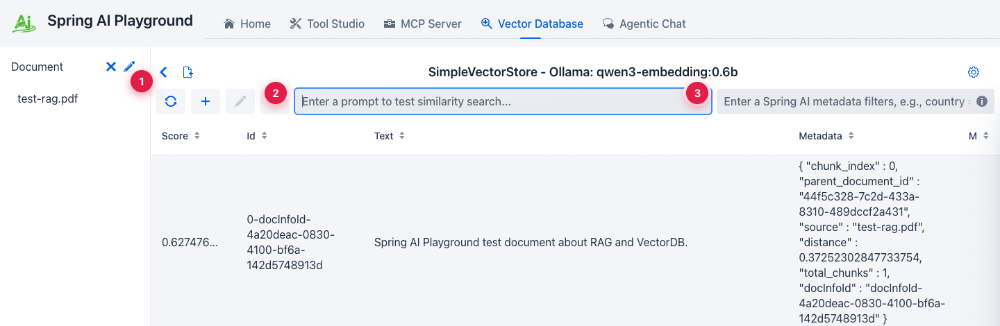
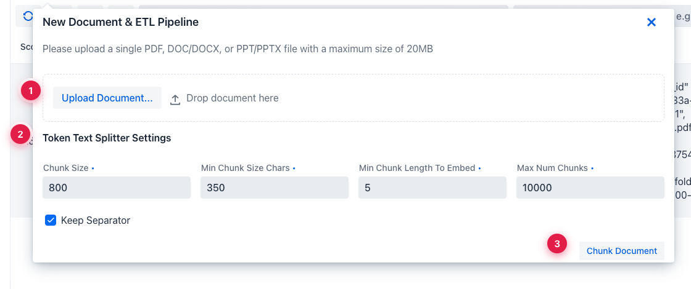
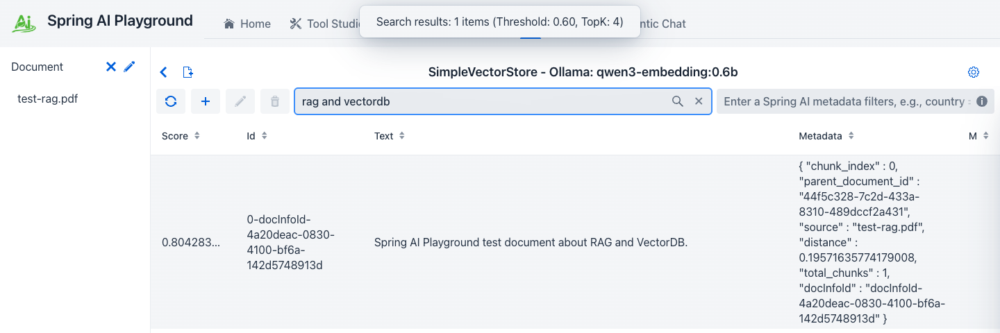

description: Tutorial 3 — upload a document, watch the ETL pipeline (extract → chunk → embed → store), and verify retrieval with a similarity search.

# Tutorial 3 — Index a Document for RAG

**Time** 6 min · **Difficulty** ★☆☆ · **Surfaces** Vector Database

!!! abstract "Goal"
    Upload a document, watch it pass through the ETL pipeline (extract → chunk → embed → store), and verify retrieval quality with a similarity search before relying on it in chat.

## Steps

1. Open **Vector Database**. The header shows the active store and embedding model: `SimpleVectorStore — Ollama: qwen3-embedding:0.6b`.

*① indexed-doc sidebar (single source of truth), ② similarity-search input (hit Enter to query), ③ Spring AI metadata filter expression — same syntax you'd use in code.*

2. Click the document-add icon next to the sidebar to open the **New Document & ETL Pipeline** dialog. Drop in a PDF, DOCX, or PPTX — up to 20 MB.
3. Tune the splitter only if the defaults don't match your content shape. `Chunk Size` and `Min Chunk Size Chars` are the two that move retrieval quality the most.

*① upload the file (drag-drop also works), ② token-splitter settings — `Chunk Size` and `Min Chunk Size Chars` move retrieval quality the most, ③ `Chunk Document` runs extraction + splitting and shows the chunks before embedding, so you can adjust the splitter without re-uploading.*

4. After embedding, run a similarity search to confirm retrieval works. Use a phrase that should be in the document.

*① cosine similarity score (0.0–1.0), ② the retrieved chunk text, ③ metadata used by Spring AI filter expressions (`source`, `chunk_index`, custom fields).*

!!! tip "Why this matters"
    Bad RAG starts here, not in chat. If the chunk you expect to be retrieved doesn't show up here at a reasonable similarity score (≥ 0.6 for most cases), the chat answer will be ungrounded — no amount of prompting fixes that.

!!! warning "Don't change the embedding model after indexing"
    The vector store stores raw vectors. Switching from `qwen3-embedding:0.6b` to a different model leaves the old vectors in place but indexed in a different space. Re-import or rebuild before trusting retrieval again.

