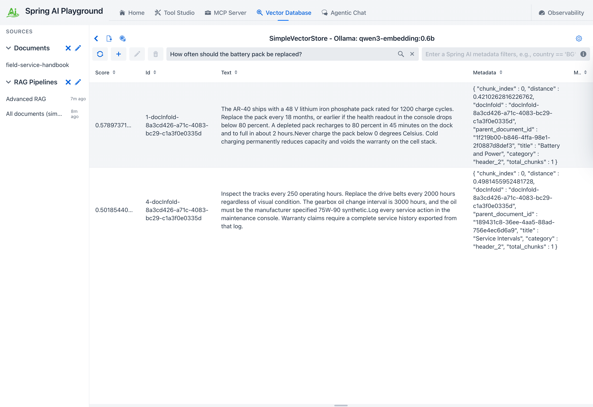
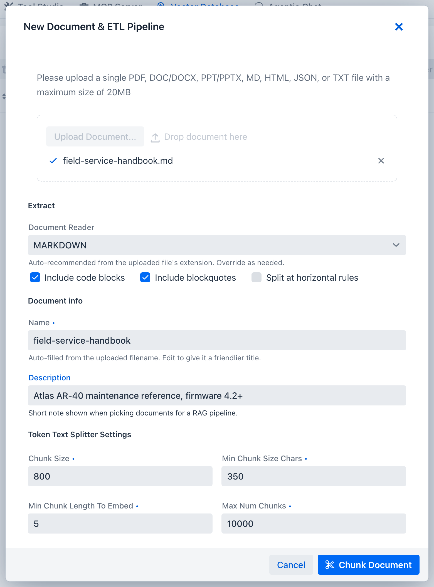
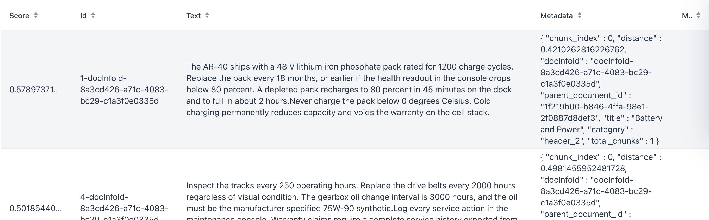

description: Tutorial 3 - upload a document, run the ETL pipeline (extract with the right reader, chunk, enrich, embed, store), and verify retrieval with a similarity search.

# Tutorial 3 - Index a Document for RAG

**Time** 7 min · **Difficulty** ★☆☆ · **Surfaces** Vector Database

!!! abstract "Goal"
    Upload a document, watch it pass through the ETL pipeline (extract → chunk → embed → store), and verify retrieval quality with a similarity search before relying on it in chat.

## Steps

1. Open **Vector Database**. The header shows the active store and embedding model: `SimpleVectorStore - Ollama: qwen3-embedding:0.6b`. The **Sources** sidebar has two groups: **Documents** for what you index here, and **RAG Pipelines** for the retrieval configurations built on top of them.

*① Sources sidebar - indexed documents above, saved RAG pipelines below, ② similarity-search input (hit Enter to query), ③ Spring AI metadata filter expression - same syntax you'd use in code.*

2. Click the document-add icon in the header to open the **New Document & ETL Pipeline** dialog. Drop in a PDF, DOC/DOCX, PPT/PPTX, MD, HTML, JSON, or TXT file - up to 20 MB.

3. Check the **Extract** section. The document reader is picked from the file extension, and reader-specific options appear with it: a `.md` file selects `MARKDOWN` and offers code-block, blockquote, and horizontal-rule handling. Override the reader when the default does not suit the file, for example choosing `TIKA` for a PDF of scanned slides.

*① upload the file (drag-drop also works), ② the auto-recommended reader plus its per-type options, ③ token-splitter settings - `Chunk Size` and `Min Chunk Size Chars` move retrieval quality the most.*

4. Tune the splitter only if the defaults do not match your content shape. Optionally enable a metadata enricher under **Metadata Enrichment** - each one costs one LLM call per chunk, so keep it off for a first pass on a large file.

5. Click **Chunk Document**. This runs extraction and splitting and shows you the chunks *before* embedding, so you can adjust and re-run without re-uploading. When the chunks look right, click **Embed and insert**.

6. Run a similarity search to confirm retrieval works. Use a phrase that should be in the document.

*① cosine similarity score (0.0-1.0), ② the retrieved chunk text, ③ metadata used by Spring AI filter expressions (`source`, `chunk_index`, custom fields).*

!!! tip "Why this matters"
    Bad RAG starts here, not in chat. If the chunk you expect doesn't come back here, the chat answer will be ungrounded, and no amount of prompting fixes that.

!!! tip "Read the scores, don't trust a fixed number"
    Similarity scores are not comparable across embedding models, so no single cutoff is universally right. The shipped default is `0.35`, picked because with `qwen3-embedding:0.6b` a chunk that answers the question scores roughly 0.48 to 0.65, while a question the corpus cannot answer tops out around 0.25. See [the measured ranges](../features/rag/pipeline-studio.md#retrieval).

    If you switch embedding models, re-check it here: run a question you know the answer to and note the score of the correct chunk, then run an unrelated question and note its best score. Any cutoff between the two works. **Search Settings** (the cog) holds the global value, and each RAG pipeline keeps its own copy.

!!! warning "Don't change the embedding model after indexing"
    The vector store stores raw vectors. Switching from `qwen3-embedding:0.6b` to a different model leaves the old vectors in place but indexed in a different space. Re-import or rebuild before trusting retrieval again.

## What you also got

Embedding into an empty store creates a default retrieval pipeline for the document, so it is immediately selectable in chat. Everything about how retrieval behaves - Top-K, threshold, query rewriting - lives on that pipeline; see [Pipeline Studio](../features/rag/pipeline-studio.md).

Next: [Tutorial 5 - Chat With RAG](5-chat-rag.md) uses this document as grounded context.
