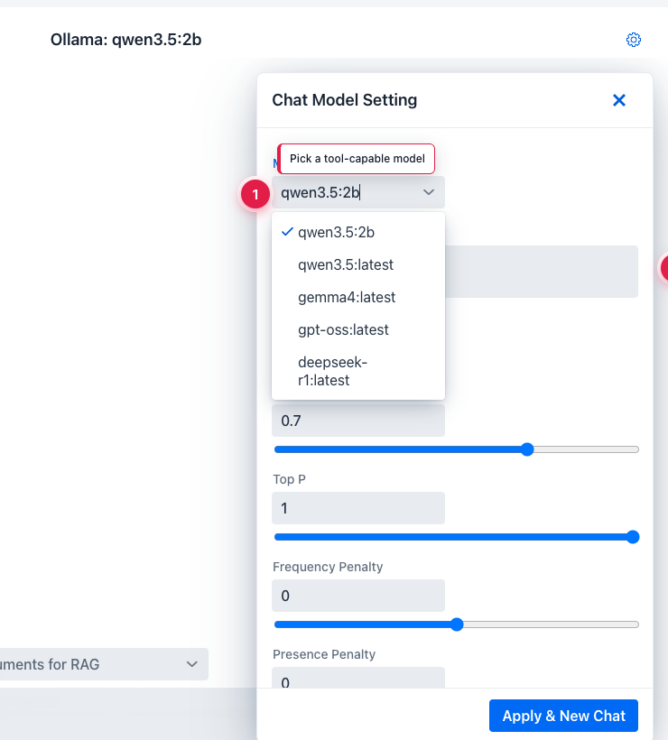
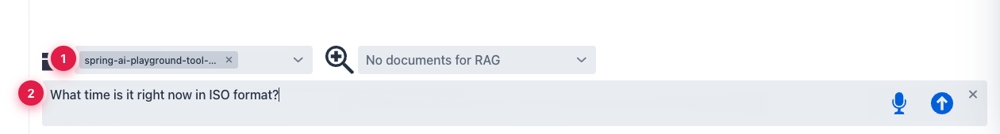
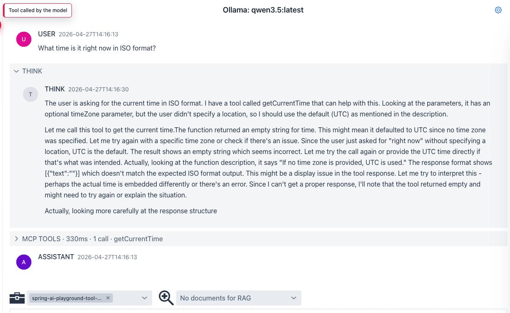

description: Tutorial 4 - trigger a built-in MCP tool from a chat turn. Watch the model decide, observe the tool call, then read the final answer.

# Tutorial 4 - Chat With Tools

**Time** 5 min · **Difficulty** ★★☆ · **Surfaces** Agentic Chat

!!! abstract "Goal"
    Call a built-in MCP tool from a real chat turn. Watch the model decide to call it, see the tool result, then read the final answer. The example below uses `getCurrentTime` because it returns instantly - but any tool published in Tutorial 1 (`getWeather` and the rest) works the same way.

## Steps

1. Open **Agentic Chat**. Click the gear icon to open **Agentic Chat Setting** and switch the model.

*① `Model` dropdown - open it to switch from the default `qwen3.5:2b`, ② recommended models for tool use are `qwen3.5:9b` and `gemma4:e4b`. Pick one and click **Apply & New Chat**.*

2. With the chat started under the new model, tick **Use built-in MCP server in this chat** in the tool menu above the prompt, confirm `getCurrentTime` is selected in the exposed-tools list, then type a prompt that should trigger a tool call.

*① Built-in MCP enabled - its exposed tools are now in the model's tool inventory. ② prompt typed but not sent - click the send arrow on the right to dispatch.*

3. Send the prompt. The chat stream interleaves the model's reasoning, the tool call, and the final answer.

*The collapsible **THINK** section shows the model's reasoning. **MCP TOOLS** shows the actual tool invocation (here `getCurrentTime`, 330 ms, 1 call). **ASSISTANT** is the final user-facing answer that uses the tool result.*

## What to observe

- The model decides on its own whether to call a tool - there's no forced tool-use directive.
- The tool name in the MCP TOOLS block matches the one you saw in MCP Inspector.
- If the tool fails or returns garbage, the model explains it instead of fabricating an answer (assuming you picked a tool-capable model).

!!! tip "Why this matters"
    `qwen3.5:2b` (the default) sometimes skips tool calls or returns empty tool turns. `qwen3.5:9b` is much more reliable for this. If a tool turn comes back empty, that is the signal to upgrade the model - not to rewrite the prompt.
